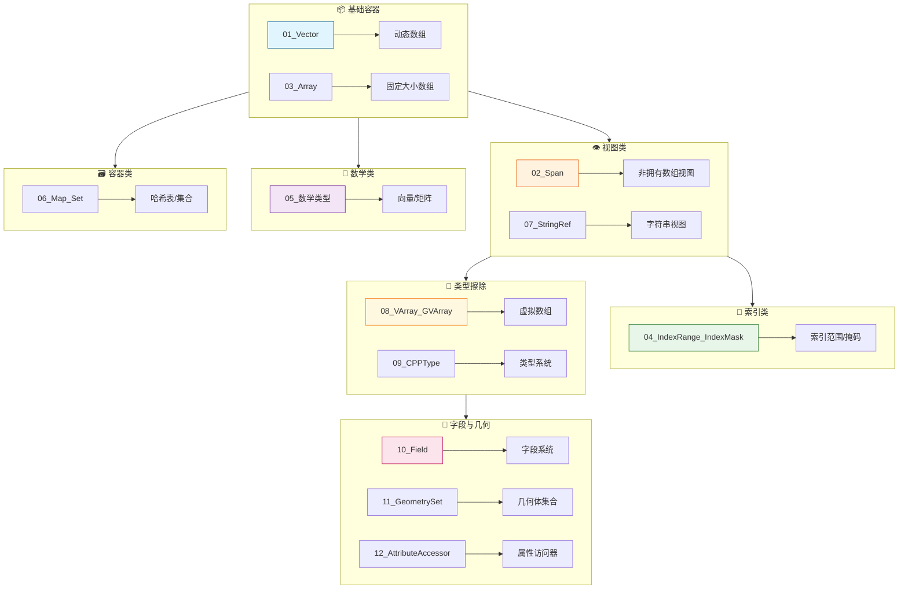
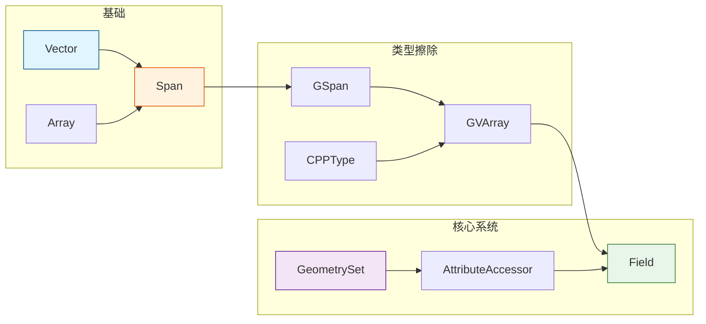

# Blender 基础库文档 - blenlib

> 节点开发中最常用的基础数据结构详解

---

## 📚 文档导航



---

## 📖 文档列表

### 基础篇（必读）

| 文档 | 内容 | 重要程度 |
|-----|------|---------|
| [01_Vector.md](01_Vector.md) | 动态数组，小缓冲区优化 | ⭐⭐⭐⭐⭐ |
| [02_Span.md](02_Span.md) | 非拥有数组视图，函数参数首选 | ⭐⭐⭐⭐⭐ |
| [03_Array.md](03_Array.md) | 固定大小数组，字段求值输出 | ⭐⭐⭐⭐ |
| [04_IndexRange_IndexMask.md](04_IndexRange_IndexMask.md) | 索引范围和掩码，并行处理 | ⭐⭐⭐⭐⭐ |
| [05_数学类型.md](05_数学类型.md) | float3/float4/float4x4 | ⭐⭐⭐⭐⭐ |

### 进阶篇

| 文档 | 内容 | 重要程度 |
|-----|------|---------|
| [06_Map_Set.md](06_Map_Set.md) | 哈希表和集合 | ⭐⭐⭐ |
| [07_StringRef.md](07_StringRef.md) | 字符串视图 | ⭐⭐⭐ |
| [08_VArray_GVArray.md](08_VArray_GVArray.md) | 虚拟数组，类型擦除数组 | ⭐⭐⭐⭐ |
| [09_CPPType.md](09_CPPType.md) | 类型擦除系统 | ⭐⭐⭐⭐ |

### 核心篇（节点开发核心）

| 文档 | 内容 | 重要程度 |
|-----|------|---------|
| [10_Field.md](10_Field.md) | 字段系统，延迟计算 | ⭐⭐⭐⭐⭐ |
| [11_GeometrySet.md](11_GeometrySet.md) | 几何体集合，多态容器 | ⭐⭐⭐⭐⭐ |
| [12_AttributeAccessor.md](12_AttributeAccessor.md) | 属性访问器，属性读写 | ⭐⭐⭐⭐⭐ |

---

## 🎯 学习路径

### 新手入门

```
01_Vector → 02_Span → 04_IndexRange_IndexMask → 05_数学类型
```

### 进阶提升

```
08_VArray_GVArray → 09_CPPType → 10_Field
```

### 实战开发

```
11_GeometrySet → 12_AttributeAccessor → 10_Field
```

---

## 🗺️ 知识依赖图



---

## 💡 快速参考

### 容器选择指南

| 场景 | 推荐类型 | 原因 |
|-----|---------|------|
| 动态增长数组 | `Vector<T>` | 小缓冲区优化 |
| 函数只读参数 | `Span<T>` | 轻量、通用 |
| 函数修改参数 | `MutableSpan<T>` | 明确意图 |
| 大小已知固定 | `Array<T>` | 更轻量 |
| 字段求值输出 | `Array<T>` | 预分配缓冲区 |
| 类型未知数组 | `GSpan` / `GVArray` | 类型擦除 |

### 类型擦除选择

| 场景 | 推荐类型 | 原因 |
|-----|---------|------|
| 只读访问未知类型 | `GSpan` | 轻量视图 |
| 可写访问未知类型 | `GMutableSpan` | 可修改 |
| 虚拟数组未知类型 | `GVArray` | 支持单值/函数 |
| 获取元素类型 | `CPPType` | 类型元信息 |

### 字段系统选择

| 场景 | 推荐类型 | 原因 |
|-----|---------|------|
| 编译期已知类型 | `Field<T>` | 类型安全 |
| 运行期确定类型 | `GField` | 灵活 |
| 读取属性 | `AttributeFieldInput` | 属性系统集成 |
| 求值字段 | `FieldEvaluator` | 高效批量计算 |

### 几何处理选择

| 场景 | 推荐类型 | 原因 |
|-----|---------|------|
| 多几何类型容器 | `GeometrySet` | 统一接口 |
| 读取属性 | `AttributeAccessor` | 只读访问 |
| 修改属性 | `MutableAttributeAccessor` | 读写访问 |
| 遍历组件 | `foreach_geometry_type` | 访问者模式 |

---

## ✅ 学习检查清单

### 基础篇

- [ ] 理解 Vector 的小缓冲区优化
- [ ] 掌握 Span 作为函数参数的用法
- [ ] 会用 IndexRange 进行循环
- [ ] 掌握 float3 的基本运算

### 进阶篇

- [ ] 理解 GVArray 的类型擦除机制
- [ ] 掌握 CPPType 的基本操作
- [ ] 了解 VArray 的虚拟数组概念

### 核心篇

- [ ] 理解 Field 的延迟计算特性
- [ ] 掌握 FieldEvaluator 的使用
- [ ] 了解 GeometrySet 的多态结构
- [ ] 掌握 AttributeAccessor 的读写
- [ ] 能编写完整的节点执行函数

---

## 📁 相关链接

- [上级目录：学习节点](../README.md)
- [Blender 开发者文档](https://developer.blender.org/docs/)
- [blenlib 源码](https://projects.blender.org/blender/blender/src/branch/main/source/blender/blenlib)

---

**Happy Coding! 🎨🔧**
