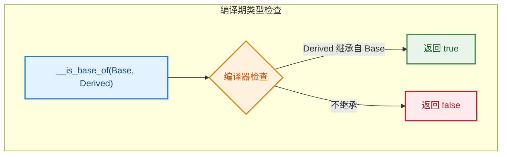
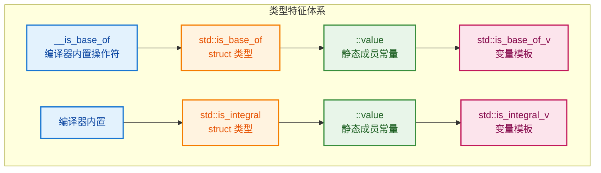
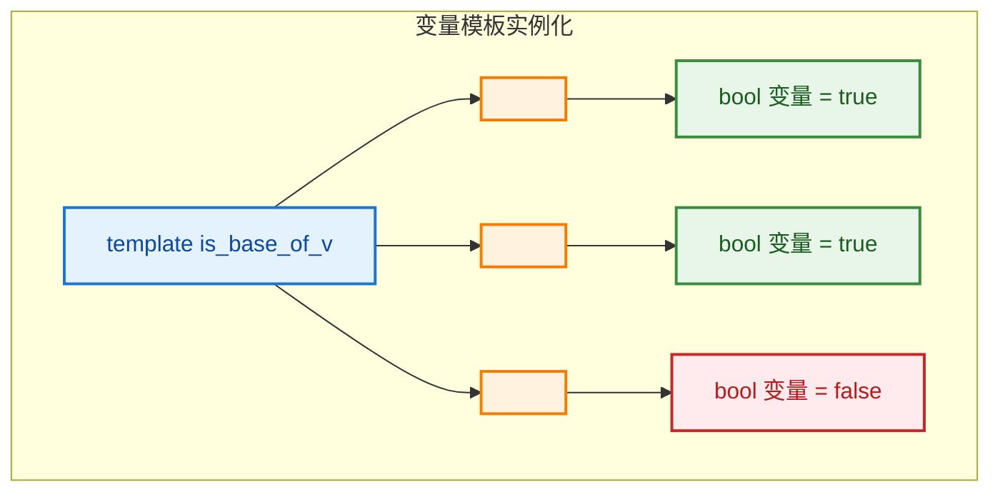
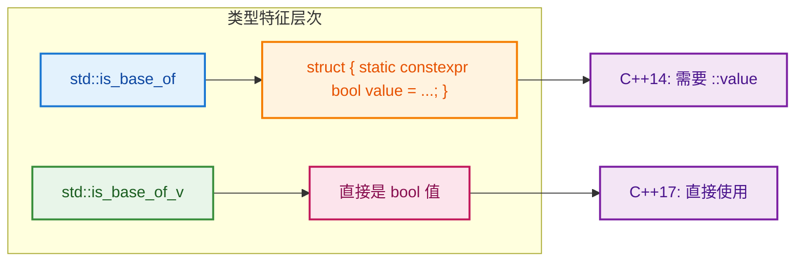
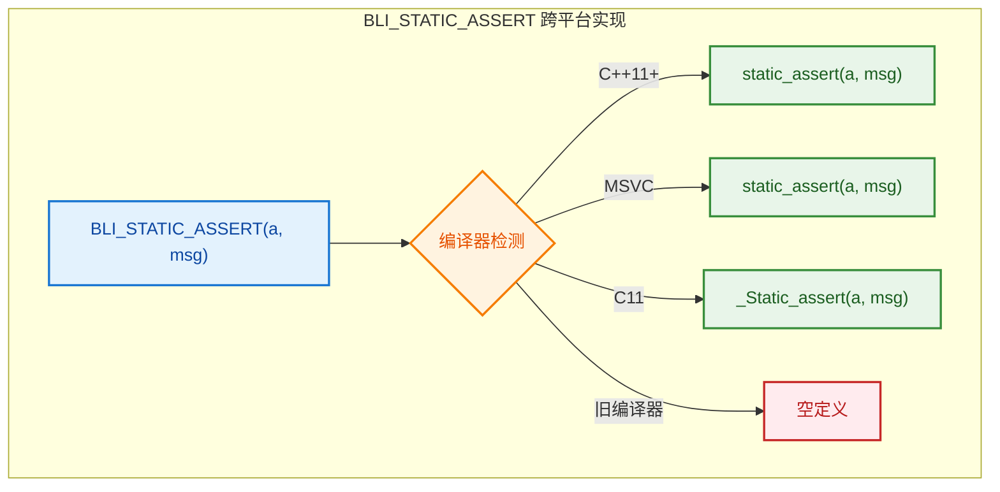
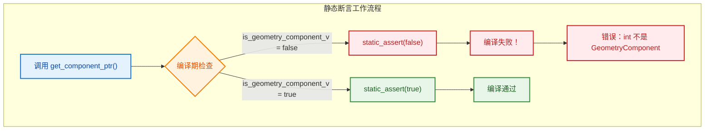

# 编译期类型检查 - `__is_base_of`, `is_base_of_v`, `BLI_STATIC_ASSERT`

> C++ 编译期类型特征和静态断言机制详解

---

## 📖 问题来源

**用户问题：**
1. `__is_base_of` 是什么？函数？
2. `is_base_of_v` 是什么？`_v` 是什么？
3. `BLI_STATIC_ASSERT` 是什么？

**涉及代码：**
- `type_traits:1256~1257` - `__is_base_of`
- `BKE_geometry_set.hh:481` - `BLI_STATIC_ASSERT(is_geometry_component_v<Component>, "")`

---

## 1. `__is_base_of` 是什么？

**`__is_base_of` 是编译器内置的类型特征（Compiler Intrinsic）**

```cpp
// 在 Visual Studio 的 type_traits 中：
template<class _Base, class _Derived>
_INLINE_VAR constexpr bool is_base_of_v = __is_base_of(_Base, _Derived);
```

| 特性 | 说明 |
|------|------|
| **本质** | 编译器内置函数（不是普通函数） |
| **作用** | 编译期检查 `_Derived` 是否继承自 `_Base` |
| **返回值** | `true` 或 `false`（编译期常量） |
| **位置** | 编译器内部实现，不是标准 C++ |

**为什么是双下划线？**

```cpp
// C++ 约定：双下划线开头的标识符保留给编译器/标准库实现
__is_base_of         // 编译器内置
__has_cpp_attribute  // 另一个编译器内置
__cplusplus          // 预定义宏

// 单下划线 + 大写字母：也保留
_Is_base_of          // 微软标准库内部使用
```

**工作原理：**

```cpp
// 编译器在编译期直接检查继承关系
// 不需要运行时开销！

class Base {};
class Derived : public Base {};
class Unrelated {};

__is_base_of(Base, Derived)     // true（编译期确定）
__is_base_of(Base, Unrelated)   // false（编译期确定）
```



---

## 2. `is_base_of_v` 是什么？`_v` 后缀是什么意思？

```cpp
// 定义（C++17 起）：
template<class _Base, class _Derived>
_INLINE_VAR constexpr bool is_base_of_v = __is_base_of(_Base, _Derived);
//           ↑
//           _v = value 的缩写
```

**`_v` 后缀约定：**

| 模板 | `_v` 版本 | 含义 |
|------|----------|------|
| `std::is_base_of<Base, Derived>` | `std::is_base_of_v<Base, Derived>` | 获取 `::value` 的简写 |
| `std::is_same<T, U>` | `std::is_same_v<T, U>` | 类型是否相同 |
| `std::is_pointer<T>` | `std::is_pointer_v<T>` | 是否是指针类型 |
| `std::is_integral<T>` | `std::is_integral_v<T>` | 是否是整数类型 |

**用户问题：各是什么？函数？变量？模板变量？**

| 名称 | 类别 | 是什么 | 说明 |
|------|------|--------|------|
| `__is_base_of` | 编译器内置 | **操作符**（类似 `sizeof`） | 不是函数，不是变量 |
| `std::is_base_of` | 类型特征 | **struct 类型** | 不是函数，不是变量 |
| `std::is_base_of_v` | 变量模板 | **bool 变量** | C++17 引入 |
| `std::is_integral` | 类型特征 | **struct 类型** | 不是函数，不是变量 |
| `std::is_integral_v` | 变量模板 | **bool 变量** | C++17 引入 |

**详细解释：**

```cpp
// 1. __is_base_of - 编译器内置操作符
bool result1 = __is_base_of(Base, Derived);  // 编译期操作，零开销

// 2. std::is_base_of - struct 类型
bool result2 = std::is_base_of<Base, Derived>::value;  // 访问静态成员

// 3. std::is_base_of_v - 变量模板（C++17）
bool result3 = std::is_base_of_v<Base, Derived>;  // 直接使用变量

// 4. std::is_integral - struct 类型
bool result4 = std::is_integral<int>::value;  // 访问静态成员

// 5. std::is_integral_v - 变量模板（C++17）
bool result5 = std::is_integral_v<int>;  // 直接使用变量
```

**关系图：**



---

### 补充：为什么用 `inline` 和 `constexpr`？变量模板是什么？

**用户问题：**
1. 为什么用 `inline` 和 `constexpr`？
2. 变量模板有点无法理解

**1. 为什么用 `constexpr`？**

```cpp
// 没有 constexpr：
template<class T>
bool is_integral_v = std::is_integral<T>::value;
//  ↑↑↑↑
//  运行期变量！不能在编译期使用

// 有 constexpr：
template<class T>
constexpr bool is_integral_v = std::is_integral<T>::value;
//  ↑↑↑↑↑↑↑↑
//  编译期常量！可以在编译期使用
```

**为什么需要 `constexpr`？**

```cpp
// 场景1：数组大小（必须是编译期常量）
int arr[is_integral_v<int> ? 10 : 20];  // ✅ 需要 constexpr

// 场景2：模板参数（必须是编译期常量）
template<bool B> class MyClass {};
MyClass<is_integral_v<int>> obj;        // ✅ 需要 constexpr

// 场景3：静态断言（必须是编译期常量）
static_assert(is_integral_v<int>);      // ✅ 需要 constexpr
```

**2. 为什么用 `inline`？**

```cpp
// 问题：头文件中定义变量
// my_header.h：
int global_var = 42;  // ❌ 每个包含此头文件的 .cpp 都会有一个定义！

// 解决方案：inline（C++17 起支持变量）
inline int global_var = 42;  // ✅ 所有文件共享同一个变量
```

**变量模板为什么需要 `inline`？**

```cpp
// 头文件：type_traits.h
template<class T>
inline constexpr bool is_integral_v = std::is_integral<T>::value;
//  ↑↑↑↑
//  必须 inline！

// 原因：
// a.cpp 实例化：is_integral_v<int>
// b.cpp 实例化：is_integral_v<int>
// 如果没有 inline，链接错误：重复定义！
```

**3. 变量模板（Variable Template）是什么？**

**简单理解：带模板参数的变量**

```cpp
// 普通变量：
int max_size = 100;  // 一个固定的值

// 变量模板：值取决于模板参数
template<typename T>
constexpr T pi = T(3.1415926535897932385);
//      ↑
//      变量模板！

// 使用：
pi<int>      // int 类型的 pi = 3
pi<float>    // float 类型的 pi = 3.14159...
pi<double>   // double 类型的 pi = 3.1415926535...

// 每个实例化都是不同的变量！
```

**类比函数模板：**

```cpp
// 函数模板：代码根据类型变化
template<typename T>
T add(T a, T b) { return a + b; }

add<int>(1, 2);       // 生成 int 版本的 add
add<float>(1.0, 2.0); // 生成 float 版本的 add

// 变量模板：值根据类型变化
template<typename T>
constexpr T max_value = std::numeric_limits<T>::max();

max_value<int>;      // int 的最大值
max_value<float>;    // float 的最大值
```

**`is_base_of_v` 是变量模板：**

```cpp
// 定义：
template<class Base, class Derived>
inline constexpr bool is_base_of_v = __is_base_of(Base, Derived);
//      ↑↑↑↑    ↑↑↑↑
//      变量模板   bool 类型

// 实例化示例：
is_base_of_v<GeometryComponent, MeshComponent>     // 一个 bool 变量 = true
is_base_of_v<GeometryComponent, CurveComponent>    // 另一个 bool 变量 = true
is_base_of_v<GeometryComponent, int>               // 又一个 bool 变量 = false

// 每个不同的 <Base, Derived> 组合都生成一个新的变量！
```

**可视化：**



**总结：**

| 关键字 | 作用 | 为什么需要 |
|--------|------|-----------|
| `constexpr` | 编译期常量 | 可以在编译期使用（数组大小、模板参数、静态断言） |
| `inline` | 避免重复定义 | 头文件中定义，多个文件共享同一个变量 |
| `template` | 变量模板 | 值根据类型参数变化 |

**变量模板简单记忆：**
- 函数模板 = 代码根据类型变化
- 变量模板 = 值根据类型变化
- `is_base_of_v<Base, Derived>` = 根据 Base 和 Derived 类型，生成不同的 bool 值

```cpp
// C++14 及以前：
constexpr bool result = std::is_base_of<Base, Derived>::value;
//                                              ↑↑↑↑↑
//                                              需要访问 ::value

// C++17 及以后（更简洁）：
constexpr bool result = std::is_base_of_v<Base, Derived>;
//                                       ↑↑
//                                       直接获取值，不需要 ::value
```

**在 Blender 中的使用：**

```cpp
// BKE_geometry_set.hh:130
template<typename T>
inline constexpr bool is_geometry_component_v = std::is_base_of_v<GeometryComponent, T>;
//                                       ↑↑
//                                       检查 T 是否继承自 GeometryComponent

// 使用示例：
is_geometry_component_v<MeshComponent>     // true（MeshComponent 继承自 GeometryComponent）
is_geometry_component_v<CurveComponent>    // true
is_geometry_component_v<int>               // false（int 不是 GeometryComponent）
```



---

## 3. `BLI_STATIC_ASSERT` 是什么？

**`BLI_STATIC_ASSERT` 是 Blender 的跨平台静态断言宏**

```cpp
// 定义在 BLI_assert.h:67~83
#if defined(__cplusplus)
/* C++11 */
#  define BLI_STATIC_ASSERT(a, msg) static_assert(a, msg);
#elif defined(_MSC_VER)
/* Visual Studio */
#    define BLI_STATIC_ASSERT(a, msg) static_assert(a, msg);
// ...
#elif defined(__STDC_VERSION__) && (__STDC_VERSION__ >= 201112L)
/* C11 */
#  define BLI_STATIC_ASSERT(a, msg) _Static_assert(a, msg);
#else
/* Old unsupported compiler */
#  define BLI_STATIC_ASSERT(a, msg)  // 空定义
#endif
```

**作用：编译期断言**

```cpp
// 语法：
BLI_STATIC_ASSERT(条件, "错误信息");

// 示例：
BLI_STATIC_ASSERT(sizeof(int) == 4, "int 必须是 4 字节");

// 如果条件为 false，编译报错：
// error: static assertion failed: "int 必须是 4 字节"
```

**跨平台兼容性：**



**在 GeometrySet 中的使用：**

```cpp
// BKE_geometry_set.hh:481
template<typename Component> 
Component *get_component_ptr()
{
    BLI_STATIC_ASSERT(is_geometry_component_v<Component>, "");
    // 编译期检查：Component 必须是 GeometryComponent 的派生类
    // 如果不是，编译错误！
    
    return static_cast<Component *>(get_component_ptr(Component::static_type));
}
```

**为什么用空字符串 `""`？**

```cpp
BLI_STATIC_ASSERT(is_geometry_component_v<Component>, "");
//                                              ↑↑
//                                              错误信息（可选）

// C++17 起可以省略错误信息：
static_assert(is_geometry_component_v<Component>);  // 只有条件

// 但 BLI_STATIC_ASSERT 宏要求两个参数，所以传空字符串
```

**实际效果：**

```cpp
// ✅ 正确使用：
auto *mesh = geometry_set.get_component_ptr<MeshComponent>();
// MeshComponent 继承自 GeometryComponent，编译通过

// ❌ 错误使用：
auto *wrong = geometry_set.get_component_ptr<int>();
// int 不继承自 GeometryComponent，编译错误！
// error: static assertion failed: ""
```



---

## ✅ 总结

| 概念 | 含义 | 示例 |
|------|------|------|
| `__is_base_of` | 编译器内置，检查继承关系 | `__is_base_of(Base, Derived)` |
| `is_base_of_v` | C++17 简写，获取 `::value` | `is_base_of_v<Base, Derived>` |
| `_v` 后缀 | value 的缩写，简化语法 | `is_same_v`, `is_pointer_v` |
| `BLI_STATIC_ASSERT` | 跨平台静态断言宏 | `BLI_STATIC_ASSERT(条件, "消息")` |

**核心思想：**

```cpp
// 编译期类型检查 = 在编译时发现类型错误，而不是运行时
// 零运行时开销！

template<typename T>
void process(T value) {
    static_assert(std::is_integral_v<T>, "T 必须是整数类型");
    // 如果 T = float，编译错误！
    // 如果 T = int，编译通过
}
```
