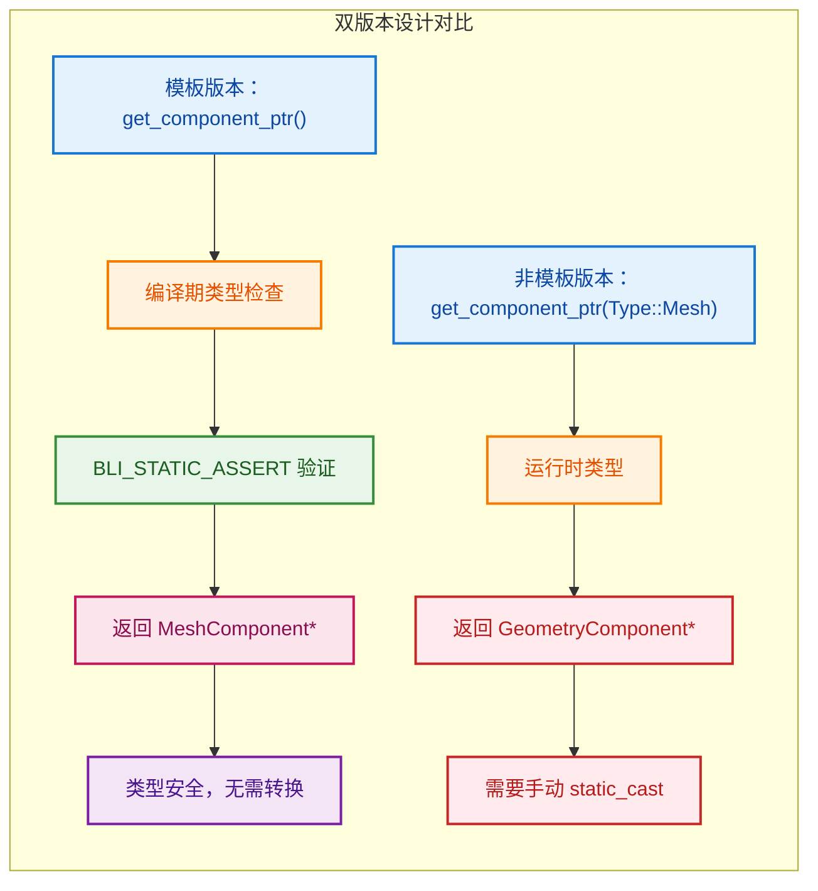
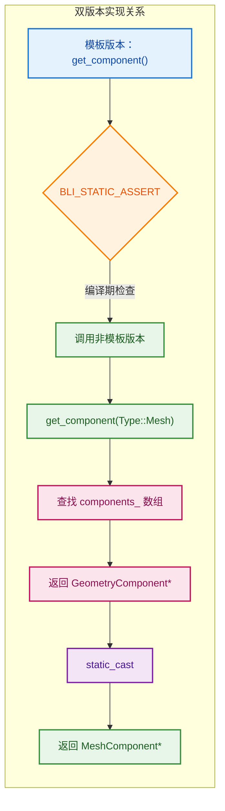
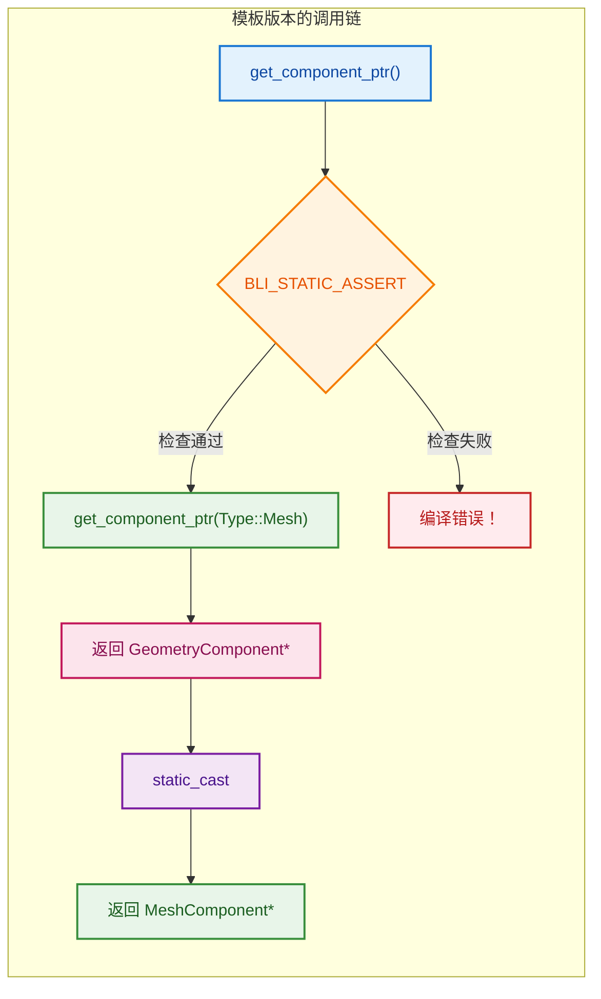
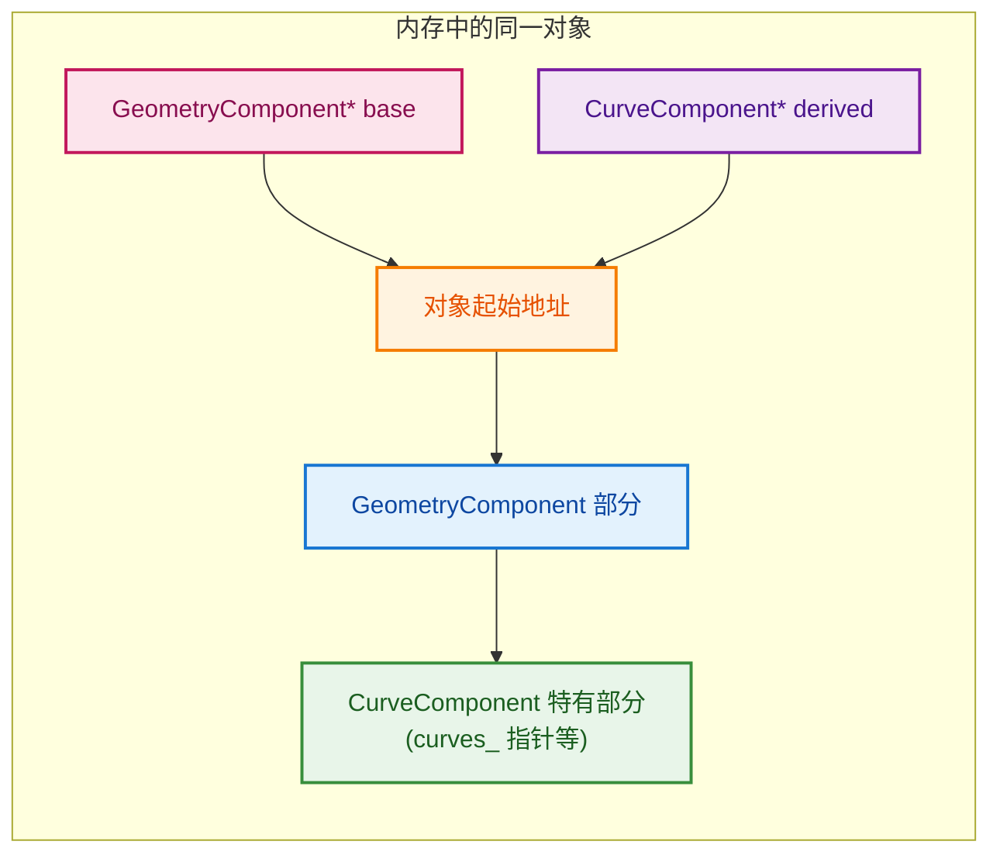
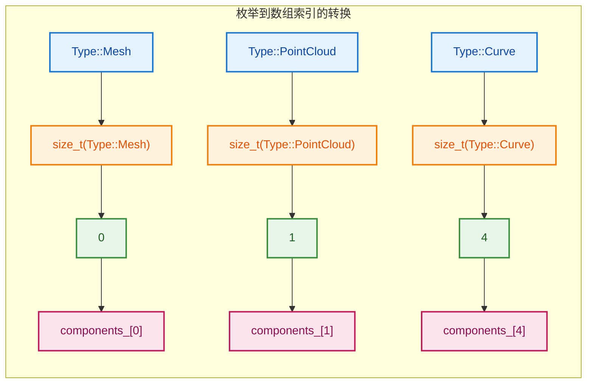
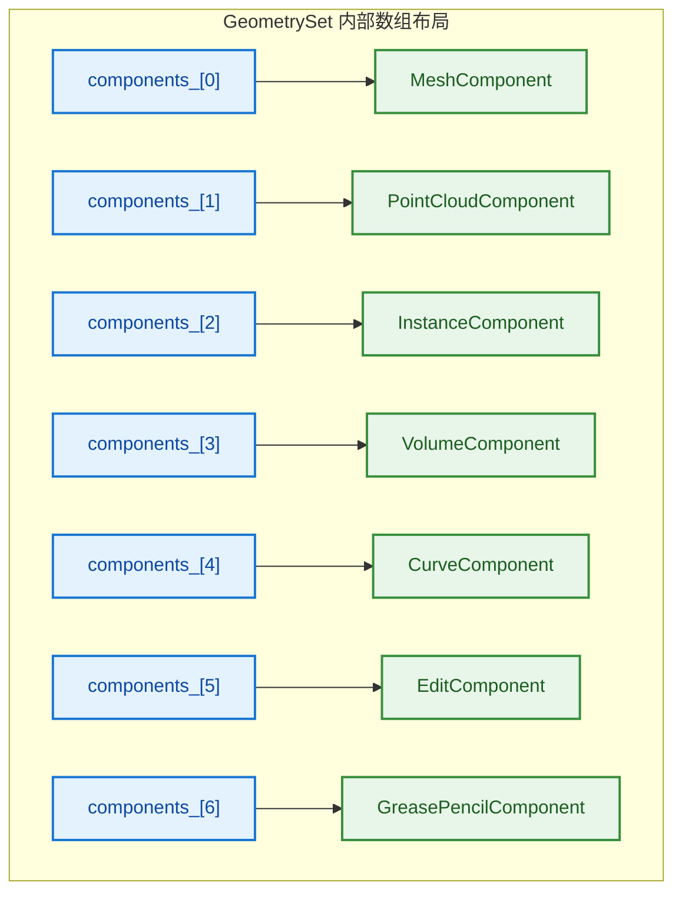

# 双版本 API 设计 - 编译期 vs 运行时

> 为什么提供模板版本和非模板版本的 API？枚举到数组索引的转换

---

## 📖 问题来源

**用户问题：**
1. `BKE_geometry_set.hh:478~483` 为什么这样设计？
2. 对枚举用 `size_t(component_type)` 是什么？

**涉及代码：**
- `get_component_ptr` 的两个版本
- `geometry_set.cc:140~141` 的枚举转换

---

## 1. 为什么 `get_component_ptr` 有两个版本？

### 代码对比

```cpp
// BKE_geometry_set.hh:478~483
// 版本1：运行时版本（非模板）
GeometryComponent *get_component_ptr(GeometryComponent::Type type);

// 版本2：编译期版本（模板）
template<typename Component> 
Component *get_component_ptr()
{
    BLI_STATIC_ASSERT(is_geometry_component_v<Component>, "");
    return static_cast<Component *>(get_component_ptr(Component::static_type));
}
```

### 为什么需要两个版本？

**版本1：运行时版本（非模板）**

```cpp
GeometryComponent *get_component_ptr(GeometryComponent::Type type);
```

- **用途**：当你只有运行时的类型信息
- **场景**：从用户输入、文件读取、网络接收的类型

```cpp
// 示例：从文件读取类型
GeometryComponent::Type type = read_type_from_file();
auto *comp = geometry_set.get_component_ptr(type);  // 运行时确定
// 返回类型是 GeometryComponent*，需要手动转换
```

**版本2：编译期版本（模板）**

```cpp
template<typename Component> 
Component *get_component_ptr()
```

- **用途**：当你知道编译期的类型
- **场景**：代码中直接指定组件类型

```cpp
// 示例：代码中明确知道类型
auto *mesh = geometry_set.get_component_ptr<MeshComponent>();  // 编译期确定
// 返回类型是 MeshComponent*，不需要手动转换
```

### 设计优势对比



| 特性 | 模板版本 `<MeshComponent>` | 非模板版本 `(Type::Mesh)` |
|------|---------------------------|-------------------------|
| **类型检查** | 编译期 | 运行时 |
| **返回类型** | `MeshComponent*`（具体） | `GeometryComponent*`（基类） |
| **需要转换** | 不需要 | 需要手动 `static_cast` |
| **性能** | 零开销 | 虚函数表查找 |
| **灵活性** | 编译期确定 | 运行时确定 |
| **错误发现** | 编译错误 | 可能运行时错误 |

### 实际使用对比

```cpp
// ❌ 使用非模板版本：繁琐且容易出错
GeometryComponent *comp = geometry_set.get_component_ptr(GeometryComponent::Type::Mesh);
if (comp) {
    MeshComponent *mesh = static_cast<MeshComponent *>(comp);  // 手动转换
    mesh->do_something();
}

// ✅ 使用模板版本：简洁且类型安全
auto *mesh = geometry_set.get_component_ptr<MeshComponent>();  // 自动转换
if (mesh) {
    mesh->do_something();  // 直接调用 MeshComponent 的方法
}
```

### 实现原理

**用户指出：模板版本实际上调用了非模板版本！**

```cpp
// BKE_geometry_set.hh:189~195
const GeometryComponent *get_component(GeometryComponent::Type component_type) const;

template<typename Component> const Component *get_component() const
{
    BLI_STATIC_ASSERT(is_geometry_component_v<Component>, "");
    // 注意：模板版本调用了非模板版本！
    return static_cast<const Component *>(get_component(Component::static_type));
}
```

**为什么这样设计？**

```cpp
// 1. 非模板版本：实现逻辑（只需一份代码）
const GeometryComponent *get_component(GeometryComponent::Type type) const
{
    // 实际的查找逻辑：
    // - 检查 components_ 数组
    // - 返回对应的组件指针
    // - 如果不存在，返回 nullptr
    return components_[size_t(type)].get();
}

// 2. 模板版本：类型安全的包装器
// 只做两件事：
// - 编译期类型检查（BLI_STATIC_ASSERT）
// - 自动类型转换（static_cast）
template<typename Component> 
const Component *get_component() const
{
    // 编译期检查：确保 Component 是 GeometryComponent 的派生类
    BLI_STATIC_ASSERT(is_geometry_component_v<Component>, "");
    
    // 调用非模板版本（复用实现）
    // Component::static_type 是编译期常量（如 Type::Mesh）
    const GeometryComponent *base = get_component(Component::static_type);
    
    // 自动转换为具体类型
    return static_cast<const Component *>(base);
}
```

**设计优势：代码复用 + 类型安全**



| 版本 | 职责 | 代码量 | 作用 |
|------|------|--------|------|
| **非模板版本** | 实现查找逻辑 | 一份 | 复用实现，避免代码膨胀 |
| **模板版本** | 类型安全检查 + 自动转换 | 内联（短小） | 提供类型安全的接口 |

**为什么不让模板版本独立实现？**

```cpp
// ❌ 如果模板版本独立实现：
template<typename Component> 
const Component *get_component() const
{
    BLI_STATIC_ASSERT(is_geometry_component_v<Component>, "");
    // 重复实现查找逻辑！
    return static_cast<const Component *>(components_[size_t(Component::static_type)].get());
}

// 问题：
// 1. 代码重复：每个模板实例都有一份查找逻辑
// 2. 代码膨胀：编译后体积增大
// 3. 维护困难：修改逻辑需要改两处

// ✅ 当前设计：模板版本只负责"类型安全层"
template<typename Component> 
const Component *get_component() const
{
    BLI_STATIC_ASSERT(is_geometry_component_v<Component>, "");
    // 复用非模板版本的实现
    return static_cast<const Component *>(get_component(Component::static_type));
}

// 优势：
// 1. 代码复用：查找逻辑只有一份
// 2. 零开销：模板版本完全内联，没有额外函数调用
// 3. 类型安全：编译期检查 + 自动转换
```



---

### 补充：为什么基类指针能转换成子类指针？

**用户问题：** 为什么基类能转换成子类？不丢失数据吗？

**关键理解：指针指向的是同一个对象！**

```cpp
// 内存布局：
class GeometryComponent {
    // 基类成员
};

class CurveComponent : public GeometryComponent {
    // 继承自 GeometryComponent
    Curves *curves_;  // 子类特有成员
};

// 创建对象：
CurveComponent component;  // 完整的 CurveComponent 对象
// 内存：[GeometryComponent 部分][CurveComponent 特有部分]

// 基类指针指向同一对象：
GeometryComponent *base = &component;
// base 指向对象的起始地址（GeometryComponent 部分）

// 向下转型：
CurveComponent *derived = static_cast<CurveComponent *>(base);
// derived 也指向同一对象的起始地址
// 只是解释方式不同：
// - base 只看到 GeometryComponent 部分
// - derived 看到完整的 CurveComponent
```

**可视化：**



**为什么不丢失数据？**

```cpp
// 因为指针只是地址，转换不改变内存内容！

CurveComponent component;
component.curves_ = some_curves;

GeometryComponent *base = &component;
// base 指向 component 的地址
// component.curves_ 仍然存在！

CurveComponent *derived = static_cast<CurveComponent *>(base);
// derived 指向同一地址
// derived->curves_ 可以访问到原来的数据！
```

**关键区别：向上转型 vs 向下转型**

| 转型方向 | 名称 | 是否安全 | 说明 |
|---------|------|---------|------|
| 子类 → 基类 | 向上转型（Upcast） | ✅ 总是安全 | 基类指针只能访问基类部分 |
| 基类 → 子类 | 向下转型（Downcast） | ⚠️ 需要确保对象实际是该类型 | 子类指针可以访问完整对象 |

```cpp
// ✅ 向上转型（总是安全）
CurveComponent derived;
GeometryComponent *base = &derived;  // 隐式转换，安全

// ⚠️ 向下转型（需要确保类型正确）
GeometryComponent *base = get_component(Type::Curve);
// 我们知道 base 实际指向 CurveComponent
CurveComponent *derived = static_cast<CurveComponent *>(base);  // 安全

// ❌ 错误的向下转型（危险！）
GeometryComponent *base = get_component(Type::Mesh);
// base 实际指向 MeshComponent
CurveComponent *derived = static_cast<CurveComponent *>(base);  // 未定义行为！
// derived->curves_ 会访问到错误的内存！
```

**为什么 `get_component_ptr` 中的转换是安全的？**

```cpp
template<typename Component> 
Component *get_component_ptr()
{
    // 1. 编译期检查：Component 是 GeometryComponent 的派生类
    BLI_STATIC_ASSERT(is_geometry_component_v<Component>, "");
    
    // 2. 传入 Component::static_type（如 Type::Curve）
    //    非模板版本返回 Type::Curve 对应的组件
    //    这个组件一定是 CurveComponent！
    
    // 3. 因此 static_cast 是安全的
    return static_cast<Component *>(get_component_ptr(Component::static_type));
}
```

**总结：**

| 问题 | 答案 |
|------|------|
| **为什么基类能转回子类？** | 指针指向同一对象，只是解释方式不同 |
| **会丢失数据吗？** | 不会，内存内容不变，只是指针类型变了 |
| **为什么安全？** | `BLI_STATIC_ASSERT` + `static_type` 确保类型匹配 |
| **什么情况下不安全？** | 如果基类指针实际指向其他子类类型 |

---

## 2. 对枚举用 `size_t(component_type)` 是什么？

### 代码位置

```cpp
// geometry_set.cc:140~141
const GeometryComponentPtr &component = components_[size_t(component_type)];
```

### 这是什么语法？

**`size_t(component_type)` 是 C++ 的函数式类型转换（Functional Cast）**

```cpp
// 三种等价的写法：
size_t(component_type)                 // 函数式转换（C++ 风格）
static_cast<size_t>(component_type)    // C++ 风格显式转换
(size_t)component_type                 // C 风格转换

// 三者效果相同，都是将枚举转换为整数
```

### 为什么需要转换？

```cpp
// GeometryComponent::Type 是 enum class（强类型枚举）
enum class Type {
    Mesh = 0,
    PointCloud = 1,
    Instance = 2,
    Volume = 3,
    Curve = 4,
    Edit = 5,
    GreasePencil = 6,
};

// components_ 是数组，需要整数索引
std::array<GeometryComponentPtr, GEO_COMPONENT_TYPE_ENUM_SIZE> components_;

// ❌ 错误：enum class 不能隐式转换为整数
components_[Type::Mesh];  // 编译错误！

// ✅ 正确：显式转换为 size_t
components_[size_t(Type::Mesh)];  // 等于 components_[0]
```

### 为什么用 `size_t` 而不是 `int`？

```cpp
// 数组索引的类型是 size_t（无符号）
std::array<GeometryComponentPtr, 7> components_;

// size_t 是数组索引的标准类型
// 在 64 位系统：size_t = uint64_t
// 在 32 位系统：size_t = uint32_t

// 使用 size_t 避免警告：
components_[int(Type::Mesh)];     // 可能有类型转换警告
components_[size_t(Type::Mesh)];  // 无警告，类型匹配
```

### 可视化



### 完整内存布局

```cpp
// GeometrySet 内部：
std::array<GeometryComponentPtr, 7> components_;

// 内存布局：
// components_[0] → MeshComponent          (Type::Mesh = 0)
// components_[1] → PointCloudComponent    (Type::PointCloud = 1)
// components_[2] → InstanceComponent      (Type::Instance = 2)
// components_[3] → VolumeComponent        (Type::Volume = 3)
// components_[4] → CurveComponent         (Type::Curve = 4)
// components_[5] → EditComponent          (Type::Edit = 5)
// components_[6] → GreasePencilComponent  (Type::GreasePencil = 6)

// 访问示例：
GeometryComponent::Type type = GeometryComponent::Type::Curve;
auto &comp = components_[size_t(type)];  // 访问 components_[4]
```



### `enum class` vs `enum`

```cpp
// C 风格枚举（隐式转换）
enum OldType { Mesh, PointCloud, Instance };
OldType type = Mesh;
int index = type;  // ✅ 可以隐式转换

// C++11 enum class（强类型，不能隐式转换）
enum class Type { Mesh, PointCloud, Instance };
Type type = Type::Mesh;
int index = type;              // ❌ 编译错误！不能隐式转换
int index = size_t(type);      // ✅ 必须显式转换
```

**为什么用 `enum class`？**

```cpp
// 1. 类型安全：防止不同枚举类型的混淆
enum class Color { Red, Green, Blue };
enum class Status { OK, Error };

Color c = Color::Red;
Status s = Status::OK;

// if (c == s)  // ❌ 编译错误！不同类型不能比较

// 2. 避免命名冲突
// enum class Type::Mesh 不会与 Mesh 类冲突
// enum Mesh 会与 Mesh 类冲突

// 3. 显式转换使代码意图更清晰
components_[size_t(Type::Mesh)];  // 明确知道在转换类型
```

---

### 补充：`static_type` 声明中的前缀问题

**用户问题：** 为什么 `static constexpr GeometryComponent::Type static_type = Type::Mesh;` 前面有前缀，后面没有？

**简单总结：**

```cpp
class MeshComponent : public GeometryComponent {
    static constexpr GeometryComponent::Type static_type = Type::Mesh;
    //                              ↑↑↑↑↑↑↑↑↑              ↑↑↑↑
    //                              类型声明（需要完整）      值初始化（类内可简写）
};
```

| 位置 | 是否需要前缀 | 原因 |
|------|-------------|------|
| **类型声明** `GeometryComponent::Type` | ✅ 需要 | 告诉编译器类型是什么 |
| **值初始化** `Type::Mesh` | ❌ 不需要（类内） | 编译器从类型推断上下文 |

**核心原则：**
- 类型声明必须明确（完整限定名）
- 值初始化在类内可以简写（编译器能推断）

---

## ✅ 总结

| 问题 | 答案 |
|------|------|
| **为什么两个 `get_component_ptr`？** | 运行时版本（灵活）+ 编译期版本（类型安全） |
| **`size_t(component_type)` 是什么？** | 函数式类型转换，将枚举转为数组索引 |
| **为什么用 `size_t`？** | 数组索引的标准类型，避免警告 |
| **`enum class` 为什么不能隐式转换？** | 强类型枚举，需要显式转换 |
| **双版本设计的优势？** | 兼顾灵活性和类型安全 |
| **为什么基类能转回子类？** | 指针指向同一对象，只是解释方式不同 |
| **为什么 `static_type` 声明前后不同？** | 类型声明需完整，值初始化类内可简写 |
