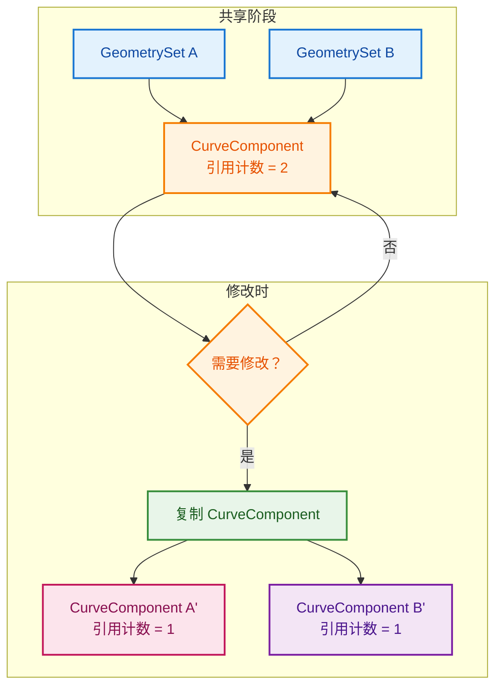
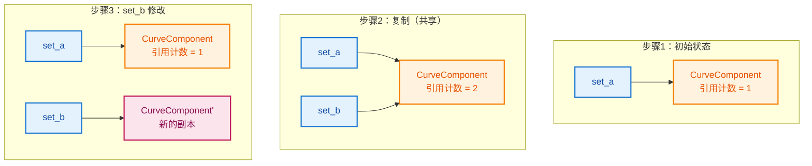
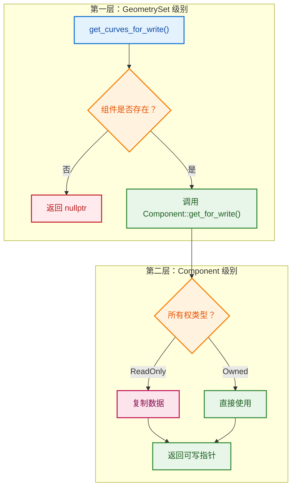

# 写时复制机制（Copy-on-Write）

> 隐式共享指针 `ImplicitSharingPtr` 的工作原理

---

## 📖 问题来源

**用户说：** "好复杂啊"

**涉及代码：**
- `geometry_set.cc:122` - `ensure_mutable_inplace()`
- `BLI_implicit_sharing_ptr.hh:139~154` - 实现细节
- `BKE_geometry_set.hh:153~154` - `GeometryComponentPtr` 定义
- `BKE_geometry_set.hh:62` - 类型别名

---

## 1. 为什么需要 `ensure_mutable_inplace`？

### 场景：多个 GeometrySet 共享同一个组件

```cpp
// 创建 GeometrySet A
GeometrySet set_a;
set_a.add_curves(...);  // 添加曲线组件

// 复制给 B（共享数据，不复制）
GeometrySet set_b = set_a;  // set_a 和 set_b 共享同一个 CurveComponent！

// 问题：如果修改 set_b，会影响 set_a 吗？
// 答案：不应该！需要写时复制
```

### 核心机制：`ImplicitSharingPtr`（隐式共享指针）

```cpp
// BKE_geometry_set.hh:62
using GeometryComponentPtr = ImplicitSharingPtr<GeometryComponent>;
//                                      ↑↑↑↑↑↑↑↑↑
//                                      隐式共享智能指针
```

**什么是隐式共享？**



---

## 2. `ensure_mutable_inplace` 的实现

```cpp
// BLI_implicit_sharing_ptr.hh:144~154
T &ensure_mutable_inplace()
{
    BLI_assert(data_);  // 确保有数据
    
    // 关键检查：是否只有一个用户？
    if (!data_->is_mutable()) {
        // 数据被共享，需要复制一份
        *this = data_->copy();  // 写时复制！
    }
    
    BLI_assert(data_->is_mutable());  // 确保现在是可变的
    data_->tag_ensured_mutable();      // 标记为已确保可变
    return const_cast<T &>(*data_);   // 返回可变引用
}
```

**工作流程：**

```cpp
// geometry_set.cc:122
return component_ptr.ensure_mutable_inplace();
//     ↑↑↑↑↑↑↑↑↑
//     GeometryComponentPtr = ImplicitSharingPtr<GeometryComponent>

// 内部逻辑：
// 1. 检查引用计数
// 2. 如果 > 1，复制一份新的
// 3. 返回可变引用
```

---

## 3. 可视化：写时复制过程



---

## 4. 为什么这样设计？

| 特性 | 优势 |
|------|------|
| **共享数据** | 复制 GeometrySet 很快（只复制指针） |
| **延迟复制** | 只有真正修改时才复制 |
| **透明** | 用户不需要知道是否在共享 |

---

## 5. 代码示例

```cpp
// 创建曲线
GeometrySet set_a;
set_a.add_curves(...);  // 创建 CurveComponent

// 快速复制（不复制数据）
GeometrySet set_b = set_a;  
// set_a 和 set_b 共享同一个 CurveComponent
// 引用计数 = 2

// 读取操作（不触发复制）
auto *curves_a = set_a.get_curves();  // 直接返回，很快
auto *curves_b = set_b.get_curves();  // 直接返回，很快

// 修改操作（触发写时复制）
set_b.get_curves_for_write();  
// 检查：引用计数 > 1？
// 是！复制一份新的 CurveComponent
// set_a 保持原数据，set_b 使用新数据
```

---

## ✅ 总结

```cpp
// 核心思想：共享直到需要修改
// Copy-on-Write = 写时复制

// 好处：
// 1. 复制 GeometrySet 是 O(1) 操作
// 2. 只有真正修改时才付出代价
// 3. 多个 GeometrySet 可以安全地共享数据
```

| 概念 | 说明 |
|------|------|
| `ImplicitSharingPtr` | 隐式共享智能指针，带引用计数 |
| `ensure_mutable_inplace` | 确保数据可变，必要时复制 |
| `is_mutable()` | 检查是否只有一个用户（引用计数 = 1） |
| 写时复制 | 延迟复制策略，修改时才真正复制 |

---

## 6. 补充问题解答

### 问题 1: 为什么重复模式不放到 `get_component_ptr` 实现里？

**观察到的重复模式：**

```cpp
// geometry_set.cc:561,567,573,579,585,621
Mesh *GeometrySet::get_mesh_for_write()
{
  MeshComponent *component = this->get_component_ptr<MeshComponent>();
  return component == nullptr ? nullptr : component->get_for_write();
}
// 重复了 7 次
```

**为什么不抽象成通用函数？**

| 原因 | 说明 |
|------|------|
| **返回类型不同** | 每个函数返回不同类型（Mesh*, Curves*, 等） |
| **C++ 语法限制** | 模板方案会增加复杂性 |
| **IDE 支持** | 显式函数有更好的自动补全 |
| **特殊逻辑** | 某些组件（如 EditHints）有特殊处理 |

**设计权衡：** 简单清晰 > 减少重复

---

### 问题 2: 解释 `get_for_write()` 的实现

**`CurveComponent::get_for_write()`：**

```cpp
Curves *CurveComponent::get_for_write()
{
  BLI_assert(this->is_mutable());  // 断言必须是可变的
  
  if (ownership_ == GeometryOwnershipType::ReadOnly) {
    curves_ = BKE_curves_copy_for_eval(curves_);  // 复制数据
    ownership_ = GeometryOwnershipType::Owned;     // 标记为已拥有
  }
  
  return curves_;
}
```

**两层写时复制机制：**



| 层级 | 职责 | 触发条件 |
|------|------|---------|
| **GeometrySet 层** | 管理组件的存在性 | 多个 GeometrySet 共享组件 |
| **Component 层** | 管理实际几何数据的所有权 | 组件从外部接收只读数据 |

**为什么需要两层？**

```cpp
// 场景：从现有曲线创建 GeometrySet（不复制）
Curves *existing_curves = ...;
GeometrySet set;
set.add_curves(existing_curves, GeometryOwnershipType::ReadOnly);

// 尝试修改
set.get_curves_for_write();
// 第一层：组件引用计数 = 1，不需要复制组件
// 第二层：ownership_ = ReadOnly，需要复制 Curves 数据
```
