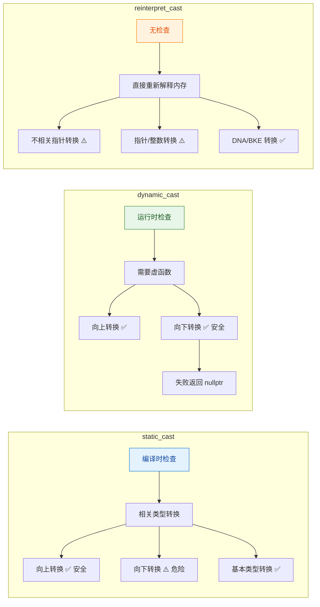
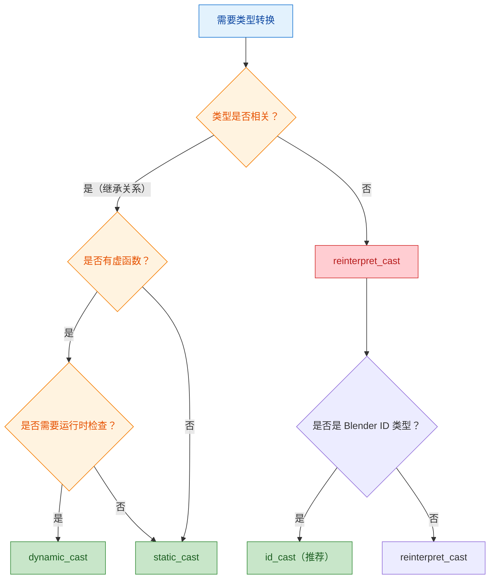

# C++ 类型转换（Cast）详解

> 详细介绍 `static_cast`、`dynamic_cast`、`reinterpret_cast` 三种类型转换，以及在 Blender 代码库中的实际使用。

---

## 📋 三种 Cast 对比总览

| 特性 | `static_cast` | `dynamic_cast` | `reinterpret_cast` |
|------|---------------|----------------|-------------------|
| **编译时检查** | ✅ | ✅ | ✅ |
| **运行时检查** | ❌ | ✅ | ❌ |
| **需要虚函数** | ❌ | ✅ 必须 | ❌ |
| **安全性** | 中等 | 最高 | 最低 |
| **性能** | 最高 | 较低（运行时检查）| 最高 |
| **用途** | 相关类型转换 | 多态类型安全转换 | 不相关类型强制转换 |
| **失败行为** | 编译错误 / 未定义行为 | 返回 `nullptr` 或抛异常 | 无检查，直接转换 |



---

## 1. static_cast —— 编译时类型转换

### 核心特点

- **编译时进行类型检查**，不执行运行时检查
- 用于**相关类型之间**的转换（有继承关系、或可以隐式转换的类型）
- **向上转换安全**，**向下转换危险**（可能产生未定义行为）
- 不能转换完全不相关的类型

### 使用场景

#### 场景 1：向上转换（子类 → 基类）—— 安全

```cpp
class Base { };
class Derived : public Base { };

Derived d;
Base *b = static_cast<Base*>(&d);  // ✅ 安全，编译通过
```

**在 Blender 中的使用：**

```cpp
// source/blender/nodes/intern/geometry_nodes_log.cc:151
const auto &edit_component = *static_cast<const bke::GeometryComponentEditData *>(component);

// GeometryComponentEditData 继承自 GeometryComponent
// 这里将基类指针 static_cast 为派生类指针（向下转换！）
// 但程序员确信 component 实际就是 GeometryComponentEditData 类型
```

#### 场景 2：向下转换（基类 → 子类）—— 危险！

```cpp
Base *b = new Base();
Derived *d = static_cast<Derived*>(b);  // ⚠️ 编译通过，但运行时可能崩溃！
// 因为 b 指向的实际上不是 Derived 对象
```

**为什么危险？**

```cpp
class Base {
public:
    int x = 10;
};

class Derived : public Base {
public:
    int y = 20;  // Derived 比 Base 多一个成员
    void derivedOnly() { /* ... */ }
};

Base *b = new Base();  // 只分配了 Base 的大小（4 字节）
Derived *d = static_cast<Derived*>(b);

d->y;  // ❌ 访问越界！Base 对象没有 y 成员
d->derivedOnly();  // ❌ 如果 derivedOnly 是虚函数，调用会崩溃
```

#### 场景 3：基本类型转换

```cpp
int i = 10;
float f = static_cast<float>(i);  // int -> float

double d = 3.14;
int i2 = static_cast<int>(d);     // double -> int（截断小数）
```

**在 Blender 中的使用：**

```cpp
// source/blender/nodes/geometry/nodes/node_geo_tool_active_element.cc:45
const AttrDomain domain = static_cast<AttrDomain>(params.node().custom1);
// 将 int 转换为枚举类型
```

#### 场景 4：void* 转换

```cpp
int *ip = new int(42);
void *vp = ip;
int *ip2 = static_cast<int*>(vp);  // ✅ void* -> 具体类型指针
```

**在 Blender 中的使用：**

```cpp
// source/blender/nodes/geometry/nodes/node_geo_viewer.cc:139
draw_int(params.layout, *static_cast<int *>(socket_value));
// 将 void* 转换为 int*，然后解引用
```

#### 场景 5：枚举类型转换

```cpp
enum class Color { Red, Green, Blue };
Color c = Color::Red;
int val = static_cast<int>(c);  // enum -> int
```

### static_cast 的上下转换条件

**基类指针和子类指针的关系：**

```cpp
class Base {
public:
    int base_val = 10;
};

class Derived : public Base {
public:
    int derived_val = 20;
};

// ========== 向上转换（子类 → 基类）==========
Derived d;
Base *b = &d;  // ✅ 隐式转换，安全

// 内存布局：
// d (Derived): [base_val=10][derived_val=20]
//                ↑
// b (Base*) 指向这里，只能看到 base_val

// 为什么安全？
// 因为 Derived 对象的开头就是 Base 子对象
// Base* 指向的范围内确实有完整的 Base 数据

// 向上转换总是隐式的，不需要 cast：
Derived d2;
Base *b2 = &d2;              // ✅ 隐式转换（推荐）
Base *b3 = static_cast<Base*>(&d2);  // ✅ 也可以，但不必要


// ========== 向下转换（基类 → 子类）==========
Base b2;
// Derived *d = &b2;  // ❌ 编译错误！不能隐式转换

Derived *d = static_cast<Derived*>(&b2);  // ⚠️ 强制转换，编译通过
// 内存布局：
// b2 (Base): [base_val=10]
//               
// d (Derived*) 指向这里，但期望看到：
// [base_val=10][derived_val=20]
//               ↑
//               这部分内存不存在！访问 d->derived_val 会越界
```

| 转换方向 | 条件 | 是否安全 | 结果 |
|---------|------|---------|------|
| **向上转换**（子类 → 基类）| 必须有继承关系 | ✅ 安全 | 编译通过，运行正确 |
| **向下转换**（基类 → 子类）| 必须有继承关系 | ⚠️ 危险 | 编译通过，但可能运行时崩溃 |
| **同级转换**（兄弟类之间）| 必须有共同基类 | ❌ 不允许 | 编译错误 |

```cpp
class Base { };
class Derived1 : public Base { };
class Derived2 : public Base { };

Base *b = new Derived1();

// 向下转换：基类指针 → 子类指针
Derived1 *d1 = static_cast<Derived1*>(b);  // ⚠️ 编译通过，但不安全
// 虽然 b 实际指向 Derived1，但 static_cast 不检查
// 如果 b 指向 Base 对象，访问 Derived1 成员会崩溃

// 兄弟类之间不能转换
Derived2 *d2 = static_cast<Derived2*>(b);  // ❌ 编译错误！没有直接继承关系
```

---

## 2. dynamic_cast —— 运行时类型安全转换

### 核心特点

- **运行时进行类型检查**（通过 RTTI，Run-Time Type Information）
- 需要**虚函数表**（必须有至少一个虚函数）
- 转换失败时：指针返回 `nullptr`，引用抛出 `std::bad_cast`
- **性能开销较大**（运行时检查）
- **只能用于多态类型**（有虚函数的类）

### 使用场景

#### 场景 1：安全向下转换（基类 → 子类）

```cpp
class Base {
public:
    virtual ~Base() {}  // 必须有虚函数！
};

class Derived : public Base {
public:
    void derivedOnlyMethod() {}
};

Base *b = new Derived();  // 实际指向 Derived 对象

// 安全向下转换
Derived *d = dynamic_cast<Derived*>(b);
if (d != nullptr) {
    d->derivedOnlyMethod();  // ✅ 安全调用
}

Base *b2 = new Base();
Derived *d2 = dynamic_cast<Derived*>(b2);
// d2 == nullptr！运行时检查发现 b2 不是 Derived 类型
```

**在 Blender 中的使用：**

```cpp
// source/blender/functions/FN_field.hh:600
template<typename InputT> inline const InputT *GField::get_input_if() const
{
  const GField &deref_field = this->deref_field_ref();
  if (const auto *input = std::get_if<Input>(&deref_field.variant())) {
    return dynamic_cast<const InputT *>(input->node.get());
  }
  return nullptr;
}

// 将基类指针 Node 安全转换为派生类 InputT
// 如果转换失败，返回 nullptr
```

#### 场景 2：运行时类型识别

```cpp
// source/blender/gpu/intern/gpu_context.cc:529
if (g_backend && dynamic_cast<GLBackend *>(g_backend) != nullptr) {
    // 确认当前后端是 OpenGL
}
if (g_backend && dynamic_cast<MTLBackend *>(g_backend) != nullptr) {
    // 确认当前后端是 Metal
}
if (g_backend && dynamic_cast<VKBackend *>(g_backend) != nullptr) {
    // 确认当前后端是 Vulkan
}

// 根据运行时类型执行不同的逻辑
```

#### 场景 3：引用类型的 dynamic_cast

```cpp
Base &b = *new Derived();
try {
    Derived &d = dynamic_cast<Derived&>(b);  // ✅ 成功
} catch (std::bad_cast &e) {
    // 转换失败时抛出异常
}

Base &b2 = *new Base();
try {
    Derived &d = dynamic_cast<Derived&>(b2);  // ❌ 抛出 std::bad_cast！
} catch (std::bad_cast &e) {
    // 捕获异常
}
```

**在 Blender 中的使用：**

```cpp
// source/blender/editors/interface/views/tree_view.cc:348
const AbstractTreeView &old_tree_view = dynamic_cast<const AbstractTreeView &>(old_view);

// 引用类型的 dynamic_cast
// 如果失败会抛出异常，但代码中通常确信类型正确
```

### dynamic_cast 的上下转换条件

| 转换方向 | 条件 | 是否安全 | 失败结果 |
|---------|------|---------|---------|
| **向上转换**（子类 → 基类）| 必须有虚函数 | ✅ 安全 | 不会失败 |
| **向下转换**（基类 → 子类）| 必须有虚函数 | ✅ 安全 | 指针返回 `nullptr`，引用抛异常 |
| **交叉转换**（兄弟类之间）| 必须有共同虚基类 | ✅ 安全 | 指针返回 `nullptr`，引用抛异常 |

```cpp
class Base {
public:
    virtual ~Base() {}  // 必须有虚函数
};

class Derived1 : public Base { };
class Derived2 : public Base { };

Base *b = new Derived1();

Derived1 *d1 = dynamic_cast<Derived1*>(b);  // ✅ 成功，d1 != nullptr
Derived2 *d2 = dynamic_cast<Derived2*>(b);  // ✅ 安全失败，d2 == nullptr
```

**关键：dynamic_cast 需要 RTTI**

```cpp
// RTTI 是什么？
// Run-Time Type Information（运行时类型信息）
// 编译器为每个有虚函数的类生成一个 type_info 对象
// dynamic_cast 通过查询 type_info 来确定实际类型

class Base {
public:
    virtual void foo() {}  // 有虚函数 = 有多态 = 有 RTTI
};

class Derived : public Base { };

Base *b = new Derived();
const std::type_info &ti = typeid(*b);  // 获取运行时类型信息
// ti.name() 会返回 "Derived"
```

---

## 3. reinterpret_cast —— 强制重新解释内存

### 核心特点

- **最危险的转换**，不进行任何类型检查
- 直接重新解释内存的位模式
- 用于**完全不相关的类型**之间转换
- 结果依赖于具体实现，可移植性差
- **不调整指针**，直接重新解释

### 使用场景

#### 场景 1：DNA/BKE 双版本转换（Blender 特有）

```cpp
// source/blender/blenkernel/BKE_curves.hh:1185
inline bke::CurvesGeometry &CurvesGeometry::wrap()
{
    return *reinterpret_cast<bke::CurvesGeometry *>(this);
}

// DNA 结构体（基类）和 BKE 类（派生类）内存布局相同
// 用 reinterpret_cast 直接重新解释内存
```

#### 场景 2：指针类型转换（不相关类型）

```cpp
// source/blender/makesdna/DNA_mask_types.h:232
return reinterpret_cast<const MaskLayerShapeElem *>(this->data);

// this->data 是某种指针类型
// 直接 reinterpret_cast 为 MaskLayerShapeElem*
```

#### 场景 3：指针与整数之间的转换

```cpp
// source/blender/makesdna/intern/dna_genfile.cc:316
return reinterpret_cast<const char *>((uintptr_t(ptr) + 3) & ~3);

// 先将指针转换为整数进行对齐计算
// 再将结果转换回指针
```

#### 场景 4：RNA 系统的 DNA 转换

```cpp
// source/blender/makesrna/intern/rna_action.cc:122
return reinterpret_cast<bAction *>(ptr->owner_id)->wrap();

// 将通用 ID 指针转换为具体的 bAction 指针
// 然后调用 wrap() 获取 C++ 封装版本
```

#### 场景 5：自定义的 id_cast（带检查的 reinterpret_cast）

```cpp
// source/blender/makesdna/DNA_ID.h:1368
/**
 * A drop-in replacement for `reinterpret_cast` that does additional checks:
 * - Static check that the source and destination types are data-block types.
 * - Run-time assert when down-casting from #ID to e.g. #Object.
 */
template<typename Dst, typename Src> inline Dst id_cast(Src &&id)
{
    // ... 类型检查 ...
    return reinterpret_cast<Dst>(id);  // 底层仍然是 reinterpret_cast
}

// 使用：
Object *ob = id_cast<Object *>(id_ptr);  // 带安全检查的 reinterpret_cast
```

### reinterpret_cast 的使用条件

| 转换类型 | 条件 | 安全性 | 说明 |
|---------|------|--------|------|
| **指针 → 指针**（不相关类型）| 无限制 | ⚠️ 程序员负责 | 直接重新解释位模式 |
| **指针 → 整数** | 整数类型足够大 | ⚠️ 依赖实现 | 用于地址计算 |
| **整数 → 指针** | 整数是有效地址 | ⚠️ 依赖实现 | 用于地址还原 |
| **引用 → 引用**（不相关类型）| 无限制 | ⚠️ 程序员负责 | 与指针转换等价 |

```cpp
// 典型用法：
int *ip = new int(42);

// ❌ static_cast 不允许不相关类型转换
float *fp = static_cast<float*>(ip);  // 编译错误！

// ✅ reinterpret_cast 允许
float *fp = reinterpret_cast<float*>(ip);  // 编译通过
// ⚠️ 但解引用 *fp 会得到无意义的结果！
```

---

## 4. 上下转换的详细条件

### 向上转换（Upcasting）：子类 → 基类

```cpp
class Base { };
class Derived : public Base { };

Derived d;
Base *b = &d;  // 隐式转换，安全

// 三种 cast 都可以：
Base *b1 = static_cast<Base*>(&d);      // ✅ 安全
Base *b2 = dynamic_cast<Base*>(&d);     // ✅ 安全（如果有虚函数）
Base *b3 = reinterpret_cast<Base*>(&d); // ⚠️ 危险！不调整指针
```

**向上转换总结：**

| Cast 类型 | 是否需要继承关系 | 是否调整指针 | 是否安全 | 推荐使用 |
|-----------|-----------------|-------------|---------|---------|
| 隐式转换 | ✅ | 否 | ✅ | ✅ 首选 |
| `static_cast` | ✅ | 否 | ✅ | ✅ |
| `dynamic_cast` | ✅ | 否 | ✅ | ⚠️ 不必要（有开销）|
| `reinterpret_cast` | ❌ | 否 | ⚠️ | ❌ 不推荐 |

### 向下转换（Downcasting）：基类 → 子类

**核心问题：基类指针能指向子类对象，子类指针能指向基类对象吗？**

```cpp
class Base {
public:
    int base_val = 10;
};

class Derived : public Base {
public:
    int derived_val = 20;
};

// ========== 1. 基类指针指向子类对象（向上）==========
Derived d;
Base *b = &d;  // ✅ 合法！隐式转换

// 内存布局：
// d (Derived): [base_val=10][derived_val=20]
//                ↑
// b (Base*) 指向这里

b->base_val;      // ✅ 可以访问，值为 10
// b->derived_val;  // ❌ 编译错误！Base* 不知道 derived_val

// 为什么合法？
// 因为 Derived 对象的开头部分就是 Base 子对象
// Base* 指向的就是这个 Base 子对象


// ========== 2. 子类指针指向基类对象（向下）==========
Base b2;
// Derived *d = &b2;  // ❌ 编译错误！不能隐式转换

// 内存布局：
// b2 (Base): [base_val=10]
//               
// 如果 Derived* 指向这里：
// d->derived_val 会访问越界！因为 b2 没有 derived_val

// 强制转换：
Derived *d = static_cast<Derived*>(&b2);  // ⚠️ 编译通过，但危险！
d->derived_val;  // ❌ 未定义行为！访问了不存在的内存
```

**关键结论：**

| 方向 | 是否允许 | 是否安全 | 说明 |
|------|---------|---------|------|
| **基类指针 → 子类对象** | ✅ 允许（隐式） | ✅ 安全 | 子类包含完整的基类部分 |
| **子类指针 → 基类对象** | ❌ 不允许（隐式） | ❌ 危险 | 基类缺少子类的成员 |

**什么时候需要基类转子类（向下转换）？**

```cpp
// 场景 1：函数返回基类指针，但实际是子类对象
class Shape {
public:
    virtual ~Shape() {}
    virtual void draw() = 0;
};

class Circle : public Shape {
public:
    void draw() override {}
    void setRadius(float r) { radius = r; }
private:
    float radius;
};

// 工厂函数返回基类指针
Shape *createShape(const std::string &type) {
    if (type == "circle") return new Circle();
    // ...
    return nullptr;
}

// 使用：
Shape *s = createShape("circle");
s->draw();  // ✅ 可以调用基类方法

// 但需要调用 Circle 特有方法时：
// s->setRadius(5.0f);  // ❌ 编译错误！Shape* 没有 setRadius

// 需要向下转换：
Circle *c = dynamic_cast<Circle*>(s);  // ✅ 运行时检查
if (c) {
    c->setRadius(5.0f);  // ✅ 现在可以调用了
}
```

```cpp
// 场景 2：容器存储基类指针，取出时需要具体类型
std::vector<Shape*> shapes;
shapes.push_back(new Circle());
shapes.push_back(new Rectangle());

for (Shape *s : shapes) {
    // 需要知道具体类型才能执行特定操作
    if (Circle *c = dynamic_cast<Circle*>(s)) {
        c->setRadius(10.0f);
    }
    else if (Rectangle *r = dynamic_cast<Rectangle*>(s)) {
        r->setWidth(20.0f);
    }
}
```

```cpp
// 场景 3：Blender 的 DNA/BKE 双版本设计
// source/blender/blenkernel/BKE_curves.hh:1185
inline bke::CurvesGeometry &CurvesGeometry::wrap()
{
    return *reinterpret_cast<bke::CurvesGeometry *>(this);
}

// 这也是基类转子类！
// this 是 blender::CurvesGeometry*（DNA 基类）
// 转换为 bke::CurvesGeometry*（BKE 派生类）
// 
// 为什么用 reinterpret_cast 而不是 static_cast？
// 1. 语义更准确：表达"重新解释同一块内存"的意图
// 2. 避免 static_cast 的指针调整（虽然这里单继承不需要调整）
// 3. 与 C 代码的强制转换语义一致
//
// 注意：static_cast 在这里也是可以编译的，因为 bke::CurvesGeometry 确实继承自 blender::CurvesGeometry
// 但 reinterpret_cast 更准确地表达了"这两个类型是同一内存的两种看法"
```

```cpp
class Base {
public:
    virtual ~Base() {}  // dynamic_cast 需要虚函数
};
class Derived : public Base { };

Base *b = new Derived();  // 实际指向 Derived

// 三种 cast 都能编译通过，访问成员都能正确运行：
Derived *d1 = static_cast<Derived*>(b);      // ✅ 正确运行
Derived *d2 = dynamic_cast<Derived*>(b);     // ✅ 正确运行
Derived *d3 = reinterpret_cast<Derived*>(b); // ✅ 正确运行

// 三种都能正确访问 Derived 的成员：
d1->derivedOnlyMethod();  // ✅ 正常运行
d2->derivedOnlyMethod();  // ✅ 正常运行
d3->derivedOnlyMethod();  // ✅ 正常运行
```

**三种都能正确运行，但推荐 `static_cast` 或 `dynamic_cast`**

```cpp
// 为什么三种都能正确运行？
// 因为 b 实际指向的就是 Derived 对象，内存布局正确

// static_cast：编译器按 Derived 类型解释指针，正确
// dynamic_cast：运行时检查确认是 Derived，然后转换，正确
// reinterpret_cast：直接按 Derived 类型重新解释内存，正确（因为内存布局相同）

// 关键区别：如果 b 实际指向的是 Base 对象（不是 Derived）
Base *b2 = new Base();

Derived *d1 = static_cast<Derived*>(b2);      // ⚠️ 编译通过，运行崩溃！
Derived *d2 = dynamic_cast<Derived*>(b2);     // ✅ 编译通过，返回 nullptr，安全
Derived *d3 = reinterpret_cast<Derived*>(b2); // ⚠️ 编译通过，运行崩溃！
```

**选择建议：**

| 场景 | 推荐 cast | 原因 |
|------|----------|------|
| **不确定实际类型** | `dynamic_cast` | 运行时检查，失败返回 nullptr |
| **确信是 Derived 类型** | `static_cast` | 性能更好，无运行时开销 |
| **DNA/BKE 内存重新解释** | `reinterpret_cast` | 语义准确，表达"同内存不同看法" |

```cpp
// 推荐写法：
Base *b = new Derived();

// 方法 1：static_cast（性能优先，确信类型时推荐）
// 适用于性能敏感且确信类型的场景（如 Blender 内部代码）
Derived *d = static_cast<Derived*>(b);
d->derivedOnlyMethod();  // ✅ 正常运行

// 方法 2：dynamic_cast（安全，不确定类型时推荐）
if (Derived *d = dynamic_cast<Derived*>(b)) {
    d->derivedOnlyMethod();  // ✅ 安全调用
}

// 方法 3：reinterpret_cast（不推荐用于继承转换）
// 除非有特殊理由（如 DNA/BKE 设计），否则不要用
```

**向下转换总结：**

| Cast 类型 | 是否需要虚函数 | 是否运行时检查 | 失败行为 | 推荐使用 |
|-----------|---------------|---------------|---------|---------|
| `static_cast` | ❌ | ❌ | 未定义行为 | ⚠️ 仅在确信类型正确时 |
| `dynamic_cast` | ✅ | ✅ | 返回 nullptr | ✅ 安全首选 |
| `reinterpret_cast` | ❌ | ❌ | 未定义行为 | ❌ 不推荐用于继承转换 |

### 交叉转换（Cross-casting）：兄弟类之间

```cpp
class Base {
public:
    virtual ~Base() {}
};
class Derived1 : public Base { };
class Derived2 : public Base { };

Base *b = new Derived1();

// 尝试转换为兄弟类：
Derived2 *d2_static = static_cast<Derived2*>(b);      // ❌ 编译错误！
Derived2 *d2_dynamic = dynamic_cast<Derived2*>(b);    // ✅ 安全失败，返回 nullptr
Derived2 *d2_reinterpret = reinterpret_cast<Derived2*>(b); // ⚠️ 编译通过，危险！
```

---

## 5. Blender 代码库中的实际使用

### static_cast 在 Blender 中的典型用法

```cpp
// 1. 节点存储转换
// source/blender/nodes/geometry/nodes/node_geo_viewer.cc:311
const auto &storage = *static_cast<NodeGeometryViewer *>(node.storage);

// node.storage 是 void*，static_cast 转换为具体类型
// 程序员确信 storage 实际就是 NodeGeometryViewer 类型


// 2. 枚举转换
// source/blender/nodes/geometry/nodes/node_geo_tool_active_element.cc:45
const AttrDomain domain = static_cast<AttrDomain>(params.node().custom1);

// 将 int 转换为枚举类型
// 这是 static_cast 的合法用法


// 3. 基类指针转派生类指针（确信类型正确）
// source/blender/nodes/intern/geometry_nodes_log.cc:151
const auto &edit_component = *static_cast<const bke::GeometryComponentEditData *>(component);

// component 是 GeometryComponent*（基类）
// 程序员确信它实际指向 GeometryComponentEditData（派生类）
// 使用 static_cast 而不是 dynamic_cast 是为了性能（避免运行时检查）
```

### dynamic_cast 在 Blender 中的典型用法

```cpp
// 1. 运行时后端识别
// source/blender/gpu/intern/gpu_context.cc:529
if (g_backend && dynamic_cast<GLBackend *>(g_backend) != nullptr) {
    // 当前是 OpenGL 后端
}

// g_backend 是 Backend*（基类）
// 需要在运行时确定实际类型


// 2. 字段输入类型识别
// source/blender/functions/FN_field.hh:600
return dynamic_cast<const InputT *>(input->node.get());

// input->node 是 Node*（基类）
// 需要在运行时确定是否是 InputT 类型
// 失败时返回 nullptr，调用者检查返回值


// 3. UI 视图项类型识别
// source/blender/editors/interface/views/tree_view.cc:348
const AbstractTreeView &old_tree_view = dynamic_cast<const AbstractTreeView &>(old_view);

// 引用类型的 dynamic_cast
// 如果失败会抛出 std::bad_cast
// 但代码中通常确信类型正确
```

### reinterpret_cast 在 Blender 中的典型用法

```cpp
// 1. DNA/BKE wrap 转换
// source/blender/blenkernel/BKE_curves.hh:1185
inline bke::CurvesGeometry &CurvesGeometry::wrap()
{
    return *reinterpret_cast<bke::CurvesGeometry *>(this);
}

// DNA 结构体和 BKE 类内存布局相同
// 用 reinterpret_cast 直接重新解释


// 2. RNA 系统的 ID 转换
// source/blender/makesrna/intern/rna_action.cc:122
return reinterpret_cast<bAction *>(ptr->owner_id)->wrap();

// ptr->owner_id 是 ID*（通用基类）
// 转换为具体的 bAction*


// 3. 自定义 id_cast（带安全检查）
// source/blender/makesdna/DNA_ID.h:1389
template<typename Dst, typename Src> inline Dst id_cast(Src &&id)
{
    // ... 静态断言和运行时检查 ...
    return reinterpret_cast<Dst>(id);
}

// Blender 封装了 reinterpret_cast，增加了类型安全检查
// 推荐使用 id_cast 而不是裸的 reinterpret_cast
```

---

## 6. 选择指南：什么时候用什么？

```cpp
// 1. 相关类型转换（继承关系明确）-> static_cast
Base *b = static_cast<Base*>(derived_ptr);  // 向上转换
Derived *d = static_cast<Derived*>(base_ptr);  // 向下转换（确信类型正确）

// 2. 多态类型安全向下转换 -> dynamic_cast
Derived *d = dynamic_cast<Derived*>(base_ptr);  // 不确定类型时用
if (d) { d->derivedMethod(); }

// 3. 不相关类型强制转换（内存布局相同）-> reinterpret_cast
BKEType *bke = reinterpret_cast<BKEType*>(dna_ptr);  // DNA/BKE 转换

// 4. 移除 const -> const_cast
NonConstType *nc = const_cast<NonConstType*>(const_ptr);

// 5. Blender 的 ID 类型转换 -> id_cast（推荐）
Object *ob = id_cast<Object *>(id_ptr);  // 带安全检查的 reinterpret_cast
```

### 决策流程图



---

## ✅ 总结

| Cast 类型 | 核心用途 | 安全性 | 性能 | Blender 典型场景 |
|-----------|---------|--------|------|-----------------|
| `static_cast` | 相关类型转换 | 中等 | 最高 | 节点存储转换、枚举转换、确信类型的向下转换 |
| `dynamic_cast` | 多态类型安全转换 | 最高 | 较低 | 运行时后端识别、字段类型识别、UI 视图项识别 |
| `reinterpret_cast` | 不相关类型强制转换 | 最低 | 最高 | DNA/BKE 转换、RNA ID 转换、指针/整数转换 |

**关键原则：**
1. **优先使用 static_cast**：当类型关系明确且不需要运行时检查时
2. **不确定类型时用 dynamic_cast**：虽然性能较低，但安全性最高
3. **reinterpret_cast 是最后手段**：仅在内存布局保证相同的情况下使用
4. **Blender 中优先使用 id_cast**：对于 ID 类型转换，使用 Blender 封装的安全版本
