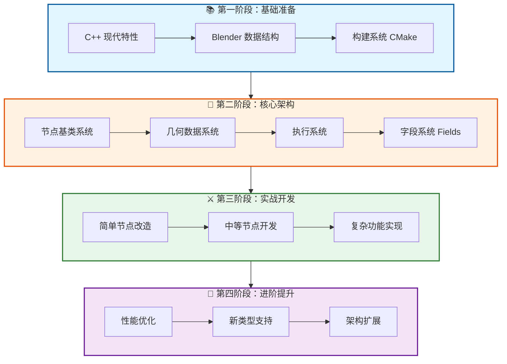
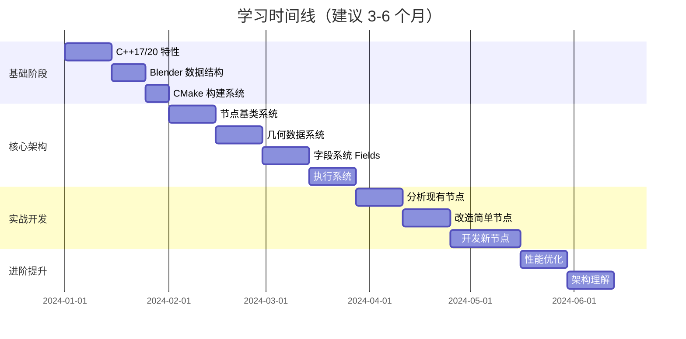
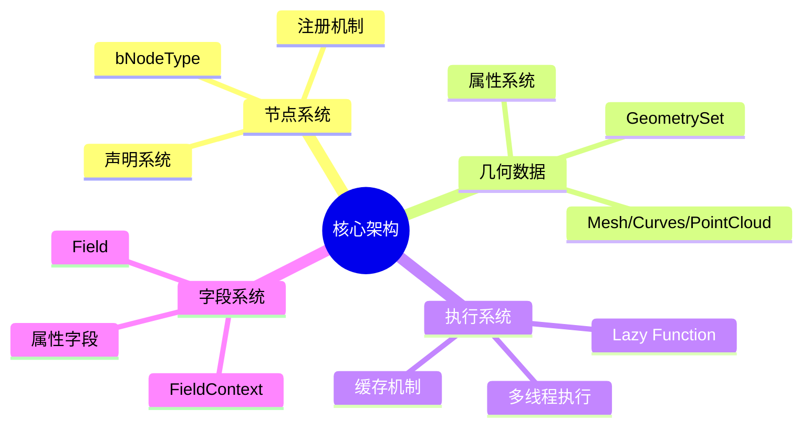
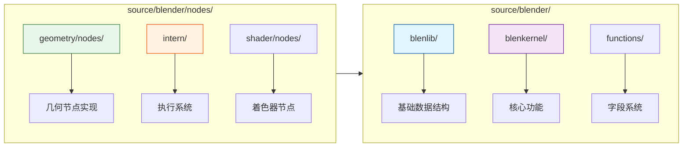

# Blender 几何节点 C++ 源码学习路线图

> 目标：掌握 Blender 几何节点开发，能够添加自定义功能

---

## 🗺️ 整体学习路线图

---

## 📊 学习路径详细规划

---

## 🎯 各阶段具体目标

### 第一阶段：基础准备（2-4 周）

| 主题 | 关键知识点 | 参考文件 |
|------|-----------|---------|
| C++17/20 | 模板、constexpr、lambda、智能指针 | - |
| Blender 数据结构 | `Vector`, `Span`, `Array`, `Map` | `source/blender/blenlib/` |
| CMake | 模块组织、编译选项、依赖管理 | `CMakeLists.txt` |

### 第二阶段：核心架构（4-6 周）

### 第三阶段：实战开发（4-6 周）

1. **Week 1-2**: 阅读并理解 5-10 个简单节点
2. **Week 3-4**: 修改现有节点（添加参数或功能）
3. **Week 5-7**: 开发一个全新的几何节点

### 第四阶段：进阶提升（持续）

- 性能分析和优化
- 理解更复杂的执行逻辑
- 参与社区贡献

---

## 📁 关键代码目录速查

---

## ✅ 学习检查清单

- [ ] 能独立编译 Blender
- [ ] 理解 `Vector<T>` 和 `Span<T>` 的区别
- [ ] 能读懂节点的 `node_declare` 函数
- [ ] 理解 `GeometrySet` 的组成
- [ ] 理解 `Field<T>` 的工作原理
- [ ] 能创建一个简单的几何节点
- [ ] 能调试节点执行流程
