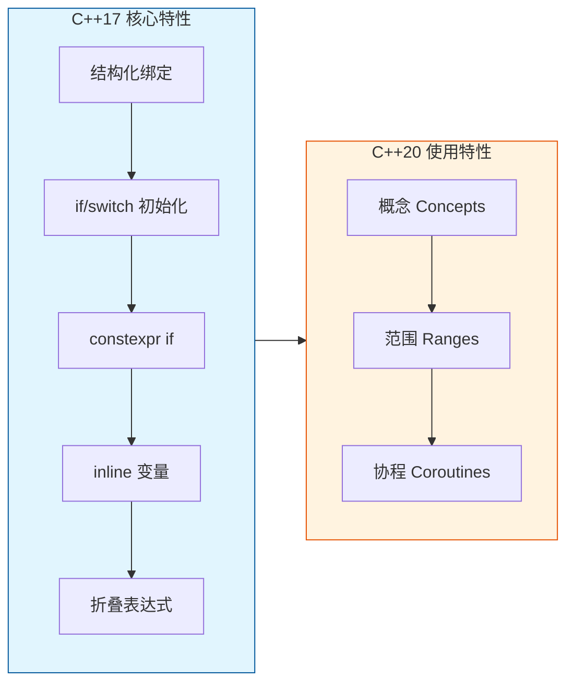
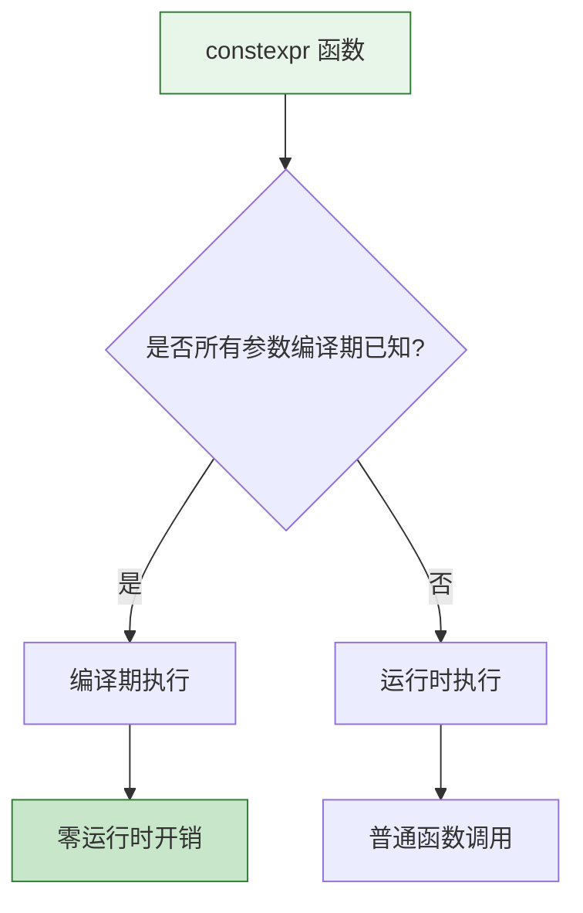
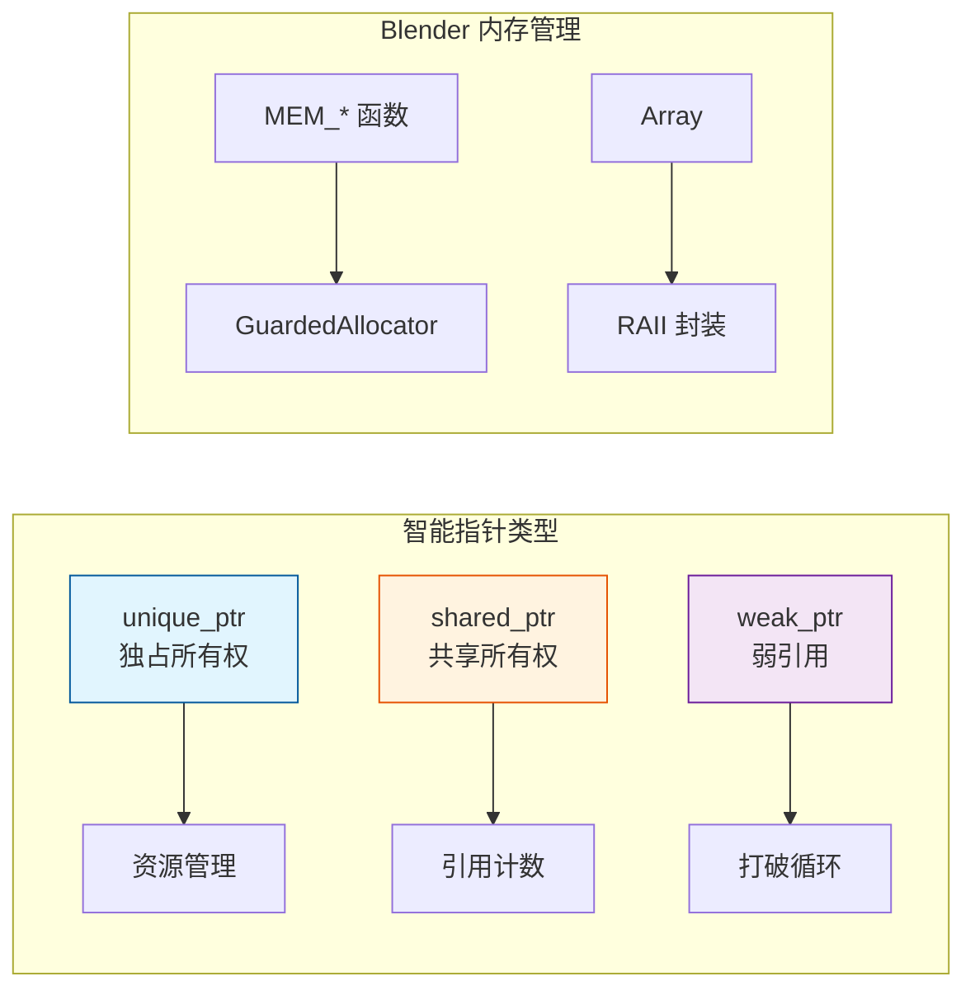

# Blender 几何节点开发 - C++ 基础

> 本章节介绍开发 Blender 几何节点所需的 C++ 知识

---

## 🎯 C++ 标准版本

Blender 使用 **C++17** 标准，部分代码使用 **C++20** 特性。



---

## 📦 模板编程

### 基础模板

```cpp
// 函数模板
namespace blender::nodes {

template<typename T>
T add(const T &a, const T &b) {
    return a + b;
}

// 类模板
template<typename T, int64_t InlineCapacity = 4>
class MyContainer {
    T data_[InlineCapacity];
    int64_t size_ = 0;
public:
    void append(const T &value) {
        data_[size_++] = value;
    }
};

} // namespace blender::nodes
```

### SFINAE 和概念

```cpp
// C++17: SFINAE
namespace blender {

template<typename T>
std::enable_if_t<std::is_arithmetic_v<T>, T>
square(T value) {
    return value * value;
}

// C++20: Concepts (如果可用)
template<typename T>
concept Arithmetic = std::is_arithmetic_v<T>;

template<Arithmetic T>
T cube(T value) {
    return value * value * value;
}

} // namespace blender
```

---

## 🔧 constexpr 和编译期计算



### Blender 中的 constexpr 示例

```cpp
// source/blender/blenlib/BLI_math_base.hh
namespace blender::math {

// 编译期计算
constexpr float degrees(float radians) {
    return radians * (180.0f / float(M_PI));
}

constexpr float radians(float degrees) {
    return degrees * (float(M_PI) / 180.0f);
}

} // namespace blender::math
```

---

## 🎭 Lambda 表达式

```cpp
namespace blender::nodes {

void process_geometry(GeometrySet &geometry) {
    // 基础 lambda
    auto print_count = [](int count) {
        std::cout << "Count: " << count << std::endl;
    };
    
    // 带捕获的 lambda
    int processed = 0;
    auto increment = [&processed]() {
        ++processed;
    };
    
    // 泛型 lambda (C++14)
    auto identity = [](auto x) { return x; };
    
    // 在算法中使用
    IndexRange range(0, 100);
    range.foreach_index([&](const int i) {
        // 处理每个索引
    });
}

} // namespace blender::nodes
```

---

## 🧠 智能指针和内存管理



### Blender 的内存管理

```cpp
// 使用 Blender 的内存分配
#include "MEM_guardedalloc.h"

void *buffer = MEM_mallocN(size, __func__);
// ... 使用 buffer ...
MEM_freeN(buffer);

// 更好的方式：使用 RAII 封装
Array<float> data(100);  // 自动分配和释放
```

---

## 🏗️ 结构化绑定和 if 初始化

```cpp
namespace blender::nodes {

void example() {
    // 结构化绑定
    std::pair<int, float> result = compute();
    auto [count, average] = result;
    
    // 或者直接从函数返回
    auto [min, max] = get_bounds(geometry);
    
    // if 初始化 (C++17)
    if (auto mesh = geometry.get_mesh(); mesh != nullptr) {
        // 在这里使用 mesh
        process(*mesh);
    }  // mesh 在这里销毁
    
    // switch 初始化
    switch (auto type = socket.type(); type) {
        case SOCK_FLOAT: /* ... */ break;
        case SOCK_VECTOR: /* ... */ break;
    }
}

} // namespace blender::nodes
```

---

## 🔄 移动语义和完美转发

```cpp
namespace blender {

class GeometrySet {
    // 移动构造函数
    GeometrySet(GeometrySet &&other) noexcept
        : mesh_(std::exchange(other.mesh_, nullptr)),
          curves_(std::exchange(other.curves_, nullptr)) {}
    
    // 移动赋值
    GeometrySet &operator=(GeometrySet &&other) noexcept {
        if (this != &other) {
            mesh_ = std::exchange(other.mesh_, nullptr);
            curves_ = std::exchange(other.curves_, nullptr);
        }
        return *this;
    }
};

// 完美转发模板
template<typename T, typename... Args>
T &Vector<T>::append(Args &&...args) {
    // 原地构造，完美转发参数
    new (end_) T(std::forward<Args>(args)...);
    ++end_;
    return *(end_ - 1);
}

} // namespace blender
```

---

## 📚 类型推导和 auto

```cpp
namespace blender::nodes {

void type_deduction_examples() {
    // auto 基础用法
    auto count = 42;           // int
    auto &mesh = get_mesh();   // Mesh&
    const auto &data = array;  // const T&
    
    // decltype 和 decltype(auto)
    decltype(auto) get_value() {
        return some_value;  // 保持返回类型的引用性
    }
    
    // 在模板中使用
    template<typename Container>
    auto get_first(Container &&c) -> decltype(auto) {
        return std::forward<Container>(c)[0];
    }
    
    // 尾置返回类型
    template<typename T, typename U>
    auto add(T t, U u) -> decltype(t + u) {
        return t + u;
    }
}

} // namespace blender::nodes
```

---

## 🎨 变参模板

```cpp
namespace blender {

// 递归终止
template<typename T>
T sum(T value) {
    return value;
}

// 变参递归
template<typename T, typename... Args>
T sum(T first, Args... rest) {
    return first + sum(rest...);
}

// C++17 折叠表达式
template<typename... Args>
auto sum_fold(Args... args) {
    return (args + ...);  // 一元右折叠
}

// 在 Blender 中的实际应用
template<typename... FieldTypes>
class FieldOperation {
    std::tuple<FieldTypes...> inputs_;
    
public:
    explicit FieldOperation(FieldTypes... fields) 
        : inputs_(std::move(fields)...) {}
};

} // namespace blender
```

---

## ✅ 学习检查清单

- [ ] 理解模板实例化机制
- [ ] 能编写 constexpr 函数
- [ ] 掌握 lambda 捕获规则
- [ ] 理解移动语义和右值引用
- [ ] 能使用结构化绑定
- [ ] 理解变参模板和折叠表达式
- [ ] 熟悉 Blender 的内存管理方式

---

## 📖 推荐资源

1. **C++ Reference**: https://en.cppreference.com/
2. **Blender 代码规范**: https://developer.blender.org/docs/handbook/coding_guidelines/
3. **Effective Modern C++** - Scott Meyers
4. **C++ Templates: The Complete Guide** - David Vandevoorde
