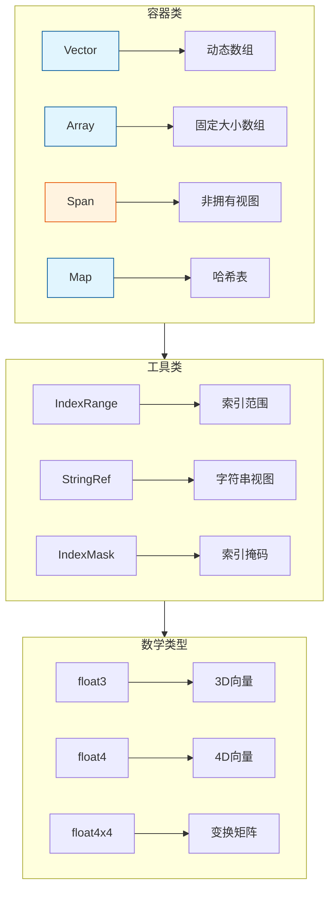
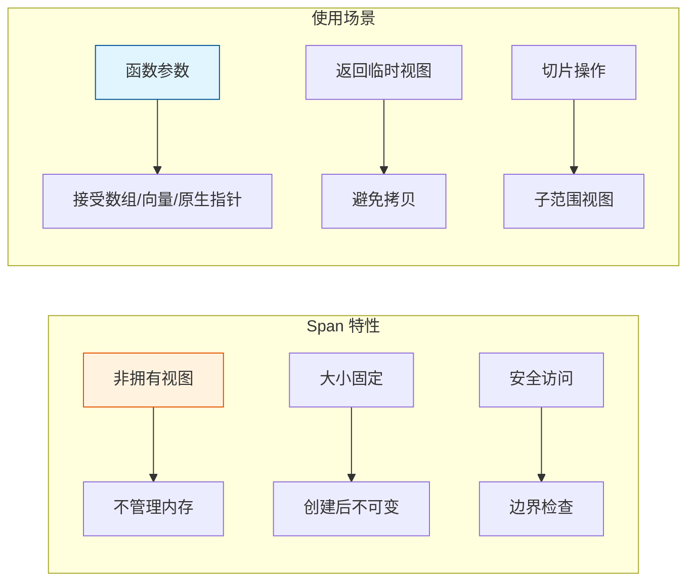
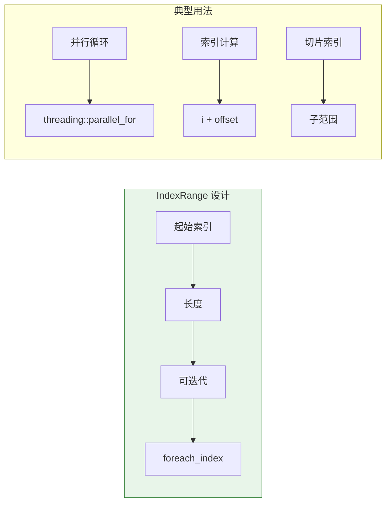
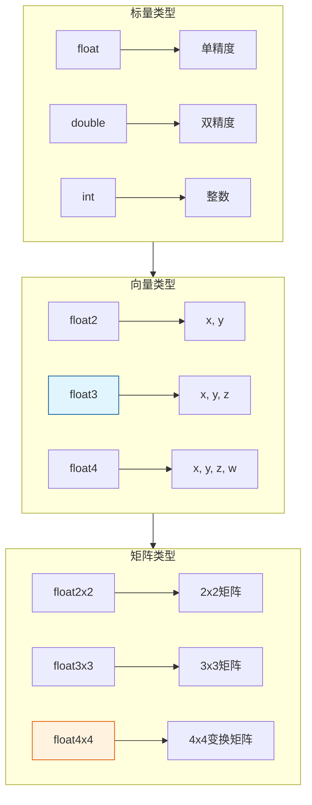
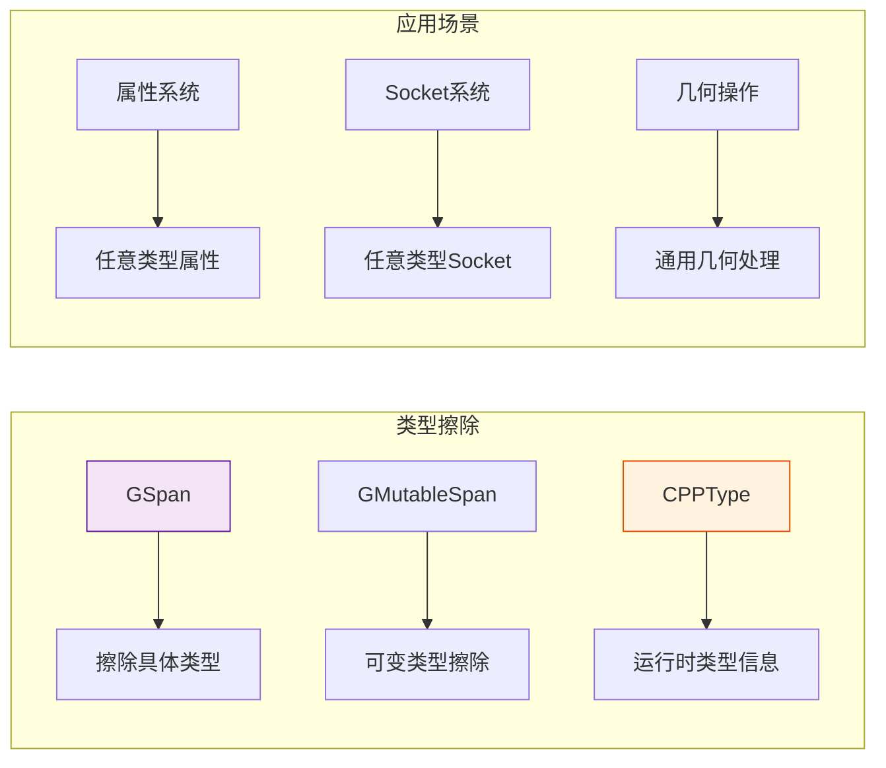

# Blender 数据结构详解

> Blender 拥有自己独立的数据结构库 `blenlib`，这是理解几何节点的基础

---

## 🏗️ 数据结构概览



---

## 📦 Vector<T> - 动态数组

### 核心特性

```cpp
// source/blender/blenlib/BLI_vector.hh
template<typename T, 
         int64_t InlineBufferCapacity = default_inline_buffer_capacity(sizeof(T)),
         typename Allocator = GuardedAllocator>
class Vector {
    // 小缓冲区优化：小数组无需堆分配
    T *begin_;
    T *end_;
    T *capacity_end_;
    TypedBuffer<T, InlineBufferCapacity> inline_buffer_;
};
```

```mermaid
flowchart LR
    subgraph 内存布局["Vector 内存布局"]
        direction TB
        IB[内联缓冲区<br/>InlineBufferCapacity] --> |小数据| NA[无需堆分配]
        IB --> |大数据| HA[堆分配]
    end
    
    subgraph 操作复杂度["操作复杂度"]
        direction TB
        AP[append] --> O1[O(1) 均摊]
        IN[insert] --> ON[O(n)]
        RM[remove] --> OR[O(n)]
        AC[access] --> OA[O(1)]
    end
    
    style IB fill:#c8e6c9,stroke:#2e7d32
    style AP fill:#e1f5fe,stroke:#01579b
```

### 使用示例

```cpp
#include "BLI_vector.hh"

namespace blender::nodes {

void vector_examples() {
    // 基础用法
    Vector<int> numbers;
    numbers.append(1);
    numbers.append(2);
    numbers.append(3);
    
    // 初始化列表
    Vector<float> values = {1.0f, 2.0f, 3.0f, 4.0f};
    
    // 指定内联缓冲区大小
    Vector<float3, 16> positions;  // 最多16个float3在栈上
    
    // 遍历
    for (float3 &pos : positions) {
        pos += float3(1, 0, 0);
    }
    
    // 索引访问
    float3 first = positions[0];
    float3 last = positions.last();
    
    // 批量操作
    positions.extend({{1, 2, 3}, {4, 5, 6}});
    
    // 移除元素
    positions.remove_and_reorder(2);  // 无序移除，O(1)
}

} // namespace blender::nodes
```

---

## 📏 Span<T> - 非拥有视图

### 核心概念



### 使用示例

```cpp
#include "BLI_span.hh"

namespace blender::nodes {

// 函数接受 Span，可以传入多种类型
void process_vertices(Span<float3> positions) {
    for (const float3 &pos : positions) {
        // 处理每个顶点
    }
}

void span_examples() {
    Vector<float3> vec = get_positions();
    Array<float3> arr(100);
    float3 raw_array[50];
    
    // 都可以传给 Span 参数
    process_vertices(vec);
    process_vertices(arr);
    process_vertices(Span<float3>(raw_array, 50));
    
    // 切片操作
    Span<float3> first_10 = vec.as_span().take_front(10);
    Span<float3> last_10 = vec.as_span().take_back(10);
    Span<float3> middle = vec.as_span().slice(10, 20);
    
    // 类型擦除的 GSpan
    GSpan generic_span(CPPType::get<float3>(), data_ptr, size);
}

} // namespace blender::nodes
```

---

## 🎯 MutableSpan<T> - 可变视图

```cpp
#include "BLI_span.hh"

namespace blender::nodes {

void modify_vertices(MutableSpan<float3> positions) {
    for (float3 &pos : positions) {
        pos *= 2.0f;  // 修改原始数据
    }
}

void mutable_span_examples() {
    Vector<float3> vec = get_positions();
    
    // 获取可变视图
    modify_vertices(vec.as_mutable_span());
    
    // 从 MutableSpan 创建 Vector（拷贝）
    Vector<float3> copy = vec.as_span();
}

} // namespace blender::nodes
```

---

## 🔢 IndexRange - 索引范围



### 使用示例

```cpp
#include "BLI_index_range.hh"

namespace blender::nodes {

void index_range_examples() {
    // 创建范围
    IndexRange range(0, 100);  // [0, 100)
    IndexRange first_10 = range.take_front(10);  // [0, 10)
    IndexRange rest = range.drop_front(10);      // [10, 100)
    
    // 迭代
    for (const int64_t i : range) {
        // i 从 0 到 99
    }
    
    // 常用模式：并行处理
    threading::parallel_for(range, 1024, [&](const IndexRange sub_range) {
        for (const int64_t i : sub_range) {
            // 处理元素 i
        }
    });
    
    // 检查包含
    bool contains = range.contains(50);  // true
    
    // 范围操作
    IndexRange shifted = range.shift(10);  // [10, 110)
}

} // namespace blender::nodes
```

---

## 🎭 IndexMask - 索引掩码

```cpp
#include "BLI_index_mask.hh"

namespace blender::nodes {

void index_mask_examples() {
    // 从布尔数组创建
    Array<bool> selection(1000);
    // ... 填充 selection ...
    IndexMask mask = IndexMask::from_booleans(selection);
    
    // 遍历选中项
    mask.foreach_index([&](const int64_t i) {
        // 只处理被选中的索引
        process_vertex(i);
    });
    
    // 获取选中数量
    int64_t selected_count = mask.size();
    
    // 切片
    IndexMask first_batch = mask.slice(IndexRange(0, 100));
}

} // namespace blender::nodes
```

---

## 🗺️ Map<K, V> - 哈希表

```cpp
#include "BLI_map.hh"

namespace blender::nodes {

void map_examples() {
    // 创建 Map
    Map<std::string, int> name_to_id;
    
    // 添加元素
    name_to_id.add("cube", 1);
    name_to_id.add("sphere", 2);
    
    // 查找
    if (std::optional<int> id = name_to_id.lookup_opt("cube")) {
        // 使用 *id
    }
    
    // 不存在则添加默认值
    int &id = name_to_id.lookup_or_add("cylinder", 3);
    
    // 遍历
    for (const auto &[name, id] : name_to_id.items()) {
        // 结构化绑定
    }
    
    // 移除
    name_to_id.remove("cube");
    
    // 批量添加
    Vector<std::string> keys = {"a", "b", "c"};
    Vector<int> values = {1, 2, 3};
    name_to_id.add_multiple(keys, values);
}

} // namespace blender::nodes
```

---

## 🔢 数学类型



### float3 使用示例

```cpp
#include "BLI_math_vector.hh"

namespace blender::nodes {

void float3_examples() {
    // 创建
    float3 a(1.0f, 2.0f, 3.0f);
    float3 b = {4.0f, 5.0f, 6.0f};
    float3 zero = float3::zero();
    float3 one = float3::one();
    
    // 算术运算
    float3 c = a + b;
    float3 d = a - b;
    float3 e = a * 2.0f;  // 标量乘
    float3 f = a * b;     // 逐元素乘
    
    // 向量运算
    float dot = math::dot(a, b);
    float3 cross = math::cross(a, b);
    float length = math::length(a);
    float3 normalized = math::normalize(a);
    
    // 距离
    float dist = math::distance(a, b);
    float dist_sq = math::distance_squared(a, b);
    
    // 线性插值
    float3 lerped = math::interpolate(a, b, 0.5f);
}

} // namespace blender::nodes
```

### float4x4 变换矩阵

```cpp
#include "BLI_math_matrix.hh"

namespace blender::nodes {

void matrix_examples() {
    // 单位矩阵
    float4x4 identity = float4x4::identity();
    
    // 从位置/旋转/缩放创建
    float3 location(1, 2, 3);
    math::Quaternion rotation = math::to_quaternion(math::EulerXYZ(0, 0, 0));
    float3 scale(1, 1, 1);
    
    float4x4 transform = math::from_loc_rot_scale<float4x4>(location, rotation, scale);
    
    // 矩阵乘法
    float4x4 combined = transform * identity;
    
    // 变换点
    float3 point(1, 0, 0);
    float3 transformed = math::transform_point(transform, point);
    float3 transformed_dir = math::transform_direction(transform, point);
    
    // 逆矩阵
    float4x4 inverse = math::invert(transform);
    
    // 转置
    float4x4 transposed = math::transpose(transform);
}

} // namespace blender::nodes
```

---

## 📝 StringRef - 字符串视图

```cpp
#include "BLI_string_ref.hh"

namespace blender::nodes {

void string_ref_examples() {
    // 从各种来源创建
    StringRef ref1 = "hello";           // 字面量
    StringRef ref2 = std::string("world");  // std::string
    
    // 不拥有内存，只是视图
    std::string str = "mutable string";
    StringRef ref3(str);  // 安全，只要 str 存活
    
    // 常用操作
    bool starts = ref1.startswith("he");  // true
    bool ends = ref1.endswith("lo");      // true
    bool contains = ref1.contains("ell"); // true
    
    // 查找
    std::optional<int64_t> pos = ref1.find_first("l");  // 2
    
    // 切片
    StringRef sub = ref1.substr(1, 3);  // "ell"
    
    // 分割
    Vector<StringRef> parts = StringRef("a,b,c").split(",");
    
    // 比较
    bool equal = (ref1 == "hello");  // true
}

} // namespace blender::nodes
```

---

## 🎨 类型擦除与 GSpan



```cpp
#include "BLI_cpp_type.hh"
#include "BLI_span.hh"

namespace blender::nodes {

void type_erasure_examples() {
    // 运行时类型信息
    const CPPType &float_type = CPPType::get<float>();
    const CPPType &float3_type = CPPType::get<float3>();
    
    // 创建类型擦除的 Span
    Array<float3> positions(100);
    GSpan gspan(float3_type, positions.data(), positions.size());
    
    // 类型检查
    if (gspan.type() == CPPType::get<float3>()) {
        // 安全地转换为具体类型
        Span<float3> typed = gspan.typed<float3>();
    }
    
    // 可变版本
    GMutableSpan gmut_span(float3_type, positions.data(), positions.size());
    
    // 构造新值
    void *buffer = MEM_mallocN(float3_type.size, __func__);
    float3_type.construct_default(buffer);  // 默认构造
    float3_type.destruct(buffer);           // 析构
    MEM_freeN(buffer);
}

} // namespace blender::nodes
```

---

## ✅ 学习检查清单

- [ ] 理解 `Vector` 的小缓冲区优化
- [ ] 掌握 `Span` 和 `MutableSpan` 的区别
- [ ] 能使用 `IndexRange` 进行高效循环
- [ ] 理解 `IndexMask` 的用途
- [ ] 熟练使用 `float3` 和 `float4x4`
- [ ] 理解 `StringRef` 的生命周期
- [ ] 了解 `GSpan` 的类型擦除机制

---

## 📁 关键头文件

| 头文件 | 功能 |
|-------|------|
| `BLI_vector.hh` | Vector<T> |
| `BLI_span.hh` | Span<T>, MutableSpan<T>, GSpan |
| `BLI_array.hh` | Array<T> |
| `BLI_map.hh` | Map<K,V> |
| `BLI_index_range.hh` | IndexRange |
| `BLI_index_mask.hh` | IndexMask |
| `BLI_string_ref.hh` | StringRef |
| `BLI_math_vector.hh` | float2, float3, float4 |
| `BLI_math_matrix.hh` | float2x2, float3x3, float4x4 |
| `BLI_cpp_type.hh` | CPPType, 类型擦除 |
