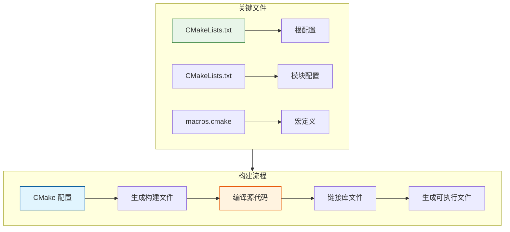
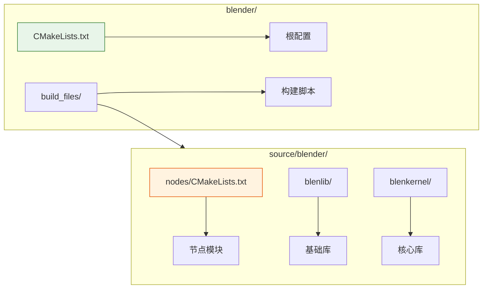
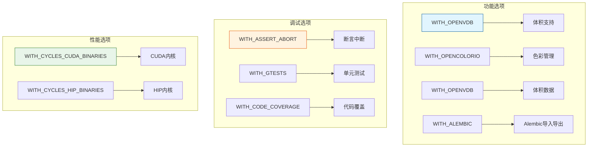
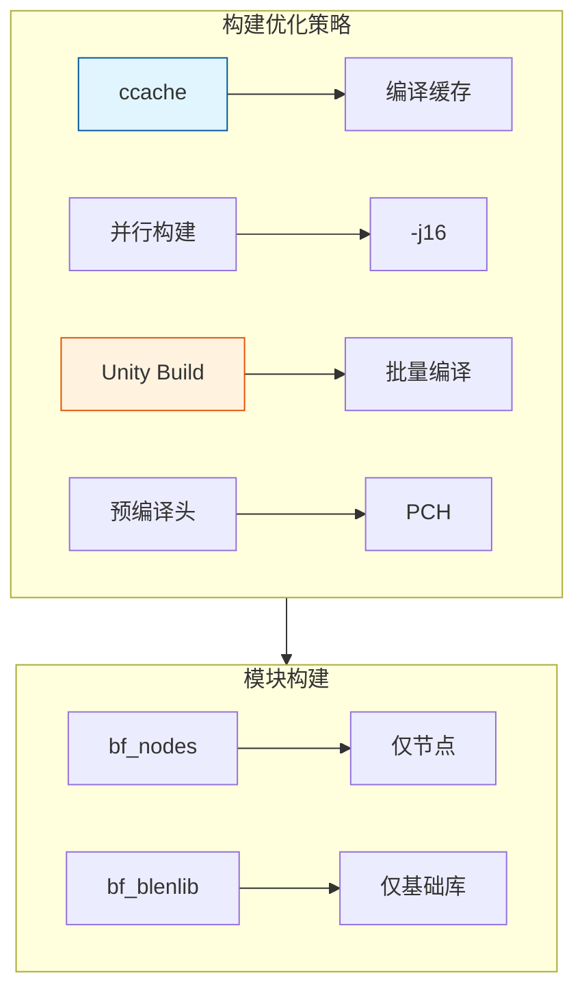
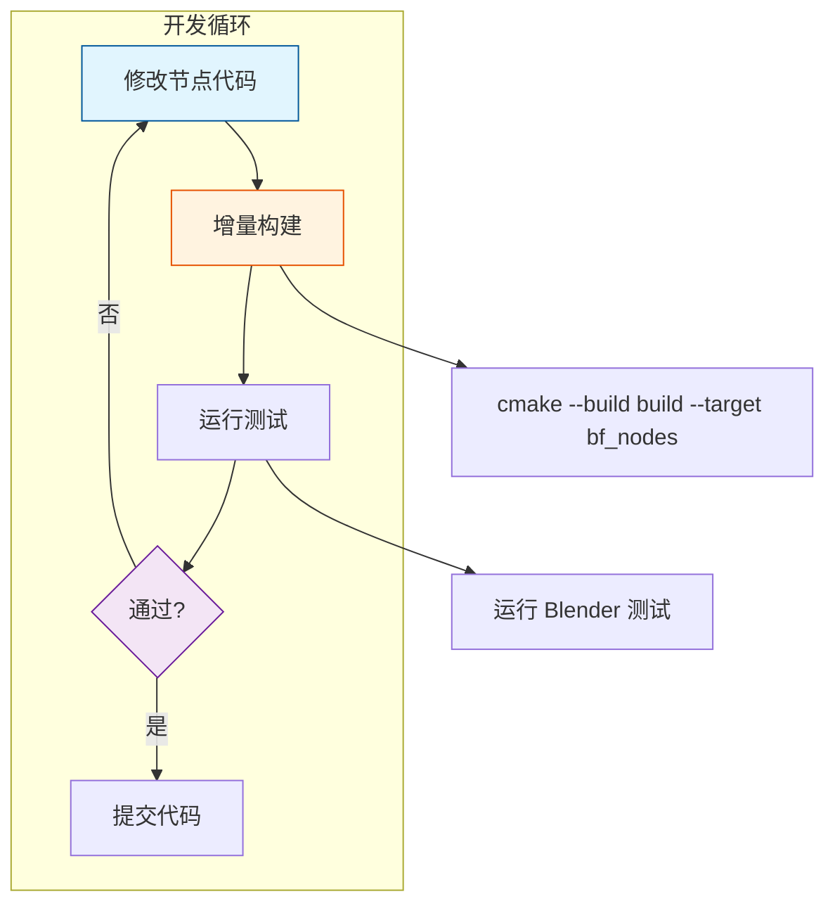

# Blender 构建系统详解

> Blender 使用 CMake 作为构建系统，理解它对于开发和调试至关重要

---

## 🏗️ 构建系统概览



---

## 📁 目录结构



### 关键文件位置

| 文件 | 用途 |
|-----|------|
| `CMakeLists.txt` | 根 CMake 配置 |
| `build_files/cmake/macros.cmake` | Blender 自定义宏 |
| `build_files/cmake/platform/` | 平台特定配置 |
| `source/blender/nodes/CMakeLists.txt` | 节点模块配置 |
| `make.bat` / `make.sh` | 便捷构建脚本 |

---

## 🔧 基础构建命令

### Windows (Visual Studio)

```powershell
# 1. 配置构建
cmake -B build -S . -G "Visual Studio 17 2022" -A x64

# 2. 构建（Release）
cmake --build build --config Release

# 3. 构建（Debug）
cmake --build build --config Debug

# 4. 并行构建（更快）
cmake --build build --config Release --parallel 16
```

### 使用 make.bat（推荐）

```batch
# 完整构建
make.bat full

# 仅更新
make.bat update

# 构建 Release
make.bat release

# 构建 Debug
make.bat debug
```

---

## ⚙️ 重要构建选项



### 常用配置示例

```powershell
# 最小化构建（仅几何节点相关）
cmake -B build_minimal -S . `
    -DWITH_OPENVDB=ON `
    -DWITH_OPENCOLORIO=ON `
    -DWITH_ALEMBIC=OFF `
    -DWITH_USD=OFF `
    -DWITH_FFTW3=OFF

# 开发构建（带调试信息）
cmake -B build_dev -S . `
    -DCMAKE_BUILD_TYPE=Debug `
    -DWITH_ASSERT_ABORT=ON `
    -DWITH_GTESTS=ON

# 仅构建特定目标
cmake --build build --target bf_nodes
```

---

## 📦 节点模块 CMakeLists.txt 解析

```cmake
# source/blender/nodes/CMakeLists.txt (简化版)

set(INC
  .
  ./geometry
  ./intern
  ./shader
  ./texture
  
  # 依赖的头文件目录
  ../blenlib
  ../blenkernel
  ../functions
  ../makesdna
  ../makesrna
)

set(INC_SYS
  # 系统库头文件
  ${ZLIB_INCLUDE_DIRS}
  ${OPENVDB_INCLUDE_DIRS}
)

set(SRC
  # 几何节点源文件
  geometry/nodes/node_geo_transform_geometry.cc
  geometry/nodes/node_geo_set_position.cc
  geometry/nodes/node_geo_join_geometry.cc
  # ... 更多节点文件
  
  # 内部实现
  intern/geometry_nodes_execute.cc
  intern/geometry_nodes_lazy_function.cc
  intern/node_register.cc
  # ...
)

set(LIB
  # 依赖的库
  bf_blenlib
  bf_blenkernel
  bf_functions
  ${OPENVDB_LIBRARIES}
)

# 定义库目标
blender_add_lib(bf_nodes "${SRC}" "${INC}" "${INC_SYS}" "${LIB}")

# 添加子目录
add_subdirectory(geometry)
```

---

## 🔍 添加新节点到构建


### 步骤详解

1. **创建节点源文件**
   ```bash
   touch source/blender/nodes/geometry/nodes/node_geo_my_custom_node.cc
   ```

2. **编辑 CMakeLists.txt**
   ```cmake
   # 在 source/blender/nodes/CMakeLists.txt 中
   set(SRC
     # ... 现有文件 ...
     geometry/nodes/node_geo_my_custom_node.cc  # 添加这一行
   )
   ```

3. **重新配置和构建**
   ```powershell
   cmake -B build -S .  # 重新配置
   cmake --build build --target bf_nodes  # 仅构建节点模块
   ```

---

## 🐛 调试构建设置

### Visual Studio 调试配置

```cmake
# 在 CMake 配置时设置
cmake -B build -S . `
    -DCMAKE_BUILD_TYPE=Debug `
    -DCMAKE_CXX_FLAGS_DEBUG="/Zi /Od /RTC1" `
    -DCMAKE_EXE_LINKER_FLAGS_DEBUG="/DEBUG"
```

### 常用调试宏

```cmake
# 启用断言
cmake -DWITH_ASSERT_ABORT=ON

# 启用地址 sanitizer (Linux/Mac)
cmake -DCMAKE_CXX_FLAGS="-fsanitize=address -fno-omit-frame-pointer"

# 启用线程 sanitizer
cmake -DCMAKE_CXX_FLAGS="-fsanitize=thread"
```

---

## 📊 构建性能优化



### 启用 ccache

```powershell
# Windows 需要安装 ccache
cmake -B build -S . -DCMAKE_C_COMPILER_LAUNCHER=ccache -DCMAKE_CXX_COMPILER_LAUNCHER=ccache
```

### Unity Build

```cmake
cmake -B build -S . -DCMAKE_UNITY_BUILD=ON
```

---

## 🎯 节点开发工作流



### 快速迭代命令

```powershell
# 1. 修改代码后，仅重新编译节点模块
cmake --build build --target bf_nodes --parallel 8

# 2. 运行 Blender 测试特定节点
.\build\bin\Release\blender.exe --background --python-expr "
import bpy
# 测试节点代码
"

# 3. 运行单元测试
ctest -R nodes --output-on-failure
```

---

## ✅ 构建检查清单

- [ ] 能独立完成首次完整构建
- [ ] 理解 CMakeLists.txt 的基本结构
- [ ] 能添加新文件到构建系统
- [ ] 能进行增量构建
- [ ] 能配置 Debug 构建
- [ ] 了解常用构建选项

---

## 📚 参考资源

1. **Blender 构建文档**: https://developer.blender.org/docs/handbook/building_blender/
2. **CMake 官方文档**: https://cmake.org/documentation/
3. **Visual Studio 构建**: https://docs.microsoft.com/visualstudio/
