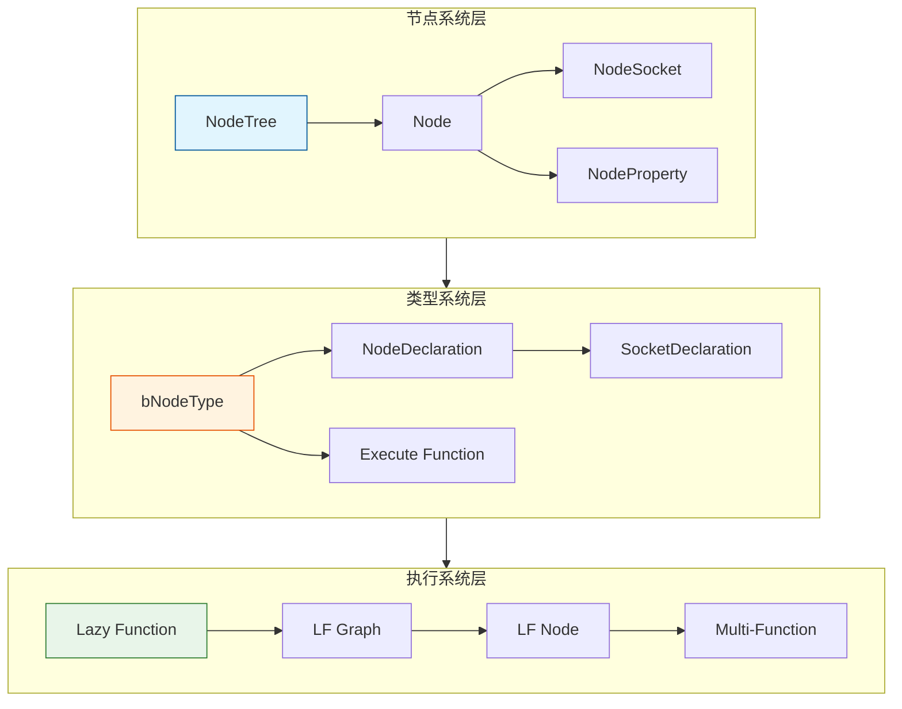
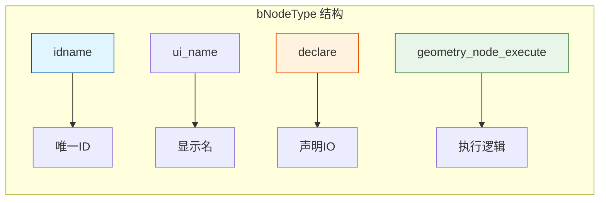
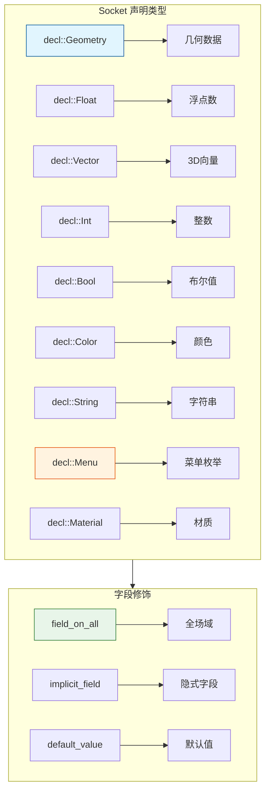
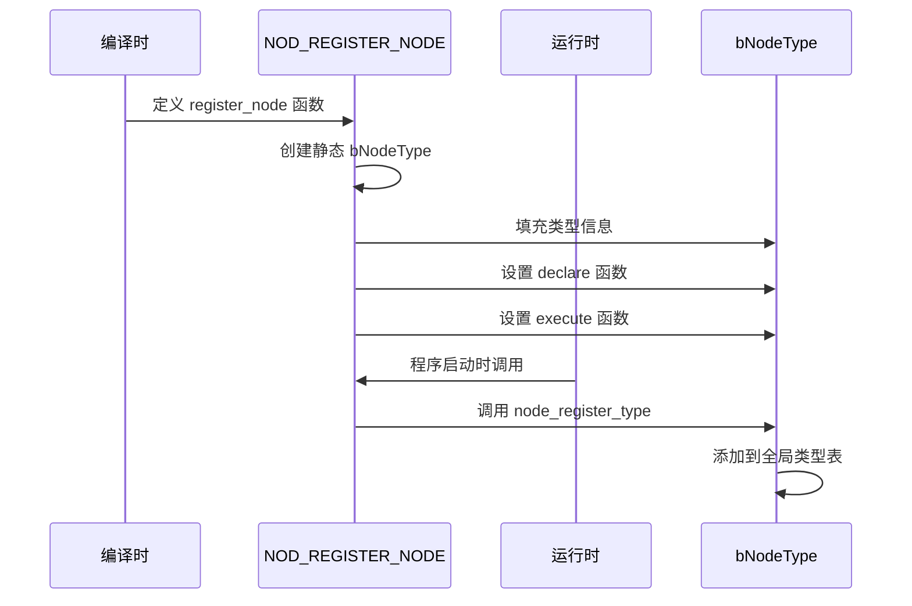
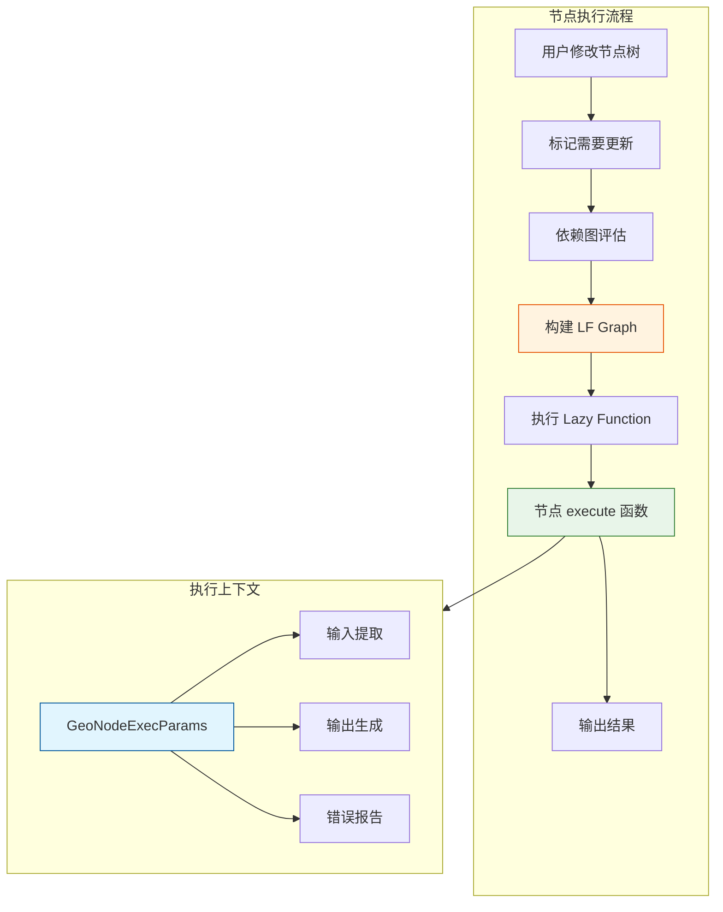
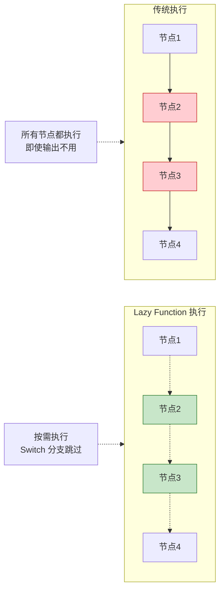
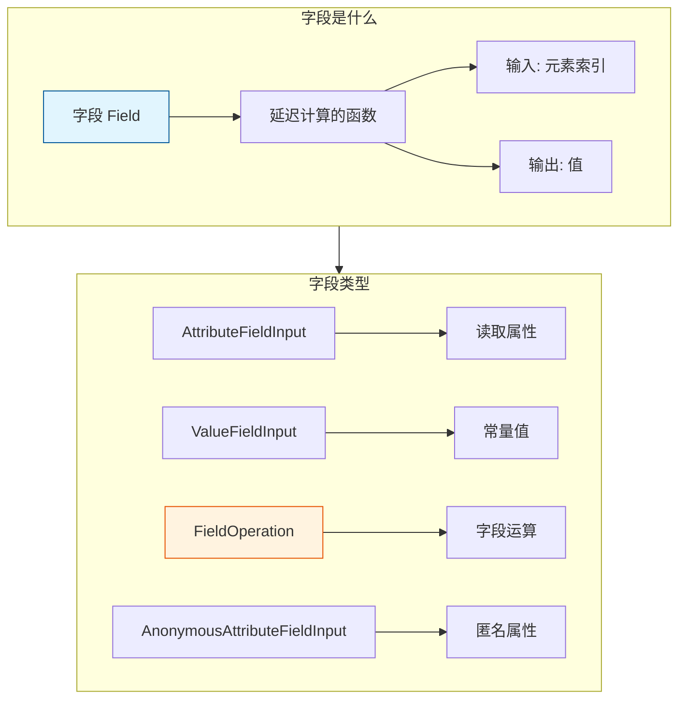
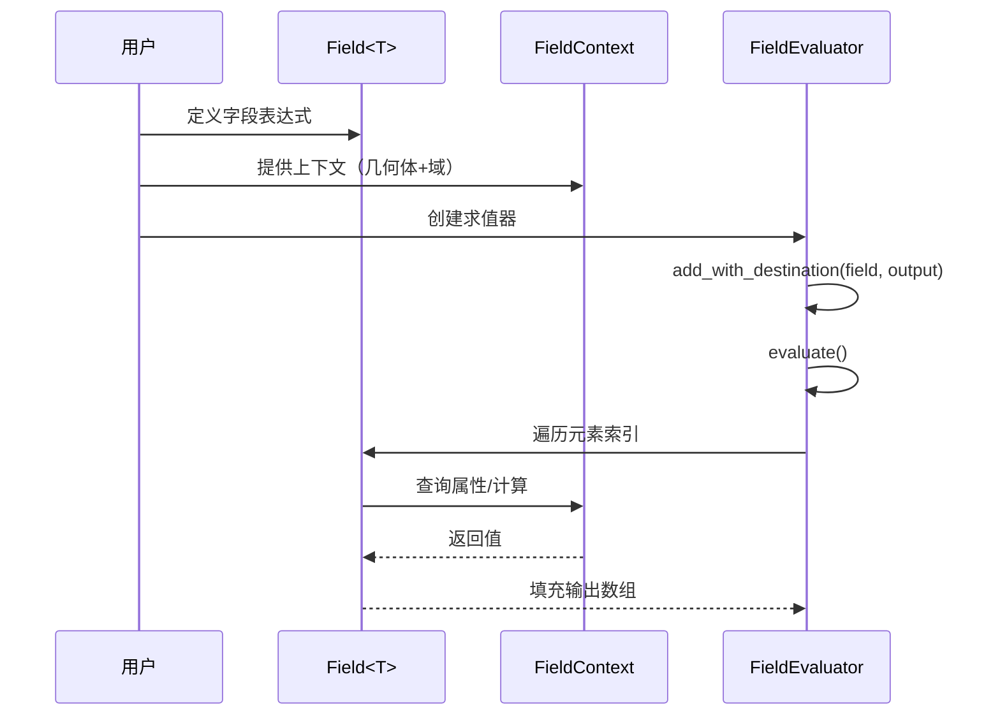
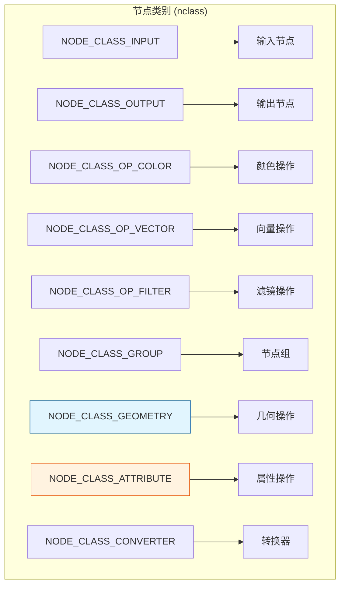

# Blender 节点系统架构详解

> 深入理解 Blender 节点系统的核心架构，这是开发几何节点的基础

---

## 🏗️ 整体架构概览



---

## 📦 核心数据结构

### bNodeType - 节点类型定义

```cpp
// source/blender/blenkernel/BKE_node.hh
namespace blender::bke {

struct bNodeType {
    /** 唯一标识符 */
    UString idname;
    
    /** 显示名称 */
    const char *ui_name;
    
    /** 描述 */
    const char *ui_description;
    
    /** 节点类别 */
    int nclass;
    
    /** 声明函数 - 定义输入输出 */
    void (*declare)(NodeDeclarationBuilder &builder);
    
    /** 执行函数 - 几何节点 */
    void (*geometry_node_execute)(GeoNodeExecParams params);
    
    /** 着色器节点执行 */
    void (*shader_node_execute)(...);
    
    /** 初始化函数 */
    void (*initfunc)(bNodeTree *ntree, bNode *node);
    
    /** 释放函数 */
    void (*freefunc)(bNode *node);
};

} // namespace blender::bke
```



---

## 📝 节点声明系统

### NodeDeclarationBuilder

```cpp
// 节点声明示例（来自 node_geo_transform_geometry.cc）
static void node_declare(NodeDeclarationBuilder &b)
{
    // 使用自定义 socket 顺序
    b.use_custom_socket_order();
    b.allow_any_socket_order();
    
    // 添加输入
    b.add_input<decl::Geometry>("Geometry"_ustr)
        .is_default_link_socket()           // 默认连接 socket
        .description("Geometry to transform");
    
    // 添加输出
    b.add_output<decl::Geometry>("Geometry"_ustr)
        .propagate_all()                     // 传播所有属性
        .align_with_previous();              // 与上一个对齐
    
    // 添加菜单输入
    b.add_input<decl::Menu>("Mode"_ustr)
        .static_items(mode_items)
        .description("How the transformation is specified");
    
    // 添加向量输入
    b.add_input<decl::Vector>("Translation"_ustr)
        .subtype(PROP_TRANSLATION)           // 子类型
        .usage_by_single_menu(GEO_NODE_TRANSFORM_MODE_COMPONENTS);
}
```

### Socket 声明类型



---

## ⚙️ 节点注册机制

### 注册流程



### 注册代码示例

```cpp
// 节点注册（来自 node_geo_transform_geometry.cc）
static void register_node()
{
    static bke::bNodeType ntype;
    
    // 基础设置
    geo_node_type_base(&ntype, "GeometryNodeTransform"_ustr, GEO_NODE_TRANSFORM_GEOMETRY);
    ntype.ui_name = "Transform Geometry";
    ntype.ui_description = "Translate, rotate or scale the geometry";
    ntype.enum_name_legacy = "TRANSFORM_GEOMETRY";
    ntype.nclass = NODE_CLASS_GEOMETRY;
    
    // 关键函数指针
    ntype.declare = node_declare;
    ntype.geometry_node_execute = node_geo_exec;
    
    // 注册
    bke::node_register_type(ntype);
}

// 宏展开后，在程序启动时自动调用
NOD_REGISTER_NODE(register_node)
```

---

## 🎬 节点执行系统

### 执行流程



### GeoNodeExecParams

```cpp
// source/blender/nodes/NOD_geometry_exec.hh
class GeoNodeExecParams {
public:
    /** 提取输入值（移动语义） */
    template<typename T>
    T extract_input(StringRef name);
    
    /** 获取输入值（拷贝） */
    template<typename T>
    T get_input(StringRef name);
    
    /** 设置输出值 */
    template<typename T>
    void set_output(StringRef name, T &&value);
    
    /** 添加错误消息 */
    void error_message_add(NodeWarningType type, StringRef message);
    
    /** 获取字段上下文 */
    const FieldContext &get_field_context() const;
};
```

### 执行函数示例

```cpp
// 来自 node_geo_transform_geometry.cc
static void node_geo_exec(GeoNodeExecParams params)
{
    // 1. 获取输入
    const auto mode = params.get_input<NodeGeometryTransformMode>("Mode"_ustr);
    GeometrySet geometry_set = params.extract_input<GeometrySet>("Geometry"_ustr);
    
    // 2. 处理逻辑
    if (mode == GEO_NODE_TRANSFORM_MODE_MATRIX) {
        const float4x4 transform = params.extract_input<float4x4>("Transform"_ustr);
        geometry::transform_geometry(geometry_set, transform);
    } else {
        const float3 translation = params.extract_input<float3>("Translation"_ustr);
        // ... 其他处理
    }
    
    // 3. 设置输出
    params.set_output("Geometry"_ustr, std::move(geometry_set));
}
```

---

## 🔄 Lazy Function 系统

### 为什么需要 Lazy Function？



### Lazy Function Graph

```cpp
// source/blender/nodes/intern/geometry_nodes_lazy_function.cc
namespace blender::nodes {

/**
 * 将节点树转换为 Lazy Function Graph
 * 这是几何节点执行的核心
 */
class GeometryNodesLazyFunctionGraphBuilder {
public:
    /**
     * 为每个节点创建对应的 LF Node
     */
    void build_node(const bNode &node) {
        const bke::bNodeType &ntype = *node.typeinfo;
        
        // 创建函数节点
        lf::FunctionNode &lf_node = graph_.add_function(*get_node_function(node));
        
        // 连接输入输出
        // ...
    }
};

} // namespace blender::nodes
```

---

## 🌊 字段系统（Fields）

### 字段概念



### 字段使用示例

```cpp
// 来自 node_geo_set_position.cc
static void node_geo_exec(GeoNodeExecParams params)
{
    GeometrySet geometry = params.extract_input<GeometrySet>("Geometry"_ustr);
    
    // 获取选择字段（bool 字段）
    const Field<bool> selection_field = params.extract_input<Field<bool>>("Selection"_ustr);
    
    // 获取位置字段（float3 字段）
    Field<float3> position_field = params.extract_input<Field<float3>>("Position"_ustr);
    Field<float3> offset_field = params.extract_input<Field<float3>>("Offset"_ustr);
    
    // 字段运算：位置 + 偏移
    Field<float3> final_position = fn::FieldOperation::from(
        get_add_fn(),
        {position_field, offset_field}
    );
    
    // 应用到场域
    if (Mesh *mesh = geometry.get_mesh_for_write()) {
        set_points_position(
            mesh->attributes_for_write(),
            bke::MeshFieldContext(*mesh, bke::AttrDomain::Point),
            selection_field,
            final_position
        );
    }
    
    params.set_output("Geometry"_ustr, std::move(geometry));
}
```

### 字段求值



---

## 🧩 多函数系统（Multi-Function）

### 什么是 Multi-Function？

```cpp
// source/blender/functions/FN_multi_function.hh
namespace blender::fn {

/**
 * Multi-Function 是对 SIMD 友好的批量计算函数
 * 输入输出都是数组，便于并行优化
 */
class MultiFunction {
public:
    /**
     * 执行批量计算
     * @param mask 需要计算的索引掩码
     * @param params 输入输出参数
     */
    virtual void call(const IndexMask &mask, Params params) const = 0;
};

} // namespace blender::fn
```

### 多函数注册和使用

```cpp
// 来自 node_geo_set_position.cc
static const auto &get_add_fn()
{
    // 从全局注册表查找
    static const auto &fn = fn::multi_function::registry::lookup("float3 + float3"_ustr);
    return fn;
}

// 使用多函数进行字段运算
Field<float3> result(fn::FieldOperation::from(
    get_add_fn(),
    {field_a, field_b}
));
```

---

## 🗂️ 节点分类体系



---

## ✅ 架构理解检查清单

- [ ] 理解 `bNodeType` 的作用和结构
- [ ] 能编写 `node_declare` 函数
- [ ] 理解节点注册机制
- [ ] 掌握 `GeoNodeExecParams` 的使用
- [ ] 理解 Lazy Function 的惰性执行原理
- [ ] 理解 Field 的概念和用法
- [ ] 了解 Multi-Function 的作用
- [ ] 能描述完整的节点执行流程

---

## 📁 关键文件

| 文件 | 用途 |
|-----|------|
| `BKE_node.hh` | 节点类型定义 |
| `NOD_geometry_exec.hh` | 几何节点执行接口 |
| `NOD_socket_declarations.hh` | Socket 声明 |
| `FN_field.hh` | 字段系统 |
| `FN_multi_function.hh` | 多函数系统 |
| `geometry_nodes_lazy_function.cc` | LF 图构建 |
| `geometry_nodes_execute.cc` | 执行逻辑 |
