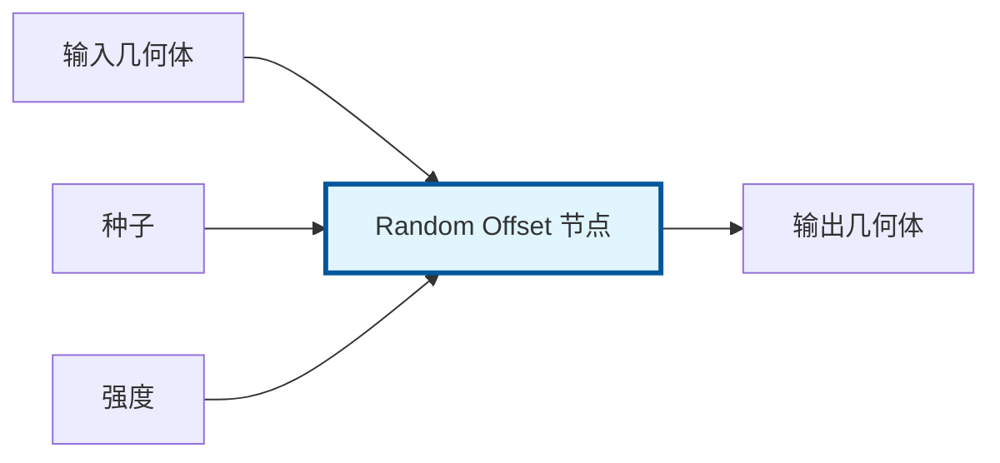
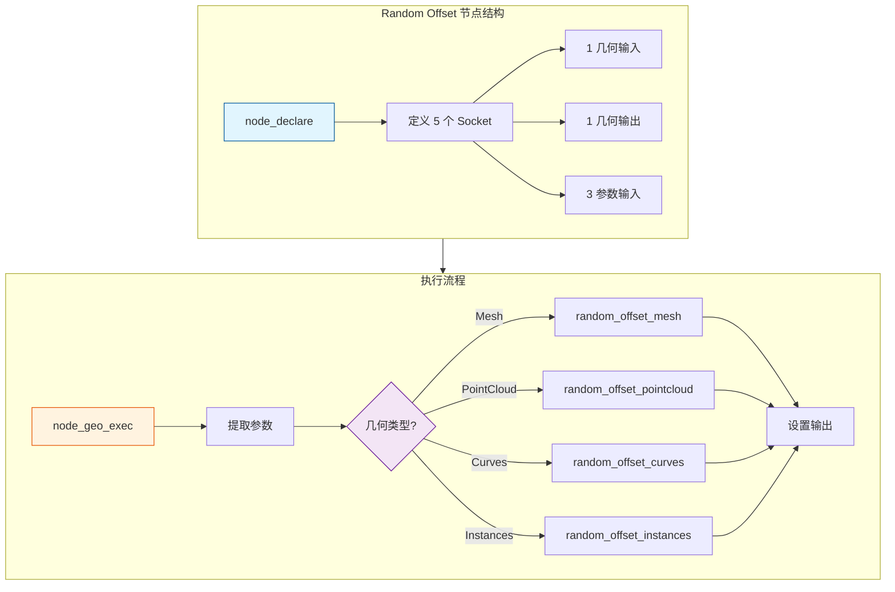

# 几何节点实战开发指南

> 从零开始创建一个自定义几何节点

---

## 🎯 实战目标

我们将创建一个名为 **"Random Offset"** 的节点，它会给几何体的每个点添加一个随机偏移。



---

## 📁 步骤 1：创建文件

### 1.1 创建源文件

```bash
# 创建新节点文件
touch source/blender/nodes/geometry/nodes/node_geo_random_offset.cc
```

### 1.2 添加到 CMakeLists.txt

编辑 `source/blender/nodes/CMakeLists.txt`：

```cmake
set(SRC
    # ... 其他文件 ...
    geometry/nodes/node_geo_random_offset.cc  # 添加这一行
)
```

---

## 📝 步骤 2：编写节点代码

### 完整代码

```cpp
/* SPDX-FileCopyrightText: 2024 Your Name
 *
 * SPDX-License-Identifier: GPL-2.0-or-later */

#include "BLI_rand.hh"           // 随机数生成
#include "BLI_noise.hh"          // 噪声函数
#include "BLI_math_vector.hh"    // 向量运算

#include "BKE_curves.hh"
#include "BKE_grease_pencil.hh"
#include "BKE_mesh.hh"
#include "BKE_instances.hh"
#include "BKE_pointcloud.hh"

#include "node_geometry_util.hh"  // 几何节点工具

namespace blender::nodes::node_geo_random_offset_cc {

// =============================================================================
// 1. 声明节点输入输出
// =============================================================================

static void node_declare(NodeDeclarationBuilder &b)
{
    b.use_custom_socket_order();
    
    // 输入几何体
    b.add_input<decl::Geometry>("Geometry"_ustr)
        .is_default_link_socket()
        .description("Geometry to add random offset to");
    
    // 输出几何体
    b.add_output<decl::Geometry>("Geometry"_ustr)
        .propagate_all()
        .align_with_previous();
    
    // 选择字段 - 只影响选中的点
    b.add_input<decl::Bool>("Selection"_ustr)
        .default_value(true)
        .hide_value()
        .field_on_all()
        .description("Points to affect");
    
    // 种子 - 控制随机性
    b.add_input<decl::Int>("Seed"_ustr)
        .default_value(0)
        .description("Seed for random number generator");
    
    // 强度 - 控制偏移大小
    b.add_input<decl::Float>("Strength"_ustr)
        .default_value(1.0f)
        .min(0.0f)
        .subtype(PROP_DISTANCE)
        .description("Strength of the random offset");
    
    // 缩放 - 各轴向的缩放
    b.add_input<decl::Vector>("Scale"_ustr)
        .default_value({1.0f, 1.0f, 1.0f})
        .subtype(PROP_XYZ)
        .description("Scale the random offset per axis");
}

// =============================================================================
// 2. 辅助函数 - 生成随机偏移
// =============================================================================

/**
 * 为每个点生成随机偏移
 */
static void add_random_offset_to_points(MutableSpan<float3> positions,
                                        const int seed,
                                        const float strength,
                                        const float3 scale)
{
    // 创建随机数生成器
    RandomNumberGenerator rng(seed);
    
    for (const int i : positions.index_range()) {
        // 为每个点生成不同的随机种子
        const int point_seed = seed + i * 12345;
        
        // 使用噪声函数生成平滑的随机值
        float3 noise_input(float(point_seed) * 0.01f);
        float3 random_dir = noise::perlin(noise_input);
        
        // 归一化并应用强度
        random_dir = math::normalize(random_dir) * strength * scale;
        
        // 添加偏移
        positions[i] += random_dir;
    }
}

// =============================================================================
// 3. 处理不同类型的几何体
// =============================================================================

/**
 * 处理 Mesh
 */
static void random_offset_mesh(Mesh &mesh,
                               const Field<bool> &selection_field,
                               const int seed,
                               const float strength,
                               const float3 scale)
{
    const bke::MeshFieldContext context(mesh, bke::AttrDomain::Point);
    fn::FieldEvaluator evaluator(context, mesh.totvert);
    evaluator.set_selection(selection_field);
    
    // 获取位置属性
    bke::MutableAttributeAccessor attributes = mesh.attributes_for_write();
    bke::SpanAttributeWriter<float3> positions = attributes.lookup_or_add_for_write_span<float3>(
        "position", bke::AttrDomain::Point);
    
    evaluator.evaluate();
    const IndexMask mask = evaluator.get_evaluated_selection_as_mask();
    
    // 应用随机偏移
    mask.foreach_index_optimized<int>([&](const int i) {
        const int point_seed = seed + i * 12345;
        float3 noise_input(float(point_seed) * 0.01f);
        float3 random_dir = noise::perlin(noise_input);
        random_dir = math::normalize(random_dir) * strength * scale;
        positions.span[i] += random_dir;
    });
    
    positions.finish();
}

/**
 * 处理 PointCloud
 */
static void random_offset_pointcloud(PointCloud &pointcloud,
                                     const Field<bool> &selection_field,
                                     const int seed,
                                     const float strength,
                                     const float3 scale)
{
    MutableSpan<float3> positions = pointcloud.positions_for_write();
    
    const bke::PointCloudFieldContext context(pointcloud);
    fn::FieldEvaluator evaluator(context, pointcloud.totpoint);
    evaluator.set_selection(selection_field);
    evaluator.evaluate();
    
    const IndexMask mask = evaluator.get_evaluated_selection_as_mask();
    
    mask.foreach_index_optimized<int>([&](const int i) {
        const int point_seed = seed + i * 12345;
        float3 noise_input(float(point_seed) * 0.01f);
        float3 random_dir = noise::perlin(noise_input);
        random_dir = math::normalize(random_dir) * strength * scale;
        positions[i] += random_dir;
    });
}

/**
 * 处理 Curves
 */
static void random_offset_curves(Curves &curves_id,
                                 const Field<bool> &selection_field,
                                 const int seed,
                                 const float strength,
                                 const float3 scale)
{
    bke::CurvesGeometry &curves = curves_id.geometry.wrap();
    MutableSpan<float3> positions = curves.positions_for_write();
    
    const bke::CurvesFieldContext context(curves_id, bke::AttrDomain::Point);
    fn::FieldEvaluator evaluator(context, curves.points_num());
    evaluator.set_selection(selection_field);
    evaluator.evaluate();
    
    const IndexMask mask = evaluator.get_evaluated_selection_as_mask();
    
    mask.foreach_index_optimized<int>([&](const int i) {
        const int point_seed = seed + i * 12345;
        float3 noise_input(float(point_seed) * 0.01f);
        float3 random_dir = noise::perlin(noise_input);
        random_dir = math::normalize(random_dir) * strength * scale;
        positions[i] += random_dir;
    });
    
    curves.calculate_bezier_auto_handles();
}

/**
 * 处理 Instances
 */
static void random_offset_instances(bke::Instances &instances,
                                    const Field<bool> &selection_field,
                                    const int seed,
                                    const float strength,
                                    const float3 scale)
{
    const bke::InstancesFieldContext context(instances);
    fn::FieldEvaluator evaluator(context, instances.instances_num());
    evaluator.set_selection(selection_field);
    evaluator.evaluate();
    
    const IndexMask mask = evaluator.get_evaluated_selection_as_mask();
    MutableSpan<float4x4> transforms = instances.transforms_for_write();
    
    mask.foreach_index_optimized<int>([&](const int i) {
        const int point_seed = seed + i * 12345;
        float3 noise_input(float(point_seed) * 0.01f);
        float3 random_dir = noise::perlin(noise_input);
        random_dir = math::normalize(random_dir) * strength * scale;
        transforms[i].location() += random_dir;
    });
}

// =============================================================================
// 4. 主执行函数
// =============================================================================

static void node_geo_exec(GeoNodeExecParams params)
{
    // 提取输入
    GeometrySet geometry = params.extract_input<GeometrySet>("Geometry"_ustr);
    const Field<bool> selection_field = params.extract_input<Field<bool>>("Selection"_ustr);
    const int seed = params.get_input<int>("Seed"_ustr);
    const float strength = params.get_input<float>("Strength"_ustr);
    const float3 scale = params.get_input<float3>("Scale"_ustr);
    
    // 处理各种几何类型
    if (Mesh *mesh = geometry.get_mesh_for_write()) {
        random_offset_mesh(*mesh, selection_field, seed, strength, scale);
    }
    if (PointCloud *pointcloud = geometry.get_pointcloud_for_write()) {
        random_offset_pointcloud(*pointcloud, selection_field, seed, strength, scale);
    }
    if (Curves *curves = geometry.get_curves_for_write()) {
        random_offset_curves(*curves, selection_field, seed, strength, scale);
    }
    if (GreasePencil *grease_pencil = geometry.get_grease_pencil_for_write()) {
        using namespace blender::bke::greasepencil;
        for (const int layer_index : grease_pencil->layers().index_range()) {
            Drawing *drawing = grease_pencil->get_eval_drawing(grease_pencil->layer(layer_index));
            if (drawing == nullptr) {
                continue;
            }
            random_offset_curves(
                *drawing->strokes_for_write(),
                selection_field,
                seed + layer_index * 1000,  // 每层不同种子
                strength,
                scale);
            drawing->tag_positions_changed();
        }
    }
    if (bke::Instances *instances = geometry.get_instances_for_write()) {
        random_offset_instances(*instances, selection_field, seed, strength, scale);
    }
    
    // 设置输出
    params.set_output("Geometry"_ustr, std::move(geometry));
}

// =============================================================================
// 5. 注册节点
// =============================================================================

static void node_register()
{
    static bke::bNodeType ntype;
    
    geo_node_type_base(&ntype, "GeometryNodeRandomOffset"_ustr, GEO_NODE_RANDOM_OFFSET);
    ntype.ui_name = "Random Offset";
    ntype.ui_description = "Add random offset to each point";
    ntype.enum_name_legacy = "RANDOM_OFFSET";
    ntype.nclass = NODE_CLASS_GEOMETRY;
    ntype.declare = node_declare;
    ntype.geometry_node_execute = node_geo_exec;
    
    bke::node_register_type(ntype);
}

NOD_REGISTER_NODE(node_register)

} // namespace blender::nodes::node_geo_random_offset_cc
```

---

## 🔨 步骤 3：编译和测试

### 3.1 重新配置和构建

```powershell
# 重新配置 CMake
cmake -B build -S .

# 仅构建节点模块（快速）
cmake --build build --target bf_nodes --parallel 8

# 或者完整构建
cmake --build build --config Release --parallel 16
```

### 3.2 测试节点

```python
# 在 Blender 的 Python 控制台测试
import bpy

# 创建新节点树
node_tree = bpy.data.node_groups.new(name="TestRandomOffset", type='GeometryNodeTree')

# 添加节点
input_node = node_tree.nodes.new('NodeGroupInput')
output_node = node_tree.nodes.new('NodeGroupOutput')
random_offset = node_tree.nodes.new('GeometryNodeRandomOffset')

# 连接
node_tree.links.new(input_node.outputs['Geometry'], random_offset.inputs['Geometry'])
node_tree.links.new(random_offset.outputs['Geometry'], output_node.inputs['Geometry'])

print("Random Offset node created successfully!")
```

---

## 📊 节点架构图解



---

## 🐛 调试技巧

### 1. 使用日志输出

```cpp
#include "CLG_log.h"

static void node_geo_exec(GeoNodeExecParams params)
{
    // 使用 CLOG 输出调试信息
    CLOG_INFO(&LOG, "Random Offset executing");
    
    GeometrySet geometry = params.extract_input<GeometrySet>("Geometry"_ustr);
    
    if (Mesh *mesh = geometry.get_mesh()) {
        CLOG_INFO(&LOG, "Processing mesh with %d vertices", mesh->totvert);
    }
    
    // ...
}
```

### 2. 使用断点

在 Visual Studio 中：
1. 设置断点在 `node_geo_exec` 函数
2. 附加到 Blender 进程
3. 在 Blender 中触发节点执行

### 3. 添加警告信息

```cpp
static void node_geo_exec(GeoNodeExecParams params)
{
    // ...
    
    if (strength < 0.0f) {
        params.error_message_add(
            NodeWarningType::Warning,
            TIP_("Strength should be non-negative")
        );
    }
    
    // ...
}
```

---

## 🎨 进阶：添加菜单图标

```cpp
// 在 node_register 中添加图标
static void node_register()
{
    static bke::bNodeType ntype;
    
    geo_node_type_base(&ntype, "GeometryNodeRandomOffset"_ustr, GEO_NODE_RANDOM_OFFSET);
    ntype.ui_name = "Random Offset";
    ntype.ui_description = "Add random offset to each point";
    ntype.enum_name_legacy = "RANDOM_OFFSET";
    ntype.nclass = NODE_CLASS_GEOMETRY;
    ntype.declare = node_declare;
    ntype.geometry_node_execute = node_geo_exec;
    
    // 添加图标（使用 Blender 内置图标）
    ntype.ui_icon = ICON_MOD_NOISE;  // 噪声图标
    
    bke::node_register_type(ntype);
}
```

---

## 📚 常见模式总结

### 模式 1：简单修改节点

```cpp
// 适用于：修改几何体属性
static void node_geo_exec(GeoNodeExecParams params)
{
    GeometrySet geometry = params.extract_input<GeometrySet>("Geometry"_ustr);
    
    if (Mesh *mesh = geometry.get_mesh_for_write()) {
        // 直接修改 mesh
    }
    
    params.set_output("Geometry"_ustr, std::move(geometry));
}
```

### 模式 2：字段求值节点

```cpp
// 适用于：基于字段计算新属性
static void node_geo_exec(GeoNodeExecParams params)
{
    GeometrySet geometry = params.extract_input<GeometrySet>("Geometry"_ustr);
    const Field<float> value_field = params.extract_input<Field<float>>("Value"_ustr);
    
    if (Mesh *mesh = geometry.get_mesh_for_write()) {
        const bke::MeshFieldContext context(*mesh, bke::AttrDomain::Point);
        fn::FieldEvaluator evaluator(context, mesh->totvert);
        
        Array<float> result(mesh->totvert);
        evaluator.add_with_destination(value_field, result.as_mutable_span());
        evaluator.evaluate();
        
        // 使用 result ...
    }
    
    params.set_output("Geometry"_ustr, std::move(geometry));
}
```

### 模式 3：生成新几何体

```cpp
// 适用于：从输入生成新几何体
static void node_geo_exec(GeoNodeExecParams params)
{
    const int count = params.get_input<int>("Count"_ustr);
    
    // 创建新几何体
    Mesh *mesh = BKE_mesh_new_nomain(count, 0, 0, 0);
    MutableSpan<float3> positions = mesh->vert_positions_for_write();
    
    // 填充位置 ...
    
    GeometrySet geometry;
    geometry.replace_mesh(mesh);
    
    params.set_output("Geometry"_ustr, std::move(geometry));
}
```

---

## ✅ 开发检查清单

- [ ] 文件创建并添加到 CMakeLists.txt
- [ ] node_declare 正确定义所有 socket
- [ ] 节点 ID 唯一（GeometryNodeRandomOffset）
- [ ] 处理所有几何类型（Mesh, Curves, PointCloud, Instances, GreasePencil）
- [ ] 支持 Selection 字段
- [ ] 代码编译无错误
- [ ] 在 Blender 中测试通过
- [ ] 边界情况处理（空几何体、负值等）

---

## 🔗 参考实现

| 节点 | 文件 | 学习要点 |
|-----|------|---------|
| Transform Geometry | `node_geo_transform_geometry.cc` | 基础结构 |
| Set Position | `node_geo_set_position.cc` | 字段使用 |
| Join Geometry | `node_geo_join_geometry.cc` | 多几何体处理 |
| Mesh Primitive Cube | `node_geo_mesh_primitive_cube.cc` | 生成几何体 |
| Instance on Points | `node_geo_instance_on_points.cc` | 复杂逻辑 |
