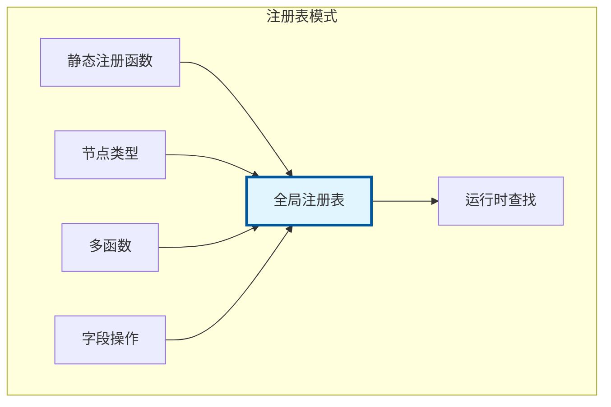
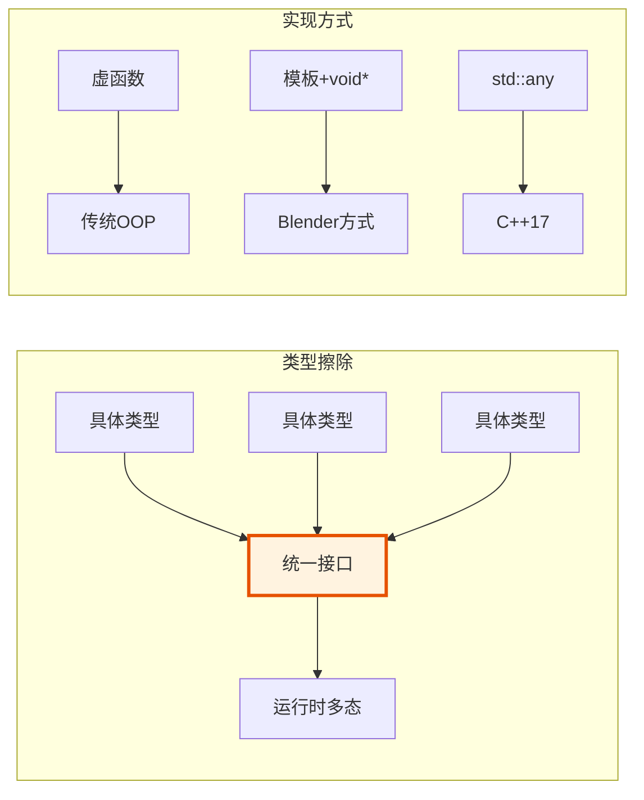
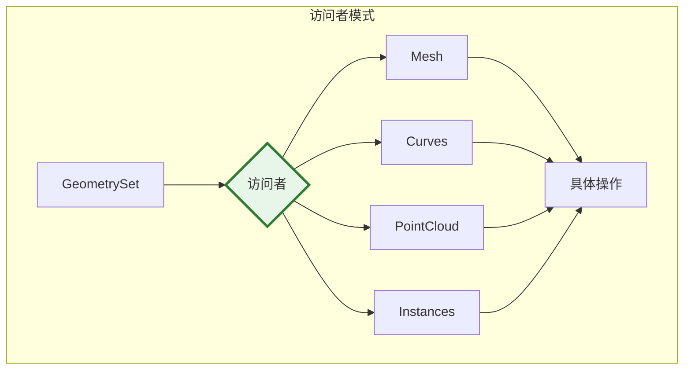
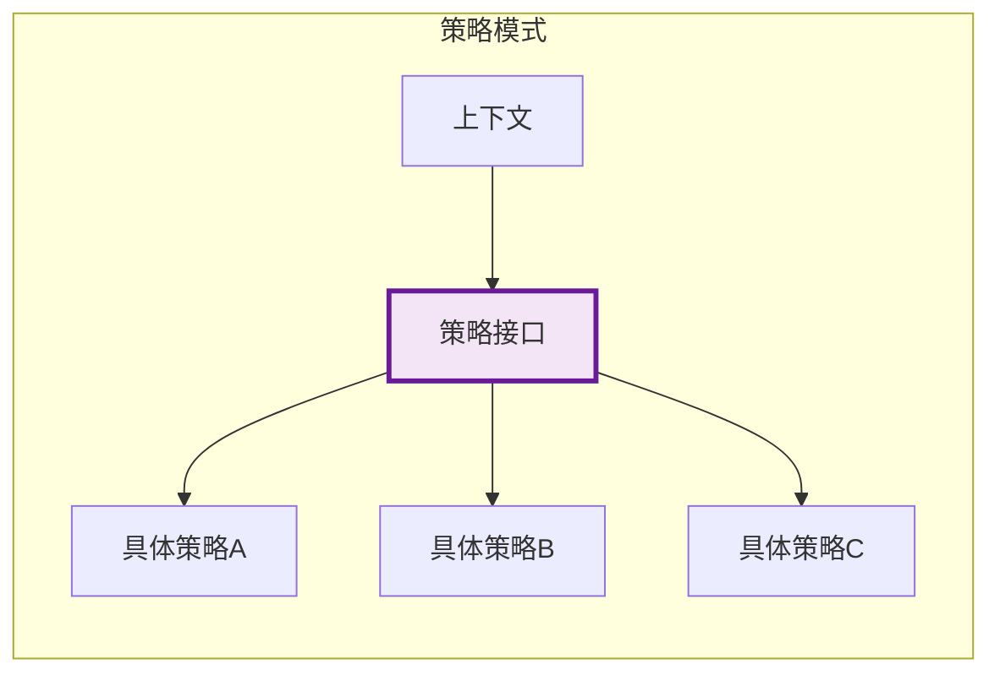
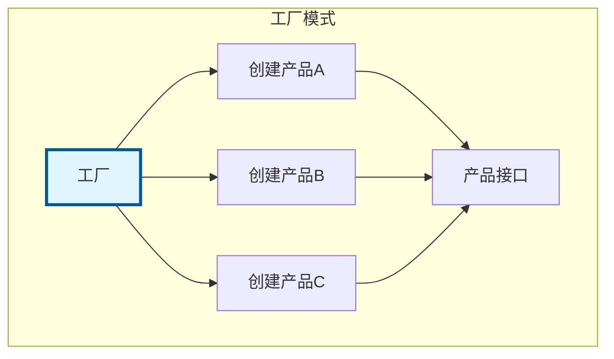
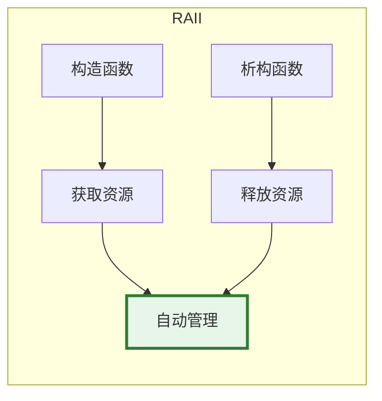
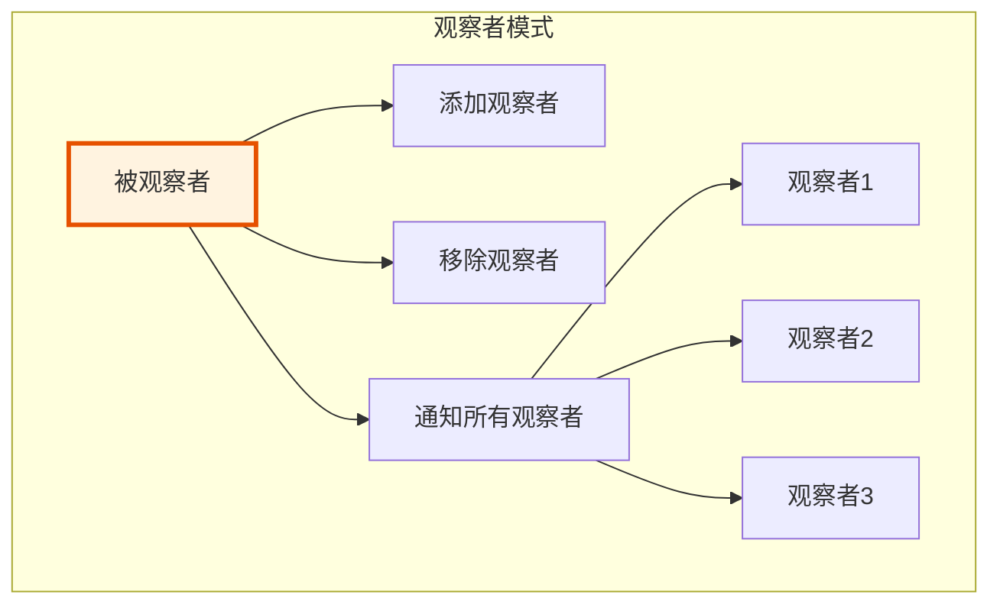
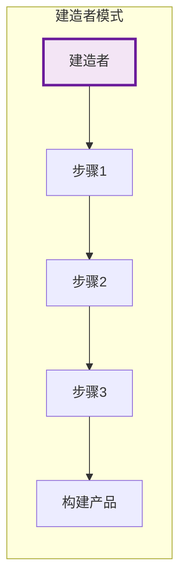

# Blender 节点系统中的设计模式

> 理解 Blender 源码中常用的设计模式，提升代码阅读能力

---

## 🏗️ 1. 注册表模式（Registry Pattern）

### 概念



### Blender 中的应用

```cpp
// 节点类型注册表
// source/blender/blenkernel/intern/node.cc

namespace blender::bke {

// 全局节点类型映射
static Map<UString, const bNodeType *> node_type_map;

void node_register_type(bNodeType &ntype)
{
    node_type_map.add_new(ntype.idname, &ntype);
}

const bNodeType *node_type_find(const UString &idname)
{
    return node_type_map.lookup_default(idname, nullptr);
}

} // namespace blender::bke

// 使用宏自动注册
#define NOD_REGISTER_NODE(func) \
    static void func(); \
    static struct NodeRegistrar { \
        NodeRegistrar() { func(); } \
    } node_registrar; \
    static void func()
```

### 优点
- 解耦注册和使用
- 支持插件动态注册
- 集中管理类型信息

---

## 🎭 2. 类型擦除（Type Erasure）

### 概念



### Blender 中的应用

```cpp
// source/blender/blenlib/BLI_cpp_type.hh

namespace blender {

/**
 * 运行时类型信息
 * 允许在不知道具体类型的情况下操作数据
 */
class CPPType {
public:
    const char *name;
    int64_t size;
    int64_t alignment;
    
    // 类型擦除的操作
    void (*construct_default)(void *ptr);
    void (*destruct)(void *ptr);
    void (*copy_construct)(void *dst, const void *src);
    void (*move_construct)(void *dst, void *src);
    
    // 获取类型的单例
    template<typename T>
    static const CPPType &get() {
        static CPPType cpp_type = create_cpp_type<T>();
        return cpp_type;
    }
};

// 使用示例
void process_generic_array(GSpan array)
{
    const CPPType &type = array.type();
    
    for (int64_t i : array.index_range()) {
        void *element = array[i];
        // 不需要知道具体类型，通过 type 操作
        type.destruct(element);
    }
}

} // namespace blender
```

### GSpan 类型擦除

```cpp
// source/blender/blenlib/BLI_span.hh

class GSpan {
    const CPPType *type_;
    const void *data_;
    int64_t size_;
    
public:
    template<typename T>
    GSpan(Span<T> span)
        : type_(&CPPType::get<T>()),
          data_(span.data()),
          size_(span.size()) {}
    
    const CPPType &type() const { return *type_; }
    
    template<typename T>
    Span<T> typed() const {
        BLI_assert(type_ == &CPPType::get<T>());
        return Span<T>(static_cast<const T *>(data_), size_);
    }
};
```

---

## 🔄 3. 访问者模式（Visitor Pattern）

### 概念



### Blender 中的应用

```cpp
// source/blender/blenkernel/BKE_geometry_set.hh

class GeometrySet {
public:
    /**
     * 对每个组件执行操作
     */
    template<typename Visitor>
    void foreach_component(Visitor &&visitor) const {
        if (mesh_) visitor(*mesh_);
        if (curves_) visitor(*curves_);
        if (pointcloud_) visitor(*pointcloud_);
        if (instances_) visitor(*instances_);
        if (volume_) visitor(*volume_);
    }
    
    /**
     * 获取特定类型的组件
     */
    template<typename T>
    const T *get() const {
        if constexpr (std::is_same_v<T, Mesh>) return mesh_.get();
        if constexpr (std::is_same_v<T, Curves>) return curves_.get();
        // ...
        return nullptr;
    }
};

// 使用示例
void print_geometry_info(const GeometrySet &geometry)
{
    geometry.foreach_component([&](const auto &component) {
        using T = std::decay_t<decltype(component)>;
        if constexpr (std::is_same_v<T, Mesh>) {
            std::cout << "Mesh: " << component.totvert << " vertices\n";
        }
        else if constexpr (std::is_same_v<T, Curves>) {
            std::cout << "Curves: " << component.geometry.point_num << " points\n";
        }
        // ...
    });
}
```

---

## 🎯 4. 策略模式（Strategy Pattern）

### 概念



### Blender 中的应用

```cpp
// 字段求值策略
// source/blender/functions/FN_field.hh

namespace blender::fn {

template<typename T>
class Field {
    std::shared_ptr<const FieldInput> input_;
    
public:
    /**
     * 不同的 FieldInput 实现不同的求值策略
     * - AttributeFieldInput: 从属性读取
     * - ValueFieldInput: 返回常量
     * - FieldOperation: 执行运算
     */
    VArray<T> evaluate(const FieldContext &context) const {
        return input_->evaluate(context);
    }
};

// 策略基类
class FieldInput {
public:
    virtual GVArray evaluate(const FieldContext &context) const = 0;
};

// 具体策略：属性输入
class AttributeFieldInput : public FieldInput {
    std::string name_;
public:
    GVArray evaluate(const FieldContext &context) const override {
        // 从几何体属性读取
        return context.attributes().lookup(name_);
    }
};

// 具体策略：常量值
class ValueFieldInput : public FieldInput {
    GValue value_;
public:
    GVArray evaluate(const FieldContext &context) const override {
        // 返回常量数组
        return GVArray::ForSingle(value_, context.size());
    }
};

} // namespace blender::fn
```

---

## 🏭 5. 工厂模式（Factory Pattern）

### 概念



### Blender 中的应用

```cpp
// Socket 声明工厂
// source/blender/nodes/NOD_socket_declarations.hh

namespace blender::nodes::decl {

class NodeDeclarationBuilder {
public:
    /**
     * 工厂方法：创建不同类型的 Socket 声明
     */
    template<typename T>
    SocketDeclarationBuilder<T> add_input(StringRef name);
    
    template<typename T>
    SocketDeclarationBuilder<T> add_output(StringRef name);
};

// 特化实现
template<>
inline SocketDeclarationBuilder<Geometry> NodeDeclarationBuilder::add_input<Geometry>(StringRef name)
{
    auto socket_decl = std::make_unique<Geometry>();
    socket_decl->name = name;
    return SocketDeclarationBuilder<Geometry>(std::move(socket_decl), *this);
}

template<>
inline SocketDeclarationBuilder<Float> NodeDeclarationBuilder::add_input<Float>(StringRef name)
{
    auto socket_decl = std::make_unique<Float>();
    socket_decl->name = name;
    return SocketDeclarationBuilder<Float>(std::move(socket_decl), *this);
}

// 使用
static void node_declare(NodeDeclarationBuilder &b)
{
    b.add_input<Geometry>("Geometry"_ustr);  // 工厂创建 Geometry socket
    b.add_input<Float>("Value"_ustr);        // 工厂创建 Float socket
}

} // namespace blender::nodes::decl
```

---

## 📦 6. RAII（资源获取即初始化）

### 概念



### Blender 中的应用

```cpp
// source/blender/blenlib/BLI_array.hh

namespace blender {

template<typename T>
class Array {
    T *data_;
    int64_t size_;
    
public:
    // 构造函数：分配资源
    explicit Array(int64_t size) : size_(size) {
        data_ = static_cast<T *>(MEM_mallocN(sizeof(T) * size, __func__));
        for (int64_t i = 0; i < size; i++) {
            new (&data_[i]) T();  // 默认构造
        }
    }
    
    // 析构函数：释放资源
    ~Array() {
        for (int64_t i = 0; i < size_; i++) {
            data_[i].~T();  // 析构
        }
        MEM_freeN(data_);
    }
    
    // 禁止拷贝
    Array(const Array &) = delete;
    Array &operator=(const Array &) = delete;
    
    // 允许移动
    Array(Array &&other) noexcept
        : data_(std::exchange(other.data_, nullptr)),
          size_(std::exchange(other.size_, 0)) {}
};

// 使用示例
void process_data() {
    Array<float> data(1000);  // 分配
    // 使用 data ...
}  // 自动释放，即使发生异常

} // namespace blender
```

### 属性写入器的 RAII

```cpp
// source/blender/blenkernel/BKE_attribute.hh

class GAttributeWriter {
    std::optional<GVMutableArray> varray_;
    
public:
    explicit GAttributeWriter(std::optional<GVMutableArray> varray)
        : varray_(std::move(varray)) {}
    
    /**
     * 析构时自动保存修改
     */
    ~GAttributeWriter() {
        if (varray_) {
            varray_->save();  // 保存到几何体
        }
    }
    
    void finish() {
        if (varray_) {
            varray_->save();
            varray_.reset();
        }
    }
};

// 使用
void modify_attribute(Mesh &mesh) {
    auto writer = mesh.attributes_for_write().lookup_or_add_for_write<float>(
        "custom_attr", bke::AttrDomain::Point);
    
    for (const int i : writer.varray.index_range()) {
        writer.varray[i] = i * 0.1f;
    }
    
    // 自动保存，无需手动调用
}
```

---

## 🔗 7. 观察者模式（Observer Pattern）

### 概念



### Blender 中的应用

```cpp
// 节点树更新通知
// source/blender/blenkernel/BKE_node_tree_update.hh

namespace blender::bke {

class NodeTreeUpdateInterface {
public:
    virtual void on_node_added(const bNode &node) = 0;
    virtual void on_node_removed(const bNode &node) = 0;
    virtual void on_socket_change(const bNodeSocket &socket) = 0;
    virtual void on_link_added(const bNodeLink &link) = 0;
    virtual void on_link_removed(const bNodeLink &link) = 0;
};

class NodeTree {
    Vector<NodeTreeUpdateInterface *> observers_;
    
public:
    void add_observer(NodeTreeUpdateInterface *observer) {
        observers_.append(observer);
    }
    
    void notify_node_added(const bNode &node) {
        for (auto *observer : observers_) {
            observer->on_node_added(node);
        }
    }
};

} // namespace blender::bke
```

---

## 🎨 8. 建造者模式（Builder Pattern）

### 概念



### Blender 中的应用

```cpp
// 节点声明建造者
// source/blender/nodes/NOD_node_declaration.hh

namespace blender::nodes {

class NodeDeclarationBuilder {
public:
    template<typename T>
    SocketDeclarationBuilder<T> add_input(StringRef name) {
        // ...
    }
    
    template<typename T>
    SocketDeclarationBuilder<T> add_output(StringRef name) {
        // ...
    }
    
    NodeDeclaration build() && {
        return std::move(declaration_);
    }
};

// Socket 声明建造者
template<typename T>
class SocketDeclarationBuilder {
public:
    SocketDeclarationBuilder &default_value(auto value) {
        socket_->default_value = value;
        return *this;
    }
    
    SocketDeclarationBuilder &description(StringRef desc) {
        socket_->description = desc;
        return *this;
    }
    
    SocketDeclarationBuilder &hide_value(bool hide = true) {
        socket_->hide_value = hide;
        return *this;
    }
    
    // 链式调用返回自身引用
};

// 使用：流畅接口
static void node_declare(NodeDeclarationBuilder &b)
{
    b.add_input<decl::Float>("Value"_ustr)
        .default_value(1.0f)
        .min(0.0f)
        .max(10.0f)
        .description("Input value")
        .hide_value(false);
}

} // namespace blender::nodes
```

---

## ✅ 设计模式理解检查清单

- [ ] 理解注册表模式在节点系统中的应用
- [ ] 理解类型擦除如何实现 GSpan
- [ ] 理解访问者模式如何处理多态几何体
- [ ] 理解策略模式在字段系统中的应用
- [ ] 理解工厂模式如何创建 Socket 声明
- [ ] 理解 RAII 如何管理资源生命周期
- [ ] 理解建造者模式的流畅接口

---

## 📚 参考资源

1. **设计模式：可复用面向对象软件的基础** - GoF
2. **Modern C++ Design** - Andrei Alexandrescu
3. **Blender 源码**: `source/blender/blenlib/`, `source/blender/nodes/`
