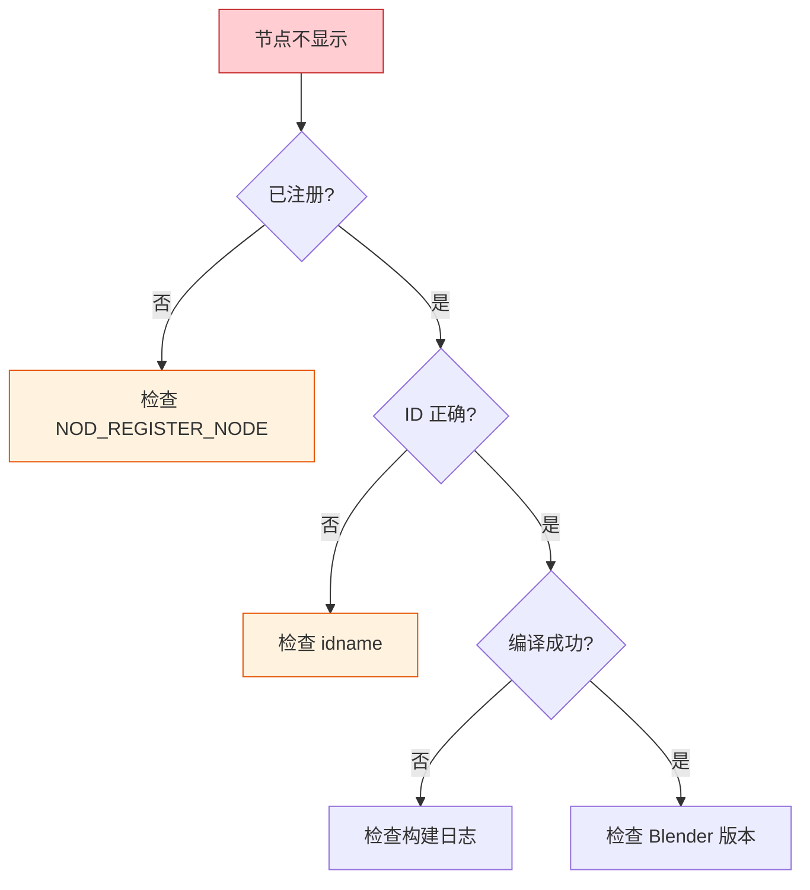
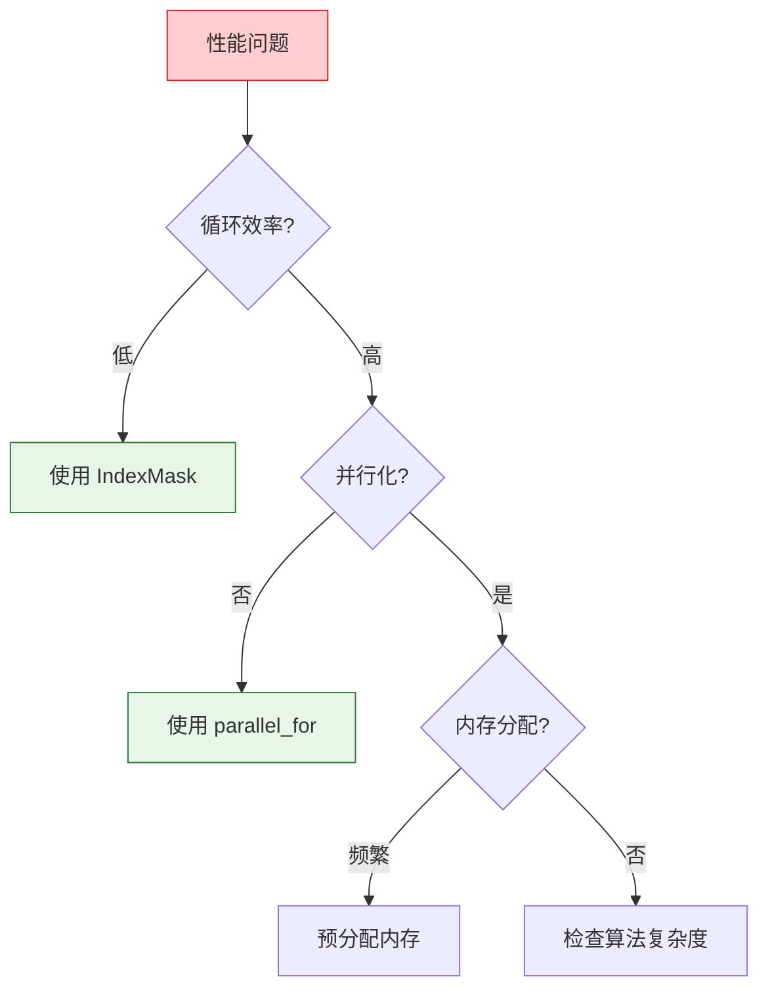

# Blender 几何节点开发常见问题

> 收集开发过程中常见的问题和解决方案

---

## 🔧 编译问题

### 问题 1：找不到头文件

```
error: 'BLI_vector.hh' file not found
#include "BLI_vector.hh"
         ^~~~~~~~~~~~~~~
```

**解决方案：**

```cmake
# 在 CMakeLists.txt 中添加正确的 include 路径
set(INC
  .
  ../blenlib      # 添加这一行
  ../blenkernel
  ../nodes
  # ...
)
```

### 问题 2：链接错误 - 未定义的符号

```
error LNK2019: unresolved external symbol "void __cdecl register_node..."
```

**解决方案：**

```cmake
# 确保源文件已添加到 CMakeLists.txt
set(SRC
  # ...
  node_geo_my_custom_node.cc  # 确保文件已添加
)
```

### 问题 3：NOD_REGISTER_NODE 宏展开失败

```
error: redefinition of 'register_node'
```

**解决方案：**

```cpp
// 确保 register_node 函数是 static 的
static void register_node()  // ✓ 正确
{
    // ...
}

void register_node()  // ✗ 错误 - 缺少 static
{
    // ...
}
```

---

## 🐛 运行时问题

### 问题 4：节点在 Blender 中不显示



**检查清单：**

```cpp
// 1. 确保使用了正确的宏
NOD_REGISTER_NODE(register_node)

// 2. 确保 idname 格式正确
geo_node_type_base(&ntype, "GeometryNodeMyNode"_ustr, GEO_NODE_MY_NODE);
// 格式：GeometryNode + PascalCase名称

// 3. 确保 legacy_type 唯一
// 在 DNA_node_types.h 中检查
enum {
    // ...
    GEO_NODE_MY_NODE = 1000,  // 确保不重复
};
```

### 问题 5：节点执行时崩溃

```cpp
// 常见原因 1：空指针检查
static void node_geo_exec(GeoNodeExecParams params)
{
    GeometrySet geometry = params.extract_input<GeometrySet>("Geometry"_ustr);
    
    // ✗ 错误：没有检查直接访问
    Mesh *mesh = geometry.get_mesh_for_write();
    mesh->totvert = 0;  // 如果 mesh 为 null，崩溃！
    
    // ✓ 正确：先检查
    if (Mesh *mesh = geometry.get_mesh_for_write()) {
        mesh->totvert = 0;
    }
}
```

```cpp
// 常见原因 2：字段求值错误
static void node_geo_exec(GeoNodeExecParams params)
{
    // ✗ 错误：在错误的域上求值
    const Field<float> field = params.extract_input<Field<float>>("Value"_ustr);
    
    if (Mesh *mesh = geometry.get_mesh_for_write()) {
        // 错误：在 Curve 域上求值 Mesh
        const bke::CurvesFieldContext context(...);  // 错误的上下文
        // ...
    }
    
    // ✓ 正确：使用匹配的域
    if (Mesh *mesh = geometry.get_mesh_for_write()) {
        const bke::MeshFieldContext context(*mesh, bke::AttrDomain::Point);
        // ...
    }
}
```

### 问题 6：内存泄漏

```cpp
// ✗ 错误：手动分配内存没有释放
static void node_geo_exec(GeoNodeExecParams params)
{
    float *data = static_cast<float *>(MEM_mallocN(sizeof(float) * 100, __func__));
    // 使用 data ...
    // 忘记释放！
}

// ✓ 正确 1：使用 RAII 容器
static void node_geo_exec(GeoNodeExecParams params)
{
    Array<float> data(100);  // 自动释放
    // 使用 data ...
}

// ✓ 正确 2：确保释放
static void node_geo_exec(GeoNodeExecParams params)
{
    float *data = static_cast<float *>(MEM_mallocN(sizeof(float) * 100, __func__));
    // 使用 data ...
    MEM_freeN(data);  // 确保释放
}
```

---

## 🎯 逻辑问题

### 问题 7：字段没有正确传播

```cpp
// ✗ 错误：输出没有 propagate_all
static void node_declare(NodeDeclarationBuilder &b)
{
    b.add_input<decl::Geometry>("Geometry"_ustr);
    b.add_output<decl::Geometry>("Geometry"_ustr);  // 缺少 propagate_all
}

// ✓ 正确：传播属性
static void node_declare(NodeDeclarationBuilder &b)
{
    b.add_input<decl::Geometry>("Geometry"_ustr);
    b.add_output<decl::Geometry>("Geometry"_ustr)
        .propagate_all();  // 传播所有属性
}
```

### 问题 8：Selection 字段不工作

```cpp
// ✗ 错误：没有使用 selection
static void node_geo_exec(GeoNodeExecParams params)
{
    GeometrySet geometry = params.extract_input<GeometrySet>("Geometry"_ustr);
    const Field<bool> selection = params.extract_input<Field<bool>>("Selection"_ustr);
    
    if (Mesh *mesh = geometry.get_mesh_for_write()) {
        MutableSpan<float3> positions = mesh->vert_positions_for_write();
        for (float3 &pos : positions) {
            pos += float3(1, 0, 0);  // 应用到所有点，忽略 selection
        }
    }
}

// ✓ 正确：使用 selection 进行过滤
static void node_geo_exec(GeoNodeExecParams params)
{
    GeometrySet geometry = params.extract_input<GeometrySet>("Geometry"_ustr);
    const Field<bool> selection = params.extract_input<Field<bool>>("Selection"_ustr);
    
    if (Mesh *mesh = geometry.get_mesh_for_write()) {
        const bke::MeshFieldContext context(*mesh, bke::AttrDomain::Point);
        fn::FieldEvaluator evaluator(context, mesh->totvert);
        evaluator.set_selection(selection);
        evaluator.evaluate();
        
        const IndexMask mask = evaluator.get_evaluated_selection_as_mask();
        MutableSpan<float3> positions = mesh->vert_positions_for_write();
        
        mask.foreach_index_optimized<int>([&](const int i) {
            positions[i] += float3(1, 0, 0);  // 只应用到选中的点
        });
    }
}
```

### 问题 9：实例变换不正确

```cpp
// ✗ 错误：直接修改位置而不是变换矩阵
static void random_offset_instances(bke::Instances &instances, ...)
{
    // 错误：实例没有 "position" 属性
    auto positions = instances.attributes_for_write().lookup_for_write<float3>("position");
}

// ✓ 正确：修改变换矩阵
static void random_offset_instances(bke::Instances &instances, ...)
{
    MutableSpan<float4x4> transforms = instances.transforms_for_write();
    for (float4x4 &transform : transforms) {
        transform.location() += random_offset;
    }
}
```

---

## 🐌 性能问题

### 问题 10：节点执行太慢



**优化示例：**

```cpp
// ✗ 慢：逐个处理
for (int i = 0; i < count; i++) {
    if (selection[i]) {
        process(i);
    }
}

// ✓ 快：使用 IndexMask 和并行
mask.foreach_index_optimized<int>(
    [&](const int i) {
        process(i);
    },
    exec_mode::grain_size(1024)  // 并行粒度
);
```

```cpp
// ✗ 慢：频繁分配
for (int i = 0; i < iterations; i++) {
    Array<float> temp(count);  // 每次循环都分配
    // ...
}

// ✓ 快：预分配
Array<float> temp(count);
for (int i = 0; i < iterations; i++) {
    // 重用 temp
    // ...
}
```

---

## 📝 调试技巧

### 技巧 1：使用 CLOG 输出

```cpp
#include "CLG_log.h"

// 定义日志类别
static CLG_LogRef LOG = {"nodes.geometry.random_offset"};

static void node_geo_exec(GeoNodeExecParams params)
{
    CLOG_INFO(&LOG, "Executing random offset node");
    
    GeometrySet geometry = params.extract_input<GeometrySet>("Geometry"_ustr);
    
    if (Mesh *mesh = geometry.get_mesh()) {
        CLOG_INFO(&LOG, "Processing mesh: %d vertices", mesh->totvert);
    }
    
    // 启用日志：在 Blender 启动参数中添加
    // --log "nodes.geometry.*"
}
```

### 技巧 2：使用断点调试

```cpp
// 在关键位置设置断点
static void node_geo_exec(GeoNodeExecParams params)
{
    GeometrySet geometry = params.extract_input<GeometrySet>("Geometry"_ustr);
    
    // 在这里设置断点
    BLI_assert(geometry.has_mesh() || geometry.has_curves());  // 断言检查
    
    // ...
}
```

### 技巧 3：可视化调试

```cpp
// 添加警告信息在节点上显示
static void node_geo_exec(GeoNodeExecParams params)
{
    GeometrySet geometry = params.extract_input<GeometrySet>("Geometry"_ustr);
    
    if (!geometry.has_real()) {
        params.error_message_add(
            NodeWarningType::Info,
            TIP_("Input geometry is empty")
        );
        params.set_output("Geometry"_ustr, std::move(geometry));
        return;
    }
    
    // ...
}
```

---

## 🧪 测试方法

### 单元测试示例

```cpp
// source/blender/nodes/intern/node_iterator_tests.cc

#include "testing/testing.h"

namespace blender::nodes::tests {

TEST(geometry_nodes, random_offset_basic)
{
    // 创建测试几何体
    Mesh *mesh = BKE_mesh_new_nomain(4, 0, 0, 0);
    MutableSpan<float3> positions = mesh->vert_positions_for_write();
    positions[0] = float3(0, 0, 0);
    positions[1] = float3(1, 0, 0);
    positions[2] = float3(1, 1, 0);
    positions[3] = float3(0, 1, 0);
    
    // 创建节点参数
    // ... 设置输入参数
    
    // 执行节点
    // node_geo_exec(params);
    
    // 验证结果
    // EXPECT_NEAR(positions[0].x, expected_x, 0.001f);
}

} // namespace blender::nodes::tests
```

### 运行测试

```bash
# 构建测试
cmake --build build --target bf_nodes_tests

# 运行测试
ctest -R nodes --output-on-failure
```

---

## ✅ 问题排查检查清单

- [ ] 代码编译无错误
- [ ] 文件已添加到 CMakeLists.txt
- [ ] 节点 ID 唯一且格式正确
- [ ] 使用了 `NOD_REGISTER_NODE` 宏
- [ ] 所有指针使用前有检查
- [ ] 内存分配有对应的释放
- [ ] 字段在正确的域上求值
- [ ] Selection 字段正确使用
- [ ] 输出设置了 `propagate_all`
- [ ] 在 Blender 中测试通过

---

## 📚 更多资源

1. **Blender 开发者文档**: https://developer.blender.org/
2. **Blender Chat**: https://blender.chat/ (channels: #development, #nodes)
3. **Blender StackExchange**: https://blender.stackexchange.com/
