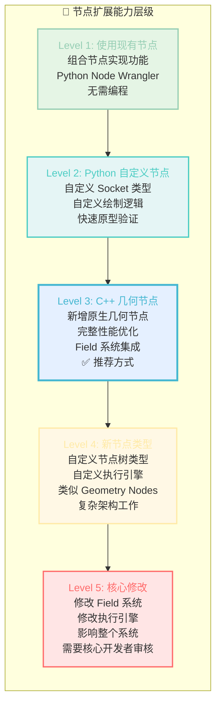
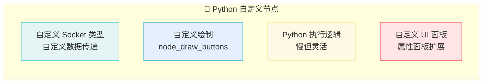
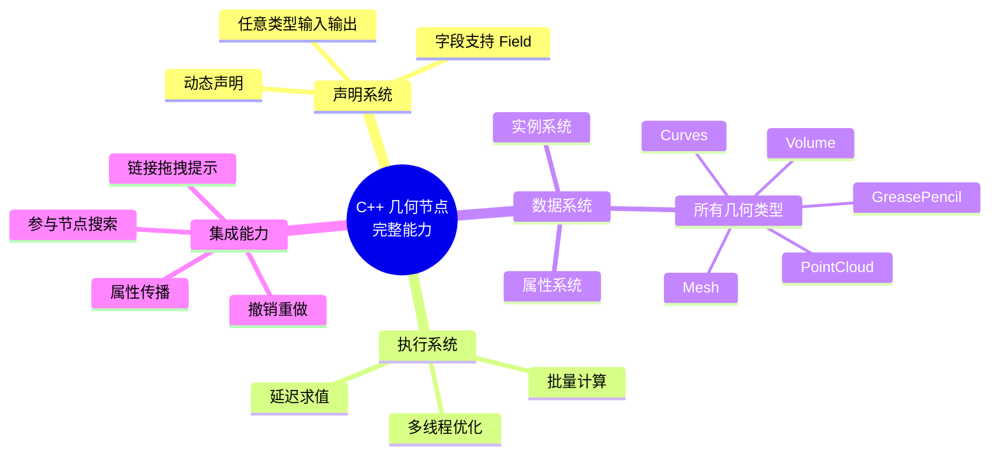
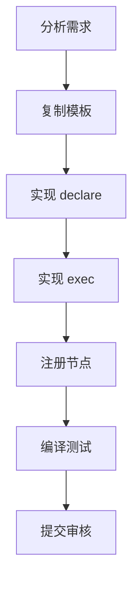
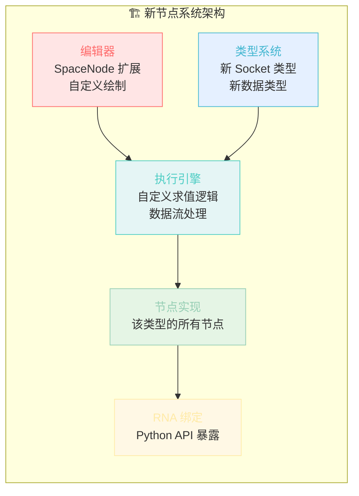
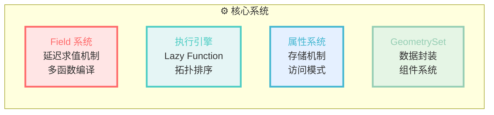
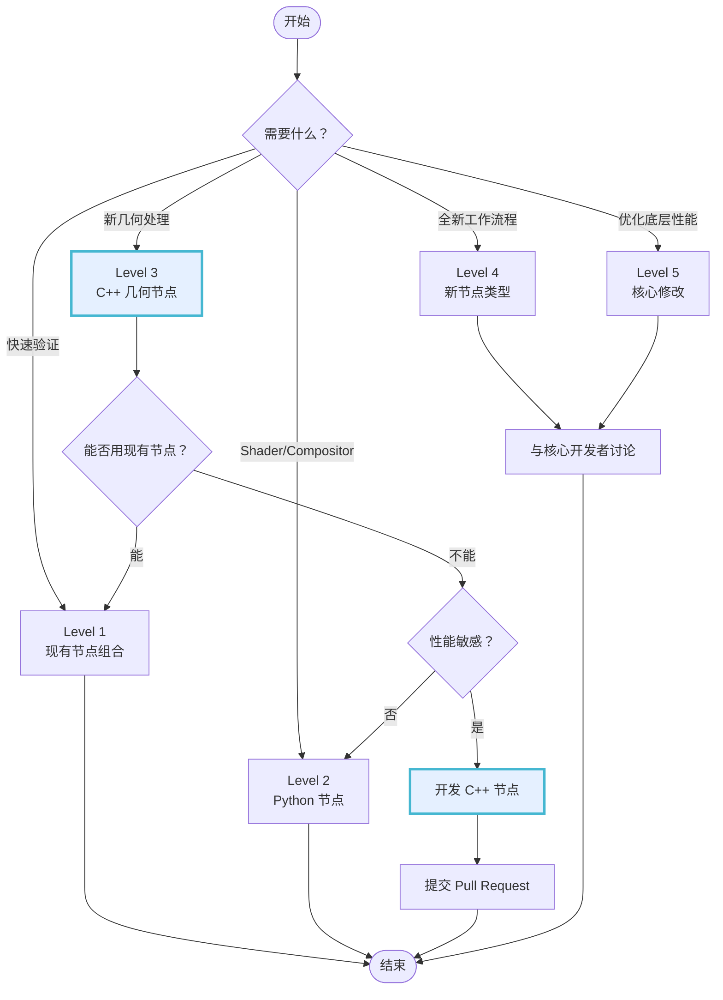

# Blender 节点系统扩展能力指南

## 你能做到什么程度？



---

## Level 1: 现有节点组合（无需编程）

### 能力范围
- 使用 200+ 内置几何节点
- 创建节点组（Node Group）封装复用逻辑
- 使用 Python 脚本批量操作节点树

### 适用场景
- 快速验证算法思路
- 非程序员参与流程设计
- 不需要极致性能的功能

### 示例：用现有节点实现曲线拆分
```
[Curve] → [Separate Geometry] → [Selection: 端点] → [Join Geometry]
                ↓
         [Separate Geometry] → [Selection: 非端点]
```

---

## Level 2: Python 自定义节点（Addon）

### 能力范围


### 限制
- ❌ **不能**参与 Field 系统（无法使用 Selection 字段）
- ❌ **不能**在 Geometry Nodes 编辑器中使用
- ❌ 性能较差（Python GIL 限制）
- ✅ 只能在 Shader/Compositor 节点中使用

### 适用场景
- Shader 节点扩展
- Compositor 节点扩展
- 快速原型验证（之后会移植到 C++）

### 示例代码结构
```python
import bpy
from bpy.types import Node

class MyCustomNode(Node):
    bl_idname = 'ShaderNodeMyCustom'
    bl_label = 'My Custom Node'
    
    # 自定义属性
    my_float: bpy.props.FloatProperty(name="Value")
    
    def init(self, context):
        self.inputs.new('NodeSocketFloat', "Input")
        self.outputs.new('NodeSocketFloat', "Output")
    
    def draw_buttons(self, context, layout):
        layout.prop(self, "my_float")
    
    def update(self):
        # 执行逻辑
        pass
```

---

## Level 3: C++ 原生几何节点（推荐）⭐

### 能力范围


### 你能做什么

| 功能 | 难度 | 示例 |
|------|------|------|
| 新增几何处理节点 | ⭐ 简单 | Split Curve, Extrude Mesh |
| 新增字段操作节点 | ⭐ 简单 | Field at Index, Accumulate |
| 新增采样节点 | ⭐⭐ 中等 | Sample Nearest, Raycast |
| 修改现有节点 | ⭐⭐ 中等 | 添加新参数、新模式 |
| 节点 UI 重构 | ⭐⭐ 中等 | 菜单选项 → Menu Socket |
| 新增几何类型支持 | ⭐⭐⭐ 困难 | 让现有节点支持 Volume |
| 优化执行性能 | ⭐⭐⭐ 困难 | SIMD, 多线程优化 |

### 文件位置
```
source/blender/nodes/geometry/nodes/
├── node_geo_*.cc          # 几何节点实现
├── node_geo_util_*.cc     # 工具函数

source/blender/geometry/
├── intern/*.cc            # 核心几何算法
├── GEO_*.hh               # 算法头文件
```

### 开发流程


### 最小节点模板
```cpp
/* SPDX-FileCopyrightText: 2026 Blender Authors
 *
 * SPDX-License-Identifier: GPL-2.0-or-later */

#include "node_geometry_util.hh"

namespace blender::nodes::node_geo_my_node_cc {

// 1. 声明层
static void node_declare(NodeDeclarationBuilder &b)
{
    b.add_input<decl::Geometry>("Geometry"_ustr);
    b.add_input<decl::Float>("Value"_ustr).default_value(1.0f);
    b.add_output<decl::Geometry>("Geometry"_ustr);
}

// 2. 执行层
static void node_geo_exec(GeoNodeExecParams params)
{
    GeometrySet geometry = params.extract_input<GeometrySet>("Geometry"_ustr);
    const float value = params.get_input<float>("Value"_ustr);
    
    // 处理逻辑...
    
    params.set_output("Geometry"_ustr, std::move(geometry));
}

// 3. 注册层
static void node_register()
{
    static bke::bNodeType ntype;
    geo_node_type_base(&ntype, "GeometryNodeMyNode"_ustr);
    ntype.ui_name = "My Node";
    ntype.ui_description = "Does something useful";
    ntype.nclass = NODE_CLASS_GEOMETRY;
    ntype.declare = node_declare;
    ntype.geometry_node_execute = node_geo_exec;
    bke::node_register_type(ntype);
}
NOD_REGISTER_NODE(node_register)

}  // namespace blender::nodes::node_geo_my_node_cc
```

---

## Level 4: 自定义节点树类型

### 能力范围
创建全新的节点系统，类似于：
- Geometry Nodes（几何节点）
- Shader Nodes（材质节点）
- Compositor Nodes（合成节点）
- Texture Nodes（纹理节点）

### 需要实现的部分


### 文件位置
```
source/blender/editors/space_node/     # 编辑器
source/blender/nodes/intern/           # 节点基础设施
source/blender/makesrna/intern/        # RNA 定义
```

### 适用场景
- 全新的工作流程（如粒子系统节点化）
- 特定领域的工具（如建筑可视化节点）
- 研究性质的实验功能

### 难度评估
- 需要修改 10+ 个文件
- 需要理解 Blender 的 Space、Editor、RNA 系统
- 需要核心开发者深度审核

---

## Level 5: 核心系统修改

### 涉及系统


### 修改影响
- 影响所有几何节点
- 可能影响文件格式兼容性
- 需要全面的性能测试
- 需要多轮代码审核

### 适用场景
- 核心开发者优化架构
- 重大版本更新（如 Blender 4.0 Field 系统重写）
- 修复底层设计缺陷

---

## 如何选择合适的层级？



---

## 推荐的开发路径

### 对于新功能开发

```mermaid
timeline
    title 推荐开发流程
    
    section 阶段1: 验证
        使用现有节点 : 快速原型
                     : 验证算法可行性
                     
    section 阶段2: 实现
        C++ 节点 : 复制模板文件
                 : 实现核心逻辑
                 : 本地编译测试
                 
    section 阶段3: 完善
        代码审核 : 提交 PR
                 : 根据反馈修改
                 : 合并到主分支
```

### 具体步骤

1. **分析现有节点**
   - 查找类似功能的节点作为参考
   - 阅读 `node_geo_*.cc` 源码
   - 理解 Field 系统如何集成

2. **复制模板**
   ```bash
   cp node_geo_curve_split.cc node_geo_my_feature.cc
   ```

3. **修改命名空间**
   ```cpp
   namespace blender::nodes::node_geo_my_feature_cc {
   ```

4. **实现 declare**
   - 定义输入输出
   - 考虑 Field 支持
   - 添加描述信息

5. **实现 exec**
   - 提取输入
   - 处理数据
   - 设置输出

6. **注册节点**
   - 选择唯一的 idname
   - 设置合适的类别
   - 添加 NOD_REGISTER_NODE

7. **编译测试**
   ```bash
   make -j8 bf_nodes
   ```

8. **提交审核**
   - 遵循代码规范
   - 添加测试用例
   - 更新文档

---

## 常见扩展需求与对应层级

| 需求 | 推荐层级 | 难度 | 参考节点 |
|------|----------|------|----------|
| 曲线细分算法 | Level 3 | ⭐⭐ | Curve Subdivide |
| 网格新操作 | Level 3 | ⭐⭐ | Extrude Mesh |
| 新采样方式 | Level 3 | ⭐⭐ | Sample Nearest |
| 字段数学运算 | Level 3 | ⭐ | Float Math |
| 节点 UI 重构 | Level 3 | ⭐⭐ | 菜单 → Menu Socket |
| 自定义材质节点 | Level 2 | ⭐⭐ | - |
| 自定义合成节点 | Level 2 | ⭐⭐ | - |
| 粒子系统节点化 | Level 4 | ⭐⭐⭐⭐⭐ | - |
| 优化 Field 求值 | Level 5 | ⭐⭐⭐⭐⭐ | - |

---

## 资源与参考

### 必读源码
- `node_geo_curve_split.cc` - 中等复杂度节点示例
- `node_geo_extrude_mesh.cc` - 复杂节点示例
- `node_geo_float_math.cc` - 简单节点示例
- `NOD_geometry_exec.hh` - 执行参数 API

### 文档
- [Blender Developer Docs](https://developer.blender.org/docs/)
- [Geometry Nodes Design](https://wiki.blender.org/wiki/Source/Nodes/GeometryNodes)

### 社区
- Blender Chat #nodes 频道
- Blender Developer 邮件列表
- Pull Request 代码审核

---

## 总结

**大多数功能需求都可以通过 Level 3（C++ 几何节点）实现**，这是：
- ✅ 性能最优
- ✅ 集成最完整
- ✅ 维护成本适中
- ✅ 审核流程明确

**避免过早优化到 Level 4/5**，除非：
- 现有架构确实无法满足
- 已经与核心开发者讨论过
- 有明确的架构设计文档
