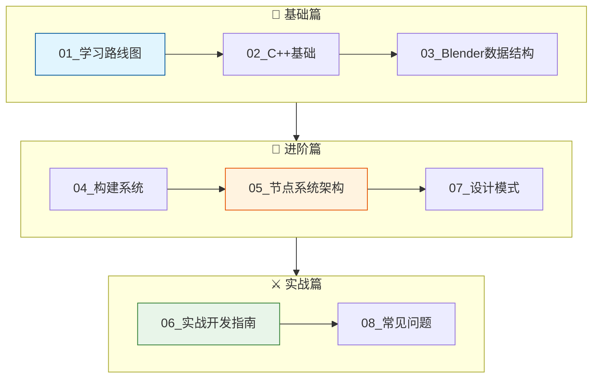
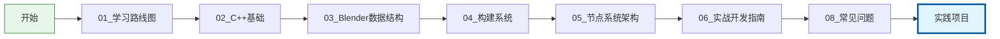
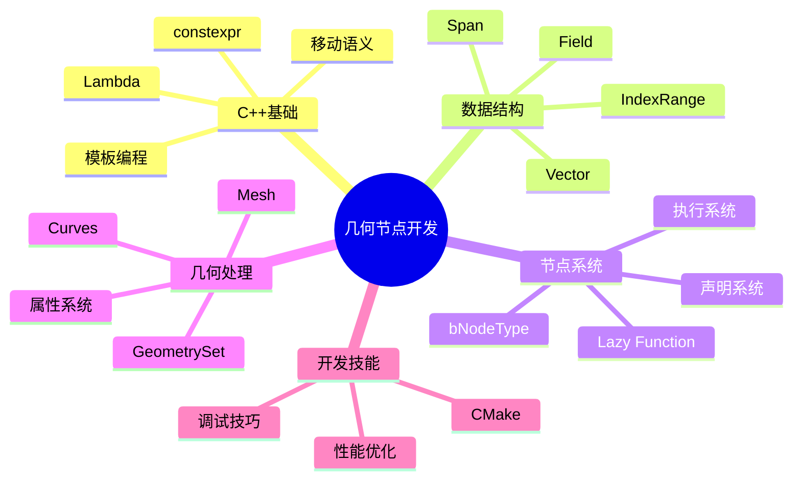

# Blender 几何节点 C++ 源码学习指南

> 从入门到精通，掌握 Blender 几何节点开发

---

## 📚 文档导航



---

## 🎯 学习路径

### 新手路线（推荐）



### 快速上手（有经验者）

如果你已经有 C++ 和 Blender 使用经验：

1. 快速浏览 [03_Blender数据结构](03_Blender数据结构.md)
2. 阅读 [05_节点系统架构](05_节点系统架构.md)
3. 直接开始 [06_实战开发指南](06_实战开发指南.md)
4. 遇到问题查阅 [08_常见问题](08_常见问题.md)

---

## 📖 文档目录

| 文档 | 内容 | 预计时间 |
|-----|------|---------|
| [01_学习路线图](01_学习路线图.md) | 整体学习规划和时间安排 | 30 分钟 |
| [02_C++基础](02_C++基础.md) | C++17/20 特性、模板、Lambda | 1-2 天 |
| [03_Blender数据结构](03_Blender数据结构.md) | Vector、Span、Field 等核心类型 | 1-2 天 |
| [04_构建系统](04_构建系统.md) | CMake、编译配置、调试 | 2-4 小时 |
| [05_节点系统架构](05_节点系统架构.md) | 节点注册、执行、字段系统 | 2-3 天 |
| [06_实战开发指南](06_实战开发指南.md) | 从零创建自定义节点 | 1-2 天 |
| [07_设计模式](07_设计模式.md) | 源码中的设计模式解析 | 1-2 天 |
| [08_常见问题](08_常见问题.md) | 问题排查和解决方案 | 参考用 |

---

## 🗺️ 知识图谱



---

## 🚀 快速开始

### 环境准备

```bash
# 1. 克隆 Blender 源码
git clone https://projects.blender.org/blender/blender.git
cd blender

# 2. 安装依赖（Windows）
# 使用 Visual Studio 2022

# 3. 配置构建
cmake -B build -S . -G "Visual Studio 17 2022" -A x64

# 4. 构建
cmake --build build --config Release --parallel 16
```

### 第一个节点

参考 [06_实战开发指南](06_实战开发指南.md) 创建你的第一个几何节点。

---

## 📊 学习进度追踪

### 基础阶段

- [ ] 理解 C++17 核心特性
- [ ] 掌握 Vector/Span/Array 用法
- [ ] 能独立编译 Blender
- [ ] 理解 CMake 基础配置

### 核心阶段

- [ ] 理解 bNodeType 结构
- [ ] 能编写 node_declare 函数
- [ ] 理解 GeoNodeExecParams
- [ ] 理解 Field 系统
- [ ] 理解 Lazy Function 执行流程

### 实战阶段

- [ ] 成功创建第一个节点
- [ ] 能处理所有几何类型
- [ ] 能使用 Selection 字段
- [ ] 能调试节点执行

### 进阶阶段

- [ ] 理解类型擦除机制
- [ ] 能进行性能优化
- [ ] 能阅读复杂节点源码
- [ ] 能为社区贡献代码

---

## 🔗 重要链接

### 官方资源

- [Blender 开发者文档](https://developer.blender.org/docs/)
- [Blender 构建指南](https://developer.blender.org/docs/handbook/building_blender/)
- [Blender 代码规范](https://developer.blender.org/docs/handbook/coding_guidelines/)

### 社区

- [Blender Chat](https://blender.chat/) - #development, #nodes 频道
- [Blender StackExchange](https://blender.stackexchange.com/)
- [Blender Artists 论坛](https://blenderartists.org/)

### 源码位置

```
blender/
├── source/blender/nodes/           # 节点系统
│   ├── geometry/nodes/             # 几何节点实现
│   ├── intern/                     # 内部实现
│   └── NOD_*.h                     # 公共头文件
├── source/blender/blenlib/         # 基础数据结构
├── source/blender/blenkernel/      # 核心功能
└── source/blender/functions/       # 字段系统
```

---

## 💡 学习建议

1. **边学边练**：阅读文档的同时动手实践
2. **阅读源码**：从简单节点开始阅读官方实现
3. **记录笔记**：建立自己的知识库
4. **参与社区**：遇到问题及时求助
5. **循序渐进**：不要急于求成，打好基础

---

## 📝 更新日志

| 日期 | 更新内容 |
|-----|---------|
| 2024-XX-XX | 初始版本 |

---

## 🤝 贡献

如果你发现错误或有改进建议，欢迎提交反馈！

---

**Happy Coding! 🎨🔧**
