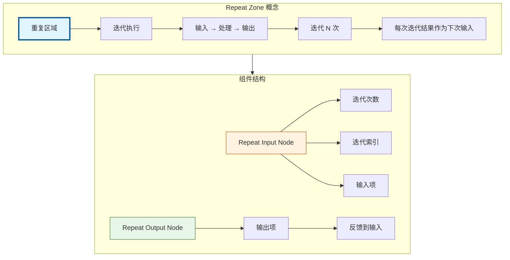
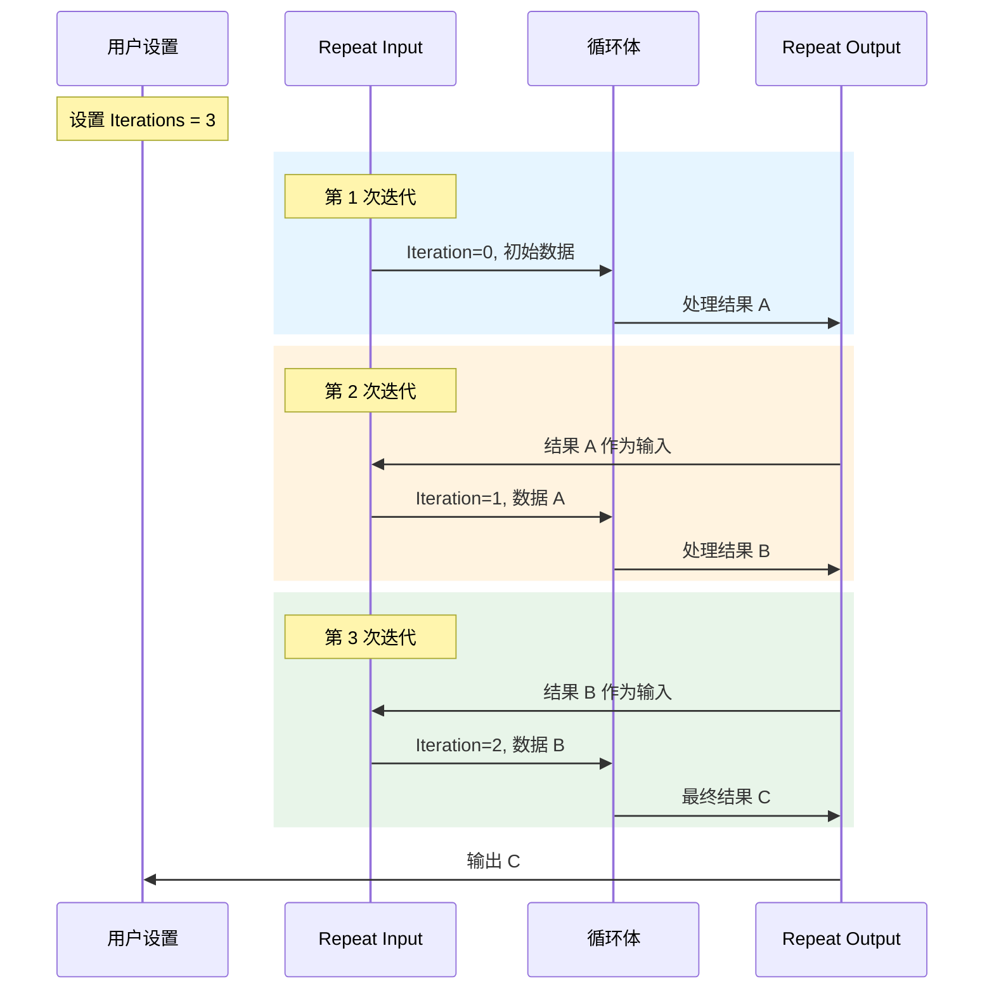

# Repeat Zone 总览

> Blender 几何节点中的重复区域，实现迭代计算和循环逻辑

---

## 📖 源码注释翻译与解释

### 文件头说明

Repeat Zone 由三个主要文件实现：

| 文件 | 路径 | 说明 |
|------|------|------|
| node_geo_repeat.cc | `source/blender/nodes/geometry/nodes/node_geo_repeat.cc` | 节点定义和UI |
| geometry_nodes_repeat_zone.cc | `source/blender/nodes/intern/geometry_nodes_repeat_zone.cc` | 执行逻辑 |
| NOD_geo_repeat.hh | `source/blender/nodes/geometry/include/NOD_geo_repeat.hh` | 头文件和数据结构 |

---

## 🎯 核心概念



### 为什么需要 Repeat Zone？

在几何节点中，很多操作需要**多次应用**才能产生复杂效果：

| 场景 | 单次操作 | 重复10次效果 |
|------|----------|--------------|
| 细分 | 细分1次 | 细分10次，更平滑 |
| 噪声 | 单次噪声 | 累积噪声，更复杂 |
| 变形 | 单次变形 | 迭代变形，分形效果 |
| 挤出 | 单次挤出 | 迭代挤出，螺旋结构 |

如果没有 Repeat Zone，用户需要手动复制粘贴节点10次，这是不可接受的。

---

## 📦 核心组件详解

### 1. Repeat Input Node（重复输入节点）

**源码位置：** `node_geo_repeat.cc:72~109`

```cpp
static void node_declare(NodeDeclarationBuilder &b)
{
    b.use_custom_socket_order();
    b.allow_any_socket_order();
    
    // 迭代索引输出（从0开始）
    b.add_output<decl::Int>("Iteration"_ustr)
        .description("Index of the current iteration. Starts counting at zero");
    
    // 迭代次数输入
    b.add_input<decl::Int>("Iterations"_ustr).min(0).default_value(1);

    const bNode *node = b.node_or_null();
    const bNodeTree *tree = b.tree_or_null();
    if (node && tree) {
        const NodeGeometryRepeatInput &storage = node_storage(*node);
        if (const bNode *output_node = tree->node_by_id(storage.output_node_id)) {
            const auto &output_storage = *static_cast<const NodeGeometryRepeatOutput *>(
                output_node->storage);
            // 动态创建输入/输出项...
            for (const int i : IndexRange(output_storage.items_num)) {
                const NodeRepeatItem &item = output_storage.items[i];
                // 添加对应的输入和输出 socket
            }
        }
    }
    
    // 扩展 socket（用于拖拽连接自动添加项）
    b.add_input<decl::Extend>(""_ustr, "__extend__"_ustr).structure_type(StructureType::Dynamic);
    b.add_output<decl::Extend>(""_ustr, "__extend__"_ustr)
        .structure_type(StructureType::Dynamic)
        .align_with_previous();
}
```

**关键设计：**

1. **动态 Socket 声明**：输入节点的 socket 不是固定的，而是根据输出节点的配置动态生成
2. **双向数据流**：
   - 输入 socket：接收上一次迭代的结果（或初始值）
   - 输出 socket：将数据传递给循环体
3. **扩展 Socket**：`__extend__` 用于支持拖拽连接时自动添加新项

**功能说明：**

| Socket | 类型 | 说明 |
|--------|------|------|
| Iterations | 输入 | 总迭代次数（>=0） |
| Iteration | 输出 | 当前迭代索引（0, 1, 2, ...） |
| 动态项 | 输入/输出 | 由输出节点定义的数据项 |

---

### 2. Repeat Output Node（重复输出节点）

**源码位置：** `node_geo_repeat.cc:168~220`

```cpp
static void node_declare(NodeDeclarationBuilder &b)
{
    b.use_custom_socket_order();
    b.allow_any_socket_order();

    const bNode *node = b.node_or_null();
    const bNodeTree *tree = b.tree_or_null();
    if (node && tree) {
        const auto &storage = node_storage(*node);
        for (const int i : IndexRange(storage.items_num)) {
            const NodeRepeatItem &item = storage.items[i];
            const eNodeSocketDatatype socket_type = eNodeSocketDatatype(item.socket_type);
            const UString name = item.name ? UString(item.name) : ""_ustr;
            const UString identifier(RepeatItemsAccessor::socket_identifier_for_item(item));
            b.add_input(socket_type, name, identifier)
                .socket_name_ptr(&tree->id, *RepeatItemsAccessor::item_srna, &item, "name");
            b.add_output(socket_type, name, identifier).align_with_previous();
        }
    }
    b.add_input<decl::Extend>(""_ustr, "__extend__"_ustr).structure_type(StructureType::Dynamic);
    b.add_output<decl::Extend>(""_ustr, "__extend__"_ustr)
        .structure_type(StructureType::Dynamic)
        .align_with_previous();
}
```

**关键设计：**

1. **配置中心**：输出节点存储 `NodeGeometryRepeatOutput`，定义了所有可传递的数据项
2. **反馈机制**：输出项通过 Zone 连接反馈到输入节点
3. **检查索引**：`inspection_index` 用于调试，可查看特定迭代的状态

---

## 🔄 执行流程详解

### 数据流图



### 执行时序

```cpp
// 概念性伪代码
Result execute_repeat_zone(int iterations, InitialData data) {
    CurrentData current = data;
    
    for (int i = 0; i < iterations; i++) {
        // 1. 输入节点提供当前迭代索引和数据
        Input input = {i, current};
        
        // 2. 执行循环体
        Output output = execute_body(input);
        
        // 3. 输出反馈到下一次迭代
        current = output.data;
    }
    
    return current;
}
```

---

## 🎨 典型使用场景

### 场景 1：多次细分网格

**节点图：**

```
[Mesh Input] ──┬──> [Repeat Input (Iterations=3)]
               │           │
               │           v
               │    [Subdivision Surface]
               │           │
               │           v
               │    [Repeat Output] ──> [Mesh Output]
               │           │
               └───────────┘ (反馈)
```

**效果：**
- 迭代 0：原始网格细分1次
- 迭代 1：细分后的网格再细分
- 迭代 2：再次细分
- 结果：总共细分3次，非常平滑的网格

---

### 场景 2：迭代噪声变形

**节点图：**

```
[Mesh Input] ──> [Repeat Input (Iterations=10)]
                         │
                         v
                  [Noise Texture]
                         │
                  [Displace]
                         │
                  [Repeat Output] ──> [Mesh Output]
                         │
                         └──────────────┐
                                        │
                         [Scale Offset] <┘
```

**效果：**
每次迭代添加不同频率的噪声，产生类似地形的效果。

---

### 场景 3：递归分形结构

**节点图：**

```
[Points] ──> [Repeat Input (Iterations=5)]
                     │
                     v
              [Instance on Points]
                     │
              [Scale (0.5)]
                     │
              [Repeat Output] ──> [Instances Output]
                     │
                     └──────────────┐
                                    │
                     [Join Geometry] <┘
```

**效果：**
每次迭代在点上实例化自身，产生分形树状结构。

---

## 📊 与其他 Zone 的对比

| 特性 | Repeat Zone | Simulation Zone | For Each Zone |
|------|-------------|-----------------|---------------|
| **执行次数** | 固定次数 | 每帧一次 | 元素数量 |
| **状态传递** | 迭代间传递 | 时间步传递 | 元素独立 |
| **延迟执行** | ✅ 支持 | ❌ 必须执行 | ✅ 支持 |
| **典型用途** | 迭代变形 | 物理模拟 | 批量处理 |
| **检查索引** | ✅ 支持 | ❌ 不支持 | ❌ 不支持 |

---

## 🔍 关键源码文件详解

### 1. node_geo_repeat.cc

**职责：** 节点定义、UI、RNA、Blend文件读写

**主要函数：**
- `node_declare()` - 声明 socket
- `node_layout_ex()` - UI 布局
- `node_init()` - 节点初始化
- `node_insert_link()` - 连接插入处理

### 2. geometry_nodes_repeat_zone.cc

**职责：** 执行逻辑、LazyFunction 实现

**主要类：**
- `LazyFunctionForRepeatZone` - 延迟执行主体
- `RepeatEvalStorage` - 执行存储
- `RepeatBodyNodeExecuteWrapper` - 循环体包装

### 3. NOD_geo_repeat.hh

**职责：** 数据结构定义、访问器

**主要结构：**
- `NodeGeometryRepeatInput` - 输入节点存储
- `NodeGeometryRepeatOutput` - 输出节点存储
- `NodeRepeatItem` - 重复项定义
- `RepeatItemsAccessor` - 项访问器

---

## ✅ 检查清单

- [ ] 理解 Repeat Zone 的基本概念（迭代执行）
- [ ] 知道输入节点和输出节点的职责分工
- [ ] 理解动态 socket 的生成机制
- [ ] 掌握 Iteration 和 Iterations 的区别
- [ ] 了解检查索引（inspection_index）的用途
- [ ] 能够设计简单的重复迭代效果

---

## 🔗 相关文档

- [02_RepeatZone_LazyFunction.md](02_RepeatZone_LazyFunction.md) - 懒执行系统
- [03_RepeatZone_SocketItems.md](03_RepeatZone_SocketItems.md) - 动态 Socket 项
- [04_RepeatZone_IterationControl.md](04_RepeatZone_IterationControl.md) - 迭代控制
- [05_RepeatZone_FieldPropagation.md](05_RepeatZone_FieldPropagation.md) - 字段传播
- [06_RepeatZone_Comparison.md](06_RepeatZone_Comparison.md) - 与 Simulation Zone 对比
