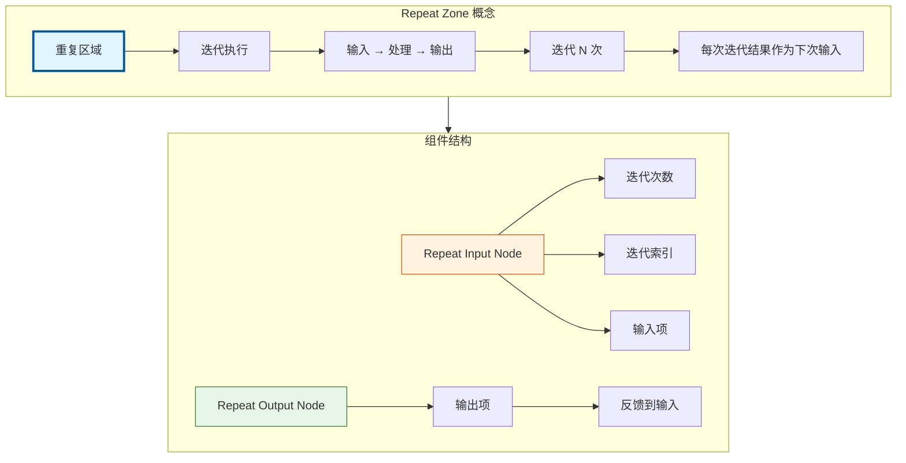
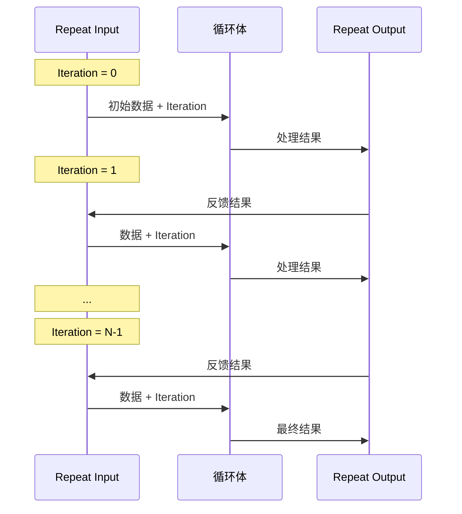

# Repeat Zone 总览

> Blender 几何节点中的重复区域，实现迭代计算和循环逻辑

---

## 🎯 核心概念



---

## 📦 核心组件

### 1. Repeat Input Node（重复输入节点）

```cpp
// source/blender/nodes/geometry/nodes/node_geo_repeat.cc

static void node_declare(NodeDeclarationBuilder &b)
{
    b.use_custom_socket_order();
    b.allow_any_socket_order();
    
    // 迭代索引输出（从0开始）
    b.add_output<decl::Int>("Iteration"_ustr)
        .description("Index of the current iteration. Starts counting at zero");
    
    // 迭代次数输入
    b.add_input<decl::Int>("Iterations"_ustr).min(0).default_value(1);
    
    // 动态输入项（由 Repeat Output Node 定义）
    // ...
}
```

**功能：**
- 提供当前迭代索引（Iteration）
- 接收总迭代次数（Iterations）
- 接收初始输入数据
- 输出传递给循环体的数据

### 2. Repeat Output Node（重复输出节点）

```cpp
static void node_declare(NodeDeclarationBuilder &b)
{
    b.use_custom_socket_order();
    b.allow_any_socket_order();
    
    // 动态输出项（可配置）
    // 默认包含 Geometry
    // ...
}
```

**功能：**
- 定义循环体的输出项
- 输出项反馈到下一次迭代
- 支持多种 Socket 类型
- 可配置检查索引（inspection_index）

---

## 🔄 执行流程



---

## 🎨 典型使用场景

### 场景 1：多次细分网格

```
Repeat Input (Iterations=3)
    ↓
Subdivision Surface
    ↓
Repeat Output
```

效果：网格被细分3次

### 场景 2：迭代变形

```
Repeat Input (Iterations=10)
    ↓
Noise Displacement
    ↓
Repeat Output
```

效果：每次迭代添加噪声，累积变形效果

### 场景 3：递归分形

```
Repeat Input (Iterations=5)
    ↓
Instance on Points
    ↓
Scale (0.5)
    ↓
Repeat Output
```

效果：创建分形结构

---

## 📁 源码文件

| 文件 | 路径 | 说明 |
|-----|------|------|
| node_geo_repeat.cc | `source/blender/nodes/geometry/nodes/node_geo_repeat.cc` | 节点定义 |
| geometry_nodes_repeat_zone.cc | `source/blender/nodes/intern/geometry_nodes_repeat_zone.cc` | 执行逻辑 |
| NOD_geo_repeat.hh | `source/blender/nodes/geometry/include/NOD_geo_repeat.hh` | 头文件 |

---

## 🔗 相关文档

- [02_RepeatZone_InputOutput.md](02_RepeatZone_InputOutput.md) - 输入输出系统
- [03_RepeatZone_Iteration.md](03_RepeatZone_Iteration.md) - 迭代控制
- [04_RepeatZone_LazyFunction.md](04_RepeatZone_LazyFunction.md) - 懒执行系统
