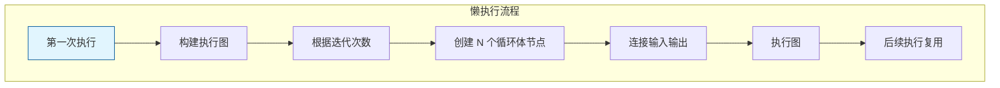

# Repeat Zone 懒执行系统

> Repeat Zone 的惰性函数实现，动态构建执行图

---

## 🎯 核心概念



---

## 📦 核心类

### LazyFunctionForRepeatZone

```cpp
// source/blender/nodes/intern/geometry_nodes_repeat_zone.cc

class LazyFunctionForRepeatZone : public LazyFunction {
 private:
  const bNodeTree &btree_;
  const bke::bNodeTreeZone &zone_;
  const bNode &repeat_output_bnode_;
  const ZoneBuildInfo &zone_info_;
  const ZoneBodyFunction &body_fn_;

 public:
  LazyFunctionForRepeatZone(const bNodeTree &btree,
                            const bke::bNodeTreeZone &zone,
                            ZoneBuildInfo &zone_info,
                            const ZoneBodyFunction &body_fn)
      : btree_(btree),
        zone_(zone),
        repeat_output_bnode_(*zone.output_node()),
        zone_info_(zone_info),
        body_fn_(body_fn)
  {
    debug_name_ = "Repeat Zone";
    initialize_zone_wrapper(zone, zone_info, body_fn, true, inputs_, outputs_);
    inputs_[zone_info.indices.inputs.main[0]].usage = lf::ValueUsage::Used;
  }

  void execute_impl(lf::Params &params, const lf::Context &context) const override;
};
```

---

## 🔄 执行图构建

### 1. 创建循环体节点

```cpp
void initialize_execution_graph(...) {
  // 获取迭代次数
  const int iterations = std::max<int>(0, 
      params.get_input<SocketValueVariant>(zone_info_.indices.inputs.main[0]).get<int>());
  
  // 创建 N 个循环体节点
  VectorSet<lf::FunctionNode *> &lf_body_nodes = eval_storage.lf_body_nodes;
  for ([[maybe_unused]] const int i : IndexRange(iterations)) {
    lf::FunctionNode &lf_node = lf_graph.add_function(*body_fn_.function);
    lf_body_nodes.add_new(&lf_node);
  }
}
```

### 2. 连接迭代索引

```cpp
// 设置迭代索引值
if (use_index_values) {
  eval_storage.index_values.reinitialize(iterations);
  threading::parallel_for(IndexRange(iterations), 1024, [&](const IndexRange range) {
    for (const int i : range) {
      eval_storage.index_values[i].set(i);
    }
  });
}

// 连接到循环体节点
for (const int iter_i : lf_body_nodes.index_range()) {
  lf::FunctionNode &lf_node = *lf_body_nodes[iter_i];
  const SocketValueVariant *index_value = use_index_values ? 
      &eval_storage.index_values[iter_i] : &static_unused_index;
  lf_node.input(body_fn_.indices.inputs.main[0]).set_default_value(index_value);
}
```

### 3. 连接输入输出链

```cpp
// 连接相邻迭代
for (const int iter_i : lf_body_nodes.index_range().drop_back(1)) {
  lf::FunctionNode &lf_node = *lf_body_nodes[iter_i];
  lf::FunctionNode &lf_next_node = *lf_body_nodes[iter_i + 1];
  
  for (const int i : IndexRange(num_repeat_items)) {
    // 当前迭代的输出连接到下一次迭代的输入
    lf_graph.add_link(
        lf_node.output(body_fn_.indices.outputs.main[i]),
        lf_next_node.input(body_fn_.indices.inputs.main[i + body_inputs_offset]));
  }
}
```

---

## 🎯 执行上下文

### RepeatBodyNodeExecuteWrapper

```cpp
class RepeatBodyNodeExecuteWrapper : public lf::GraphExecutorNodeExecuteWrapper {
 public:
  const bNode *repeat_output_bnode_ = nullptr;
  VectorSet<lf::FunctionNode *> *lf_body_nodes_ = nullptr;

  void execute_node(const lf::FunctionNode &node,
                    lf::Params &params,
                    const lf::Context &context) const override
  {
    GeoNodesUserData &user_data = *static_cast<GeoNodesUserData *>(context.user_data);
    const int iteration = lf_body_nodes_->index_of_try(const_cast<lf::FunctionNode *>(&node));
    
    if (iteration == -1) {
      // 非循环体节点，正常执行
      fn.execute(params, context);
      return;
    }

    // 设置循环体计算上下文
    bke::RepeatZoneComputeContext body_compute_context{
        user_data.compute_context, *repeat_output_bnode_, iteration};
    GeoNodesUserData body_user_data = user_data;
    body_user_data.compute_context = &body_compute_context;
    
    // 执行循环体
    fn.execute(params, body_context);
  }
};
```

---

## ✅ 检查清单

- [ ] 理解执行图动态构建
- [ ] 掌握迭代节点创建
- [ ] 了解输入输出链连接
- [ ] 理解执行上下文包装
