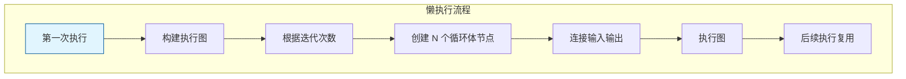
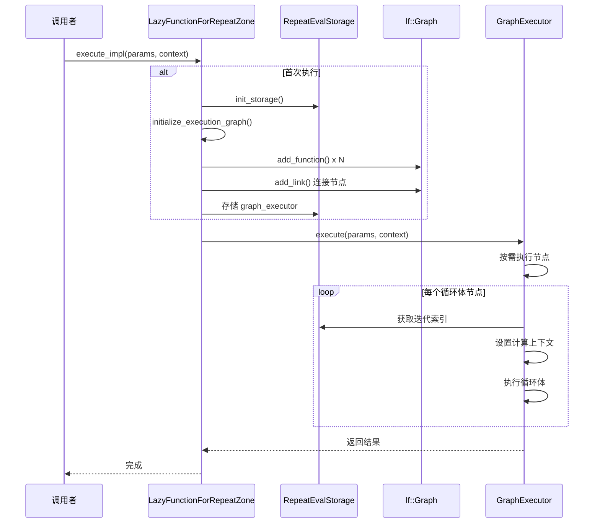

# Repeat Zone 懒执行系统

> Repeat Zone 的惰性函数实现，动态构建执行图

---

## 📖 源码注释翻译与解释

### 懒执行概念

Lazy Function（惰性函数）是 Blender 几何节点执行系统的核心机制。它允许节点图按需执行，而不是一次性计算所有节点。

**核心思想：**
- 构建一个"执行图"（execution graph）
- 只计算需要的输出
- 自动处理依赖关系

---

## 🎯 核心概念



### 为什么需要懒执行？

| 场景 | 立即执行 | 懒执行 |
|------|----------|--------|
| 条件分支 | 所有分支都执行 | 只执行命中分支 |
| 部分输出 | 计算所有输出 | 只计算需要的 |
| 重复计算 | 每次都重新算 | 缓存结果复用 |

---

## 📦 核心类详解

### LazyFunctionForRepeatZone

**源码位置：** `geometry_nodes_repeat_zone.cc:45~120`

```cpp
class LazyFunctionForRepeatZone : public LazyFunction {
 private:
  const bNodeTree &btree_;                    // 节点树引用
  const bke::bNodeTreeZone &zone_;            // Zone 信息
  const bNode &repeat_output_bnode_;          // 输出节点引用
  const ZoneBuildInfo &zone_info_;            // Zone 构建信息
  const ZoneBodyFunction &body_fn_;           // 循环体函数

 public:
  LazyFunctionForRepeatZone(const bNodeTree &btree,
                            const bke::bNodeTreeZone &zone,
                            ZoneBuildInfo &zone_info,
                            const ZoneBodyFunction &body_fn)
      : btree_(btree),
        zone_(zone),
        repeat_output_bnode_(*zone.output_node()),
        zone_info_(zone_info),
        body_fn_(body_fn)
  {
    debug_name_ = "Repeat Zone";
    initialize_zone_wrapper(zone, zone_info, body_fn, true, inputs_, outputs_);
    inputs_[zone_info.indices.inputs.main[0]].usage = lf::ValueUsage::Used;
  }

  void *init_storage(LinearAllocator<> &allocator) const override;
  void destruct_storage(void *storage) const override;
  void execute_impl(lf::Params &params, const lf::Context &context) const override;
};
```

**成员说明：**

| 成员 | 类型 | 说明 |
|------|------|------|
| `btree_` | `const bNodeTree &` | 节点树引用，用于访问节点信息 |
| `zone_` | `const bke::bNodeTreeZone &` | Zone 信息，包含输入输出节点 |
| `repeat_output_bnode_` | `const bNode &` | 输出节点引用，用于获取配置 |
| `zone_info_` | `const ZoneBuildInfo &` | Zone 构建信息，包含输入输出索引 |
| `body_fn_` | `const ZoneBodyFunction &` | 循环体函数，包含循环体内的节点图 |

**构造函数逻辑：**

1. 初始化所有引用成员
2. 设置调试名称 `"Repeat Zone"`
3. 调用 `initialize_zone_wrapper` 初始化输入输出
4. 标记 Iterations 输入为 `Used`（必须计算）

---

## 🔄 执行图构建详解

### 1. 获取迭代次数

```cpp
void initialize_execution_graph(...) const {
  // 获取迭代次数（第一个 main 输入）
  const int iterations = std::max<int>(0, 
      params.get_input<SocketValueVariant>(zone_info_.indices.inputs.main[0]).get<int>());
  
  // 大迭代次数提示线程系统
  if (iterations >= 10) {
    lazy_threading::send_hint();
  }
  
  // ... 后续构建
}
```

**关键点：**
- 使用 `std::max(0, value)` 确保非负
- `iterations >= 10` 时发送线程提示，允许工作窃取

### 2. 创建循环体节点

```cpp
// 创建 N 个循环体节点
VectorSet<lf::FunctionNode *> &lf_body_nodes = eval_storage.lf_body_nodes;
for ([[maybe_unused]] const int i : IndexRange(iterations)) {
  lf::FunctionNode &lf_node = lf_graph.add_function(*body_fn_.function);
  lf_body_nodes.add_new(&lf_node);
}
```

**说明：**
- 每个迭代创建一个 `lf::FunctionNode`
- 所有节点使用相同的 `body_fn_.function`（循环体逻辑）
- `VectorSet` 确保唯一性，同时保持插入顺序

### 3. 连接输入链

```cpp
// 第一个循环体节点连接外部输入
lf::FunctionNode &lf_first_body_node = *lf_body_nodes[0];
for (const int i : IndexRange(num_repeat_items)) {
  lf_graph.add_link(
      *lf_inputs[zone_info_.indices.inputs.main[i + main_inputs_offset]],
      lf_first_body_node.input(body_fn_.indices.inputs.main[i + body_inputs_offset]));
}
```

### 4. 连接迭代链

```cpp
// 连接相邻迭代（反馈机制）
for (const int iter_i : lf_body_nodes.index_range().drop_back(1)) {
  lf::FunctionNode &lf_node = *lf_body_nodes[iter_i];
  lf::FunctionNode &lf_next_node = *lf_body_nodes[iter_i + 1];
  
  for (const int i : IndexRange(num_repeat_items)) {
    // 当前迭代的输出连接到下一次迭代的输入
    lf_graph.add_link(
        lf_node.output(body_fn_.indices.outputs.main[i]),
        lf_next_node.input(body_fn_.indices.inputs.main[i + body_inputs_offset]));
  }
}
```

**迭代链图示：**


### 5. 连接输出链

```cpp
// 最后一个循环体节点连接输出
lf::FunctionNode &lf_last_body_node = *lf_body_nodes[iterations - 1];
for (const int i : IndexRange(num_repeat_items)) {
  lf_graph.add_link(
      lf_last_body_node.output(body_fn_.indices.outputs.main[i]),
      *lf_outputs[zone_info_.indices.outputs.main[i]]);
}
```

---

## 🎯 执行上下文包装

### RepeatBodyNodeExecuteWrapper

**源码位置：** `geometry_nodes_repeat_zone.cc:180~220`

```cpp
class RepeatBodyNodeExecuteWrapper : public lf::GraphExecutorNodeExecuteWrapper {
 public:
  const bNode *repeat_output_bnode_ = nullptr;
  VectorSet<lf::FunctionNode *> *lf_body_nodes_ = nullptr;

  void execute_node(const lf::FunctionNode &node,
                    lf::Params &params,
                    const lf::Context &context) const override
  {
    GeoNodesUserData &user_data = *static_cast<GeoNodesUserData *>(context.user_data);
    
    // 确定当前迭代索引
    const int iteration = lf_body_nodes_->index_of_try(
        const_cast<lf::FunctionNode *>(&node));
    
    if (iteration == -1) {
      // 非循环体节点，正常执行
      fn.execute(params, context);
      return;
    }

    // 创建当前迭代的计算上下文
    bke::RepeatZoneComputeContext body_compute_context{
        user_data.compute_context, *repeat_output_bnode_, iteration};
    
    // 复制用户数据并更新上下文
    GeoNodesUserData body_user_data = user_data;
    body_user_data.compute_context = &body_compute_context;
    body_user_data.verbose_log = should_log_verbose_in_context(
        user_data, body_compute_context.hash());
    
    // 创建局部用户数据
    GeoNodesLocalUserData body_local_user_data{body_user_data};
    
    // 构建新的上下文
    lf::Context body_context{
        context.storage, &body_user_data, &body_local_user_data};
    
    // 执行循环体
    fn.execute(params, body_context);
  }
};
```

**作用：**

1. **迭代识别**：通过 `index_of_try` 确定当前执行的是第几次迭代
2. **上下文隔离**：为每次迭代创建独立的 `RepeatZoneComputeContext`
3. **日志支持**：支持按迭代设置详细日志
4. **性能优化**：避免为每次迭代创建单独的 LazyFunction

---

## 🔄 执行流程详解

### 完整执行时序



---

## 🎨 边界情况处理

### 0 次迭代

```cpp
if (iterations > 0) {
  // 创建循环体节点并连接
  // ...
} else {
  // 直接连接输入到输出，不创建循环体
  for (const int i : IndexRange(num_repeat_items)) {
    lf_graph.add_link(
        *lf_inputs[zone_info_.indices.inputs.main[i + main_inputs_offset]],
        *lf_outputs[zone_info_.indices.outputs.main[i]]);
  }
}
```

### 单次迭代

```cpp
if (iterations == 1) {
  // 只创建一个循环体节点
  // 输入连接到这个节点
  // 这个节点连接输出
  // 没有迭代间连接
}
```

---

## ✅ 检查清单

- [ ] 理解 LazyFunction 的基本概念（按需执行）
- [ ] 掌握执行图动态构建的过程
- [ ] 了解迭代节点的创建和连接
- [ ] 理解输入链、迭代链、输出链的区别
- [ ] 掌握执行上下文包装的作用
- [ ] 了解边界情况（0次、1次、多次迭代）的处理

---

## 📁 相关文件

| 文件 | 路径 |
|------|------|
| geometry_nodes_repeat_zone.cc | `source/blender/nodes/intern/geometry_nodes_repeat_zone.cc` |
| lazy_function.hh | `source/blender/functions/lazy_function.hh` |
| graph_executor.hh | `source/blender/functions/graph_executor.hh` |

---

## 🔗 相关文档

- [01_RepeatZone_Overview.md](01_RepeatZone_Overview.md) - 总览
- [03_RepeatZone_SocketItems.md](03_RepeatZone_SocketItems.md) - 动态 Socket 项
- [07_RepeatZone_DataStructures.md](07_RepeatZone_DataStructures.md) - 数据结构详解
