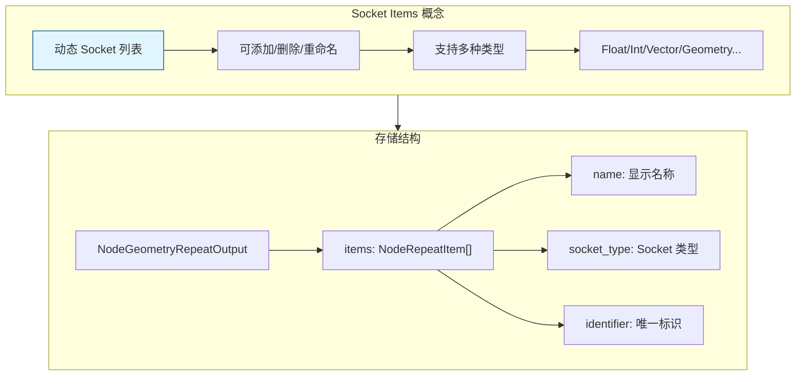
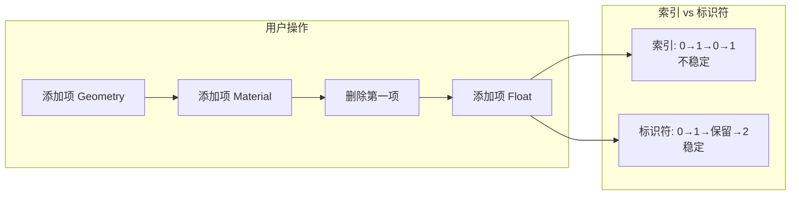
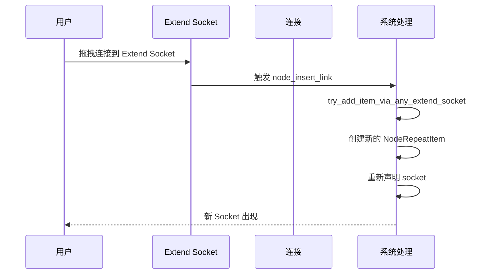

# Repeat Zone Socket Items 系统

> Repeat Zone 的动态 Socket 项管理系统

---

## 📖 源码注释翻译与解释

### Socket Items 概念

Socket Items 是 Blender 几何节点中用于动态管理 Socket（端口）的机制。它允许用户在运行时添加、删除和重命名 Socket，而不需要重新编译节点。

**核心思想：**
- 将 Socket 配置存储在节点的 DNA 数据中
- 通过访问器模式（Accessor Pattern）统一操作
- 支持多种数据类型（Float、Int、Vector、Geometry 等）

---

## 🎯 核心概念



---

## 📦 核心数据结构详解

### NodeRepeatItem

**源码位置：** `DNA_node_types.h:1556~1562`

```cpp
/**
 * Repeat Zone 的单个项定义
 * 存储在 NodeGeometryRepeatOutput 中
 */
typedef struct NodeRepeatItem {
    char *name;                    // 显示名称（国际化字符串）
    int identifier;                // 唯一标识符（持久化）
    short socket_type;             // Socket 类型 (eNodeSocketDatatype)
    char _pad[2];                  // 内存对齐填充
} NodeRepeatItem;
```

**字段说明：**

| 字段 | 类型 | 说明 |
|------|------|------|
| `name` | `char*` | 显示名称，支持国际化翻译 |
| `identifier` | `int` | 唯一标识符，即使重新排序也保持不变 |
| `socket_type` | `short` | Socket 数据类型（几何体、整数、浮点等） |
| `_pad` | `char[2]` | 内存对齐填充，确保结构体对齐 |

**为什么需要 identifier？**



- **索引**：随增删改查变化，不稳定
- **标识符**：一旦分配永不改变，稳定引用

### NodeGeometryRepeatOutput

**源码位置：** `DNA_node_types.h:1564~1574`

```cpp
/**
 * Repeat Zone 输出节点的存储结构
 * 包含所有可配置的 Socket 项
 */
typedef struct NodeGeometryRepeatOutput {
    NodeRepeatItem *items;         // Socket 项数组（动态分配）
    int items_num;                 // 项数量
    int active_index;              // UI 中当前选中的项索引
    int next_identifier;           // 下一个可用的标识符
    int inspection_index;          // 检查特定迭代的索引（调试用）
} NodeGeometryRepeatOutput;
```

**内存布局：**

```mermaid
flowchart TB
    subgraph "NodeGeometryRepeatOutput"
        A[items: NodeRepeatItem*]
        B[items_num: int = 3]
        C[active_index: int = 1]
        D[next_identifier: int = 3]
        E[inspection_index: int = -1]
    end
    
    subgraph "堆上分配的 items 数组"
        F[items[0]<br/>name: "Geometry"<br/>socket_type: SOCK_GEOMETRY<br/>identifier: 0]
        G[items[1]<br/>name: "Count"<br/>socket_type: SOCK_INT<br/>identifier: 1]
        H[items[2]<br/>name: "Radius"<br/>socket_type: SOCK_FLOAT<br/>identifier: 2]
    end
    
    A --> F
    A --> G
    A --> H
```

---

## 🔧 RepeatItemsAccessor 详解

**源码位置：** `NOD_geo_repeat.hh:45~120`

```cpp
/**
 * Repeat Zone Socket Items 的访问器
 * 使用 CRTP 模式实现静态多态
 */
struct RepeatItemsAccessor : public socket_items::SocketItemsAccessorDefaults {
  using ItemT = NodeRepeatItem;
  static StructRNA **item_srna;
  static int node_type;
  static constexpr StringRefNull node_idname = "GeometryNodeRepeatOutput";
  static constexpr bool has_type = true;    // 支持类型选择
  static constexpr bool has_name = true;    // 支持自定义名称
  
  // 操作符 ID 定义
  struct operator_idnames {
    static constexpr StringRefNull add_item = "NODE_OT_repeat_zone_item_add";
    static constexpr StringRefNull remove_item = "NODE_OT_repeat_zone_item_remove";
    static constexpr StringRefNull move_item = "NODE_OT_repeat_zone_item_move";
  };
  
  // UI 列表 ID
  struct ui_idnames {
    static constexpr StringRefNull list = "DATA_UL_repeat_zone_state";
  };
  
  // RNA 属性名
  struct rna_names {
    static constexpr StringRefNull items = "repeat_items";
    static constexpr StringRefNull active_index = "active_index";
  };

  // 从节点获取 items 引用
  static socket_items::SocketItemsRef<NodeRepeatItem> get_items_from_node(bNode &node) {
    auto *storage = static_cast<NodeGeometryRepeatOutput *>(node.storage);
    return {&storage->items, &storage->items_num, &storage->active_index};
  }
  
  // 复制项
  static void copy_item(const NodeRepeatItem &src, NodeRepeatItem &dst) {
    dst.socket_type = src.socket_type;
    dst.identifier = src.identifier;
    dst.name = BLI_strdup_null(src.name);
  }
  
  // 销毁项
  static void destruct_item(NodeRepeatItem *item) {
    MEM_SAFE_FREE(item->name);
  }
  
  // 获取 Socket 类型
  static eNodeSocketDatatype get_socket_type(const NodeRepeatItem &item) {
    return static_cast<eNodeSocketDatatype>(item.socket_type);
  }
  
  // 获取名称指针（用于 RNA 绑定）
  static char **get_name(NodeRepeatItem &item) {
    return &item.name;
  }
  
  // 检查是否支持特定 Socket 类型
  static bool supports_socket_type(const eNodeSocketDatatype socket_type, const int ntree_type) {
    return bke::node_tree_type_supports_socket_type_static(ntree_type, socket_type);
  }
  
  // 初始化新项
  static void init_with_socket_type_and_name(bNode &node,
                                             NodeRepeatItem &item,
                                             const eNodeSocketDatatype socket_type,
                                             const char *name) {
    auto *storage = static_cast<NodeGeometryRepeatOutput *>(node.storage);
    item.socket_type = socket_type;
    item.identifier = storage->next_identifier++;
    socket_items::set_item_name_and_make_unique<RepeatItemsAccessor>(node, item, name);
  }
  
  // 生成 Socket 标识符（用于内部引用）
  static std::string socket_identifier_for_item(const NodeRepeatItem &item) {
    return "Item_" + std::to_string(item.identifier);
  }
};
```

**CRTP 模式：**

```cpp
// 基类提供通用实现
template<typename Accessor>
class SocketItemsAccessorDefaults {
    // 通用操作...
};

// 派生类提供特定配置
struct RepeatItemsAccessor : public SocketItemsAccessorDefaults<RepeatItemsAccessor> {
    // 特定配置...
};
```

**好处：**
- 编译时多态，零运行时开销
- 统一接口，代码复用
- 类型安全

---

## 🎨 动态 Socket 声明详解

### Input Node 声明流程

**源码位置：** `node_geo_repeat.cc:72~109`

```cpp
static void node_declare(NodeDeclarationBuilder &b)
{
    b.use_custom_socket_order();      // 使用自定义顺序
    b.allow_any_socket_order();       // 允许任意顺序
    
    // 固定 Socket
    b.add_output<decl::Int>("Iteration"_ustr)
        .description("Index of the current iteration. Starts counting at zero");
    b.add_input<decl::Int>("Iterations"_ustr).min(0).default_value(1);

    // 动态 Socket（从 Output Node 读取配置）
    const bNode *node = b.node_or_null();
    const bNodeTree *tree = b.tree_or_null();
    if (node && tree) {
        const NodeGeometryRepeatInput &storage = node_storage(*node);
        if (const bNode *output_node = tree->node_by_id(storage.output_node_id)) {
            const auto &output_storage = *static_cast<const NodeGeometryRepeatOutput *>(
                output_node->storage);
            
            // 为每个 item 创建输入输出 Socket
            for (const int i : IndexRange(output_storage.items_num)) {
                const NodeRepeatItem &item = output_storage.items[i];
                const eNodeSocketDatatype socket_type = eNodeSocketDatatype(item.socket_type);
                const UString name = item.name ? UString(item.name) : ""_ustr;
                const UString identifier(RepeatItemsAccessor::socket_identifier_for_item(item));
                
                // 输入 Socket（接收上一次迭代的结果）
                auto &input_decl = b.add_input(socket_type, name, identifier)
                    .socket_name_ptr(&tree->id, *RepeatItemsAccessor::item_srna, &item, "name");
                
                // 输出 Socket（传递给循环体，与输入对齐）
                auto &output_decl = b.add_output(socket_type, name, identifier)
                    .align_with_previous();
                
                // 支持字段的类型
                if (socket_type_supports_attributes(socket_type)) {
                    input_decl.supports_field();              // 输入支持字段
                    output_decl.dependent_field({input_decl.index()});  // 输出依赖输入
                }
                
                // 动态结构类型（用于字段传播）
                input_decl.structure_type(StructureType::Dynamic);
                output_decl.structure_type(StructureType::Dynamic);
            }
        }
    }
    
    // 扩展 Socket（用于拖拽连接自动添加新项）
    b.add_input<decl::Extend>(""_ustr, "__extend__"_ustr).structure_type(StructureType::Dynamic);
    b.add_output<decl::Extend>(""_ustr, "__extend__"_ustr)
        .structure_type(StructureType::Dynamic)
        .align_with_previous();
}
```

**关键设计：**

1. **动态读取配置**：输入节点不存储自己的配置，而是从输出节点读取
2. **输入输出配对**：每个 item 同时创建输入和输出 socket
3. **字段支持**：对支持字段的类型（如 Geometry），声明字段依赖关系
4. **扩展 Socket**：`__extend__` 用于支持拖拽连接时自动添加新项

### 扩展 Socket 机制



---

## 🎯 典型操作详解

### 添加新项

**方式 1：通过 UI 按钮**

```cpp
// 使用通用操作符
static void node_operators()
{
    socket_items::ops::make_common_operators<RepeatItemsAccessor>();
}
```

**方式 2：通过拖拽连接**

```cpp
static bool node_insert_link(bke::NodeInsertLinkParams &params)
{
    bNode *output_node = params.ntree.node_by_id(node_storage(params.node).output_node_id);
    if (!output_node) {
        return true;  // 允许连接，但不添加项
    }
    // 尝试通过扩展 socket 添加新项
    return socket_items::try_add_item_via_any_extend_socket<RepeatItemsAccessor>(
        params.ntree, params.node, *output_node, params.link);
}
```

### 删除项

```cpp
// 使用通用操作符
// NODE_OT_repeat_zone_item_remove
// 内部实现：
template<typename Accessor>
static int remove_item_exec(bContext *C, wmOperator *op)
{
    // 获取当前选中的项索引
    int index = RNA_int_get(op->ptr, "index");
    
    // 移除项
    socket_items::remove_item_by_index<Accessor>(node, index);
    
    // 更新节点
    BKE_ntree_update_tag_node_property(ntree, node);
}
```

### 移动项

```cpp
// 使用通用操作符
// NODE_OT_repeat_zone_item_move
// 内部实现：
template<typename Accessor>
static int move_item_exec(bContext *C, wmOperator *op)
{
    int index = RNA_int_get(op->ptr, "index");
    int direction = RNA_enum_get(op->ptr, "direction");  // UP / DOWN
    
    socket_items::move_item<Accessor>(node, index, direction);
}
```

---

## 📊 支持的 Socket 类型

| 类型 | 枚举值 | 说明 |
|------|--------|------|
| `SOCK_FLOAT` | 0 | 浮点数 |
| `SOCK_INT` | 1 | 整数 |
| `SOCK_BOOLEAN` | 2 | 布尔值 |
| `SOCK_VECTOR` | 3 | 三维向量 |
| `SOCK_ROTATION` | 6 | 旋转（四元数） |
| `SOCK_MATRIX` | 7 | 4x4 矩阵 |
| `SOCK_STRING` | 8 | 字符串 |
| `SOCK_RGBA` | 10 | 颜色 |
| `SOCK_SHADER` | 11 | 着色器 |
| `SOCK_OBJECT` | 12 | 对象引用 |
| `SOCK_IMAGE` | 13 | 图像 |
| `SOCK_GEOMETRY` | 14 | 几何体 |
| `SOCK_COLLECTION` | 15 | 集合 |
| `SOCK_TEXTURE` | 16 | 纹理 |
| `SOCK_MATERIAL` | 17 | 材质 |

---

## ✅ 检查清单

- [ ] 理解 NodeRepeatItem 和 NodeGeometryRepeatOutput 的结构
- [ ] 掌握 RepeatItemsAccessor 的作用和 CRTP 模式
- [ ] 了解动态 Socket 声明的流程
- [ ] 理解扩展 Socket（`__extend__`）的作用
- [ ] 掌握添加、删除、移动项的操作
- [ ] 了解 identifier 和 index 的区别

---

## 📁 相关文件

| 文件 | 路径 |
|------|------|
| NOD_geo_repeat.hh | `source/blender/nodes/geometry/include/NOD_geo_repeat.hh` |
| node_geo_repeat.cc | `source/blender/nodes/geometry/nodes/node_geo_repeat.cc` |
| NOD_socket_items_ui.hh | `source/blender/nodes/NOD_socket_items_ui.hh` |
| DNA_node_types.h | `source/blender/makesdna/DNA_node_types.h` |

---

## 🔗 相关文档

- [01_RepeatZone_Overview.md](01_RepeatZone_Overview.md) - 总览
- [02_RepeatZone_LazyFunction.md](02_RepeatZone_LazyFunction.md) - 懒执行系统
- [04_RepeatZone_IterationControl.md](04_RepeatZone_IterationControl.md) - 迭代控制
