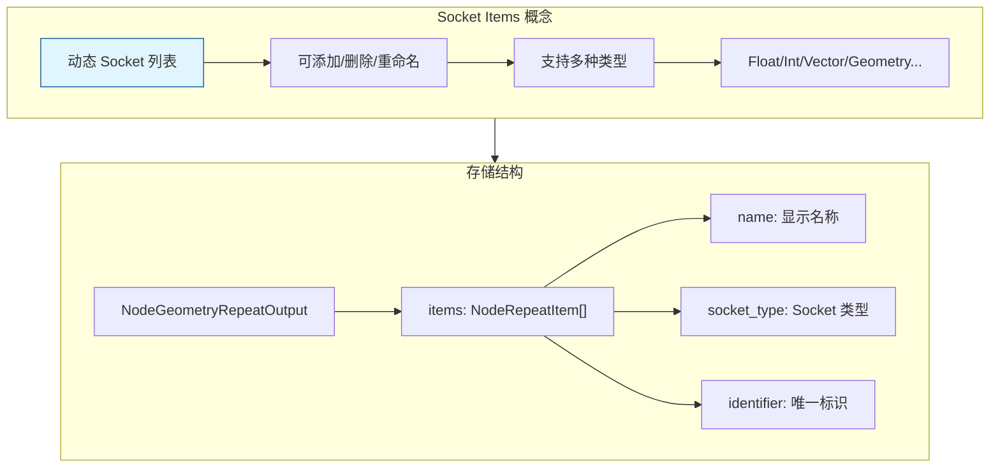

# Repeat Zone Socket Items 系统

> Repeat Zone 的动态 Socket 项管理系统

---

## 🎯 核心概念



---

## 📦 核心数据结构

### NodeRepeatItem

```cpp
// DNA_node_types.h

typedef struct NodeRepeatItem {
    char *name;                    // 显示名称
    int identifier;                // 唯一标识符
    short socket_type;             // Socket 类型 (eNodeSocketDatatype)
    char _pad[2];
} NodeRepeatItem;

typedef struct NodeGeometryRepeatOutput {
    NodeRepeatItem *items;         // Socket 项数组
    int items_num;                 // 项数量
    int active_index;              // 当前选中项
    int next_identifier;           // 下一个标识符
    int inspection_index;          // 检查索引
} NodeGeometryRepeatOutput;
```

---

## 🔧 RepeatItemsAccessor

```cpp
// NOD_geo_repeat.hh

struct RepeatItemsAccessor : public socket_items::SocketItemsAccessorDefaults {
  using ItemT = NodeRepeatItem;
  static StructRNA **item_srna;
  static int node_type;
  static constexpr StringRefNull node_idname = "GeometryNodeRepeatOutput";
  static constexpr bool has_type = true;
  static constexpr bool has_name = true;
  
  // 操作符 ID
  struct operator_idnames {
    static constexpr StringRefNull add_item = "NODE_OT_repeat_zone_item_add";
    static constexpr StringRefNull remove_item = "NODE_OT_repeat_zone_item_remove";
    static constexpr StringRefNull move_item = "NODE_OT_repeat_zone_item_move";
  };
  
  // 获取节点中的 items
  static socket_items::SocketItemsRef<NodeRepeatItem> get_items_from_node(bNode &node) {
    auto *storage = static_cast<NodeGeometryRepeatOutput *>(node.storage);
    return {&storage->items, &storage->items_num, &storage->active_index};
  }
  
  // 初始化新项
  static void init_with_socket_type_and_name(bNode &node,
                                             NodeRepeatItem &item,
                                             const eNodeSocketDatatype socket_type,
                                             const char *name) {
    auto *storage = static_cast<NodeGeometryRepeatOutput *>(node.storage);
    item.socket_type = socket_type;
    item.identifier = storage->next_identifier++;
    socket_items::set_item_name_and_make_unique<RepeatItemsAccessor>(node, item, name);
  }
  
  // 生成 Socket 标识符
  static std::string socket_identifier_for_item(const NodeRepeatItem &item) {
    return "Item_" + std::to_string(item.identifier);
  }
};
```

---

## 🎨 动态 Socket 声明

### Input Node 声明

```cpp
static void node_declare(NodeDeclarationBuilder &b)
{
    b.use_custom_socket_order();
    b.allow_any_socket_order();
    
    // 固定 Socket
    b.add_output<decl::Int>("Iteration"_ustr);
    b.add_input<decl::Int>("Iterations"_ustr).min(0).default_value(1);
    
    // 动态 Socket（从 Output Node 读取配置）
    const bNode *node = b.node_or_null();
    const bNodeTree *tree = b.tree_or_null();
    if (node && tree) {
        const NodeGeometryRepeatInput &storage = node_storage(*node);
        if (const bNode *output_node = tree->node_by_id(storage.output_node_id)) {
            const auto &output_storage = *static_cast<const NodeGeometryRepeatOutput *>(
                output_node->storage);
            
            // 为每个 item 创建输入输出 Socket
            for (const int i : IndexRange(output_storage.items_num)) {
                const NodeRepeatItem &item = output_storage.items[i];
                const eNodeSocketDatatype socket_type = eNodeSocketDatatype(item.socket_type);
                const UString name = item.name ? UString(item.name) : ""_ustr;
                const UString identifier(RepeatItemsAccessor::socket_identifier_for_item(item));
                
                // 输入 Socket
                auto &input_decl = b.add_input(socket_type, name, identifier)
                    .socket_name_ptr(&tree->id, *RepeatItemsAccessor::item_srna, &item, "name");
                
                // 输出 Socket（与输入对齐）
                auto &output_decl = b.add_output(socket_type, name, identifier)
                    .align_with_previous();
                
                // 支持字段
                if (socket_type_supports_attributes(socket_type)) {
                    input_decl.supports_field();
                    output_decl.dependent_field({input_decl.index()});
                }
            }
        }
    }
    
    // 扩展 Socket（用于添加新项）
    b.add_input<decl::Extend>(""_ustr, "__extend__"_ustr);
    b.add_output<decl::Extend>(""_ustr, "__extend__"_ustr).align_with_previous();
}
```

---

## 🎯 典型操作

### 添加新项

```cpp
// 通过扩展 Socket 添加
static bool node_insert_link(bke::NodeInsertLinkParams &params)
{
    return socket_items::try_add_item_via_any_extend_socket<RepeatItemsAccessor>(
        params.ntree, params.node, params.node, params.link);
}
```

### 删除项

```cpp
// 使用通用操作符
static void node_operators()
{
    socket_items::ops::make_common_operators<RepeatItemsAccessor>();
}
```

---

## ✅ 检查清单

- [ ] 理解 NodeRepeatItem 结构
- [ ] 掌握 RepeatItemsAccessor 的使用
- [ ] 了解动态 Socket 声明机制
- [ ] 理解扩展 Socket 的作用
