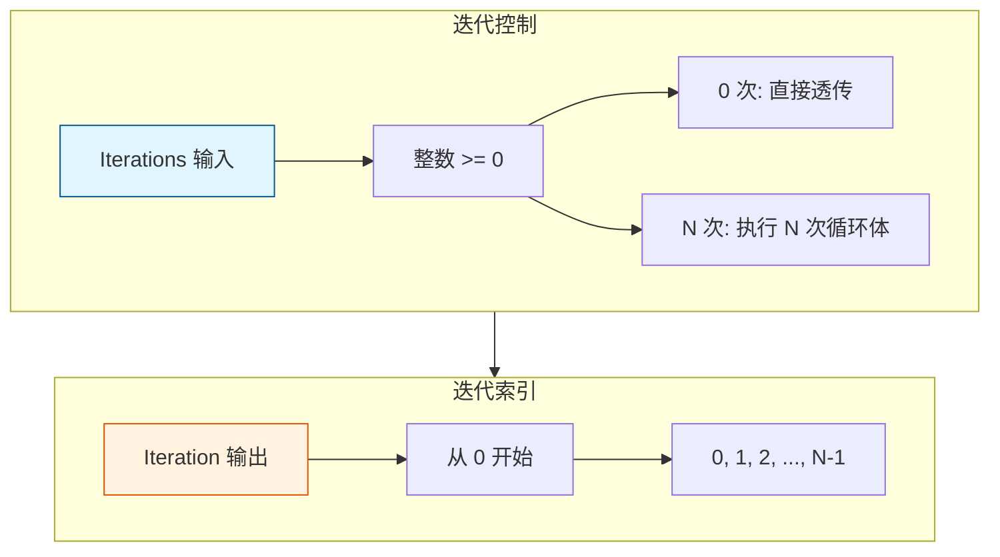

# Repeat Zone 迭代控制

> Repeat Zone 的迭代次数控制和索引管理

---

## 🎯 核心概念



---

## 📦 Iterations 输入

### 声明

```cpp
static void node_declare(NodeDeclarationBuilder &b)
{
    // 迭代次数输入
    b.add_input<decl::Int>("Iterations"_ustr)
        .min(0)                    // 最小 0 次
        .default_value(1);         // 默认 1 次
}
```

### 执行时获取

```cpp
void initialize_execution_graph(...) {
    // 获取迭代次数
    const int iterations = std::max<int>(0, 
        params.get_input<SocketValueVariant>(zone_info_.indices.inputs.main[0]).get<int>());
    
    // 大迭代次数提示线程系统
    if (iterations >= 10) {
        lazy_threading::send_hint();
    }
}
```

---

## 🔢 Iteration 输出

### 声明

```cpp
static void node_declare(NodeDeclarationBuilder &b)
{
    // 迭代索引输出
    b.add_output<decl::Int>("Iteration"_ustr)
        .description("Index of the current iteration. Starts counting at zero");
}
```

### 值生成

```cpp
// 预计算所有迭代索引值
if (use_index_values) {
    eval_storage.index_values.reinitialize(iterations);
    threading::parallel_for(IndexRange(iterations), 1024, [&](const IndexRange range) {
        for (const int i : range) {
            eval_storage.index_values[i].set(i);
        }
    });
}

// 设置到循环体节点
for (const int iter_i : lf_body_nodes.index_range()) {
    lf::FunctionNode &lf_node = *lf_body_nodes[iter_i];
    const SocketValueVariant *index_value = use_index_values ? 
        &eval_storage.index_values[iter_i] : &static_unused_index;
    lf_node.input(body_fn_.indices.inputs.main[0]).set_default_value(index_value);
}
```

---

## 🎨 使用场景

### 场景 1：固定次数

```
Iterations = 5
Iteration: 0, 1, 2, 3, 4
```

### 场景 2：动态次数

```
Iterations = 顶点数
Iteration: 0 到 顶点数-1
用于: 逐顶点处理
```

### 场景 3：0 次迭代

```
Iterations = 0
效果: 输入直接透传到输出，不执行循环体
```

---

## ⚠️ 边界情况

### 检查索引越界

```cpp
// 检查 inspection_index 是否越界
if (node_storage.inspection_index > 0) {
    if (node_storage.inspection_index >= iterations) {
        // 添加警告
        tree_logger->node_warnings.append(
            {repeat_output_bnode_.identifier,
             {NodeWarningType::Info, N_("Inspection index is out of range")}});
    }
}
```

---

## ✅ 检查清单

- [ ] 理解 Iterations 输入的作用
- [ ] 掌握 Iteration 输出的范围
- [ ] 了解 0 次迭代的特殊处理
- [ ] 理解检查索引的功能
