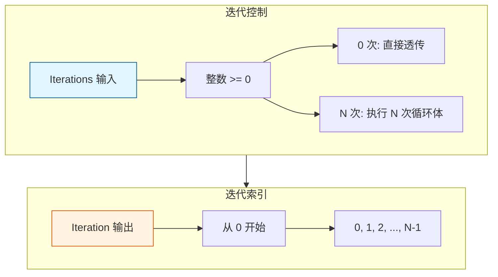

# Repeat Zone 迭代控制

> Repeat Zone 的迭代次数控制和索引管理

---

## 📖 源码注释翻译与解释

### 迭代控制概念

Repeat Zone 的迭代控制包含两个核心部分：
1. **Iterations** - 控制总迭代次数的输入
2. **Iteration** - 提供当前迭代索引的输出

这种设计允许用户在运行时动态控制循环行为，同时让循环体知道当前处于第几次迭代。

---

## 🎯 核心概念



---

## 📦 Iterations 输入详解

### 声明

**源码位置：** `node_geo_repeat.cc:78`

```cpp
static void node_declare(NodeDeclarationBuilder &b)
{
    // 迭代次数输入
    b.add_input<decl::Int>("Iterations"_ustr)
        .min(0)                    // 最小 0 次（不能为负）
        .default_value(1);         // 默认 1 次
}
```

**参数说明：**

| 参数 | 值 | 说明 |
|------|-----|------|
| `min` | 0 | 最小迭代次数，防止负数 |
| `default_value` | 1 | 默认迭代1次，避免无操作 |

### 执行时获取

**源码位置：** `geometry_nodes_repeat_zone.cc:150~160`

```cpp
void initialize_execution_graph(...) {
    // 获取迭代次数（第一个 main 输入）
    const int iterations = std::max<int>(0, 
        params.get_input<SocketValueVariant>(zone_info_.indices.inputs.main[0]).get<int>());
    
    // 大迭代次数提示线程系统
    if (iterations >= 10) {
        lazy_threading::send_hint();
    }
}
```

**关键点：**

1. **双重保护**：声明时限制 `min(0)`，执行时再用 `std::max(0, value)`
2. **线程提示**：`iterations >= 10` 时发送提示，允许工作窃取调度

**为什么需要 `std::max`？**

```cpp
// 虽然 UI 限制了 min(0)，但：
// 1. 脚本可能传入负数
// 2. 表达式计算可能产生负数
// 3. 文件损坏可能导致负数

const int iterations = std::max<int>(0, value);  // 防御性编程
```

---

## 🔢 Iteration 输出详解

### 声明

**源码位置：** `node_geo_repeat.cc:76~77`

```cpp
static void node_declare(NodeDeclarationBuilder &b)
{
    // 迭代索引输出
    b.add_output<decl::Int>("Iteration"_ustr)
        .description("Index of the current iteration. Starts counting at zero");
}
```

**说明：**
- 类型：`Int`（整数）
- 范围：`0` 到 `Iterations-1`
- 用途：让循环体知道当前是第几次迭代

### 值生成机制

**源码位置：** `geometry_nodes_repeat_zone.cc:200~230`

```cpp
// 预计算所有迭代索引值
if (use_index_values) {
    eval_storage.index_values.reinitialize(iterations);
    threading::parallel_for(IndexRange(iterations), 1024, [&](const IndexRange range) {
        for (const int i : range) {
            eval_storage.index_values[i].set(i);
        }
    });
}

// 设置到循环体节点
for (const int iter_i : lf_body_nodes.index_range()) {
    lf::FunctionNode &lf_node = *lf_body_nodes[iter_i];
    const SocketValueVariant *index_value = use_index_values ? 
        &eval_storage.index_values[iter_i] : &static_unused_index;
    lf_node.input(body_fn_.indices.inputs.main[0]).set_default_value(index_value);
}
```

**优化策略：**

| 条件 | 行为 | 原因 |
|------|------|------|
| `use_index_values = true` | 预计算所有索引 | 迭代次数多，并行计算更快 |
| `use_index_values = false` | 使用静态常量 | 迭代次数少，避免开销 |

**并行计算：**

```cpp
threading::parallel_for(IndexRange(iterations), 1024, [&](const IndexRange range) {
    for (const int i : range) {
        eval_storage.index_values[i].set(i);
    }
});
```

- **粒度**：1024，平衡并行度和调度开销
- **范围**：每个线程处理一个子范围

---

## 🎨 使用场景详解

### 场景 1：固定次数

```
Iterations = 5
Iteration: 0, 1, 2, 3, 4
```

**节点图：**

```
[Value: 5] ──> [Iterations]
                    │
[Iteration] ────────┼──> [Multiply]
    │               │      │
    v               v      v
   0,1,2,3,4      ...    [Result]
```

**用途：** 已知需要执行的确切次数

---

### 场景 2：动态次数

```
Iterations = 顶点数
Iteration: 0 到 顶点数-1
用于: 逐顶点处理
```

**节点图：**

```
[Mesh] ──> [Points] ──> [Count] ──> [Iterations]
                                        │
[Iteration] ────────────────────────────┼──> [Set Point Position]
    │                                   │
    v                                   v
   0,1,2,...                          [New Mesh]
```

**用途：** 根据数据规模动态决定迭代次数

---

### 场景 3：0 次迭代

```
Iterations = 0
效果: 输入直接透传到输出，不执行循环体
```

**节点图：**

```
[Input] ──> [Repeat Input (Iterations=0)] ──> [Repeat Output] ──> [Output]
              │                                    │
              └────────── 直接透传 ────────────────┘
```

**用途：**
- 条件禁用：根据条件决定是否执行
- 调试：临时跳过循环
- 默认状态：未配置时的安全行为

**源码处理：**

```cpp
if (iterations > 0) {
    // 创建循环体节点并连接...
} else {
    // 直接连接输入到输出
    for (const int i : IndexRange(num_repeat_items)) {
        lf_graph.add_link(
            *lf_inputs[zone_info_.indices.inputs.main[i + main_inputs_offset]],
            *lf_outputs[zone_info_.indices.outputs.main[i]]);
    }
}
```

---

### 场景 4：迭代索引驱动

```
Iterations = 10
Iteration 用于: 控制变形强度
```

**节点图：**

```
[Iteration] ──> [Multiply] ──> [Offset Scale]
    │              │
    v              v
   0~9          0.0~0.9

[Offset Scale] ──> [Vector Scale] ──> [Displace]
```

**用途：** 每次迭代的变形强度逐渐增加

---

## ⚠️ 边界情况处理

### 负数迭代次数

```cpp
// 输入: Iterations = -5
// 处理后: iterations = max(0, -5) = 0
// 结果: 不执行循环，直接透传
```

### 超大迭代次数

```cpp
if (iterations >= 10) {
    lazy_threading::send_hint();
}
```

- **阈值**：10 次
- **行为**：提示线程调度器，允许其他工作在此期间执行
- **目的**：提高整体系统响应性

### 检查索引越界

**源码位置：** `geometry_nodes_repeat_zone.cc:250~260`

```cpp
// 检查 inspection_index 是否越界
if (node_storage.inspection_index > 0) {
    if (node_storage.inspection_index >= iterations) {
        // 添加警告
        tree_logger->node_warnings.append(
            {repeat_output_bnode_.identifier,
             {NodeWarningType::Info, N_("Inspection index is out of range")}});
    }
}
```

**inspection_index 用途：**

- 允许用户查看特定迭代的状态
- 用于调试和验证
- 不影响实际执行

---

## 📊 性能考量

### 迭代次数 vs 性能

| 迭代次数 | 性能影响 | 建议 |
|----------|----------|------|
| 1-5 | 可忽略 | 自由使用 |
| 5-20 | 中等 | 注意循环体复杂度 |
| 20-100 | 较大 | 优化循环体，减少节点 |
| 100+ | 很大 | 考虑其他方案，如 Geometry Nodes 的批量操作 |

### 优化建议

1. **减少循环体复杂度**
   ```
   // 不好：每次迭代都重新计算
   [Input] ──> [Complex Calculation] ──> [Output]
   
   // 好：复杂计算移到循环外
   [Input] ──> [Complex Calculation] ──> [Repeat] ──> [Simple Op]
   ```

2. **使用并行处理**
   ```cpp
   // 如果循环体内有独立操作，使用并行节点
   threading::parallel_for(...)
   ```

3. **考虑替代方案**
   - 大量迭代 → 使用 Simulation Zone 或批量操作
   - 几何处理 → 使用 Geometry Nodes 的原生批量节点

---

## ✅ 检查清单

- [ ] 理解 Iterations 输入的作用和限制
- [ ] 掌握 Iteration 输出的范围和用途
- [ ] 了解 0 次迭代的特殊处理（直接透传）
- [ ] 理解检查索引（inspection_index）的功能
- [ ] 掌握负数和大迭代次数的处理
- [ ] 了解迭代次数对性能的影响

---

## 📁 相关文件

| 文件 | 路径 |
|------|------|
| node_geo_repeat.cc | `source/blender/nodes/geometry/nodes/node_geo_repeat.cc` |
| geometry_nodes_repeat_zone.cc | `source/blender/nodes/intern/geometry_nodes_repeat_zone.cc` |

---

## 🔗 相关文档

- [01_RepeatZone_Overview.md](01_RepeatZone_Overview.md) - 总览
- [02_RepeatZone_LazyFunction.md](02_RepeatZone_LazyFunction.md) - 懒执行系统
- [05_RepeatZone_FieldPropagation.md](05_RepeatZone_FieldPropagation.md) - 字段传播
