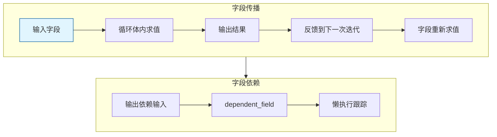

# Repeat Zone 字段传播

> Repeat Zone 中字段（Field）的传播和处理机制

---

## 🎯 核心概念



---

## 📦 字段支持声明

### Socket 字段声明

```cpp
static void node_declare(NodeDeclarationBuilder &b)
{
    for (const int i : IndexRange(output_storage.items_num)) {
        const NodeRepeatItem &item = output_storage.items[i];
        const eNodeSocketDatatype socket_type = eNodeSocketDatatype(item.socket_type);
        
        auto &input_decl = b.add_input(socket_type, name, identifier);
        auto &output_decl = b.add_output(socket_type, name, identifier)
            .align_with_previous();
        
        // 支持字段的类型
        if (socket_type_supports_attributes(socket_type)) {
            // 输入支持字段
            input_decl.supports_field();
            
            // 输出依赖输入字段
            output_decl.dependent_field({input_decl.index()});
        }
        
        // 动态结构类型（用于字段传播）
        input_decl.structure_type(StructureType::Dynamic);
        output_decl.structure_type(StructureType::Dynamic);
    }
}
```

---

## 🔄 字段传播机制

### 1. 输入字段进入循环

```
输入字段 (Field<float3>)
    ↓
Repeat Input Node
    ↓
在循环体内求值
```

### 2. 循环体内字段运算

```
Iteration 0:
    Position Field → 求值 → 结果 Geometry
    
Iteration 1:
    新 Position Field → 求值 → 新结果
```

### 3. 输出字段反馈

```cpp
// 每次迭代的输出作为下一次迭代的输入
for (const int iter_i : lf_body_nodes.index_range().drop_back(1)) {
    lf::FunctionNode &lf_node = *lf_body_nodes[iter_i];
    lf::FunctionNode &lf_next_node = *lf_body_nodes[iter_i + 1];
    
    for (const int i : IndexRange(num_repeat_items)) {
        // 字段值传递
        lf_graph.add_link(
            lf_node.output(body_fn_.indices.outputs.main[i]),
            lf_next_node.input(body_fn_.indices.inputs.main[i + body_inputs_offset]));
    }
}
```

---

## 🎨 字段使用示例

### 示例：迭代位移

```
Repeat Input (Iterations=5)
    Position Field (implicit)
    Offset Field (0, 0.1, 0)
    
    ↓
    
Set Position
    Position = Position + Offset * Iteration
    
    ↓
    
Repeat Output
    Geometry (新位置)
```

效果：每次迭代向上移动 0.1 单位

---

## ✅ 检查清单

- [ ] 理解 supports_field() 的作用
- [ ] 掌握 dependent_field() 的依赖声明
- [ ] 了解 StructureType::Dynamic 的用途
- [ ] 理解字段在迭代中的传播
