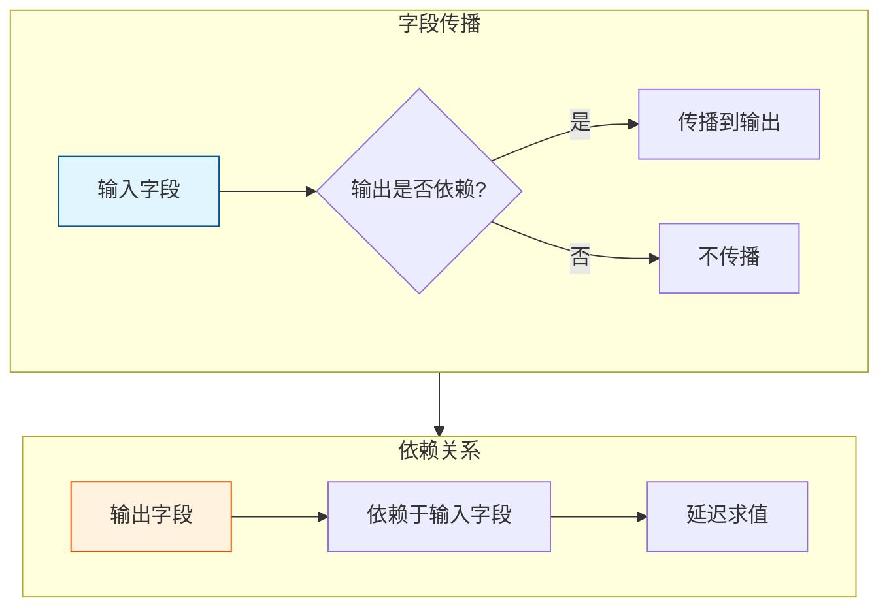
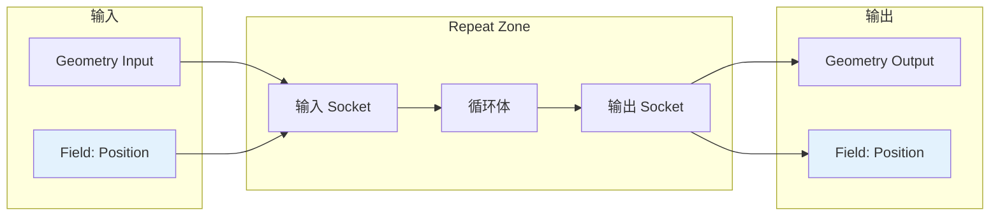
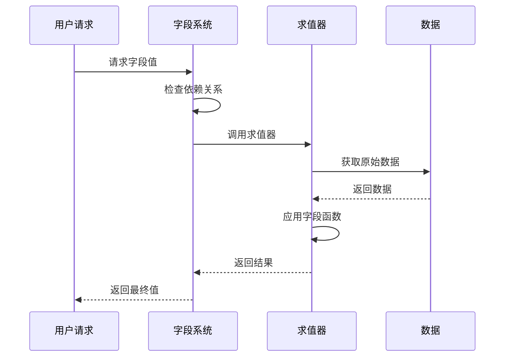

# Repeat Zone 字段传播

> Repeat Zone 中字段（Field）的传递和依赖关系处理

---

## 📖 源码注释翻译与解释

### 字段传播概念

在 Blender 几何节点中，**字段（Field）** 是一种延迟计算的属性引用。字段传播决定了哪些输入会影响哪些输出，这对于优化计算和避免不必要的求值至关重要。

**核心问题：**
- 输入字段如何影响输出？
- 哪些输出依赖于哪些输入？
- 如何优化字段求值？

---

## 🎯 核心概念



---

## 📦 字段支持声明

### 输入节点声明

**源码位置：** `node_geo_repeat.cc:95~105`

```cpp
static void node_declare(NodeDeclarationBuilder &b)
{
    // ... 其他声明 ...
    
    for (const int i : IndexRange(output_storage.items_num)) {
        const NodeRepeatItem &item = output_storage.items[i];
        const eNodeSocketDatatype socket_type = eNodeSocketDatatype(item.socket_type);
        
        // 输入 Socket
        auto &input_decl = b.add_input(socket_type, name, identifier)
            .socket_name_ptr(&tree->id, *RepeatItemsAccessor::item_srna, &item, "name");
        
        // 输出 Socket
        auto &output_decl = b.add_output(socket_type, name, identifier)
            .align_with_previous();
        
        // 字段支持声明
        if (socket_type_supports_attributes(socket_type)) {
            input_decl.supports_field();              // 输入支持字段
            output_decl.dependent_field({input_decl.index()});  // 输出依赖输入
        }
        
        // 动态结构类型
        input_decl.structure_type(StructureType::Dynamic);
        output_decl.structure_type(StructureType::Dynamic);
    }
}
```

**关键方法：**

| 方法 | 作用 |
|------|------|
| `supports_field()` | 声明此输入可以接受字段 |
| `dependent_field({index})` | 声明输出依赖于指定输入的字段 |
| `structure_type(StructureType::Dynamic)` | 动态结构，支持字段传播 |

---

## 🔧 字段依赖关系

### 依赖声明详解

```cpp
// 输入支持字段
input_decl.supports_field();

// 输出依赖于输入
output_decl.dependent_field({input_decl.index()});
```

**含义：**
- 如果输入是字段，输出也是字段
- 输出的字段值依赖于输入的字段值
- 系统会建立这种依赖关系图

**图示：**



---

## 🎨 字段传播示例

### 示例 1：位置字段传播

**节点图：**

```
[Mesh] ──> [Repeat Input]
    │           │
    │           v
    │      [Set Position]
    │      [Offset: (0, Iteration*0.1, 0)]
    │           │
    │           v
    │      [Repeat Output] ──> [Mesh Output]
    │           │
    └───────────┘
```

**字段传播：**
1. 输入 Mesh 带有 `position` 字段
2. `Set Position` 节点修改位置字段
3. 输出 Mesh 保留修改后的 `position` 字段
4. 每次迭代累积偏移

### 示例 2：自定义属性传播

**节点图：**

```
[Mesh] ──> [Repeat Input]
    │           │
    │           v
    │      [Store Named Attribute]
    │      [Name: "iteration_count"]
    │      [Value: Iteration]
    │           │
    │           v
    │      [Repeat Output] ──> [Mesh Output]
    │           │
    └───────────┘
```

**字段传播：**
1. 每次迭代存储当前迭代索引到属性
2. 属性在迭代间累积
3. 最终 Mesh 包含所有迭代的信息

---

## 📊 字段类型支持

### 支持字段的 Socket 类型

| 类型 | 支持字段 | 说明 |
|------|----------|------|
| `SOCK_GEOMETRY` | ✅ | 几何体带有属性字段 |
| `SOCK_FLOAT` | ✅ | 可作为标量字段 |
| `SOCK_INT` | ✅ | 可作为整数字段 |
| `SOCK_VECTOR` | ✅ | 可作为向量字段 |
| `SOCK_BOOLEAN` | ✅ | 可作为布尔字段 |
| `SOCK_STRING` | ❌ | 字符串不支持字段 |
| `SOCK_OBJECT` | ❌ | 对象引用不支持 |
| `SOCK_IMAGE` | ❌ | 图像不支持 |

### 检查字段支持

```cpp
// 源码：node_geo_repeat.cc:100
if (socket_type_supports_attributes(socket_type)) {
    input_decl.supports_field();
    output_decl.dependent_field({input_decl.index()});
}
```

**函数实现：**

```cpp
bool socket_type_supports_attributes(eNodeSocketDatatype type)
{
    switch (type) {
        case SOCK_GEOMETRY:
        case SOCK_FLOAT:
        case SOCK_INT:
        case SOCK_VECTOR:
        case SOCK_BOOLEAN:
            return true;
        default:
            return false;
    }
}
```

---

## 🔄 字段求值流程

### 延迟求值机制



### Repeat Zone 中的字段求值

```cpp
// 概念性伪代码
void evaluate_repeat_zone() {
    // 1. 收集所有字段输入
    Map<std::string, Field> input_fields;
    for (const auto &input : inputs) {
        if (input.is_field()) {
            input_fields[input.name] = input.get_field();
        }
    }
    
    // 2. 每次迭代更新字段
    for (int i = 0; i < iterations; i++) {
        // 创建字段上下文
        FieldContext context;
        context.set_iteration(i);
        
        // 求值字段
        for (auto &[name, field] : input_fields) {
            Value value = field.evaluate(context);
            // 使用 value 进行处理...
        }
    }
}
```

---

## ⚠️ 字段传播限制

### 限制 1：迭代间字段不累积

```
问题：每次迭代的字段是独立的

迭代 0：position = (0, 0, 0)
迭代 1：position = (0, 0.1, 0)  // 不是 (0, 0, 0) + offset
```

**解决：** 使用几何体的实际属性存储累积值

### 限制 2：字段上下文隔离

```cpp
// 每次迭代有独立的字段上下文
for (int i = 0; i < iterations; i++) {
    RepeatZoneComputeContext context(parent_context, zone, i);
    // 字段在此上下文中求值
}
```

### 限制 3：动态结构类型

```cpp
// 必须使用 Dynamic 结构类型才能支持字段
input_decl.structure_type(StructureType::Dynamic);
output_decl.structure_type(StructureType::Dynamic);
```

---

## 💡 最佳实践

### 1. 明确字段依赖

```cpp
// 好：明确声明依赖
output_decl.dependent_field({input_decl.index()});

// 避免：隐式依赖（难以优化）
// 不声明依赖关系
```

### 2. 减少字段传播

```
// 不好：所有输出都依赖所有输入
for (input : inputs) {
    for (output : outputs) {
        output.dependent_field({input.index()});
    }
}

// 好：只声明实际依赖
output.dependent_field({relevant_input.index()});
```

### 3. 使用几何体属性存储状态

```
// 需要跨迭代累积的数据，使用属性
[Store Named Attribute]  // 存储到几何体
[Name: "accumulated_value"]

[Named Attribute]        // 下一迭代读取
[Name: "accumulated_value"]
```

---

## ✅ 检查清单

- [ ] 理解字段（Field）的基本概念
- [ ] 掌握 `supports_field()` 和 `dependent_field()` 的用法
- [ ] 了解哪些 Socket 类型支持字段
- [ ] 理解字段传播的方向（输入→输出）
- [ ] 了解字段求值的延迟机制
- [ ] 掌握字段传播的限制和解决方法

---

## 📁 相关文件

| 文件 | 路径 |
|------|------|
| node_geo_repeat.cc | `source/blender/nodes/geometry/nodes/node_geo_repeat.cc` |
| NOD_socket_declarations.hh | `source/blender/nodes/NOD_socket_declarations.hh` |
| BKE_geometry_fields.hh | `source/blender/blenkernel/BKE_geometry_fields.hh` |

---

## 🔗 相关文档

- [01_RepeatZone_Overview.md](01_RepeatZone_Overview.md) - 总览
- [03_RepeatZone_SocketItems.md](03_RepeatZone_SocketItems.md) - 动态 Socket 项
- [04_RepeatZone_IterationControl.md](04_RepeatZone_IterationControl.md) - 迭代控制
