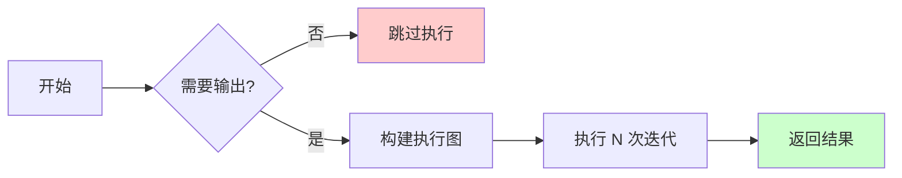

# Repeat Zone vs Simulation Zone 对比

> Repeat Zone 和 Simulation Zone 的详细对比分析

---

## 📖 源码注释翻译与解释

### 两种 Zone 的设计目标

| Zone 类型 | 设计目标 | 核心特性 |
|-----------|----------|----------|
| **Repeat Zone** | 固定次数的迭代计算 | 延迟执行、可跳过、检查索引 |
| **Simulation Zone** | 时间步进的物理模拟 | 状态持久化、每帧执行、Bake |

---

## 🎯 核心差异概览


---

## 📊 详细对比表

| 特性 | Repeat Zone | Simulation Zone |
|------|-------------|-----------------|
| **执行触发** | 按需执行（延迟） | 每帧必须执行 |
| **执行次数** | 固定整数（Iterations） | 每帧一次 |
| **状态传递** | 迭代间传递 | 时间步间传递 |
| **状态存储** | 内存中（临时） | 磁盘/内存（持久） |
| **延迟执行** | ✅ 支持 | ❌ 不支持 |
| **跳过迭代** | ✅ 可以 | ❌ 不可以 |
| **检查索引** | ✅ 支持 | ❌ 不支持 |
| **Bake 功能** | ❌ 不支持 | ✅ 支持 |
| **典型用途** | 迭代变形 | 物理模拟 |

---

## 🔧 执行模型对比

### Repeat Zone 执行模型



**特点：**
- 只在需要输出时执行
- 可以跳过整个 Zone
- 迭代次数在开始时确定

**源码体现：**

```cpp
// geometry_nodes_repeat_zone.cc
void execute_impl(...) {
    // 首次执行时才构建图
    if (!eval_storage.graph_executor) {
        initialize_execution_graph(...);
    }
    // 执行...
}
```

### Simulation Zone 执行模型


**特点：**
- 每帧必须执行
- 状态在帧间持久化
- 不能跳过（否则模拟断裂）

**源码体现：**

```cpp
// geometry_nodes_simulation_zone.cc
void execute_impl(...) {
    // 必须执行，不能跳过
    // 读取上一帧状态
    auto state = load_state();
    
    // 执行模拟
    auto new_state = simulate_step(state);
    
    // 保存状态供下一帧使用
    save_state(new_state);
}
```

---

## 💾 状态管理对比

### Repeat Zone 状态

```cpp
// 临时状态，执行后丢弃
struct RepeatEvalStorage {
    LinearAllocator<> allocator;
    VectorSet<lf::FunctionNode *> lf_body_nodes;
    lf::Graph graph;
    // ...
};

// 生命周期：一次执行
void execute_impl(...) {
    RepeatEvalStorage storage;
    // 构建图、执行、自动销毁
}
```

**特点：**
- 临时存储
- 执行后释放
- 不持久化

### Simulation Zone 状态

```cpp
// 持久化状态，跨帧保存
struct SimulationState {
    Map<std::string, GeometrySet> geometries;
    Map<std::string, GArray> attributes;
    // ...
};

// 生命周期：整个动画
void save_state(const SimulationState &state) {
    // 保存到磁盘或内存
    write_to_disk(state);
}

SimulationState load_state() {
    // 从磁盘或内存读取
    return read_from_disk();
}
```

**特点：**
- 持久化存储
- 跨帧保持
- 支持 Bake 到磁盘

---

## 🎨 使用场景对比

### Repeat Zone 适用场景

#### 场景 1：多次细分

```
目标：将网格细分 5 次

[Mesh] ──> [Repeat (Iterations=5)]
              │
              ├──> [Subdivision Surface]
              │
              └──> [Output]

结果：非常平滑的高分辨率网格
```

**为什么用 Repeat Zone：**
- 固定次数（5次）
- 不需要状态持久化
- 可以延迟执行（如果输出未使用）

#### 场景 2：迭代噪声

```
目标：累积多层噪声

[Points] ──> [Repeat (Iterations=10)]
               │
               ├──> [Noise Texture]
               ├──> [Displace]
               │
               └──> [Output]

结果：复杂的地形效果
```

**为什么用 Repeat Zone：**
- 固定层数（10层）
- 每层基于前一层
- 不需要跨帧状态

---

### Simulation Zone 适用场景

#### 场景 1：粒子系统

```
目标：模拟粒子运动

[Emitter] ──> [Simulation Zone]
                │
                ├──> [Force Field]
                ├──> [Collision]
                ├──> [Update Position]
                │
                └──> [Particles]

结果：持续的粒子动画
```

**为什么用 Simulation Zone：**
- 需要状态持久化（粒子位置、速度）
- 每帧必须更新
- 支持 Bake

#### 场景 2：布料模拟

```
目标：模拟布料摆动

[Mesh] ──> [Simulation Zone]
             │
             ├──> [Gravity]
             ├──> [Wind]
             ├──> [Collision]
             ├──> [Solve Constraints]
             │
             └──> [Deformed Mesh]

结果：自然的布料动画
```

**为什么用 Simulation Zone：**
- 需要前一帧的布料状态
- 时间连续性很重要
- 需要 Bake 功能

---

## ⚡ 性能对比

### Repeat Zone 性能

| 方面 | 特点 |
|------|------|
| **内存** | 临时分配，执行后释放 |
| **计算** | 只在需要时执行 |
| **优化** | 可跳过整个 Zone |
| **缓存** | 每次重新构建执行图 |

**性能提示：**

```cpp
// 大迭代次数时发送线程提示
if (iterations >= 10) {
    lazy_threading::send_hint();
}
```

### Simulation Zone 性能

| 方面 | 特点 |
|------|------|
| **内存** | 状态持久化，占用较大 |
| **计算** | 每帧必须执行 |
| **优化** | 可 Bake 避免重复计算 |
| **缓存** | 状态缓存，快速读取 |

**性能提示：**

```cpp
// Bake 后直接从磁盘读取
if (is_baked) {
    return load_baked_state(frame);
}
```

---

## 🔍 代码结构对比

### 文件结构

| 组件 | Repeat Zone | Simulation Zone |
|------|-------------|-----------------|
| **节点定义** | `node_geo_repeat.cc` | `node_geo_simulation.cc` |
| **执行逻辑** | `geometry_nodes_repeat_zone.cc` | `geometry_nodes_simulation_zone.cc` |
| **头文件** | `NOD_geo_repeat.hh` | `NOD_geo_simulation.hh` |
| **DNA 结构** | `NodeGeometryRepeatOutput` | `NodeGeometrySimulationOutput` |

### 类结构对比

```cpp
// Repeat Zone
class LazyFunctionForRepeatZone : public LazyFunction {
    void execute_impl(lf::Params &params, const lf::Context &context) const override;
    // 临时存储，执行后丢弃
};

// Simulation Zone
class LazyFunctionForSimulationZone : public LazyFunction {
    void execute_impl(lf::Params &params, const lf::Context &context) const override;
    // 加载/保存持久化状态
    void load_state(...);
    void save_state(...);
};
```

---

## 🎯 选择指南

### 什么时候用 Repeat Zone？

✅ **使用 Repeat Zone：**
- 需要固定次数的迭代
- 不需要状态持久化
- 可以延迟执行
- 迭代间数据通过 socket 传递

❌ **不要用 Repeat Zone：**
- 需要每帧更新
- 状态需要跨帧保持
- 需要 Bake 功能
- 时间连续性很重要

### 什么时候用 Simulation Zone？

✅ **使用 Simulation Zone：**
- 物理模拟（粒子、布料、流体）
- 需要状态持久化
- 每帧必须更新
- 需要 Bake 功能

❌ **不要用 Simulation Zone：**
- 只需要固定次数迭代
- 不需要跨帧状态
- 可以延迟执行

---

## 🔄 混合使用

### Repeat Zone 内嵌 Simulation Zone

```
[Repeat (Iterations=3)]
    │
    ├──> [Simulation Zone]
    │       │
    │       ├──> [Particle Sim]
    │       │
    │       └──> [Particles]
    │
    └──> [Output]

效果：重复运行 3 次独立的粒子模拟
```

### Simulation Zone 内嵌 Repeat Zone

```
[Simulation Zone]
    │
    ├──> [Physics Update]
    │
    ├──> [Repeat (Iterations=5)]
    │       │
    │       ├──> [Subdivision]
    │       │
    │       └──> [Smoothed Mesh]
    │
    └──> [Output]

效果：每帧物理模拟后，细分 5 次
```

---

## ✅ 检查清单

### Repeat Zone 检查清单

- [ ] 迭代次数是否固定？
- [ ] 是否可以延迟执行？
- [ ] 状态是否只需要在迭代间传递？
- [ ] 是否需要检查特定迭代？

### Simulation Zone 检查清单

- [ ] 是否需要每帧更新？
- [ ] 状态是否需要跨帧持久化？
- [ ] 是否需要 Bake 功能？
- [ ] 是否是物理模拟？

---

## 📁 相关文件

| Zone 类型 | 文件 | 路径 |
|-----------|------|------|
| Repeat | node_geo_repeat.cc | `source/blender/nodes/geometry/nodes/node_geo_repeat.cc` |
| Repeat | geometry_nodes_repeat_zone.cc | `source/blender/nodes/intern/geometry_nodes_repeat_zone.cc` |
| Simulation | node_geo_simulation.cc | `source/blender/nodes/geometry/nodes/node_geo_simulation.cc` |
| Simulation | geometry_nodes_simulation_zone.cc | `source/blender/nodes/intern/geometry_nodes_simulation_zone.cc` |

---

## 🔗 相关文档

- [01_RepeatZone_Overview.md](01_RepeatZone_Overview.md) - Repeat Zone 总览
- [02_RepeatZone_LazyFunction.md](02_RepeatZone_LazyFunction.md) - 懒执行系统
- [07_RepeatZone_DataStructures.md](07_RepeatZone_DataStructures.md) - 数据结构详解
