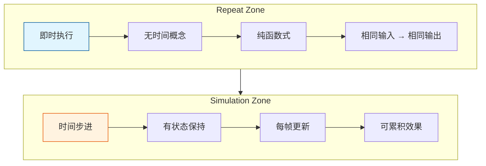

# Repeat Zone vs Simulation Zone 对比

> Repeat Zone 和 Simulation Zone 的区别和适用场景

---

## 🎯 核心区别



---

## 📊 特性对比

| 特性 | Repeat Zone | Simulation Zone |
|-----|-------------|-----------------|
| **执行时机** | 即时 | 每帧 |
| **状态保持** | 无 | 有 |
| **时间概念** | 无 | 有（时间步长） |
| **确定性** | 完全确定 | 依赖前一帧状态 |
| **性能** | 单次计算 | 持续计算 |
| **用途** | 迭代处理 | 物理模拟、动画 |

---

## 🎨 使用场景对比

### Repeat Zone 适用场景

1. **多次细分**
   ```
   目标: 细分网格3次
   方式: Repeat Zone (Iterations=3)
   ```

2. **迭代变形**
   ```
   目标: 应用噪声10次
   方式: Repeat Zone (Iterations=10)
   ```

3. **递归生成**
   ```
   目标: 分形结构
   方式: Repeat Zone (Iterations=5)
   ```

### Simulation Zone 适用场景

1. **粒子系统**
   ```
   目标: 粒子运动模拟
   方式: Simulation Zone (每帧更新位置)
   ```

2. **物理模拟**
   ```
   目标: 布料、刚体
   方式: Simulation Zone (时间积分)
   ```

3. **生长动画**
   ```
   目标: 植物生长
   方式: Simulation Zone (累积生长)
   ```

---

## 🔄 执行流程对比

### Repeat Zone

```
第1帧:
    输入 → 迭代1 → 迭代2 → ... → 迭代N → 输出
    
第2帧:
    输入 → 迭代1 → 迭代2 → ... → 迭代N → 输出
    
（每次重新计算）
```

### Simulation Zone

```
第1帧:
    初始状态 → 模拟步进 → 保存状态 → 输出
    
第2帧:
    读取状态 → 模拟步进 → 保存状态 → 输出
    
（状态持续累积）
```

---

## ✅ 选择指南

| 需求 | 选择 |
|-----|------|
| 需要固定次数处理 | Repeat Zone |
| 需要时间累积效果 | Simulation Zone |
| 纯几何操作 | Repeat Zone |
| 物理/动画效果 | Simulation Zone |
| 需要确定性结果 | Repeat Zone |
| 需要交互响应 | Simulation Zone |

---

## 📁 源码文件对比

| Zone | 节点定义 | 执行逻辑 |
|-----|---------|---------|
| Repeat | `node_geo_repeat.cc` | `geometry_nodes_repeat_zone.cc` |
| Simulation | `node_geo_simulation.cc` | `geometry_nodes_simulation_zone.cc` |
