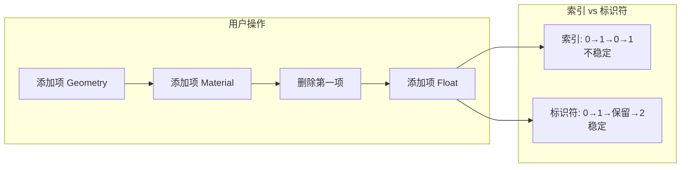
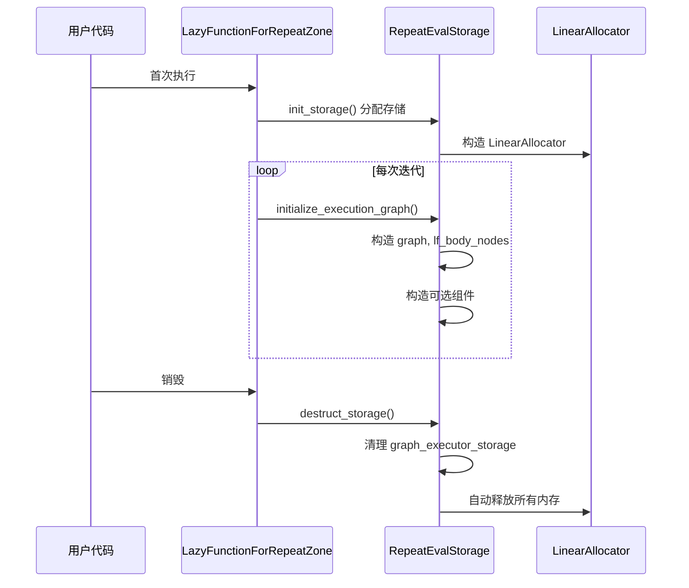
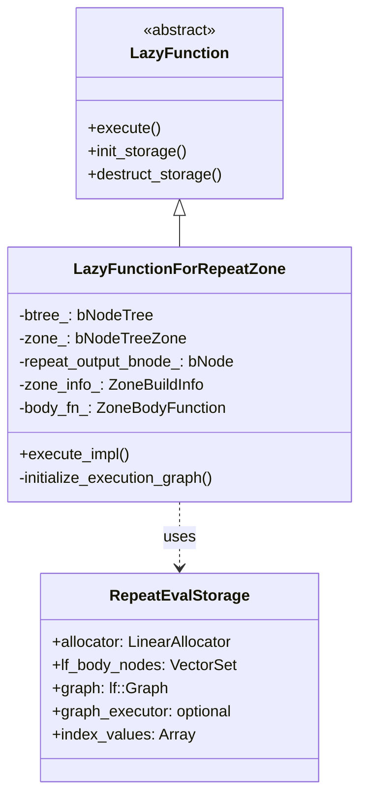
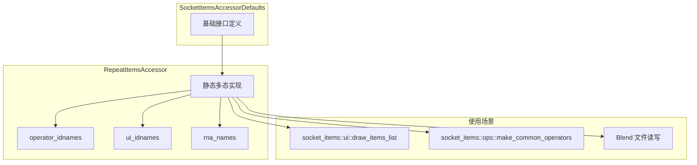
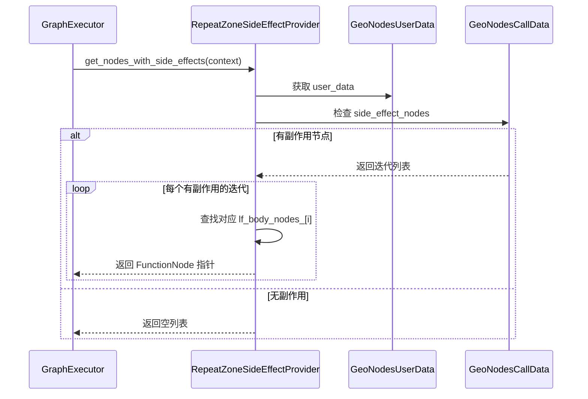
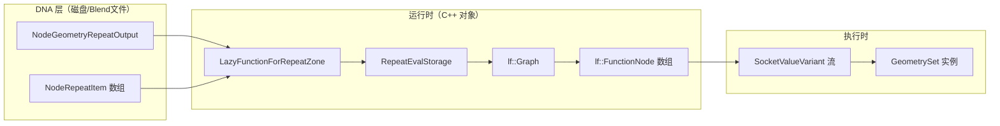
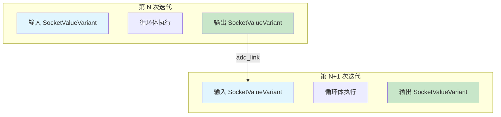
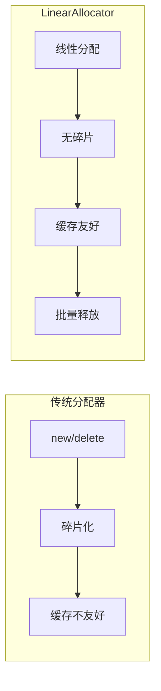

# Repeat Zone 数据结构详解

## 概述

Repeat Zone 的实现依赖于多个精心设计的 C++ 数据结构，这些数据结构共同协作实现循环迭代功能。本文档详细分析这些数据结构的定义、用途和相互关系。

---

## 1. DNA 层数据结构

### 1.1 NodeRepeatItem - 重复项定义

```cpp
struct NodeRepeatItem {
    char *name = nullptr;           // 显示名称（国际化）
    short socket_type = 0;          // eNodeSocketDatatype 枚举值
    char _pad[2] = {};              // 内存对齐填充
    int identifier = 0;             // 唯一标识符（持久化）
};
```

**关键设计要点：**

| 字段 | 类型 | 说明 |
|------|------|------|
| `name` | `char*` | 动态分配的字符串，支持国际化翻译 |
| `socket_type` | `short` | Socket 数据类型（几何体、整数、浮点等） |
| `identifier` | `int` | 唯一标识符，即使重新排序也保持不变 |

**为什么需要 identifier？**



### 1.2 NodeGeometryRepeatInput - 输入节点存储

```cpp
struct NodeGeometryRepeatInput {
    DNA_DEFINE_CXX_METHODS(NodeGeometryRepeatInput)
    int32_t output_node_id = 0;     // 对应输出节点的 bNode.identifier
};
```

**设计意图：**
- 轻量级结构，仅存储与输出节点的关联
- 使用 `output_node_id` 而非指针，确保 DNA 兼容性
- 支持延迟解析，在运行时通过 ID 查找对应节点

### 1.3 NodeGeometryRepeatOutput - 输出节点存储

```cpp
struct NodeGeometryRepeatOutput {
    DNA_DEFINE_CXX_METHODS(NodeGeometryRepeatOutput)
    
    NodeRepeatItem *items = nullptr;      // 动态数组指针
    int items_num = 0;                     // 项数量
    int active_index = 0;                  // UI 选中索引
    int next_identifier = 0;               // 下一个可用标识符
    int inspection_index = 0;              // 检查特定迭代
    
    // C++ 辅助方法
    Span<NodeRepeatItem> items_span() const;
    MutableSpan<NodeRepeatItem> items_span();
};
```

**内存布局：**

```mermaid
flowchart TB
    subgraph "NodeGeometryRepeatOutput"
        A[items: NodeRepeatItem*]
        B[items_num: int = 3]
        C[active_index: int = 1]
        D[next_identifier: int = 3]
        E[inspection_index: int = -1]
    end
    
    subgraph "堆上分配的 items 数组"
        F[items[0]<br/>name: "Geometry"<br/>socket_type: SOCK_GEOMETRY<br/>identifier: 0]
        G[items[1]<br/>name: "Count"<br/>socket_type: SOCK_INT<br/>identifier: 1]
        H[items[2]<br/>name: "Radius"<br/>socket_type: SOCK_FLOAT<br/>identifier: 2]
    end
    
    A --> F
    A --> G
    A --> H
```

---

## 2. 运行时数据结构

### 2.1 RepeatEvalStorage - 评估存储

这是 Repeat Zone 执行时的核心数据结构，存储在 `LinearAllocator` 中：

```cpp
struct RepeatEvalStorage {
    // 内存分配器
    LinearAllocator<> allocator;
    
    // 循环体节点追踪
    VectorSet<lf::FunctionNode *> lf_body_nodes;
    
    // 延迟执行图
    lf::Graph graph;
    
    // 可选组件（按需构造）
    std::optional<LazyFunctionForLogicalOr> or_function;
    std::optional<RepeatZoneSideEffectProvider> side_effect_provider;
    std::optional<RepeatBodyNodeExecuteWrapper> body_execute_wrapper;
    std::optional<lf::GraphExecutor> graph_executor;
    
    // 迭代索引值缓存
    Array<SocketValueVariant> index_values;
    
    // 执行器存储
    void *graph_executor_storage = nullptr;
    
    // 多线程标志
    bool multi_threading_enabled = false;
    
    // 参数映射
    Vector<int> input_index_map;
    Vector<int> output_index_map;
};
```

**详细字段分析：**

| 字段 | 类型 | 用途 |
|------|------|------|
| `allocator` | `LinearAllocator<>` | 高效的线性内存分配器 |
| `lf_body_nodes` | `VectorSet` | 追踪所有循环体节点，用于上下文设置 |
| `graph` | `lf::Graph` | 延迟执行图，包含所有迭代节点 |
| `or_function` | `std::optional` | 边界链接使用的逻辑或函数 |
| `side_effect_provider` | `std::optional` | 副作用节点管理 |
| `body_execute_wrapper` | `std::optional` | 循环体执行包装器 |
| `graph_executor` | `std::optional` | 图执行器实例 |
| `index_values` | `Array<SocketValueVariant>` | 预计算的迭代索引值 |
| `graph_executor_storage` | `void*` | 执行器的私有存储 |
| `multi_threading_enabled` | `bool` | 是否启用多线程 |
| `input_index_map` | `Vector<int>` | 输入参数索引映射 |
| `output_index_map` | `Vector<int>` | 输出参数索引映射 |

**内存生命周期：**



### 2.2 LazyFunctionForRepeatZone - 延迟函数实现

```cpp
class LazyFunctionForRepeatZone : public LazyFunction {
 private:
    const bNodeTree &btree_;                    // 节点树引用
    const bke::bNodeTreeZone &zone_;            // Zone 信息
    const bNode &repeat_output_bnode_;          // 输出节点引用
    const ZoneBuildInfo &zone_info_;            // Zone 构建信息
    const ZoneBodyFunction &body_fn_;           // 循环体函数

 public:
    LazyFunctionForRepeatZone(
        const bNodeTree &btree,
        const bke::bNodeTreeZone &zone,
        ZoneBuildInfo &zone_info,
        const ZoneBodyFunction &body_fn);

    void *init_storage(LinearAllocator<> &allocator) const override;
    void destruct_storage(void *storage) const override;
    void execute_impl(lf::Params &params, const lf::Context &context) const override;
    
 private:
    void initialize_execution_graph(
        lf::Params &params,
        RepeatEvalStorage &eval_storage,
        const NodeGeometryRepeatOutput &node_storage,
        GeoNodesUserData &user_data,
        GeoNodesLocalUserData &local_user_data) const;
};
```

**类关系图：**



---

## 3. 辅助数据结构

### 3.1 RepeatItemsAccessor - 项访问器

```cpp
struct RepeatItemsAccessor : public socket_items::SocketItemsAccessorDefaults {
    using ItemT = NodeRepeatItem;
    static StructRNA **item_srna;
    static int node_type;
    static constexpr StringRefNull node_idname = "GeometryNodeRepeatOutput";
    static constexpr bool has_type = true;
    static constexpr bool has_name = true;
    
    struct operator_idnames {
        static constexpr StringRefNull add_item = "NODE_OT_repeat_zone_item_add";
        static constexpr StringRefNull remove_item = "NODE_OT_repeat_zone_item_remove";
        static constexpr StringRefNull move_item = "NODE_OT_repeat_zone_item_move";
    };
    
    struct ui_idnames {
        static constexpr StringRefNull list = "DATA_UL_repeat_zone_state";
    };
    
    struct rna_names {
        static constexpr StringRefNull items = "repeat_items";
        static constexpr StringRefNull active_index = "active_index";
    };

    static socket_items::SocketItemsRef<NodeRepeatItem> get_items_from_node(bNode &node);
    static void copy_item(const NodeRepeatItem &src, NodeRepeatItem &dst);
    static void destruct_item(NodeRepeatItem *item);
    static void blend_write_item(BlendWriter *writer, const ItemT &item);
    static void blend_read_data_item(BlendDataReader *reader, ItemT &item);
    static eNodeSocketDatatype get_socket_type(const NodeRepeatItem &item);
    static char **get_name(NodeRepeatItem &item);
    static bool supports_socket_type(const eNodeSocketDatatype socket_type, const int ntree_type);
    static void init_with_socket_type_and_name(
        bNode &node, NodeRepeatItem &item, 
        const eNodeSocketDatatype socket_type, const char *name);
    static std::string socket_identifier_for_item(const NodeRepeatItem &item);
};
```

**CRTP 模式应用：**



### 3.2 RepeatBodyNodeExecuteWrapper - 执行包装器

```cpp
class RepeatBodyNodeExecuteWrapper : public lf::GraphExecutorNodeExecuteWrapper {
 public:
    const bNode *repeat_output_bnode_ = nullptr;
    VectorSet<lf::FunctionNode *> *lf_body_nodes_ = nullptr;

    void execute_node(
        const lf::FunctionNode &node,
        lf::Params &params,
        const lf::Context &context) const override;
};
```

**职责：**
- 为每次迭代设置正确的 `ComputeContext`
- 支持正确的日志记录
- 避免为每次迭代创建单独的 `LazyFunction`

### 3.3 RepeatZoneSideEffectProvider - 副作用提供者

```cpp
class RepeatZoneSideEffectProvider : public lf::GraphExecutorSideEffectProvider {
 public:
    const bNode *repeat_output_bnode_ = nullptr;
    Span<lf::FunctionNode *> lf_body_nodes_;

    Vector<const lf::FunctionNode *> get_nodes_with_side_effects(
        const lf::Context &context) const override;
};
```

**副作用处理流程：**



---

## 4. 数据流与转换

### 4.1 静态数据 → 运行时数据



### 4.2 迭代数据传递



---

## 5. 关键设计决策

### 5.1 为什么使用 VectorSet 而不是 Vector？

```cpp
VectorSet<lf::FunctionNode *> lf_body_nodes;
```

**原因：**
1. **唯一性保证**：确保每个循环体节点只被添加一次
2. **快速查找**：`O(1)` 时间复杂度检查节点是否存在
3. **索引映射**：通过 `index_of_try()` 获取迭代索引

### 5.2 为什么使用 std::optional？

```cpp
std::optional<lf::GraphExecutor> graph_executor;
```

**原因：**
1. **延迟构造**：避免在构造函数中复杂初始化
2. **生命周期管理**：明确表达"可能不存在"的语义
3. **异常安全**：构造失败时不会留下部分初始化状态

### 5.3 为什么分离 Iterations 输入？

```cpp
// Iterations 输入在图外处理
const int main_inputs_offset = 1;
const int body_inputs_offset = 1;
```

**原因：**
1. **图结构简化**：执行图不需要处理动态的迭代次数
2. **提前验证**：可以在构建图之前验证迭代次数
3. **性能优化**：支持基于迭代次数的优化决策

---

## 6. 内存管理策略

### 6.1 LinearAllocator 的优势

```cpp
LinearAllocator<> allocator;
```



### 6.2 存储生命周期

```cpp
void *init_storage(LinearAllocator<> &allocator) const override {
    return allocator.construct<RepeatEvalStorage>().release();
}

void destruct_storage(void *storage) const override {
    RepeatEvalStorage *s = static_cast<RepeatEvalStorage *>(storage);
    if (s->graph_executor_storage) {
        s->graph_executor->destruct_storage(s->graph_executor_storage);
    }
    std::destroy_at(s);
    // LinearAllocator 会自动回收所有内存
}
```

---

## 7. 总结

Repeat Zone 的数据结构设计体现了以下原则：

1. **分离关注点**：DNA 层、运行时层、执行层清晰分离
2. **延迟初始化**：使用 `std::optional` 和延迟构造减少开销
3. **内存效率**：`LinearAllocator` 提供高效的内存管理
4. **类型安全**：强类型系统确保数据一致性
5. **可扩展性**：访问器模式支持灵活的功能扩展
