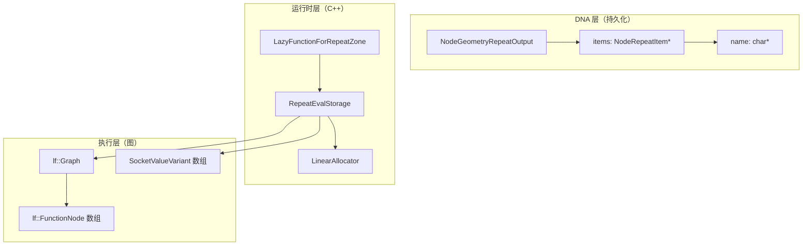
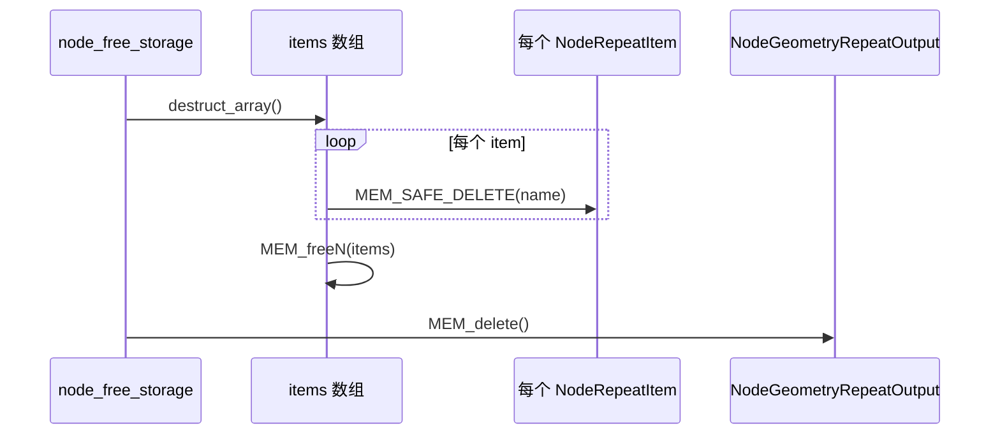
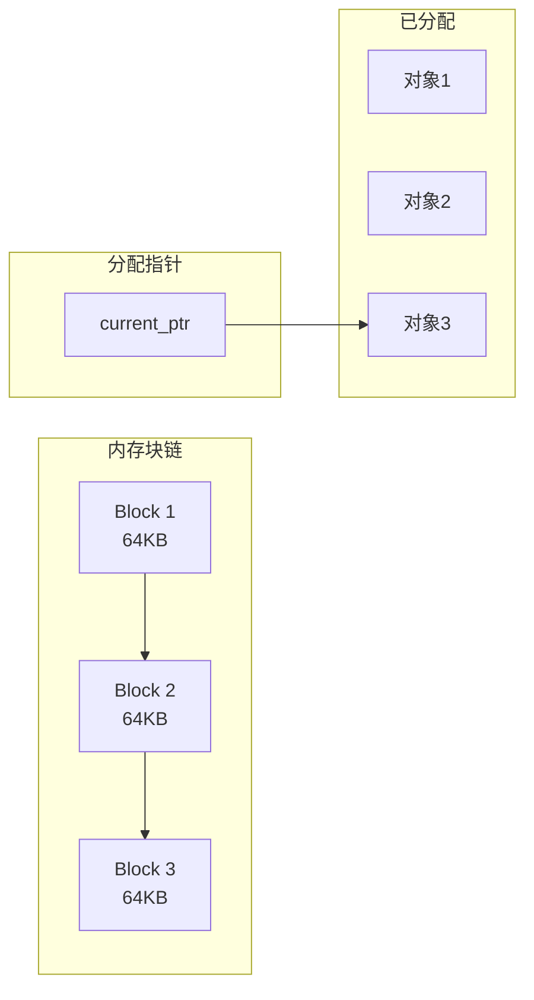
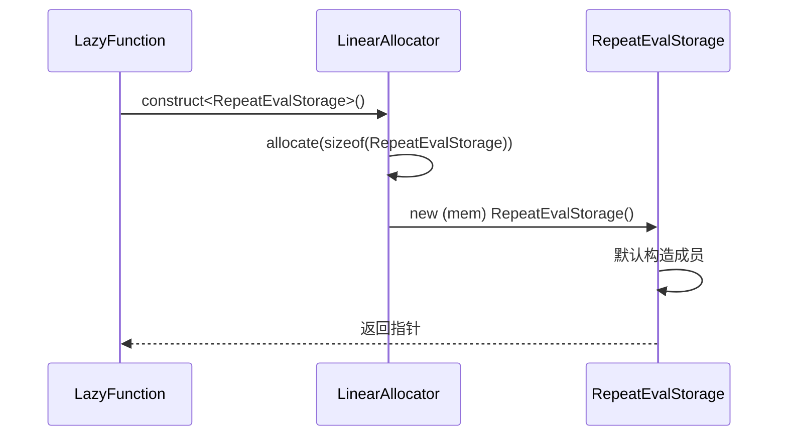
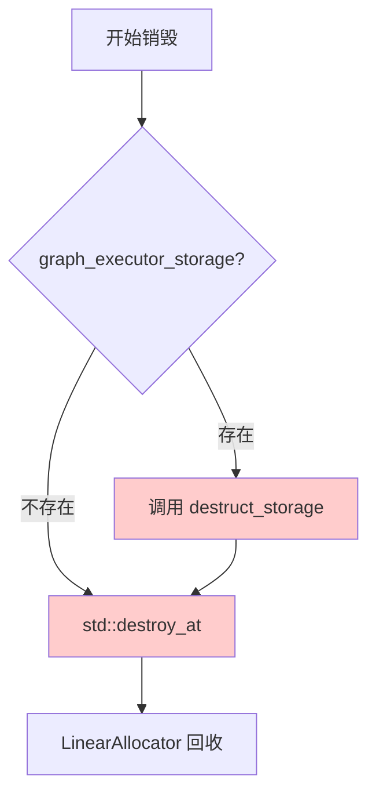
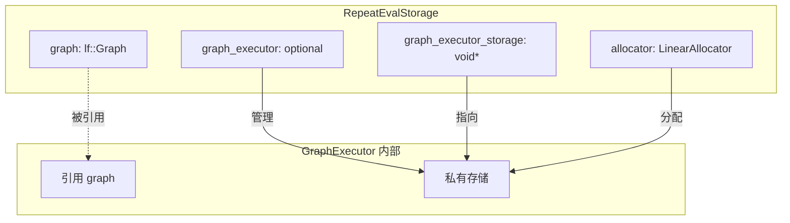
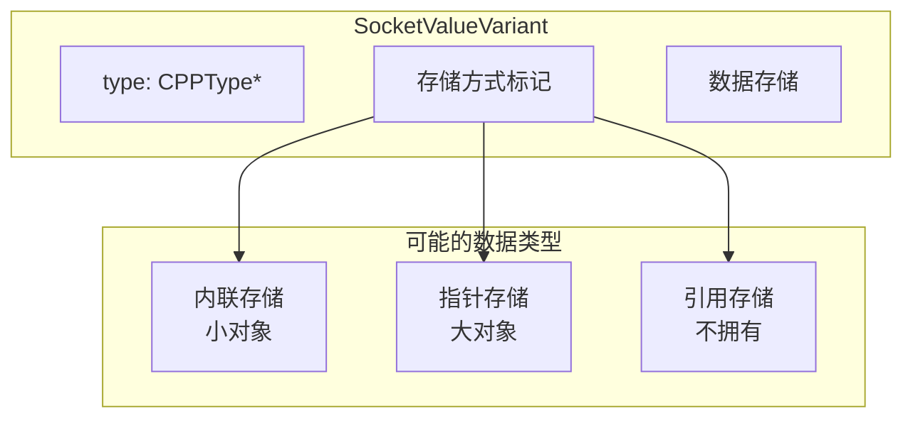
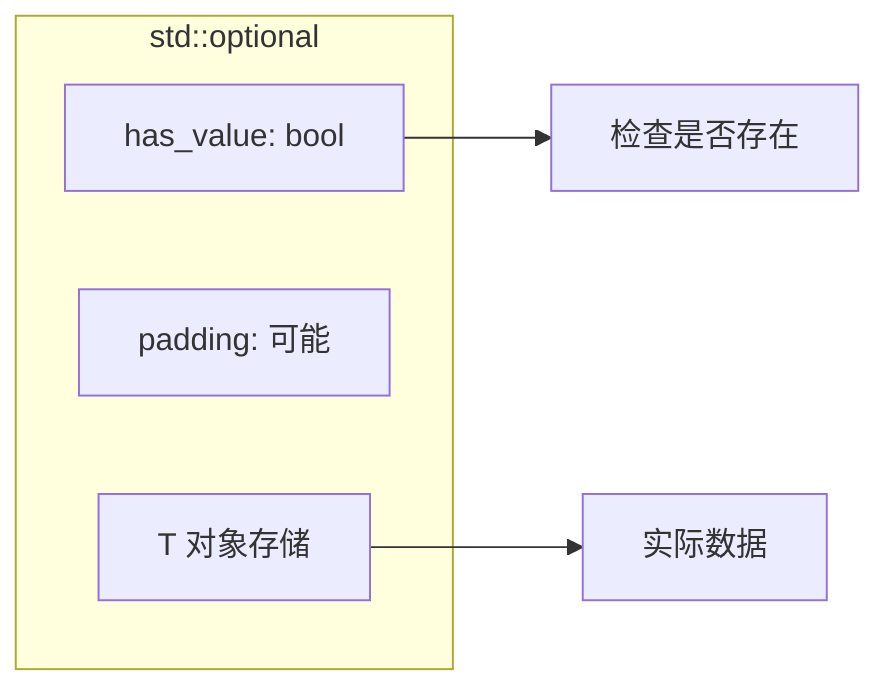
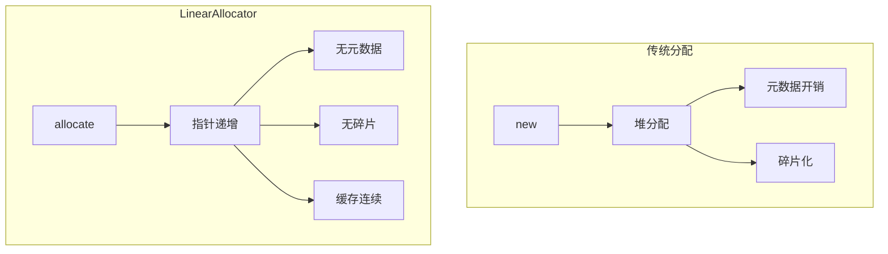

# Repeat Zone 内存管理详解

## 概述

Repeat Zone 的内存管理采用多层次策略，结合了 Blender 的 DNA 系统、C++ 的现代内存管理特性和自定义分配器。本文档详细分析其内存管理机制。

---

## 1. 内存管理架构



---

## 2. DNA 层内存管理

### 2.1 动态数组分配

```cpp
// 初始化时分配默认项
static void node_init(bNodeTree *tree, bNode *node) {
    NodeGeometryRepeatOutput *data = MEM_new<NodeGeometryRepeatOutput>(__func__);
    data->next_identifier = 0;
    
    if (tree->type == NTREE_GEOMETRY) {
        // 使用 MEM_new_array 分配数组
        data->items = MEM_new_array<NodeRepeatItem>(1, __func__);
        data->items[0].name = BLI_strdup(DATA_("Geometry"));
        data->items[0].socket_type = SOCK_GEOMETRY;
        data->items[0].identifier = data->next_identifier++;
        data->items_num = 1;
    }
    
    node->storage = data;
}
```

**内存分配函数对比：**

| 函数 | 用途 | 对应释放 |
|------|------|----------|
| `MEM_new<T>` | 单对象分配 | `MEM_delete` |
| `MEM_new_array<T>(n)` | 数组分配 | `MEM_delete_array` |
| `BLI_strdup` | 字符串复制 | `MEM_freeN` |

### 2.2 存储释放

```cpp
static void node_free_storage(bNode *node) {
    // 首先释放 items 数组中的每个项
    socket_items::destruct_array<RepeatItemsAccessor>(*node);
    
    // 然后释放存储结构本身
    MEM_delete(reinterpret_cast<NodeGeometryRepeatOutput *>(node->storage));
}
```

**释放顺序的重要性：**



### 2.3 存储复制

```cpp
static void node_copy_storage(bNodeTree * /*dst_tree*/, 
                               bNode *dst_node, 
                               const bNode *src_node) {
    const NodeGeometryRepeatOutput &src_storage = node_storage(*src_node);
    
    // 浅拷贝基础数据
    auto *dst_storage = MEM_new<NodeGeometryRepeatOutput>(
        __func__, 
        dna::shallow_copy(src_storage)
    );
    dst_node->storage = dst_storage;
    
    // 深拷贝 items 数组
    socket_items::copy_array<RepeatItemsAccessor>(*src_node, *dst_node);
}
```

**浅拷贝 vs 深拷贝：**

```mermaid
flowchart TB
    subgraph "浅拷贝前"
        A1[src.items] --> B1[数组内存]
        A1 --> C1[src.items[0].name]
    end
    
    subgraph "浅拷贝后（危险）"
        A2[dst.items] --> B1
        A2 --> C1
    end
    
    subgraph "深拷贝后（安全）"
        A3[dst.items] --> B2[新数组内存]
        A3 --> C2[name 的副本]
    end
    
    B1 -.->|需要| B2
    C1 -.->|需要| C2
```

---

## 3. 运行时内存管理

### 3.1 LinearAllocator 详解

```cpp
struct RepeatEvalStorage {
    LinearAllocator<> allocator;  // 线性分配器
    // ...
};
```

**LinearAllocator 工作原理：**



**分配策略：**

```cpp
// 构造对象并获取指针
template<typename T, typename... Args>
T *construct(Args &&... args) {
    void *mem = allocate(sizeof(T), alignof(T));
    return new (mem) T(std::forward<Args>(args)...);
}

// 分配原始内存
void *allocate(size_t size, size_t alignment) {
    // 对齐指针
    char *ptr = align_pointer(current_ptr, alignment);
    char *new_ptr = ptr + size;
    
    if (new_ptr > current_block_end) {
        // 当前块不足，分配新块
        allocate_new_block();
        ptr = align_pointer(current_ptr, alignment);
        new_ptr = ptr + size;
    }
    
    current_ptr = new_ptr;
    return ptr;
}
```

### 3.2 存储初始化

```cpp
void *init_storage(LinearAllocator<> &allocator) const override {
    // 在 LinearAllocator 中构造 RepeatEvalStorage
    return allocator.construct<RepeatEvalStorage>().release();
}
```

**初始化流程：**



### 3.3 存储销毁

```cpp
void destruct_storage(void *storage) const override {
    RepeatEvalStorage *s = static_cast<RepeatEvalStorage *>(storage);
    
    // 1. 销毁 graph_executor 的私有存储
    if (s->graph_executor_storage) {
        s->graph_executor->destruct_storage(s->graph_executor_storage);
    }
    
    // 2. 销毁 RepeatEvalStorage 本身
    std::destroy_at(s);
    
    // 3. LinearAllocator 会自动回收所有内存
}
```

**销毁顺序：**



---

## 4. 图执行内存管理

### 4.1 图的构建与销毁

```cpp
void initialize_execution_graph(...) const {
    lf::Graph &lf_graph = eval_storage.graph;
    
    // 添加输入/输出 socket
    Vector<lf::GraphInputSocket *> lf_inputs;
    Vector<lf::GraphOutputSocket *> lf_outputs;
    
    // 添加循环体节点
    VectorSet<lf::FunctionNode *> &lf_body_nodes = eval_storage.lf_body_nodes;
    for ([[maybe_unused]] const int i : IndexRange(iterations)) {
        lf::FunctionNode &lf_node = lf_graph.add_function(*body_fn_.function);
        lf_body_nodes.add_new(&lf_node);
    }
    
    // ... 构建图结构
}
```

### 4.2 GraphExecutor 生命周期

```cpp
// 构造执行器
eval_storage.graph_executor.emplace(
    lf_graph,
    std::move(lf_graph_inputs),
    std::move(lf_graph_outputs),
    nullptr,                                    // 无默认输入
    &*eval_storage.side_effect_provider,        // 副作用提供者
    &*eval_storage.body_execute_wrapper         // 执行包装器
);

// 初始化执行器存储
eval_storage.graph_executor_storage = eval_storage.graph_executor->init_storage(
    eval_storage.allocator);
```

**内存所有权：**



---

## 5. SocketValueVariant 内存管理

### 5.1 变体类型的内存策略

```cpp
Array<SocketValueVariant> index_values;

// 预分配迭代索引值
if (use_index_values) {
    eval_storage.index_values.reinitialize(iterations);
    threading::parallel_for(IndexRange(iterations), 1024, [&](const IndexRange range) {
        for (const int i : range) {
            eval_storage.index_values[i].set(i);
        }
    });
}
```

**SocketValueVariant 内存布局：**



### 5.2 静态常量优化

```cpp
// 静态常量避免重复分配
static const SocketValueVariant static_unused_index{-1};
static bool static_true = true;
static bool static_false = false;

// 使用引用避免拷贝
const SocketValueVariant *index_value = use_index_values ? 
    &eval_storage.index_values[iter_i] : 
    &static_unused_index;
lf_node.input(body_fn_.indices.inputs.main[0]).set_default_value(index_value);
```

---

## 6. 智能指针与可选类型

### 6.1 std::optional 的使用

```cpp
struct RepeatEvalStorage {
    std::optional<LazyFunctionForLogicalOr> or_function;
    std::optional<RepeatZoneSideEffectProvider> side_effect_provider;
    std::optional<RepeatBodyNodeExecuteWrapper> body_execute_wrapper;
    std::optional<lf::GraphExecutor> graph_executor;
};
```

**optional 内存布局：**



**延迟构造模式：**

```cpp
// 第一次使用时构造
if (!eval_storage.graph_executor) {
    eval_storage.graph_executor.emplace(
        lf_graph, 
        std::move(lf_graph_inputs),
        std::move(lf_graph_outputs),
        nullptr,
        &*eval_storage.side_effect_provider,
        &*eval_storage.body_execute_wrapper
    );
}
```

### 6.2 原始指针的使用场景

```cpp
const bNodeTree &btree_;           // 引用成员，生命周期由外部保证
const bNode &repeat_output_bnode_; // 引用成员，生命周期由外部保证
void *graph_executor_storage;      // 类型擦除指针，实际类型未知
```

**指针使用原则：**

| 类型 | 使用场景 | 所有权 |
|------|----------|--------|
| 引用成员 | 生命周期确定长于本对象 | 无 |
| 原始指针 | 可选引用或类型擦除 | 视情况而定 |
| 智能指针 | 共享所有权 | 共享 |

---

## 7. 内存优化技术

### 7.1 内存池效果



### 7.2 批量释放优势

```cpp
// 传统方式：逐个释放
for (auto *node : nodes) {
    delete node;  // 多次系统调用
}

// LinearAllocator 方式：批量释放
// 只需重置指针或释放整个块
allocator.reset();  // O(1)
```

### 7.3 缓存友好布局

```cpp
// 连续存储提高缓存命中率
Array<SocketValueVariant> index_values;

// 并行写入时缓存行优化
threading::parallel_for(IndexRange(iterations), 1024, [&](const IndexRange range) {
    for (const int i : range) {
        eval_storage.index_values[i].set(i);
    }
});
```

---

## 8. 内存安全与异常处理

### 8.1 RAII 模式

```cpp
class LazyFunctionForRepeatZone : public LazyFunction {
public:
    // 构造函数只进行基本初始化
    LazyFunctionForRepeatZone(...) 
        : btree_(btree), 
          zone_(zone),
          repeat_output_bnode_(*zone.output_node()),
          ... {}
    
    // 复杂初始化延迟到 init_storage
    void *init_storage(LinearAllocator<> &allocator) const override {
        return allocator.construct<RepeatEvalStorage>().release();
    }
    
    // 确保资源释放
    void destruct_storage(void *storage) const override {
        // 显式清理
    }
};
```

### 8.2 异常安全保证

```cpp
void initialize_execution_graph(...) const {
    // 基本保证：异常发生时不会泄漏资源
    // 强保证：使用可选类型延迟构造
    
    try {
        eval_storage.graph_executor.emplace(...);
    } catch (...) {
        // 已构造的部分会自动销毁
        // LinearAllocator 内存会在 storage 销毁时释放
        throw;
    }
}
```

---

## 9. 内存调试与监控

### 9.1 调试输出

```cpp
// 输出图的 DOT 表示用于调试
// std::cout << "\n\n" << lf_graph.to_dot() << "\n\n";
```

### 9.2 内存统计

```cpp
// LinearAllocator 可以提供统计信息
size_t allocated_size = allocator.allocated_size();
size_t used_size = allocator.used_size();
size_t block_count = allocator.block_count();
```

---

## 10. 最佳实践总结

1. **使用 LinearAllocator**：对于生命周期明确的临时对象，使用线性分配器提高性能
2. **延迟构造**：使用 `std::optional` 延迟复杂对象的构造
3. **明确所有权**：通过引用成员和文档明确内存所有权
4. **静态常量**：对于不变的小对象，使用静态存储避免重复分配
5. **批量操作**：优先使用批量分配和释放，减少系统调用
6. **缓存友好**：保持数据布局的连续性，提高缓存命中率
