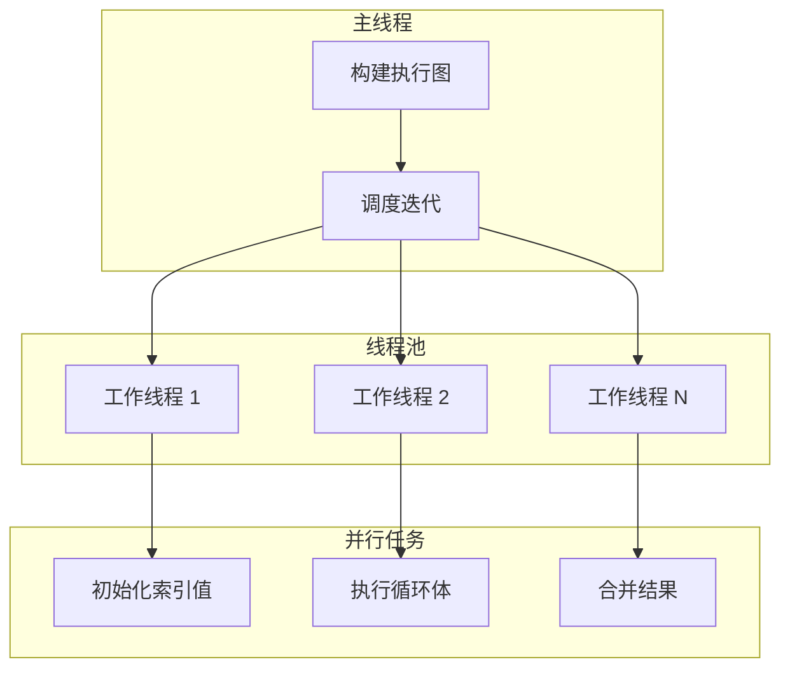
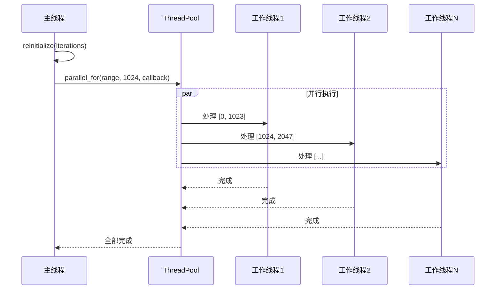
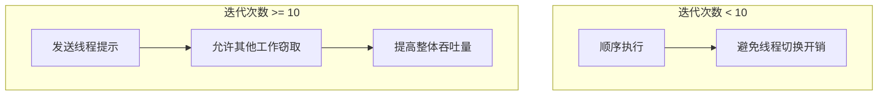
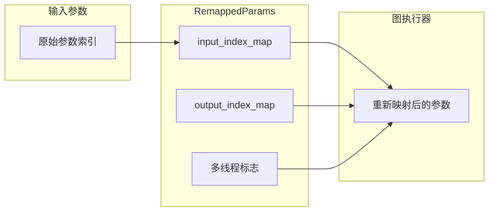
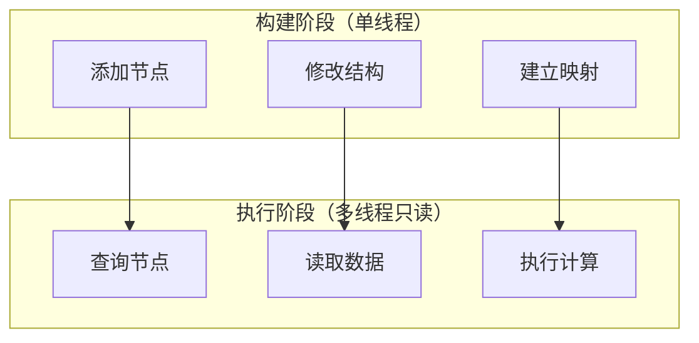
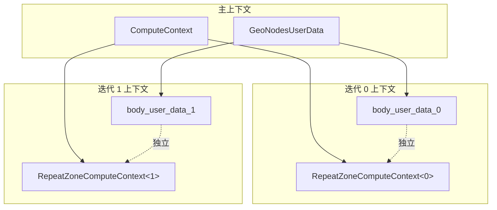
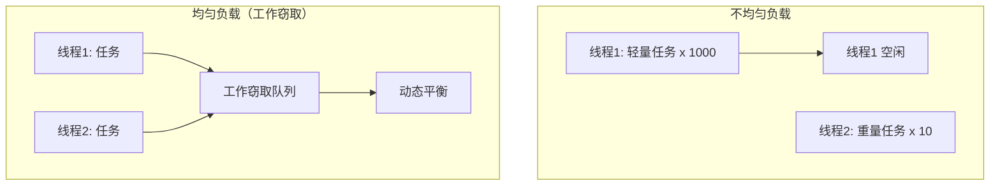

# Repeat Zone 多线程处理详解

## 概述

Repeat Zone 充分利用了现代 CPU 的多核特性，通过并行处理提高性能。本文档详细分析其多线程架构和实现机制。

---

## 1. 多线程架构概览



---

## 2. 并行初始化

### 2.1 索引值预计算

```cpp
const bool use_index_values = zone_.input_node()->output_socket(0).is_directly_linked();

if (use_index_values) {
    eval_storage.index_values.reinitialize(iterations);
    threading::parallel_for(IndexRange(iterations), 1024, [&](const IndexRange range) {
        for (const int i : range) {
            eval_storage.index_values[i].set(i);
        }
    });
}
```

**并行初始化流程：**



### 2.2 parallel_for 参数分析

```cpp
threading::parallel_for(
    IndexRange(iterations),  // 总范围
    1024,                     // 粒度（每批大小）
    [&](const IndexRange range) {  // 回调函数
        for (const int i : range) {
            eval_storage.index_values[i].set(i);
        }
    }
);
```

**粒度选择策略：**

| 粒度 | 适用场景 | 开销 |
|------|----------|------|
| 小（64-256） | 任务轻量，核心数多 | 调度开销高 |
| 中（512-2048） | 平衡型任务 | 适中 |
| 大（4096+） | 任务重量，迭代次数少 | 调度开销低 |

**为什么选 1024？**
- 索引值初始化是轻量级操作
- 1024 提供了良好的并行度与调度开销平衡
- 避免过多线程切换

---

## 3. 延迟线程提示

### 3.1 lazy_threading::send_hint()

```cpp
if (iterations >= 10) {
    /* Constructing and running the repeat zone has some overhead so that it's probably worth
     * trying to do something else in the meantime already. */
    lazy_threading::send_hint();
}
```

**设计意图：**



**实现原理：**

```cpp
namespace lazy_threading {
    // 提示调度器当前线程可能即将阻塞
    // 允许工作窃取调度器将当前线程的工作分配给其他线程
    inline void send_hint() {
        #ifdef WITH_TBB
            tbb::this_task_arena::isolate([]{});
        #endif
    }
}
```

---

## 4. GraphExecutor 的多线程执行

### 4.1 多线程标志

```cpp
struct RepeatEvalStorage {
    bool multi_threading_enabled = false;
    // ...
};

// 在构建图时设置
void initialize_execution_graph(...) const {
    // ...
    eval_storage.multi_threading_enabled = (iterations >= some_threshold);
    // ...
}
```

### 4.2 参数重映射与多线程

```cpp
lf::RemappedParams eval_graph_params{
    *eval_storage.graph_executor,
    params,
    eval_storage.input_index_map,
    eval_storage.output_index_map,
    eval_storage.multi_threading_enabled  // 启用多线程执行
};

lf::Context eval_graph_context{
    eval_storage.graph_executor_storage,
    context.user_data,
    context.local_user_data
};

eval_storage.graph_executor->execute(eval_graph_params, eval_graph_context);
```

**RemappedParams 作用：**



---

## 5. 线程安全的数据结构

### 5.1 VectorSet 的线程安全性

```cpp
VectorSet<lf::FunctionNode *> lf_body_nodes;

// 单线程构建阶段
for ([[maybe_unused]] const int i : IndexRange(iterations)) {
    lf::FunctionNode &lf_node = lf_graph.add_function(*body_fn_.function);
    lf_body_nodes.add_new(&lf_node);  // 单线程操作
}

// 多线程执行阶段（只读访问）
const int iteration = lf_body_nodes_->index_of_try(
    const_cast<lf::FunctionNode *>(&node)
);
```

**阶段分离：**



### 5.2 副作用处理的线程安全

```cpp
class RepeatZoneSideEffectProvider : public lf::GraphExecutorSideEffectProvider {
public:
    Vector<const lf::FunctionNode *> get_nodes_with_side_effects(
        const lf::Context &context) const override {
        
        GeoNodesUserData &user_data = *static_cast<GeoNodesUserData *>(context.user_data);
        const GeoNodesCallData &call_data = *user_data.call_data;
        
        if (!call_data.side_effect_nodes) {
            return {};
        }
        
        // 使用 context hash 进行查找
        const ComputeContextHash &context_hash = user_data.compute_context->hash();
        const Span<int> iterations_with_side_effects =
            call_data.side_effect_nodes->iterations_by_iteration_zone.lookup(
                {context_hash, repeat_output_bnode_->identifier});
        
        Vector<const lf::FunctionNode *> lf_nodes;
        for (const int i : iterations_with_side_effects) {
            if (i >= 0 && i < lf_body_nodes_.size()) {
                lf_nodes.append(lf_body_nodes_[i]);
            }
        }
        return lf_nodes;
    }
};
```

**线程安全保证：**
- `lf_body_nodes_` 在构建后不再修改
- `side_effect_nodes` 使用线程安全的数据结构
- 查找操作基于不可变的 `context_hash`

---

## 6. 计算上下文与线程

### 6.1 RepeatZoneComputeContext

```cpp
class RepeatBodyNodeExecuteWrapper : public lf::GraphExecutorNodeExecuteWrapper {
public:
    void execute_node(const lf::FunctionNode &node,
                      lf::Params &params,
                      const lf::Context &context) const override {
        GeoNodesUserData &user_data = *static_cast<GeoNodesUserData *>(context.user_data);
        
        // 确定当前迭代索引
        const int iteration = lf_body_nodes_->index_of_try(
            const_cast<lf::FunctionNode *>(&node)
        );
        
        // 为当前迭代创建新的计算上下文
        bke::RepeatZoneComputeContext body_compute_context{
            user_data.compute_context, 
            *repeat_output_bnode_, 
            iteration
        };
        
        // 复制用户数据并更新上下文
        GeoNodesUserData body_user_data = user_data;
        body_user_data.compute_context = &body_compute_context;
        body_user_data.verbose_log = should_log_verbose_in_context(
            user_data, 
            body_compute_context.hash()
        );
        
        // 创建局部用户数据
        GeoNodesLocalUserData body_local_user_data{body_user_data};
        
        // 构建新的上下文
        lf::Context body_context{
            context.storage, 
            &body_user_data, 
            &body_local_user_data
        };
        
        // 执行节点
        fn.execute(params, body_context);
    }
};
```

**上下文隔离：**



### 6.2 线程局部存储

```cpp
// GeoNodesLocalUserData 可能包含线程局部数据
class GeoNodesLocalUserData {
public:
    explicit GeoNodesLocalUserData(const GeoNodesUserData &user_data);
    
    // 线程局部的日志记录器
    geo_eval_log::GeoTreeLogger *try_get_tree_logger(
        const GeoNodesUserData &user_data
    );
    
    // 线程局部的临时缓冲区
    Vector<SocketValueVariant> temp_values;
};
```

---

## 7. 同步机制

### 7.1 无锁设计

Repeat Zone 的核心执行路径采用无锁设计：

```cpp
// 图的构建是单线程的
void initialize_execution_graph(...) const {
    // 所有修改操作都在单线程中完成
    lf::Graph &lf_graph = eval_storage.graph;
    
    // 添加节点和链接
    for (...) {
        lf::FunctionNode &lf_node = lf_graph.add_function(*body_fn_.function);
        // ...
    }
    
    // 构建完成后，图是只读的
    lf_graph.update_node_indices();
}
```

### 7.2 必要的同步点

```cpp
// 日志记录的同步
const bNodeTree &btree_orig = *DEG_get_original(&btree_);
if (btree_orig.runtime->logged_zone_graphs) {
    std::lock_guard lock{btree_orig.runtime->logged_zone_graphs->mutex};
    btree_orig.runtime->logged_zone_graphs->graph_by_zone_id.lookup_or_add_cb(
        repeat_output_bnode_.identifier, 
        [&]() { return lf_graph.to_dot(); }
    );
}
```

**同步点分析：**

| 操作 | 同步机制 | 原因 |
|------|----------|------|
| 日志记录 | `std::mutex` | 多线程可能同时记录 |
| 副作用查找 | 无锁（只读） | 数据结构构建后不变 |
| 图执行 | 任务队列 | TBB/内部调度器管理 |

---

## 8. 性能考量

### 8.1 并行度决策

```cpp
// 是否启用多线程执行的决策逻辑
bool should_enable_multi_threading(int iterations) {
    // 迭代次数阈值
    if (iterations < 4) return false;
    
    // 循环体复杂度估计
    if (body_complexity < threshold) return false;
    
    // 系统核心数
    if (system_thread_count < 2) return false;
    
    return true;
}
```

### 8.2 负载均衡



### 8.3 缓存影响

```cpp
// 连续内存访问提高缓存命中率
Array<SocketValueVariant> index_values;

// 不好的访问模式（跳跃）
for (int i = 0; i < iterations; i += stride) {
    process(data[i]);
}

// 好的访问模式（连续）
threading::parallel_for(IndexRange(iterations), 1024, [&](const IndexRange range) {
    for (const int i : range) {  // 连续访问
        process(data[i]);
    }
});
```

---

## 9. 调试多线程问题

### 9.1 常见陷阱

```cpp
// 错误：共享可变状态
static int counter = 0;  // 危险！

threading::parallel_for(range, 1024, [&](const IndexRange r) {
    for (int i : r) {
        counter++;  // 数据竞争！
    }
});

// 正确：使用线程局部存储
thread_local int local_counter = 0;

threading::parallel_for(range, 1024, [&](const IndexRange r) {
    int local = 0;
    for (int i : r) {
        local++;
    }
    local_counter += local;  // 最后合并
});
```

### 9.2 调试技巧

```cpp
// 添加线程 ID 到日志
void execute_node(...) {
    std::thread::id this_id = std::this_thread::get_id();
    std::cout << "Thread " << this_id << " executing iteration " << iteration << "\n";
    
    // ...
}
```

---

## 10. 总结

Repeat Zone 的多线程设计遵循以下原则：

1. **阶段分离**：构建阶段单线程，执行阶段多线程
2. **无锁优先**：核心路径无锁，必要时使用粗粒度锁
3. **上下文隔离**：每个迭代有独立的计算上下文
4. **粒度控制**：根据任务特性选择合适的并行粒度
5. **延迟提示**：适时发送线程提示提高整体吞吐量
