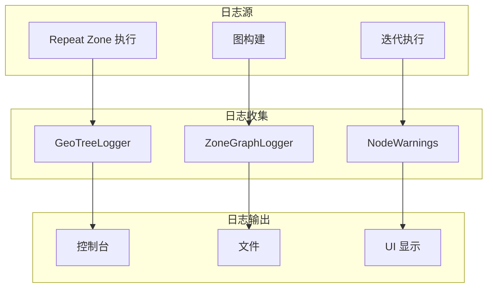
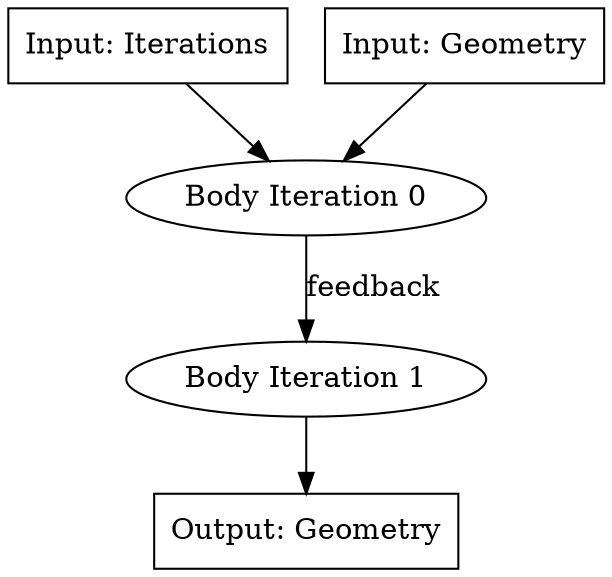
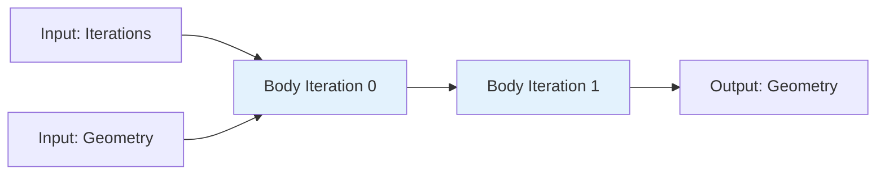
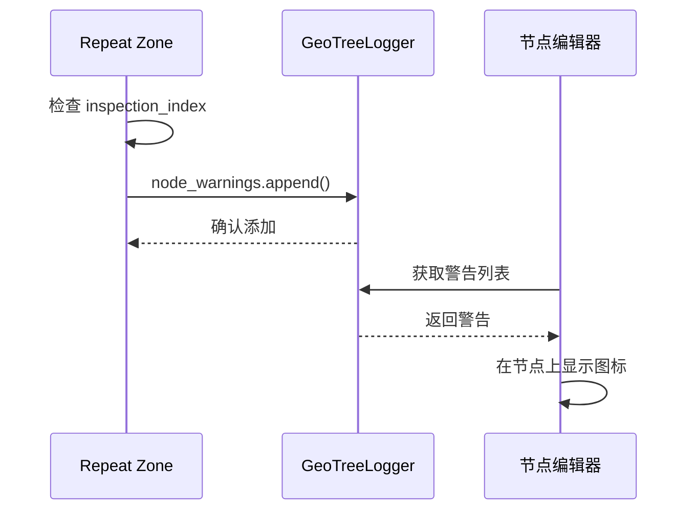
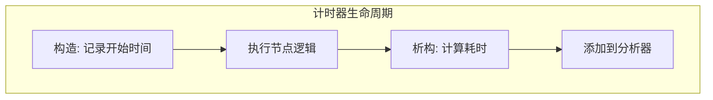

# Repeat Zone 调试与日志系统

## 概述

Repeat Zone 提供了完善的调试和日志机制，帮助开发者理解执行流程、诊断问题。本文档详细分析其调试系统的实现。

---

## 1. 调试系统架构



---

## 2. 图可视化调试

### 2.1 DOT 格式输出

```cpp
// 输出图的 DOT 表示用于调试
// std::cout << "\n\n" << lf_graph.to_dot() << "\n\n";
```

**DOT 格式示例：**



**可视化效果：**



### 2.2 日志图存储

```cpp
/* Log graph for debugging purposes. */
const bNodeTree &btree_orig = *DEG_get_original(&btree_);
if (btree_orig.runtime->logged_zone_graphs) {
    std::lock_guard lock{btree_orig.runtime->logged_zone_graphs->mutex};
    btree_orig.runtime->logged_zone_graphs->graph_by_zone_id.lookup_or_add_cb(
        repeat_output_bnode_.identifier, 
        [&]() { return lf_graph.to_dot(); }
    );
}
```

**存储结构：**

```cpp
struct LoggedZoneGraphs {
    std::mutex mutex;  // 线程安全
    Map<int, std::string> graph_by_zone_id;  // zone_id -> DOT 字符串
};
```

---

## 3. 节点警告系统

### 3.1 检查索引越界

```cpp
/* Show a warning when the inspection index is out of range. */
if (node_storage.inspection_index > 0) {
    if (node_storage.inspection_index >= iterations) {
        if (geo_eval_log::GeoTreeLogger *tree_logger = 
            local_user_data.try_get_tree_logger(user_data)) {
            
            tree_logger->node_warnings.append(
                *tree_logger->allocator,
                {
                    repeat_output_bnode_.identifier,
                    {NodeWarningType::Info, N_("Inspection index is out of range")}
                }
            );
        }
    }
}
```

**警告类型：**

| 类型 | 用途 | 显示方式 |
|------|------|----------|
| `Info` | 一般信息 | 蓝色提示 |
| `Warning` | 警告 | 黄色警告 |
| `Error` | 错误 | 红色错误 |

### 3.2 警告数据结构

```cpp
struct NodeWarning {
    NodeWarningType type;
    std::string message;
};

struct NodeWarningCollection {
    int node_identifier;
    Vector<NodeWarning> warnings;
};
```

**UI 显示流程：**



---

## 4. 执行计时

### 4.1 ScopedNodeTimer

```cpp
void execute_impl(lf::Params &params, const lf::Context &context) const override {
    const ScopedNodeTimer node_timer{context, repeat_output_bnode_};
    
    // ... 执行逻辑
}
```

**计时器实现：**

```cpp
class ScopedNodeTimer {
public:
    ScopedNodeTimer(const lf::Context &context, const bNode &node) 
        : context_(context), node_(node), start_(std::chrono::high_resolution_clock::now()) {}
    
    ~ScopedNodeTimer() {
        auto end = std::chrono::high_resolution_clock::now();
        auto duration = std::chrono::duration_cast<std::chrono::microseconds>(end - start_);
        
        // 记录到性能分析器
        if (context_.user_data) {
            auto &user_data = *static_cast<GeoNodesUserData *>(context_.user_data);
            if (user_data.profiler) {
                user_data.profiler->add_sample(node_.identifier, duration.count());
            }
        }
    }
    
private:
    const lf::Context &context_;
    const bNode &node_;
    std::chrono::time_point<std::chrono::high_resolution_clock> start_;
};
```

**性能数据收集：**



---

## 5. 详细日志模式

### 5.1 逐迭代日志

```cpp
void execute_node(...) const override {
    GeoNodesUserData &user_data = *static_cast<GeoNodesUserData *>(context.user_data);
    const int iteration = lf_body_nodes_->index_of_try(
        const_cast<lf::FunctionNode *>(&node)
    );
    
    // 创建迭代上下文
    bke::RepeatZoneComputeContext body_compute_context{
        user_data.compute_context, 
        *repeat_output_bnode_, 
        iteration
    };
    
    // 检查是否需要详细日志
    GeoNodesUserData body_user_data = user_data;
    body_user_data.verbose_log = should_log_verbose_in_context(
        user_data, 
        body_compute_context.hash()
    );
    
    if (body_user_data.verbose_log) {
        // 记录迭代开始
        log_iteration_start(iteration, params);
    }
    
    // ... 执行逻辑
    
    if (body_user_data.verbose_log) {
        // 记录迭代结束
        log_iteration_end(iteration, params);
    }
}
```

### 5.2 日志级别控制

```cpp
bool should_log_verbose_in_context(
    const GeoNodesUserData &user_data,
    const ComputeContextHash &context_hash
) {
    // 检查全局设置
    if (!user_data.call_data->eval_mode.log_debug()) {
        return false;
    }
    
    // 检查特定上下文
    if (user_data.call_data->verbose_contexts) {
        return user_data.call_data->verbose_contexts->contains(context_hash);
    }
    
    return false;
}
```

---

## 6. 调试辅助函数

### 6.1 输入/输出检查

```cpp
void debug_log_params(const lf::Params &params, const char *phase) {
    std::cout << "=== " << phase << " ===\n";
    
    for (int i = 0; i < params.inputs_num(); i++) {
        if (params.try_get_input(i)) {
            std::cout << "Input " << i << ": set\n";
        } else {
            std::cout << "Input " << i << ": not set\n";
        }
    }
    
    for (int i = 0; i < params.outputs_num(); i++) {
        if (params.output_was_set(i)) {
            std::cout << "Output " << i << ": was set\n";
        } else {
            std::cout << "Output " << i << ": not set\n";
        }
    }
}
```

### 6.2 图结构验证

```cpp
bool validate_graph(const lf::Graph &graph) {
    bool valid = true;
    
    // 检查所有节点都有输入
    for (const auto &node : graph.nodes()) {
        for (const auto &input : node.inputs()) {
            if (!input.has_value() && !input.is_linked()) {
                std::cerr << "Node " << node.name() << " input not set\n";
                valid = false;
            }
        }
    }
    
    // 检查无循环依赖
    if (graph.has_cycles()) {
        std::cerr << "Graph has cycles!\n";
        valid = false;
    }
    
    return valid;
}
```

---

## 7. 运行时检查

### 7.1 断言使用

```cpp
void initialize_execution_graph(...) const {
    // 前置条件检查
    BLI_assert(iterations >= 0);
    BLI_assert(node_storage.items_num > 0);
    
    // ... 构建逻辑
    
    // 后置条件检查
    BLI_assert(eval_storage.lf_body_nodes.size() == iterations);
    BLI_assert(lf_graph.node_count() >= iterations);
}
```

### 7.2 防御性编程

```cpp
void execute_impl(...) const override {
    // 检查存储是否已初始化
    if (!eval_storage.graph_executor) {
        // 首次执行，初始化图
        this->initialize_execution_graph(...);
    }
    
    // 验证图执行器
    BLI_assert(eval_storage.graph_executor.has_value());
    BLI_assert(eval_storage.graph_executor_storage != nullptr);
    
    // ... 执行
}
```

---

## 8. 调试配置

### 8.1 CMake 调试选项

```cmake
# 启用调试符号
set(CMAKE_BUILD_TYPE Debug)

# 启用地址 sanitizer
set(CMAKE_CXX_FLAGS "${CMAKE_CXX_FLAGS} -fsanitize=address")

# 启用线程 sanitizer（检测数据竞争）
set(CMAKE_CXX_FLAGS "${CMAKE_CXX_FLAGS} -fsanitize=thread")

# 启用断言
add_definitions(-DBLI_ENABLE_ASSERT)
```

### 8.2 运行时调试标志

```cpp
// 在代码中启用详细日志
#define REPEAT_ZONE_VERBOSE_LOGGING 1

// 启用图可视化
#define REPEAT_ZONE_DUMP_DOT 1

// 启用性能分析
#define REPEAT_ZONE_PROFILING 1
```

---

## 9. 常见问题调试

### 9.1 无限循环检测

```cpp
void execute_impl(...) const override {
    static thread_local int recursion_depth = 0;
    
    if (++recursion_depth > 1000) {
        std::cerr << "Possible infinite recursion detected!\n";
        BLI_assert(false);
    }
    
    // ... 执行逻辑
    
    --recursion_depth;
}
```

### 9.2 内存泄漏检测

```cpp
class RepeatEvalStorage {
public:
    ~RepeatEvalStorage() {
        // 验证所有资源已释放
        BLI_assert(graph_executor_storage == nullptr || 
                   "graph_executor_storage not freed!");
    }
};
```

### 9.3 数据竞争检测

```cpp
// 使用原子变量检测并发访问
std::atomic<int> access_count{0};

void unsafe_function() {
    int count = ++access_count;
    if (count > 1) {
        std::cerr << "Concurrent access detected!\n";
    }
    
    // ... 逻辑
    
    --access_count;
}
```

---

## 10. 调试工具集成

### 10.1 GDB 调试脚本

```python
# repeat_zone_gdb.py
import gdb

class RepeatZoneCommand(gdb.Command):
    """打印 Repeat Zone 状态"""
    
    def __init__(self):
        super().__init__("repeat-zone-info", gdb.COMMAND_DATA)
    
    def invoke(self, arg, from_tty):
        # 获取当前帧
        frame = gdb.selected_frame()
        
        # 打印迭代次数
        iterations = frame.read_var("iterations")
        print(f"Iterations: {iterations}")
        
        # 打印 body_nodes 数量
        body_nodes = frame.read_var("eval_storage").address
        print(f"Body nodes: {body_nodes}")

RepeatZoneCommand()
```

### 10.2 可视化调试工具

```cpp
// 导出为 JSON 供外部工具分析
void export_debug_info(const RepeatEvalStorage &storage, const char *filename) {
    std::ofstream file(filename);
    file << "{\n";
    file << "  \"iterations\": " << storage.lf_body_nodes.size() << ",\n";
    file << "  \"multi_threading\": " << storage.multi_threading_enabled << ",\n";
    file << "  \"graph_nodes\": " << storage.graph.node_count() << ",\n";
    file << "  \"graph_links\": " << storage.graph.link_count() << "\n";
    file << "}\n";
}
```

---

## 11. 总结

Repeat Zone 的调试系统提供了多层次的诊断能力：

1. **静态分析**：图可视化、DOT 输出
2. **运行时检查**：断言、验证函数
3. **性能分析**：ScopedNodeTimer 收集执行时间
4. **日志记录**：分级日志系统，支持详细模式
5. **警告系统**：向用户展示重要信息

通过这些工具，开发者可以有效地诊断和解决 Repeat Zone 相关问题。
