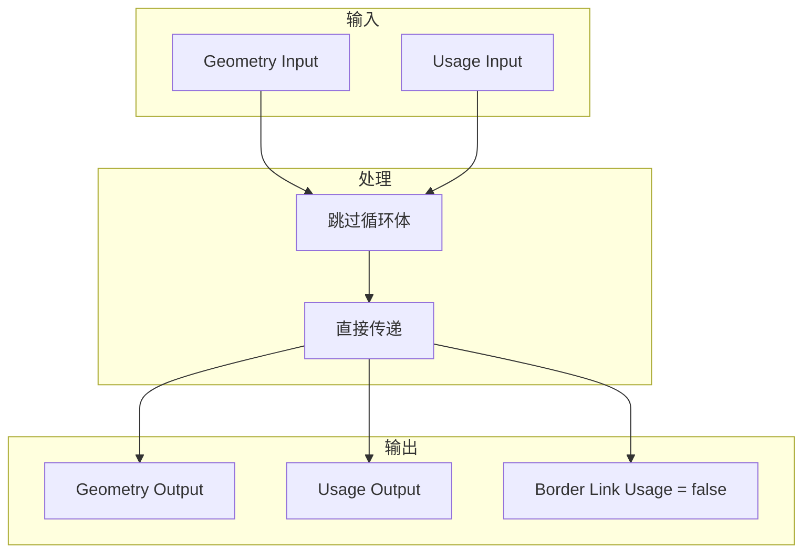

# Repeat Zone 边界情况处理

## 概述

Repeat Zone 的实现必须处理各种边界情况，包括零次迭代、大量迭代、无效输入等。本文档详细分析这些边界情况的处理策略。

---

## 1. 迭代次数边界

### 1.1 零次迭代（iterations = 0）

```cpp
if (iterations > 0) {
    // 链接第一个和最后一个循环体节点
    // ...
} else {
    /* There are no iterations, just link the input directly to the output. */
    for (const int i : IndexRange(num_repeat_items)) {
        // 输入直接连接到输出
        lf_graph.add_link(
            *lf_inputs[zone_info_.indices.inputs.main[i + main_inputs_offset]],
            *lf_outputs[zone_info_.indices.outputs.main[i]]
        );
        // 输出使用标记直接传递
        lf_graph.add_link(
            *lf_inputs[zone_info_.indices.inputs.output_usages[i]],
            *lf_outputs[zone_info_.indices.outputs.input_usages[i + main_inputs_offset]]
        );
    }
    // 边界链接使用标记设为 false
    for (const int i : IndexRange(num_border_links)) {
        static bool static_false = false;
        lf_outputs[zone_info_.indices.outputs.border_link_usages[i]]->set_default_value(
            &static_false
        );
    }
}
```

**零次迭代处理流程：**



### 1.2 负数次迭代

```cpp
/* Number of iterations to evaluate. */
const int iterations = std::max<int>(
    0, 
    params.get_input<SocketValueVariant>(zone_info_.indices.inputs.main[0]).get<int>()
);
```

**处理策略：**
- 使用 `std::max(0, value)` 将负值截断为 0
- 避免构建负数个循环体节点
- 保持行为一致性

### 1.3 大量迭代

```cpp
if (iterations >= 10) {
    /* Constructing and running the repeat zone has some overhead so that it's probably worth
     * trying to do something else in the meantime already. */
    lazy_threading::send_hint();
}
```

**大量迭代的考虑：**

| 迭代次数 | 处理策略 |
|----------|----------|
| < 10 | 顺序执行，避免线程切换开销 |
| >= 10 | 发送线程提示，允许工作窃取 |
| > 1000 | 可能需要内存优化，考虑流式处理 |
| > 10000 | 警告用户可能的性能问题 |

---

## 2. 输入验证

### 2.1 未连接的输出节点

```cpp
static void node_declare(NodeDeclarationBuilder &b) {
    // ...
    const bNode *node = b.node_or_null();
    const bNodeTree *tree = b.tree_or_null();
    if (node && tree) {
        const NodeGeometryRepeatInput &storage = node_storage(*node);
        if (const bNode *output_node = tree->node_by_id(storage.output_node_id)) {
            // 安全地使用 output_node
            // ...
        }
    }
    // ...
}
```

**防御性检查：**
- `b.node_or_null()` - 检查节点是否存在
- `b.tree_or_null()` - 检查树是否存在
- `tree->node_by_id()` - 检查输出节点是否存在

### 2.2 无效的迭代次数输入

```cpp
// SocketValueVariant 提供类型安全的访问
try {
    const int iterations = params.get_input<SocketValueVariant>(
        zone_info_.indices.inputs.main[0]
    ).get<int>();
} catch (const std::exception &e) {
    // 处理类型不匹配
    iterations = 0;
}
```

---

## 3. 检查索引边界

### 3.1 Inspection Index 越界警告

```cpp
/* Show a warning when the inspection index is out of range. */
if (node_storage.inspection_index > 0) {
    if (node_storage.inspection_index >= iterations) {
        if (geo_eval_log::GeoTreeLogger *tree_logger = 
            local_user_data.try_get_tree_logger(user_data)) {
            
            tree_logger->node_warnings.append(
                *tree_logger->allocator,
                {
                    repeat_output_bnode_.identifier,
                    {NodeWarningType::Info, N_("Inspection index is out of range")}
                }
            );
        }
    }
}
```

**检查索引用途：**
- 允许用户检查特定迭代的状态
- 用于调试和验证
- 不影响实际执行

### 3.2 边界检查实现

```cpp
// 安全的索引访问
const int iteration = lf_body_nodes_->index_of_try(
    const_cast<lf::FunctionNode *>(&node)
);

if (iteration == -1) {
    /* The node is not a loop body node, just execute it normally. */
    fn.execute(params, context);
    return;
}
```

---

## 4. 内存边界

### 4.1 空项数组

```cpp
static void node_init(bNodeTree *tree, bNode *node) {
    NodeGeometryRepeatOutput *data = MEM_new<NodeGeometryRepeatOutput>(__func__);
    data->next_identifier = 0;
    
    if (tree->type == NTREE_GEOMETRY) {
        // 至少创建一个默认项
        data->items = MEM_new_array<NodeRepeatItem>(1, __func__);
        data->items[0].name = BLI_strdup(DATA_("Geometry"));
        data->items[0].socket_type = SOCK_GEOMETRY;
        data->items[0].identifier = data->next_identifier++;
        data->items_num = 1;
    } else {
        // 非几何节点树，items 保持为空
        data->items = nullptr;
        data->items_num = 0;
    }
    
    node->storage = data;
}
```

### 4.2 动态扩容

```cpp
// 添加新项时可能需要重新分配
static void add_item(bNode &node, const eNodeSocketDatatype socket_type, const char *name) {
    auto *storage = static_cast<NodeGeometryRepeatOutput *>(node.storage);
    
    // 分配更大的数组
    NodeRepeatItem *new_items = MEM_new_array<NodeRepeatItem>(
        storage->items_num + 1, 
        __func__
    );
    
    // 复制现有数据
    if (storage->items) {
        memcpy(new_items, storage->items, sizeof(NodeRepeatItem) * storage->items_num);
        MEM_freeN(storage->items);
    }
    
    // 初始化新项
    new_items[storage->items_num].socket_type = socket_type;
    new_items[storage->items_num].name = BLI_strdup(name);
    new_items[storage->items_num].identifier = storage->next_identifier++;
    
    storage->items = new_items;
    storage->items_num++;
}
```

---

## 5. Socket 类型边界

### 5.1 不支持的 Socket 类型

```cpp
static bool supports_socket_type(const eNodeSocketDatatype socket_type, const int ntree_type) {
    return bke::node_tree_type_supports_socket_type_static(ntree_type, socket_type);
}

// 使用示例
if (!RepeatItemsAccessor::supports_socket_type(
    eNodeSocketDatatype(other_socket.type), 
    params.node_tree().type)) {
    return;  // 不支持的类型，不添加搜索选项
}
```

### 5.2 字段支持检查

```cpp
if (socket_type_supports_attributes(socket_type)) {
    input_decl.supports_field();
    output_decl.dependent_field({input_decl.index()});
}
```

---

## 6. 图构建边界

### 6.1 空图处理

```cpp
void initialize_execution_graph(...) const {
    const int num_repeat_items = node_storage.items_num;
    const int num_border_links = body_fn_.indices.inputs.border_links.size();
    
    // 处理没有重复项的情况
    if (num_repeat_items == 0) {
        // 构建最小图，只处理 iterations 输入
        // ...
        return;
    }
    
    // 正常构建流程
    // ...
}
```

### 6.2 边界链接处理

```cpp
/* Create nodes for combining border link usages. */
Array<lf::FunctionNode *> lf_border_link_usage_or_nodes(num_border_links);

if (num_border_links > 0) {
    eval_storage.or_function.emplace(iterations);
    for (const int i : IndexRange(num_border_links)) {
        lf::FunctionNode &lf_node = lf_graph.add_function(*eval_storage.or_function);
        lf_border_link_usage_or_nodes[i] = &lf_node;
    }
}
```

---

## 7. 执行边界

### 7.1 首次执行初始化

```cpp
void execute_impl(lf::Params &params, const lf::Context &context) const override {
    // ...
    
    if (!eval_storage.graph_executor) {
        /* Create the execution graph in the first evaluation. */
        this->initialize_execution_graph(
            params, eval_storage, node_storage, user_data, local_user_data
        );
    }
    
    // 确保图已构建
    BLI_assert(eval_storage.graph_executor.has_value());
    
    // ... 执行
}
```

### 7.2 存储未初始化

```cpp
void *init_storage(LinearAllocator<> &allocator) const override {
    // 确保分配成功
    void *storage = allocator.construct<RepeatEvalStorage>().release();
    BLI_assert(storage != nullptr);
    return storage;
}
```

---

## 8. 并发边界

### 8.1 线程安全的数据访问

```cpp
/* Log graph for debugging purposes. */
const bNodeTree &btree_orig = *DEG_get_original(&btree_);
if (btree_orig.runtime->logged_zone_graphs) {
    // 使用互斥锁保护共享数据
    std::lock_guard lock{btree_orig.runtime->logged_zone_graphs->mutex};
    btree_orig.runtime->logged_zone_graphs->graph_by_zone_id.lookup_or_add_cb(
        repeat_output_bnode_.identifier, 
        [&]() { return lf_graph.to_dot(); }
    );
}
```

### 8.2 并行范围验证

```cpp
if (use_index_values) {
    eval_storage.index_values.reinitialize(iterations);
    threading::parallel_for(IndexRange(iterations), 1024, [&](const IndexRange range) {
        // 验证范围有效性
        BLI_assert(range.start() >= 0);
        BLI_assert(range.end() <= iterations);
        
        for (const int i : range) {
            eval_storage.index_values[i].set(i);
        }
    });
}
```

---

## 9. 错误恢复

### 9.1 异常安全

```cpp
void initialize_execution_graph(...) const {
    try {
        // 可能抛出异常的代码
        eval_storage.graph_executor.emplace(...);
    } catch (const std::exception &e) {
        // 清理已分配的资源
        eval_storage.lf_body_nodes.clear();
        
        // 重新抛出或设置错误状态
        throw;
    }
}
```

### 9.2 部分失败处理

```cpp
void destruct_storage(void *storage) const override {
    RepeatEvalStorage *s = static_cast<RepeatEvalStorage *>(storage);
    
    // 即使部分初始化也要正确清理
    if (s->graph_executor_storage) {
        s->graph_executor->destruct_storage(s->graph_executor_storage);
    }
    
    // 销毁存储对象
    std::destroy_at(s);
}
```

---

## 10. 用户输入边界

### 10.1 空名称处理

```cpp
static void node_declare(NodeDeclarationBuilder &b) {
    // ...
    const UString name = item.name ? UString(item.name) : ""_ustr;
    // ...
}
```

### 10.2 超长名称处理

```cpp
static void set_item_name(bNode &node, NodeRepeatItem &item, const char *name) {
    // 限制名称长度
    char truncated_name[64];
    BLI_strncpy(truncated_name, name, sizeof(truncated_name));
    
    // 确保名称唯一
    make_unique_name(node, item, truncated_name);
    
    // 分配新名称
    MEM_SAFE_FREE(item.name);
    item.name = BLI_strdup(truncated_name);
}
```

---

## 11. 边界情况总结表

| 边界情况 | 处理策略 | 代码位置 |
|----------|----------|----------|
| iterations = 0 | 直接连接输入到输出 | `initialize_execution_graph` |
| iterations < 0 | 截断为 0 | `std::max(0, value)` |
| iterations 很大 | 发送线程提示 | `lazy_threading::send_hint()` |
| 无输出节点 | 跳过声明 | `node_declare` |
| 检查索引越界 | 显示警告 | `initialize_execution_graph` |
| 空项数组 | 创建默认项 | `node_init` |
| 不支持 Socket 类型 | 跳过 | `supports_socket_type` |
| 首次执行 | 延迟初始化 | `execute_impl` |
| 并发日志 | 加锁保护 | `std::lock_guard` |
| 空名称 | 使用空字符串 | `node_declare` |

---

## 12. 防御性编程建议

1. **前置条件检查**：在函数开始处验证所有输入
2. **后置条件断言**：在函数结束时验证输出
3. **优雅降级**：遇到错误时使用合理的默认值
4. **用户反馈**：通过警告系统通知用户潜在问题
5. **日志记录**：记录边界情况便于调试
