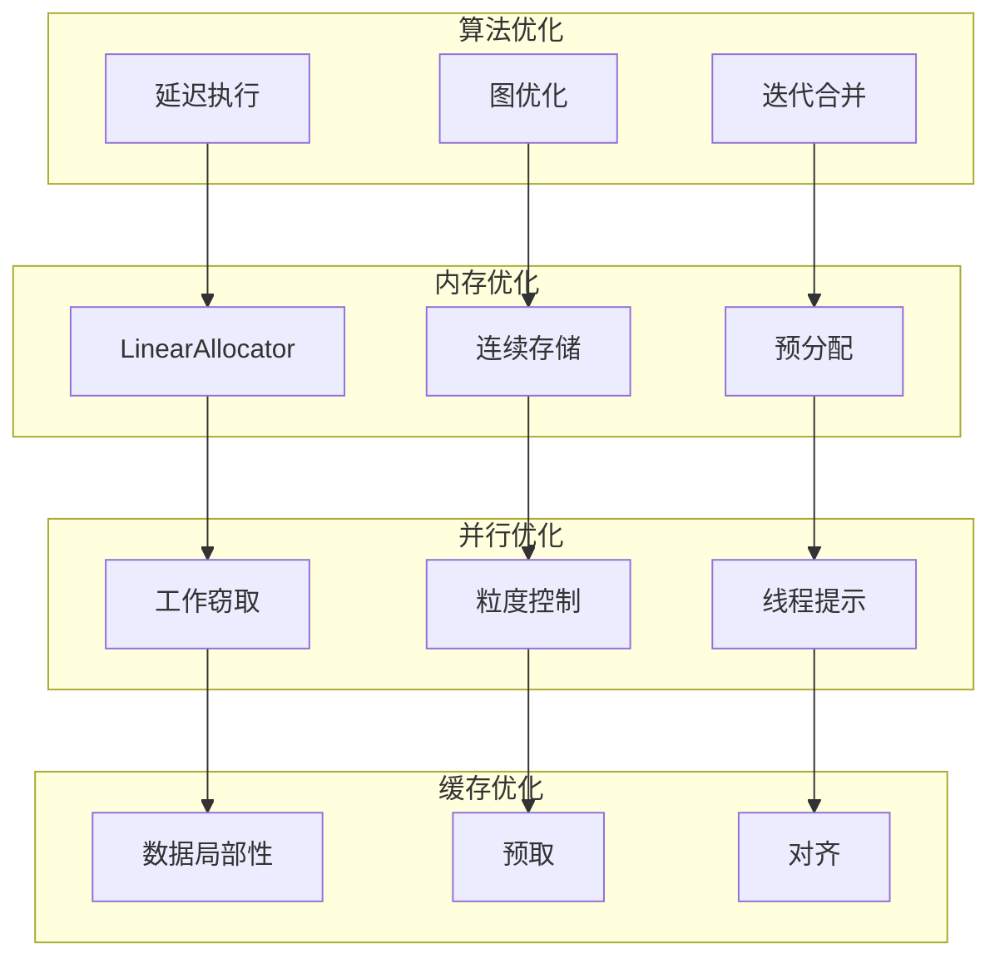
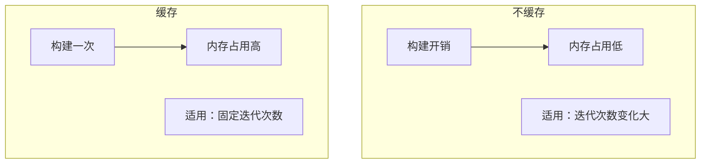
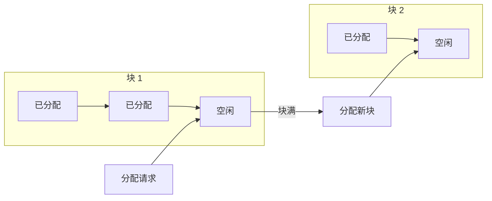
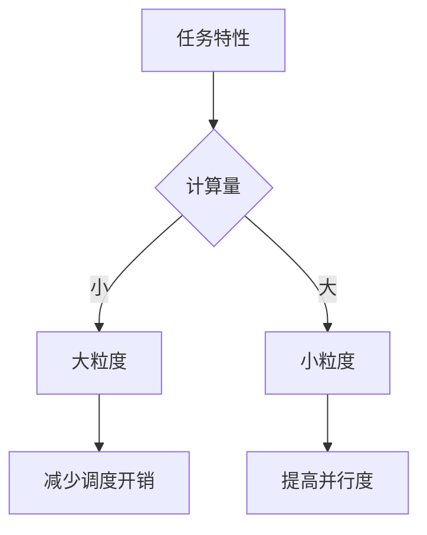
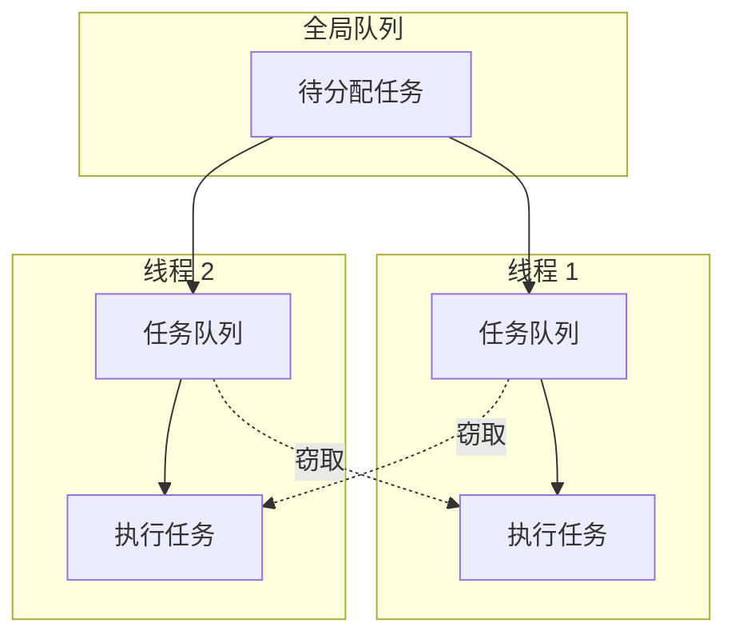

# Repeat Zone 性能优化详解

## 概述

Repeat Zone 的性能优化涉及多个层面，从算法选择到内存布局，从并行策略到缓存优化。本文档详细分析其性能优化技术。

---

## 1. 性能优化架构



---

## 2. 延迟执行优化

### 2.1 惰性求值策略

```cpp
void execute_impl(lf::Params &params, const lf::Context &context) const override {
    // 只在需要时构建执行图
    if (!eval_storage.graph_executor) {
        this->initialize_execution_graph(...);
    }
    
    // 惰性执行 - 只计算需要的输出
    eval_storage.graph_executor->execute(eval_graph_params, eval_graph_context);
}
```

**惰性求值优势：**

| 场景 | 立即执行 | 惰性执行 |
|------|----------|----------|
| 部分输出使用 | 计算所有 | 只计算需要的 |
| 条件分支 | 都执行 | 只执行命中的分支 |
| 多次请求 | 每次都计算 | 缓存结果 |

### 2.2 图缓存策略

```cpp
/**
 * Generate a lazy-function graph that contains the loop body (`body_fn_`) as many times
 * as there are iterations. Since this graph depends on the number of iterations, it can't be
 * reused in general. We could consider caching a version of this graph per number of iterations,
 * but right now that doesn't seem worth it.
 */
void initialize_execution_graph(...) const {
    // 当前实现：每次重新构建图
    // 可能的优化：缓存常见迭代次数的图
}
```

**缓存策略权衡：**



---

## 3. 内存优化

### 3.1 LinearAllocator 性能优势

```cpp
struct RepeatEvalStorage {
    LinearAllocator<> allocator;
    // ...
};
```

**分配性能对比：**

| 分配器 | 分配时间 | 释放时间 | 碎片 |
|--------|----------|----------|------|
| malloc/free | O(1) | O(1) | 有 |
| LinearAllocator | O(1) | O(1) | 无 |
| 池分配器 | O(1) | O(1) | 无（固定大小） |

**LinearAllocator 工作流程：**



### 3.2 连续内存布局

```cpp
// 预分配连续的索引值数组
Array<SocketValueVariant> index_values;

if (use_index_values) {
    eval_storage.index_values.reinitialize(iterations);
    threading::parallel_for(IndexRange(iterations), 1024, [&](const IndexRange range) {
        for (const int i : range) {
            eval_storage.index_values[i].set(i);
        }
    });
}
```

**缓存行优化：**

```mermaid
flowchart TB
    subgraph "缓存行 0"
        A[index_values[0]]
        B[index_values[1]]
        C[index_values[2]]
        D[index_values[3]]
    end
    
    subgraph "缓存行 1"
        E[index_values[4]]
        F[index_values[5]]
        G[index_values[6]]
        H[index_values[7]]
    end
    
    I[顺序访问] --> A
    A --> B
    B --> C
    C --> D
    D --> E
    E --> F
    F --> G
    G --> H
```

### 3.3 内存预分配

```cpp
// 预分配 Vector 容量避免重新分配
Vector<lf::GraphInputSocket *> lf_inputs;
Vector<lf::GraphOutputSocket *> lf_outputs;

lf_inputs.reserve(inputs_.size());
lf_outputs.reserve(outputs_.size());

for (const int i : inputs_.index_range()) {
    lf_inputs.append(&lf_graph.add_input(*input.type, this->input_name(i)));
}
```

---

## 4. 并行优化

### 4.1 并行粒度选择

```cpp
// 粒度 = 1024，平衡并行度与调度开销
threading::parallel_for(IndexRange(iterations), 1024, [&](const IndexRange range) {
    for (const int i : range) {
        eval_storage.index_values[i].set(i);
    }
});
```

**粒度选择策略：**



### 4.2 线程提示机制

```cpp
if (iterations >= 10) {
    /* Constructing and running the repeat zone has some overhead so that it's probably worth
     * trying to do something else in the meantime already. */
    lazy_threading::send_hint();
}
```

**线程提示效果：**

| 迭代次数 | 行为 | 原因 |
|----------|------|------|
| < 10 | 不发送提示 | 线程切换开销 > 并行收益 |
| >= 10 | 发送提示 | 允许工作窃取，提高吞吐量 |

### 4.3 工作窃取调度



---

## 5. 缓存优化

### 5.1 数据局部性

```cpp
// 好的局部性：连续访问
for (const int i : IndexRange(num_repeat_items)) {
    lf_graph.add_link(
        *lf_inputs[zone_info_.indices.inputs.main[i + main_inputs_offset]],
        lf_first_body_node.input(body_fn_.indices.inputs.main[i + body_inputs_offset])
    );
}

// 避免：随机访问
for (const int i : random_indices) {
    process(data[i]);  // 缓存不友好
}
```

### 5.2 结构体填充优化

```cpp
// 原始布局（有填充）
struct NodeRepeatItem {
    char *name;           // 8 bytes
    short socket_type;    // 2 bytes
    // 6 bytes padding
    int identifier;       // 4 bytes
};  // 总：24 bytes

// 优化布局（减少填充）
struct NodeRepeatItemOptimized {
    char *name;           // 8 bytes
    int identifier;       // 4 bytes
    short socket_type;    // 2 bytes
    // 2 bytes padding
};  // 总：16 bytes
```

### 5.3 预取提示

```cpp
// 编译器预取提示
for (const int i : IndexRange(iterations)) {
    __builtin_prefetch(&eval_storage.index_values[i + 4], 1, 3);
    eval_storage.index_values[i].set(i);
}
```

---

## 6. 算法优化

### 6.1 边界链接优化

```cpp
/* Create nodes for combining border link usages. */
Array<lf::FunctionNode *> lf_border_link_usage_or_nodes(num_border_links);
eval_storage.or_function.emplace(iterations);

for (const int i : IndexRange(num_border_links)) {
    lf::FunctionNode &lf_node = lf_graph.add_function(*eval_storage.or_function);
    lf_border_link_usage_or_nodes[i] = &lf_node;
}
```

**优化策略：**
- 使用 `LazyFunctionForLogicalOr` 合并边界链接使用标记
- 避免为每个边界链接创建单独的函数

### 6.2 迭代链优化

```cpp
/* Handle body nodes pair-wise. */
for (const int iter_i : lf_body_nodes.index_range().drop_back(1)) {
    lf::FunctionNode &lf_node = *lf_body_nodes[iter_i];
    lf::FunctionNode &lf_next_node = *lf_body_nodes[iter_i + 1];
    
    for (const int i : IndexRange(num_repeat_items)) {
        // 直接链接，避免中间拷贝
        lf_graph.add_link(
            lf_node.output(body_fn_.indices.outputs.main[i]),
            lf_next_node.input(body_fn_.indices.inputs.main[i + body_inputs_offset])
        );
    }
}
```

---

## 7. 编译器优化

### 7.1 内联提示

```cpp
// 强制内联小函数
inline void process_item(Item &item) {
    // 简单处理
}

// 建议内联
[[gnu::always_inline]] void critical_function() {
    // 性能关键代码
}
```

### 7.2 分支预测

```cpp
// 提示 likely/unlikely
if (LIKELY(iterations > 0)) {
    // 常见路径
} else {
    // 罕见路径
}

// 使用 BLI 宏
if (BLI_UNLIKELY(node_storage.inspection_index >= iterations)) {
    // 警告路径
}
```

### 7.3 循环展开

```cpp
// 手动展开小循环
for (const int i : IndexRange(num_repeat_items / 4)) {
    process(i * 4 + 0);
    process(i * 4 + 1);
    process(i * 4 + 2);
    process(i * 4 + 3);
}

// 处理剩余
for (const int i : IndexRange(num_repeat_items % 4)) {
    process(num_repeat_items - i - 1);
}
```

---

## 8. 性能分析

### 8.1 计时点设置

```cpp
void execute_impl(lf::Params &params, const lf::Context &context) const override {
    const ScopedNodeTimer node_timer{context, repeat_output_bnode_};
    
    // 细分计时
    SCOPED_TIMER("Initialize");
    if (!eval_storage.graph_executor) {
        this->initialize_execution_graph(...);
    }
    
    {
        SCOPED_TIMER("Execute");
        eval_storage.graph_executor->execute(...);
    }
}
```

### 8.2 性能指标收集

```cpp
struct PerformanceMetrics {
    int64_t graph_build_time_us;
    int64_t execution_time_us;
    int64_t memory_allocated_bytes;
    int num_iterations;
    bool used_multi_threading;
};
```

---

## 9. 性能调优建议

### 9.1 迭代次数选择

| 迭代次数 | 建议 |
|----------|------|
| 1-5 | 适合简单重复操作 |
| 5-50 | 平衡性能与功能 |
| 50-500 | 注意性能影响，考虑优化 |
| 500+ | 需要专门优化，可能不适合实时 |

### 9.2 循环体复杂度


### 9.3 内存使用监控

```cpp
// 监控内存使用
void log_memory_usage(const RepeatEvalStorage &storage) {
    std::cout << "Memory usage:\n";
    std::cout << "  Graph nodes: " << storage.graph.node_count() << "\n";
    std::cout << "  Body nodes: " << storage.lf_body_nodes.size() << "\n";
    std::cout << "  Index values: " << storage.index_values.size() << "\n";
}
```

---

## 10. 性能优化总结

1. **延迟构建**：只在需要时构建执行图
2. **线性分配**：使用 LinearAllocator 减少分配开销
3. **连续存储**：保持数据局部性提高缓存命中率
4. **并行执行**：合理使用多线程，控制粒度
5. **预分配**：避免运行时的动态扩容
6. **编译器优化**：使用内联、分支预测等提示
7. **算法选择**：使用高效的算法和数据结构
