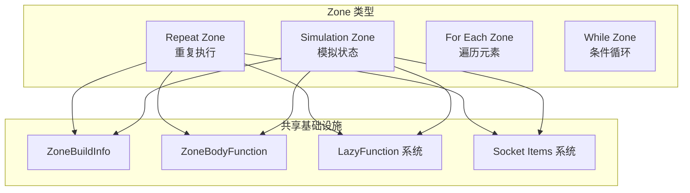
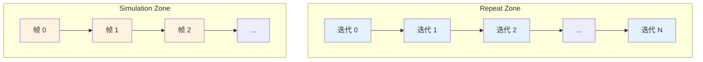
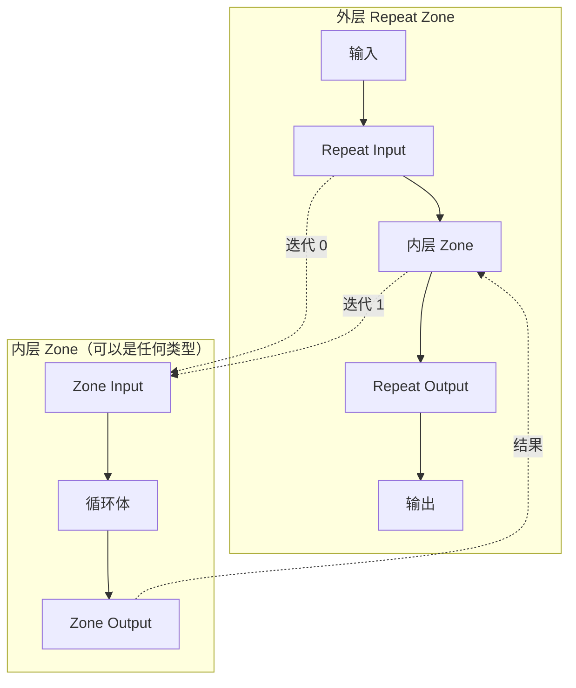
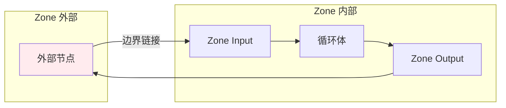
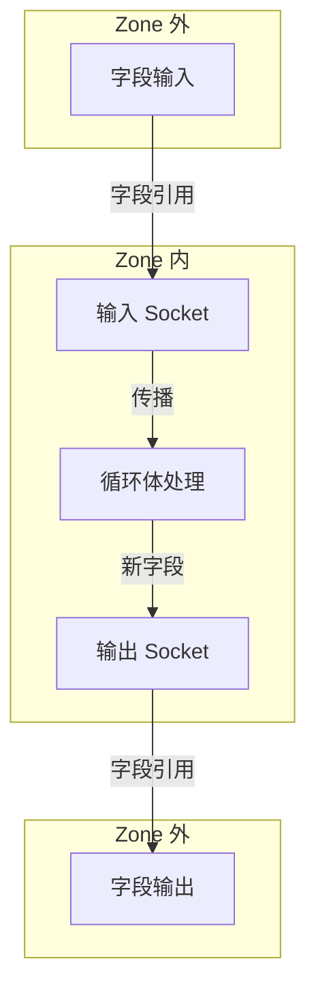
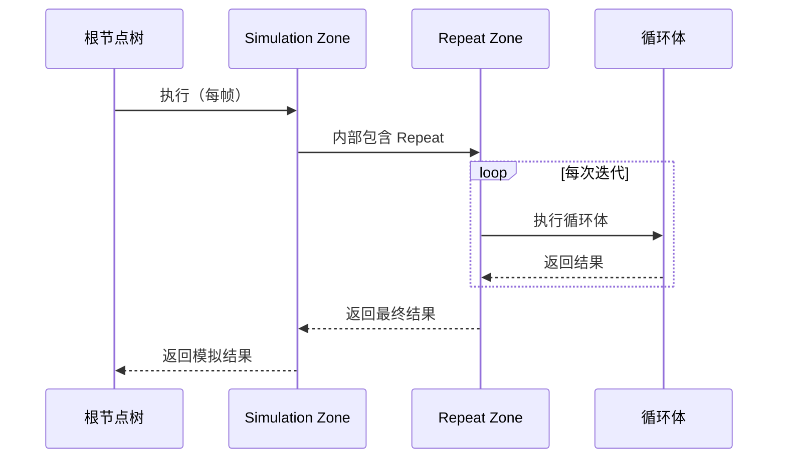

# Repeat Zone 与其他 Zone 的交互

## 概述

Repeat Zone 作为 Blender 几何节点系统的一部分，需要与其他 Zone 类型（如 Simulation Zone）协同工作。本文档分析这些交互机制和实现细节。

---

## 1. Zone 系统架构



---

## 2. 通用 Zone 基础设施

### 2.1 ZoneBuildInfo 结构

```cpp
// 所有 Zone 类型共享的构建信息
struct ZoneBuildInfo {
    struct {
        struct {
            Vector<int> main;           // 主要输入
            Vector<int> border_links;   // 边界链接输入
            Map<int, int> reference_sets; // 引用集合
        } inputs;
        struct {
            Vector<int> main;           // 主要输出
            Vector<int> input_usages;   // 输入使用标记
            Vector<int> border_link_usages; // 边界链接使用标记
        } outputs;
    } indices;
};
```

**共享函数：**

```cpp
// 初始化 Zone 包装器（所有 Zone 类型使用）
void initialize_zone_wrapper(
    const bke::bNodeTreeZone &zone,
    ZoneBuildInfo &zone_info,
    const ZoneBodyFunction &body_fn,
    const bool body_produces_output,
    Vector<lf::Input> &r_inputs,
    Vector<lf::Output> &r_outputs
);

// 生成输入/输出名称
std::string zone_wrapper_input_name(
    const ZoneBuildInfo &zone_info,
    const bke::bNodeTreeZone &zone,
    const Span<lf::Input> inputs,
    const int index
);
```

### 2.2 Zone 类型对比

| 特性 | Repeat Zone | Simulation Zone | For Each Zone |
|------|-------------|-----------------|---------------|
| 执行次数 | 固定次数 | 每帧一次 | 元素数量 |
| 状态传递 | 迭代间传递 | 时间步传递 | 元素独立 |
| 延迟执行 | 是 | 否（必须执行） | 是 |
| 副作用处理 | 可选迭代 | 必须执行 | 可选元素 |
| 检查索引 | 支持 | 不支持 | 不支持 |

---

## 3. Repeat Zone 与 Simulation Zone 对比

### 3.1 执行模型差异



### 3.2 状态管理差异

**Repeat Zone：**
```cpp
// 迭代间状态传递通过图链接实现
for (const int i : IndexRange(num_repeat_items)) {
    lf_graph.add_link(
        lf_node.output(body_fn_.indices.outputs.main[i]),
        lf_next_node.input(body_fn_.indices.inputs.main[i + body_inputs_offset])
    );
}
```

**Simulation Zone：**
```cpp
// 状态保存到磁盘/内存，跨帧恢复
void save_state(SimulationState &state) {
    // 序列化几何体、属性等
}

void load_state(const SimulationState &state) {
    // 反序列化恢复状态
}
```

### 3.3 副作用处理差异

```cpp
// Repeat Zone：副作用是可选的
class RepeatZoneSideEffectProvider : public lf::GraphExecutorSideEffectProvider {
    Vector<const lf::FunctionNode *> get_nodes_with_side_effects(...) const override {
        // 只返回指定迭代的副作用节点
        if (!call_data.side_effect_nodes) {
            return {};  // 无副作用
        }
        // ...
    }
};

// Simulation Zone：副作用是必须的
class SimulationZoneSideEffectProvider : public lf::GraphExecutorSideEffectProvider {
    Vector<const lf::FunctionNode *> get_nodes_with_side_effects(...) const override {
        // 必须执行所有副作用节点
        return all_side_effect_nodes;
    }
};
```

---

## 4. Zone 嵌套支持

### 4.1 嵌套架构



### 4.2 上下文堆栈

```cpp
// 嵌套 Zone 的上下文管理
class GeoNodesUserData {
public:
    const ComputeContext *compute_context;  // 当前上下文
    // ...
};

// Repeat Zone 创建新上下文
bke::RepeatZoneComputeContext body_compute_context{
    user_data.compute_context,  // 父上下文
    *repeat_output_bnode_, 
    iteration
};

// 上下文链：Root -> Simulation -> Repeat -> For Each
```

### 4.3 嵌套限制

```cpp
// 防止无限嵌套
static constexpr int MAX_ZONE_NESTING = 10;

void execute_zone(...) {
    if (current_nesting_level >= MAX_ZONE_NESTING) {
        report_error("Zone nesting level exceeded");
        return;
    }
    // ...
}
```

---

## 5. Socket Items 系统共享

### 5.1 通用访问器模式

```cpp
// Repeat Items 访问器
struct RepeatItemsAccessor : public socket_items::SocketItemsAccessorDefaults {
    using ItemT = NodeRepeatItem;
    static constexpr StringRefNull node_idname = "GeometryNodeRepeatOutput";
    // ...
};

// Simulation Items 访问器
struct SimulationItemsAccessor : public socket_items::SocketItemsAccessorDefaults {
    using ItemT = NodeSimulationItem;
    static constexpr StringRefNull node_idname = "GeometryNodeSimulationOutput";
    // ...
};
```

### 5.2 共享操作

```cpp
// 所有 Zone 类型使用相同的操作
namespace socket_items {
    namespace ops {
        template<typename Accessor>
        void make_common_operators() {
            // 注册添加/删除/移动操作符
            WM_operatortype_append(add_item_operator<Accessor>);
            WM_operatortype_append(remove_item_operator<Accessor>);
            WM_operatortype_append(move_item_operator<Accessor>);
        }
    }
    
    namespace ui {
        template<typename Accessor>
        void draw_items_list_with_operators(...) {
            // 绘制通用的项列表 UI
        }
    }
}
```

---

## 6. 边界链接系统

### 6.1 跨 Zone 数据流



### 6.2 边界链接使用追踪

```cpp
// 追踪边界链接是否被使用
for (const int i : IndexRange(num_border_links)) {
    lf_graph.add_link(
        *lf_inputs[zone_info_.indices.inputs.border_links[i]],
        lf_node.input(body_fn_.indices.inputs.border_links[i])
    );
    
    // 收集使用标记
    lf_graph.add_link(
        lf_node.output(body_fn_.indices.outputs.border_link_usages[i]),
        lf_border_link_usage_or_nodes[i]->input(iter_i)
    );
}
```

---

## 7. 字段系统交互

### 7.1 字段传播

```cpp
static void node_declare(NodeDeclarationBuilder &b) {
    // ...
    if (socket_type_supports_attributes(socket_type)) {
        input_decl.supports_field();
        output_decl.dependent_field({input_decl.index()});
    }
    // ...
}
```

**字段在 Zone 间的传播：**



### 7.2 字段上下文链

```cpp
// 嵌套 Zone 的字段上下文
FieldContext root_context;
FieldContext repeat_context{root_context, repeat_zone_id, iteration};
FieldContext foreach_context{repeat_context, foreach_zone_id, element_index};

// 字段解析时遍历上下文链
Value field_evaluate(const FieldContext &context) {
    if (context.has_value(name)) {
        return context.get_value(name);
    }
    if (context.parent()) {
        return field_evaluate(*context.parent());
    }
    return default_value;
}
```

---

## 8. 执行调度交互

### 8.1 Zone 执行顺序



### 8.2 执行模式协调

```cpp
// Simulation Zone 必须执行
bool SimulationZone::is_lazy() const { return false; }

// Repeat Zone 可以延迟执行
bool RepeatZone::is_lazy() const { return true; }

// 调度器根据模式决定执行策略
void schedule_node(Node &node) {
    if (node.is_lazy() && !is_output_needed(node)) {
        return;  // 跳过延迟节点
    }
    execute_node(node);
}
```

---

## 9. 调试与日志交互

### 9.1 跨 Zone 日志

```cpp
// Repeat Zone 设置迭代上下文用于日志
bke::RepeatZoneComputeContext body_compute_context{
    user_data.compute_context, 
    *repeat_output_bnode_, 
    iteration
};

// 日志记录包含完整上下文链
void log_operation(const ComputeContext &context, const char *message) {
    std::string full_context = context.to_string();
    // 输出: "Root/Simulation(0)/Repeat(5)/ForEach(3)"
    std::cout << "[" << full_context << "] " << message << "\n";
}
```

### 9.2 图可视化

```cpp
// 每个 Zone 可以导出自己的子图
void export_zone_graph(const bNodeTreeZone &zone) {
    std::string dot = "subgraph cluster_" + std::to_string(zone.id) + " {\n";
    dot += "label=\"" + zone.name + "\";\n";
    
    for (const auto &node : zone.nodes()) {
        dot += node.to_dot();
    }
    
    dot += "}\n";
}
```

---

## 10. 扩展新 Zone 类型

### 10.1 实现步骤

```cpp
// 1. 定义 DNA 结构
struct NodeNewZoneOutput {
    NodeNewZoneItem *items;
    int items_num;
    // ...
};

// 2. 实现访问器
struct NewZoneItemsAccessor : public socket_items::SocketItemsAccessorDefaults {
    using ItemT = NodeNewZoneItem;
    static constexpr StringRefNull node_idname = "GeometryNodeNewZoneOutput";
    // ...
};

// 3. 实现 LazyFunction
class LazyFunctionForNewZone : public LazyFunction {
    void execute_impl(lf::Params &params, const lf::Context &context) const override;
    // ...
};

// 4. 注册节点类型
static void node_register() {
    static bke::bNodeType ntype;
    sh_geo_node_type_base(&ntype, "GeometryNodeNewZoneInput", GEO_NODE_NEW_ZONE_INPUT);
    // ...
    bke::node_register_type(ntype);
}
```

### 10.2 复用现有组件

```cpp
// 复用 Zone 包装器初始化
void initialize_zone_wrapper(zone, zone_info, body_fn, true, inputs, outputs);

// 复用 Socket Items 系统
socket_items::ui::draw_items_list_with_operators<NewZoneItemsAccessor>(...);
socket_items::ops::make_common_operators<NewZoneItemsAccessor>();

// 复用 Blend 文件读写
socket_items::blend_write<NewZoneItemsAccessor>(&writer, node);
socket_items::blend_read_data<NewZoneItemsAccessor>(&reader, node);
```

---

## 11. 总结

Repeat Zone 与其他 Zone 类型的交互体现了 Blender 几何节点系统的设计原则：

1. **共享基础设施**：ZoneBuildInfo、Socket Items 等通用组件
2. **一致的接口**：所有 Zone 遵循相同的 LazyFunction 模式
3. **灵活的嵌套**：支持任意深度的 Zone 嵌套
4. **清晰的边界**：边界链接系统管理跨 Zone 数据流
5. **统一的调试**：上下文链提供完整的执行轨迹
