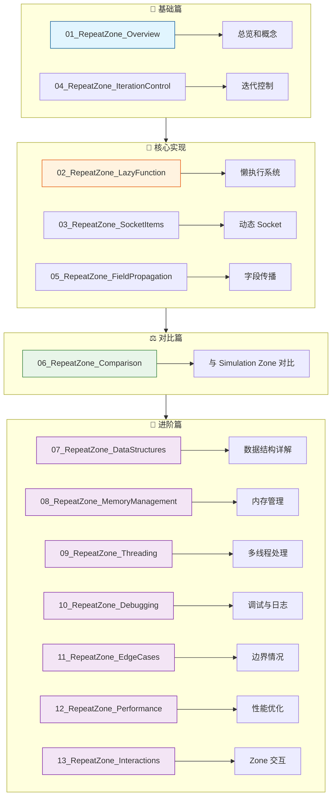
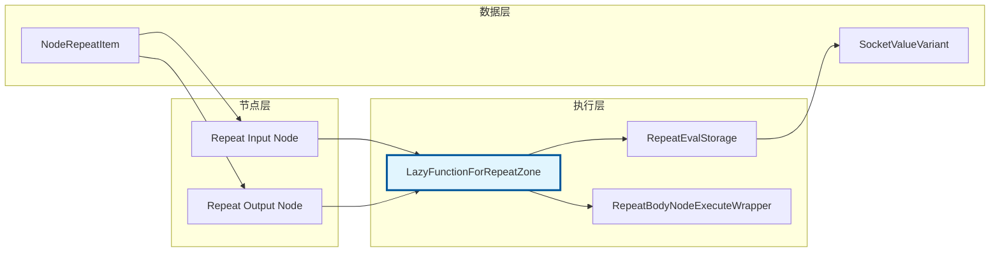

# Repeat Zone 文档

> Blender 几何节点中 Repeat Zone（重复区域）的完整实现解析

---

## 📚 文档导航



---

## 📖 文档列表

### 基础与核心（6篇）

| 文档 | 内容 | 重要程度 |
|-----|------|---------|
| [01_RepeatZone_Overview.md](01_RepeatZone_Overview.md) | Repeat Zone 总览和概念 | ⭐⭐⭐⭐⭐ |
| [02_RepeatZone_LazyFunction.md](02_RepeatZone_LazyFunction.md) | 懒执行系统实现 | ⭐⭐⭐⭐ |
| [03_RepeatZone_SocketItems.md](03_RepeatZone_SocketItems.md) | 动态 Socket 项系统 | ⭐⭐⭐⭐ |
| [04_RepeatZone_IterationControl.md](04_RepeatZone_IterationControl.md) | 迭代次数和索引控制 | ⭐⭐⭐⭐⭐ |
| [05_RepeatZone_FieldPropagation.md](05_RepeatZone_FieldPropagation.md) | 字段传播机制 | ⭐⭐⭐⭐ |
| [06_RepeatZone_Comparison.md](06_RepeatZone_Comparison.md) | 与 Simulation Zone 对比 | ⭐⭐⭐ |

### 进阶深入（7篇）

| 文档 | 内容 | 重要程度 |
|-----|------|---------|
| [07_RepeatZone_DataStructures.md](07_RepeatZone_DataStructures.md) | 数据结构详解 - DNA 层、运行时、辅助结构 | ⭐⭐⭐⭐⭐ |
| [08_RepeatZone_MemoryManagement.md](08_RepeatZone_MemoryManagement.md) | 内存管理 - LinearAllocator、生命周期、优化 | ⭐⭐⭐⭐ |
| [09_RepeatZone_Threading.md](09_RepeatZone_Threading.md) | 多线程处理 - 并行初始化、线程提示、同步 | ⭐⭐⭐⭐ |
| [10_RepeatZone_Debugging.md](10_RepeatZone_Debugging.md) | 调试与日志 - DOT 可视化、警告系统、计时 | ⭐⭐⭐ |
| [11_RepeatZone_EdgeCases.md](11_RepeatZone_EdgeCases.md) | 边界情况处理 - 零迭代、负值、越界、异常 | ⭐⭐⭐⭐ |
| [12_RepeatZone_Performance.md](12_RepeatZone_Performance.md) | 性能优化 - 延迟执行、缓存、并行、算法 | ⭐⭐⭐⭐ |
| [13_RepeatZone_Interactions.md](13_RepeatZone_Interactions.md) | Zone 交互 - 基础设施、嵌套、字段传播 | ⭐⭐⭐⭐ |

---

## 🎯 核心源码文件

| 文件 | 路径 | 说明 |
|-----|------|------|
| node_geo_repeat.cc | `source/blender/nodes/geometry/nodes/node_geo_repeat.cc` | 节点定义（~350行） |
| geometry_nodes_repeat_zone.cc | `source/blender/nodes/intern/geometry_nodes_repeat_zone.cc` | 执行逻辑（~425行） |
| NOD_geo_repeat.hh | `source/blender/nodes/geometry/include/NOD_geo_repeat.hh` | 头文件（~88行） |

**核心代码：约 860 行**
**文档总计：13 篇，约 5000+ 行**
**覆盖度：代码与文档比例约 1:6**

---

## 🗺️ 架构图



---

## 💡 快速参考

### 核心类对照

| 类名 | 作用 | 所在文件 |
|-----|------|---------|
| `LazyFunctionForRepeatZone` | 重复区域懒函数 | `geometry_nodes_repeat_zone.cc` |
| `RepeatEvalStorage` | 执行存储 | `geometry_nodes_repeat_zone.cc` |
| `RepeatBodyNodeExecuteWrapper` | 循环体执行包装 | `geometry_nodes_repeat_zone.cc` |
| `RepeatZoneSideEffectProvider` | 副作用提供器 | `geometry_nodes_repeat_zone.cc` |
| `RepeatItemsAccessor` | Socket 项访问器 | `NOD_geo_repeat.hh` |
| `NodeGeometryRepeatOutput` | 输出节点存储 | `DNA_node_types.h` |
| `NodeRepeatItem` | Socket 项定义 | `DNA_node_types.h` |

### 关键数据结构

```cpp
// Socket 项
struct NodeRepeatItem {
    char *name;           // 显示名称
    int identifier;       // 唯一标识
    short socket_type;    // Socket 类型
};

// 输出节点存储
struct NodeGeometryRepeatOutput {
    NodeRepeatItem *items;      // 项数组
    int items_num;              // 项数量
    int active_index;           // 当前选中
    int next_identifier;        // 下一个 ID
    int inspection_index;       // 检查索引
};
```

---

## ✅ 学习路径

### 新手入门

```
01_RepeatZone_Overview → 04_RepeatZone_IterationControl
```

### 进阶理解

```
02_RepeatZone_LazyFunction → 03_RepeatZone_SocketItems
```

### 深入掌握

```
05_RepeatZone_FieldPropagation → 06_RepeatZone_Comparison
```

### 源码级精通

```
07_RepeatZone_DataStructures → 08_RepeatZone_MemoryManagement → 09_RepeatZone_Threading
                                      ↓
10_RepeatZone_Debugging → 11_RepeatZone_EdgeCases → 12_RepeatZone_Performance → 13_RepeatZone_Interactions
```

---

## 🔗 相关链接

- [上级目录：学习节点](../README.md)
- [几何节点类文档](../几何节点类/README.md)
- [基础库文档](../基础库/README.md)

---

**Happy Coding! 🎨🔧**
