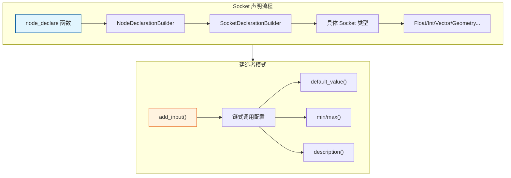
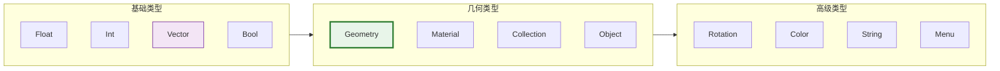

# SocketDeclaration - Socket 声明系统

> 定义几何节点输入输出的类型系统，使用建造者模式构建节点接口

---

## 🎯 核心概念



---

## 📦 Socket 类型概览



---

## 🚀 常用 Socket 声明

### 基础数值类型

```cpp
#include "NOD_socket_declarations.hh"

static void node_declare(NodeDeclarationBuilder &b)
{
    // Float - 浮点数
    b.add_input<decl::Float>("Value"_ustr)
        .default_value(1.0f)
        .min(0.0f)
        .max(10.0f)
        .subtype(PROP_DISTANCE)  // 距离子类型
        .description("输入值");
    
    // Int - 整数
    b.add_input<decl::Int>("Count"_ustr)
        .default_value(10)
        .min(1)
        .max(100)
        .description("数量");
    
    // Vector - 向量
    b.add_input<decl::Vector>("Offset"_ustr)
        .default_value({0.0f, 0.0f, 1.0f})
        .subtype(PROP_TRANSLATION)  // 平移子类型
        .description("偏移量");
    
    // Bool - 布尔
    b.add_input<decl::Bool>("Selection"_ustr)
        .default_value(true)
        .hide_value()  // 隐藏值，只显示字段
        .description("选择");
}
```

### 几何类型

```cpp
static void node_declare(NodeDeclarationBuilder &b)
{
    // Geometry - 几何体
    b.add_input<decl::Geometry>("Geometry"_ustr)
        .is_default_link_socket()  // 默认连接 socket
        .description("输入几何体");
    
    b.add_output<decl::Geometry>("Geometry"_ustr)
        .propagate_all()  // 传播所有属性
        .align_with_previous();  // 与上一个对齐
    
    // Material - 材质
    b.add_input<decl::Material>("Material"_ustr)
        .description("材质");
    
    // Object - 对象
    b.add_input<decl::Object>("Target"_ustr)
        .description("目标对象");
}
```

### 高级类型

```cpp
static void node_declare(NodeDeclarationBuilder &b)
{
    // Color - 颜色
    b.add_input<decl::Color>("Color"_ustr)
        .default_value({1.0f, 0.5f, 0.0f, 1.0f})
        .description("颜色");
    
    // Rotation - 旋转
    b.add_input<decl::Rotation>("Rotation"_ustr)
        .description("旋转");
    
    // String - 字符串
    b.add_input<decl::String>("Name"_ustr)
        .default_value("Default"_ustr)
        .description("名称");
    
    // Menu - 菜单枚举
    b.add_input<decl::Menu>("Mode"_ustr)
        .static_items(mode_items)  // 静态菜单项
        .description("模式选择");
}
```

---

## 🎨 字段修饰符

### 字段相关

```cpp
static void node_declare(NodeDeclarationBuilder &b)
{
    // field_on_all - 支持全场域
    b.add_input<decl::Float>("Value"_ustr)
        .field_on_all()  // 可以在任何域上使用字段
        .default_value(1.0f);
    
    // implicit_field - 隐式字段（如位置）
    b.add_input<decl::Vector>("Position"_ustr)
        .implicit_field(implicit_position_input)  // 默认使用位置字段
        .description("位置");
    
    // hide_value - 隐藏值，只显示字段连接
    b.add_input<decl::Float>("Factor"_ustr)
        .hide_value()
        .field_on_all();
}
```

### 几何输出修饰

```cpp
static void node_declare(NodeDeclarationBuilder &b)
{
    b.add_output<decl::Geometry>("Geometry"_ustr)
        .propagate_all()  // 传播所有属性
        .propagate_only({"position", "normal"})  // 只传播指定属性
        .align_with_previous();  // UI 对齐
}
```

---

## 🎯 Socket 配置选项

### Float/Int 配置

```cpp
b.add_input<decl::Float>("Scale"_ustr)
    .default_value(1.0f)           // 默认值
    .min(0.0f)                     // 最小值
    .max(100.0f)                   // 最大值
    .soft_min(0.0f)               // 软最小（UI限制）
    .soft_max(10.0f)              // 软最大（UI限制）
    .subtype(PROP_PERCENTAGE)      // 子类型：百分比
    .description("缩放比例");
```

### 子类型列表

| 子类型 | 用途 | 示例 |
|-------|------|------|
| `PROP_NONE` | 普通数值 | 通用 |
| `PROP_DISTANCE` | 距离 | 位置、半径 |
| `PROP_PERCENTAGE` | 百分比 | 0-100% |
| `PROP_FACTOR` | 因子 | 0-1 |
| `PROP_ANGLE` | 角度 | 旋转 |
| `PROP_TIME` | 时间 | 动画 |
| `PROP_TRANSLATION` | 平移 | 位置偏移 |
| `PROP_DIRECTION` | 方向 | 法线 |
| `PROP_XYZ` | XYZ分量 | 缩放 |
| `PROP_COLOR` | 颜色 | RGB |

---

## 🎯 节点开发中的典型用法

### 模式 1：标准几何节点

```cpp
static void node_declare(NodeDeclarationBuilder &b)
{
    b.use_custom_socket_order();
    b.allow_any_socket_order();
    
    // 输入
    b.add_input<decl::Geometry>("Geometry"_ustr)
        .is_default_link_socket()
        .description("输入几何体");
    
    b.add_input<decl::Vector>("Offset"_ustr)
        .default_value({0.0f, 0.0f, 0.0f})
        .subtype(PROP_TRANSLATION)
        .field_on_all()
        .description("偏移量");
    
    b.add_input<decl::Bool>("Selection"_ustr)
        .default_value(true)
        .hide_value()
        .field_on_all()
        .description("选择");
    
    // 输出
    b.add_output<decl::Geometry>("Geometry"_ustr)
        .propagate_all()
        .align_with_previous();
}
```

### 模式 2：带菜单的节点

```cpp
static void node_declare(NodeDeclarationBuilder &b)
{
    // 模式选择菜单
    b.add_input<decl::Menu>("Mode"_ustr)
        .static_items(mode_items)
        .description("操作模式");
    
    // 根据模式显示不同输入
    b.add_input<decl::Float>("Value A"_ustr)
        .default_value(1.0f)
        .usage_by_single_menu(MODE_A)
        .description("模式A的值");
    
    b.add_input<decl::Float>("Value B"_ustr)
        .default_value(2.0f)
        .usage_by_single_menu(MODE_B)
        .description("模式B的值");
}
```

### 模式 3：多输出节点

```cpp
static void node_declare(NodeDeclarationBuilder &b)
{
    b.add_input<decl::Geometry>("Geometry"_ustr)
        .is_default_link_socket();
    
    // 多个输出
    b.add_output<decl::Geometry>("Mesh"_ustr)
        .description("网格部分");
    
    b.add_output<decl::Geometry>("Curves"_ustr)
        .description("曲线部分");
    
    b.add_output<decl::Geometry>("Points"_ustr)
        .description("点云部分");
    
    // 数值输出
    b.add_output<decl::Int>("Count"_ustr)
        .description("元素数量");
}
```

---

## ✅ 检查清单

- [ ] 理解 SocketDeclaration 的建造者模式
- [ ] 掌握常用 socket 类型（Float/Int/Vector/Geometry）
- [ ] 了解字段修饰符（field_on_all, implicit_field）
- [ ] 掌握子类型的使用场景
- [ ] 理解 propagate_all 的作用

---

## 📁 相关文件

| 文件 | 路径 |
|-----|------|
| NOD_socket_declarations.hh | `source/blender/nodes/NOD_socket_declarations.hh` |
| NOD_node_declaration.hh | `source/blender/nodes/NOD_node_declaration.hh` |

---

## 🔗 相关文档

- [02_GeoNodeExecParams.md](02_GeoNodeExecParams.md) - 节点执行参数
- [03_NodeDeclarationBuilder.md](03_NodeDeclarationBuilder.md) - 声明构建器
