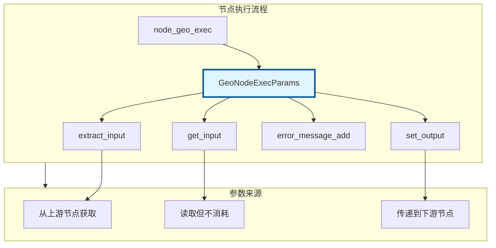

# GeoNodeExecParams - 节点执行参数

> 几何节点执行时的参数接口，用于获取输入和设置输出

---

## 🎯 核心概念



---

## 📦 获取输入

### extract_input - 提取输入（移动语义）

```cpp
#include "NOD_geometry_exec.hh"

static void node_geo_exec(GeoNodeExecParams params)
{
    // 1. 提取基础类型（移动）
    GeometrySet geometry = params.extract_input<GeometrySet>("Geometry"_ustr);
    float3 offset = params.extract_input<float3>("Offset"_ustr);
    float scale = params.extract_input<float>("Scale"_ustr);
    int count = params.extract_input<int>("Count"_ustr);
    bool selection = params.extract_input<bool>("Selection"_ustr);
    
    // 2. 提取字段
    Field<float3> position_field = params.extract_input<Field<float3>>("Position"_ustr);
    Field<float> value_field = params.extract_input<Field<float>>("Value"_ustr);
    Field<bool> selection_field = params.extract_input<Field<bool>>("Selection"_ustr);
    
    // 3. 提取枚举（菜单）
    auto mode = params.extract_input<NodeGeometryTransformMode>("Mode"_ustr);
    
    // 注意：extract_input 只能调用一次！
    // 第二次调用会触发断言错误
}
```

### get_input - 获取输入（拷贝语义）

```cpp
static void node_geo_exec(GeoNodeExecParams params)
{
    // get_input 可以多次调用（拷贝）
    float value1 = params.get_input<float>("Value"_ustr);
    float value2 = params.get_input<float>("Value"_ustr);  // OK
    
    // 适用于需要多次读取的场景
    if (params.get_input<bool>("UseOffset"_ustr)) {
        float3 offset = params.get_input<float3>("Offset"_ustr);
        // 使用 offset...
    }
}
```

---

## 📝 设置输出

### set_output - 设置输出

```cpp
static void node_geo_exec(GeoNodeExecParams params)
{
    // 处理几何体
    GeometrySet geometry = params.extract_input<GeometrySet>("Geometry"_ustr);
    
    // ... 处理逻辑 ...
    
    // 1. 输出几何体
    params.set_output("Geometry"_ustr, std::move(geometry));
    
    // 2. 输出字段
    Field<float3> result_field = compute_field(/* ... */);
    params.set_output("Position"_ustr, std::move(result_field));
    
    // 3. 输出基础类型
    params.set_output("Count"_ustr, int(mesh->totvert));
}
```

---

## ⚠️ 错误处理

### 添加警告/错误信息

```cpp
static void node_geo_exec(GeoNodeExecParams params)
{
    GeometrySet geometry = params.extract_input<GeometrySet>("Geometry"_ustr);
    
    // 检查空几何体
    if (!geometry.has_real()) {
        params.error_message_add(
            NodeWarningType::Info,
            TIP_("Input geometry is empty")
        );
        params.set_output("Geometry"_ustr, std::move(geometry));
        return;
    }
    
    // 检查无效参数
    float scale = params.get_input<float>("Scale"_ustr);
    if (scale < 0.0f) {
        params.error_message_add(
            NodeWarningType::Warning,
            TIP_("Scale should be non-negative")
        );
    }
    
    // 严重错误
    if (scale == 0.0f) {
        params.error_message_add(
            NodeWarningType::Error,
            TIP_("Scale cannot be zero")
        );
        return;
    }
}
```

---

## 🎯 完整示例

### 标准节点模式

```cpp
static void node_geo_exec(GeoNodeExecParams params)
{
    // 1. 提取所有输入
    GeometrySet geometry = params.extract_input<GeometrySet>("Geometry"_ustr);
    const float3 offset = params.get_input<float3>("Offset"_ustr);
    const Field<bool> selection_field = params.extract_input<Field<bool>>("Selection"_ustr);
    
    // 2. 验证输入
    if (!geometry.has_real()) {
        params.set_output("Geometry"_ustr, std::move(geometry));
        return;
    }
    
    // 3. 处理逻辑
    if (Mesh *mesh = geometry.get_mesh_for_write()) {
        const bke::MeshFieldContext context(*mesh, bke::AttrDomain::Point);
        fn::FieldEvaluator evaluator(context, mesh->totvert);
        evaluator.set_selection(selection_field);
        evaluator.evaluate();
        
        const IndexMask mask = evaluator.get_evaluated_selection_as_mask();
        MutableSpan<float3> positions = mesh->vert_positions_for_write();
        
        mask.foreach_index_optimized<int>([&](const int64_t i) {
            positions[i] += offset;
        });
    }
    
    // 4. 设置输出
    params.set_output("Geometry"_ustr, std::move(geometry));
}
```

### 多输出节点

```cpp
static void node_geo_exec(GeoNodeExecParams params)
{
    GeometrySet geometry = params.extract_input<GeometrySet>("Geometry"_ustr);
    
    // 分离不同类型的几何体
    GeometrySet mesh_geometry;
    GeometrySet curves_geometry;
    GeometrySet points_geometry;
    
    if (const Mesh *mesh = geometry.get_mesh()) {
        mesh_geometry.replace_mesh(BKE_mesh_copy_for_eval(mesh));
    }
    if (const Curves *curves = geometry.get_curves()) {
        curves_geometry.replace_curves(BKE_curves_copy_for_eval(curves));
    }
    if (const PointCloud *pc = geometry.get_pointcloud()) {
        points_geometry.replace_pointcloud(BKE_pointcloud_copy_for_eval(pc));
    }
    
    // 设置多个输出
    params.set_output("Mesh"_ustr, std::move(mesh_geometry));
    params.set_output("Curves"_ustr, std::move(curves_geometry));
    params.set_output("Points"_ustr, std::move(points_geometry));
    
    // 数值输出
    int total_count = 0;
    if (const Mesh *mesh = geometry.get_mesh()) {
        total_count += mesh->totvert;
    }
    params.set_output("Count"_ustr, total_count);
}
```

---

## ✅ 检查清单

- [ ] 理解 extract_input 和 get_input 的区别
- [ ] 掌握 extract_input 只能调用一次的规则
- [ ] 了解 set_output 的使用
- [ ] 会用 error_message_add 添加警告
- [ ] 掌握标准节点执行模式

---

## 📁 相关文件

| 文件 | 路径 |
|-----|------|
| NOD_geometry_exec.hh | `source/blender/nodes/NOD_geometry_exec.hh` |

---

## 🔗 相关文档

- [01_SocketDeclaration.md](01_SocketDeclaration.md) - Socket 声明
