# GeoNodeExecParams - 节点执行参数

> 几何节点执行时的参数接口，用于获取输入和设置输出

---

## 🎯 核心概念

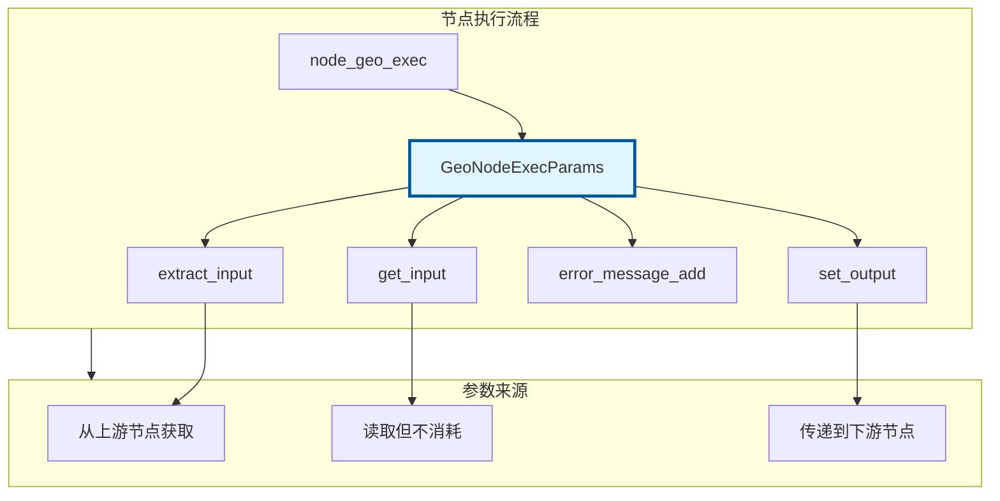

---

## 📦 获取输入

### extract_input - 提取输入（移动语义）

```cpp
#include "NOD_geometry_exec.hh"

static void node_geo_exec(GeoNodeExecParams params)
{
    // 1. 提取基础类型（移动）
    GeometrySet geometry = params.extract_input<GeometrySet>("Geometry"_ustr);
    float3 offset = params.extract_input<float3>("Offset"_ustr);
    float scale = params.extract_input<float>("Scale"_ustr);
    int count = params.extract_input<int>("Count"_ustr);
    bool selection = params.extract_input<bool>("Selection"_ustr);
    
    // 2. 提取字段
    Field<float3> position_field = params.extract_input<Field<float3>>("Position"_ustr);
    Field<float> value_field = params.extract_input<Field<float>>("Value"_ustr);
    Field<bool> selection_field = params.extract_input<Field<bool>>("Selection"_ustr);
    
    // 3. 提取枚举（菜单）
    auto mode = params.extract_input<NodeGeometryTransformMode>("Mode"_ustr);
    
    // 注意：extract_input 只能调用一次！
    // 第二次调用会触发断言错误
}
```

### get_input - 获取输入（拷贝语义）

```cpp
static void node_geo_exec(GeoNodeExecParams params)
{
    // get_input 可以多次调用（拷贝）
    float value1 = params.get_input<float>("Value"_ustr);
    float value2 = params.get_input<float>("Value"_ustr);  // OK
    
    // 适用于需要多次读取的场景
    if (params.get_input<bool>("UseOffset"_ustr)) {
        float3 offset = params.get_input<float3>("Offset"_ustr);
        // 使用 offset...
    }
}
```

---

## 📝 设置输出

### set_output - 设置输出

```cpp
static void node_geo_exec(GeoNodeExecParams params)
{
    // 处理几何体
    GeometrySet geometry = params.extract_input<GeometrySet>("Geometry"_ustr);
    
    // ... 处理逻辑 ...
    
    // 1. 输出几何体
    params.set_output("Geometry"_ustr, std::move(geometry));
    
    // 2. 输出字段
    Field<float3> result_field = compute_field(/* ... */);
    params.set_output("Position"_ustr, std::move(result_field));
    
    // 3. 输出基础类型
    params.set_output("Count"_ustr, int(mesh->totvert));
}
```

---

## ⚠️ 错误处理

### 添加警告/错误信息

```cpp
static void node_geo_exec(GeoNodeExecParams params)
{
    GeometrySet geometry = params.extract_input<GeometrySet>("Geometry"_ustr);
    
    // 检查空几何体
    if (!geometry.has_real()) {
        params.error_message_add(
            NodeWarningType::Info,
            TIP_("Input geometry is empty")
        );
        params.set_output("Geometry"_ustr, std::move(geometry));
        return;
    }
    
    // 检查无效参数
    float scale = params.get_input<float>("Scale"_ustr);
    if (scale < 0.0f) {
        params.error_message_add(
            NodeWarningType::Warning,
            TIP_("Scale should be non-negative")
        );
    }
    
    // 严重错误
    if (scale == 0.0f) {
        params.error_message_add(
            NodeWarningType::Error,
            TIP_("Scale cannot be zero")
        );
        return;
    }
}
```

---

## 🔧 源码详解

### 1. 为什么这么多 `using`？

**文件：** `source/blender/nodes/NOD_geometry_exec.hh:33~64`

```cpp
namespace blender::nodes {

using bke::AttrDomain;
using bke::AttributeAccessor;
using bke::AttributeDomainAndType;
using bke::AttributeFieldInput;
using bke::AttributeFilter;
using bke::AttributeIter;
using bke::AttributeMetaData;
using bke::AttributeReader;
using bke::AttributeWriter;
using bke::CurveComponent;
using bke::GAttributeReader;
using bke::GAttributeWriter;
using bke::GeometryComponent;
using bke::GeometryComponentEditData;
using bke::GeometryNodesReferenceSet;
using bke::GeometrySet;
using bke::GreasePencilComponent;
using bke::GSpanAttributeWriter;
using bke::InstancesComponent;
using bke::MeshComponent;
using bke::MutableAttributeAccessor;
using bke::PointCloudComponent;
using bke::SocketValueVariant;
using bke::SpanAttributeWriter;
using bke::VolumeComponent;
using eval_log::NamedAttributeUsage;
using fn::Field;
using fn::FieldContext;
using fn::FieldEvaluator;
using fn::FieldInput;
using fn::FieldOperation;
using fn::GField;
```

#### 为什么需要这么多 `using`？

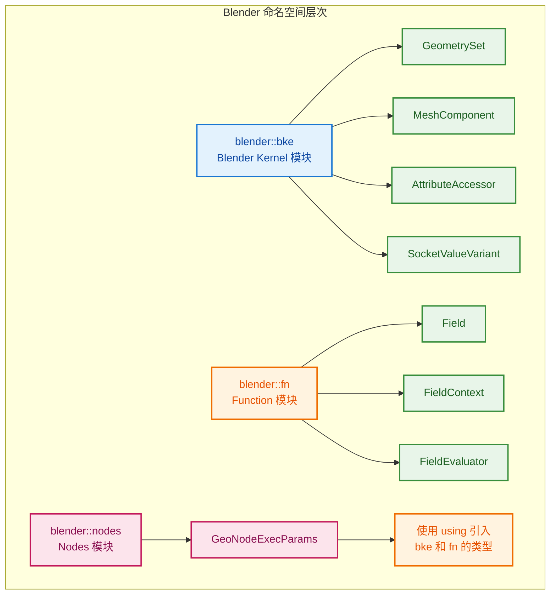

**核心原因：**

1. **命名空间隔离**：Blender 代码库很大，按模块划分命名空间（`bke`、`fn`、`nodes` 等），避免命名冲突。

2. **代码简洁**：`using bke::GeometrySet;` 后，在 `nodes` 命名空间内可以直接写 `GeometrySet` 而不是 `bke::GeometrySet`。

3. **头文件即文档**：这些 `using` 声明明确告诉读者——这个模块依赖哪些外部类型。

4. **模板函数需要**：`extract_input<T>()` 和 `get_input<T>()` 是模板函数，内部直接使用这些类型，需要提前引入。

#### 这些 `using` 各自是什么？

| 分组 | 类型 | 来源 | 作用 |
|------|------|------|------|
| **属性系统** | `AttrDomain` | `bke` | 属性域枚举（点、边、面等） |
| | `AttributeAccessor` | `bke` | 只读属性访问器 |
| | `MutableAttributeAccessor` | `bke` | 可写属性访问器 |
| | `AttributeIter` | `bke` | 属性迭代器 |
| | `AttributeMetaData` | `bke` | 属性元数据 |
| | `AttributeReader` | `bke` | 属性读取器 |
| | `AttributeWriter` | `bke` | 属性写入器 |
| | `GAttributeReader` | `bke` | 泛型属性读取器 |
| | `GAttributeWriter` | `bke` | 泛型属性写入器 |
| | `GSpanAttributeWriter` | `bke` | 泛型 Span 属性写入器 |
| | `SpanAttributeWriter` | `bke` | Span 属性写入器 |
| | `AttributeDomainAndType` | `bke` | 属性域和类型组合 |
| | `AttributeFieldInput` | `bke` | 属性字段输入 |
| | `AttributeFilter` | `bke` | 属性过滤器 |
| **几何组件** | `GeometryComponent` | `bke` | 几何组件基类 |
| | `GeometryComponentEditData` | `bke` | 编辑数据组件 |
| | `GeometrySet` | `bke` | 几何集合 |
| | `MeshComponent` | `bke` | 网格组件 |
| | `CurveComponent` | `bke` | 曲线组件 |
| | `PointCloudComponent` | `bke` | 点云组件 |
| | `InstancesComponent` | `bke` | 实例组件 |
| | `VolumeComponent` | `bke` | 体积组件 |
| | `GreasePencilComponent` | `bke` | 蜡笔组件 |
| **其他** | `SocketValueVariant` | `bke` | Socket 值变体（核心类型） |
| | `GeometryNodesReferenceSet` | `bke` | 几何节点引用集合 |
| | `NamedAttributeUsage` | `eval_log` | 命名属性使用记录 |
| **字段系统** | `Field` | `fn` | 字段模板类 |
| | `GField` | `fn` | 泛型字段 |
| | `FieldContext` | `fn` | 字段上下文 |
| | `FieldEvaluator` | `fn` | 字段求值器 |
| | `FieldInput` | `fn` | 字段输入 |
| | `FieldOperation` | `fn` | 字段操作 |

---

### 2. `extract_input<T>` 模板详解

**文件：** `source/blender/nodes/NOD_geometry_exec.hh:107~146`

```cpp
template<typename T> T extract_input(const UString identifier)
{
#ifndef NDEBUG
    this->check_input_access(identifier);
#endif
    const int index = this->get_input_index(identifier);
    if constexpr (is_GeoNodesMultiInput_v<T>) {
      using ValueT = typename T::value_type;
      BLI_assert(node_.input_by_identifier(identifier)->is_multi_input());
      if constexpr (std::is_same_v<ValueT, SocketValueVariant>) {
        return params_.extract_input<T>(index);
      }
      else {
        auto values_variants = params_.extract_input<GeoNodesMultiInput<SocketValueVariant>>(
            index);
        GeoNodesMultiInput<ValueT> values;
        values.values.reserve(values_variants.values.size());
        for (const int i : values_variants.values.index_range()) {
          values.values.append(values_variants.values[i].extract<ValueT>());
        }
        return values;
      }
    }
    else {
      SocketValueVariant value_variant = params_.extract_input<SocketValueVariant>(index);
      if constexpr (std::is_same_v<T, SocketValueVariant>) {
        return value_variant;
      }
      else if constexpr (std::is_enum_v<T>) {
        return T(value_variant.extract<MenuValue>().value);
      }
      else {
        T value = value_variant.extract<T>();
        if constexpr (std::is_same_v<T, GeometrySet>) {
          this->check_input_geometry_set(identifier, value);
        }
        return value;
      }
    }
}
```

#### 如何理解这段代码？

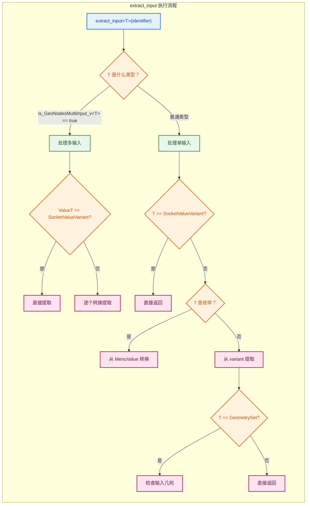

**逐段解析：**

**1. 调试检查**

```cpp
#ifndef NDEBUG
    this->check_input_access(identifier);
#endif
```

**为什么用 `#ifndef NDEBUG` 而不是 `#ifdef DEBUG`？**

这是 C/C++ 标准中的**双重否定**惯用法，看起来有点怪，但有其历史原因：

| 宏 | 含义 | 来源 |
|----|------|------|
| `NDEBUG` | **N**ot **DEBUG**（非调试模式） | C 标准库 `<assert.h>` |
| `DEBUG` | 调试模式（Blender 自定义） | Blender 构建系统 |

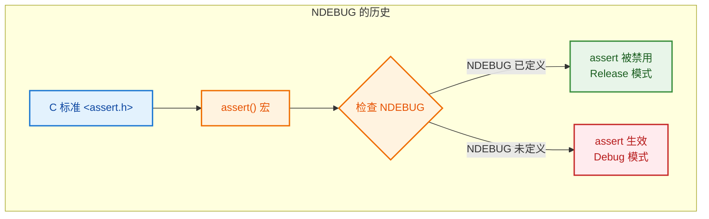

**为什么标准选择 `NDEBUG` 而不是 `DEBUG`？**

1. **历史原因**：C 标准委员会选择 `NDEBUG`（Not Debug）而不是 `DEBUG`，是因为：
   - 默认情况下（不定义任何宏），`assert()` 应该**生效**
   - 只有显式定义了 `NDEBUG`，`assert()` 才被禁用
   - 这样新用户不配置任何宏也能得到调试保护

2. **Blender 的双重检查**：
   ```cpp
   #ifndef NDEBUG   // 如果不是非调试模式 = 如果是调试模式
       check_input_access();
   #endif
   ```

**翻译/解释：**
> 仅在调试模式下检查输入访问。`NDEBUG` 是 C/C++ 标准宏，表示"非调试模式"。在 Release 构建中，这段代码会被完全移除，零运行时开销。

**2. 获取输入索引**

```cpp
const int index = this->get_input_index(identifier);
```

通过 socket 标识符（如 `"Geometry"`）找到对应的输入索引。

**3. 多输入处理分支**

```cpp
if constexpr (is_GeoNodesMultiInput_v<T>) {
```

**`if constexpr`** 是 C++17 的**编译期 if**，在编译时根据类型 `T` 决定走哪个分支。如果 `T` 是 `GeoNodesMultiInput<...>`，就走这个分支。

#### 第 114 行语法详解

```cpp
using ValueT = typename T::value_type;
```

**这行代码看起来怪，但拆开就明白了：**

| 部分 | 含义 |
|------|------|
| `using ValueT =` | 定义类型别名 `ValueT` |
| `typename` | **必须加！** 告诉编译器 `T::value_type` 是一个**类型**而不是成员变量 |
| `T::value_type` | 访问模板参数 `T` 内部的 `value_type` 类型 |

**为什么需要 `typename`？**

```cpp
// 假设 T = GeoNodesMultiInput<float>
// 那么 T 内部有：using value_type = float;

using ValueT = typename T::value_type;
// 展开后等价于：
using ValueT = float;
```

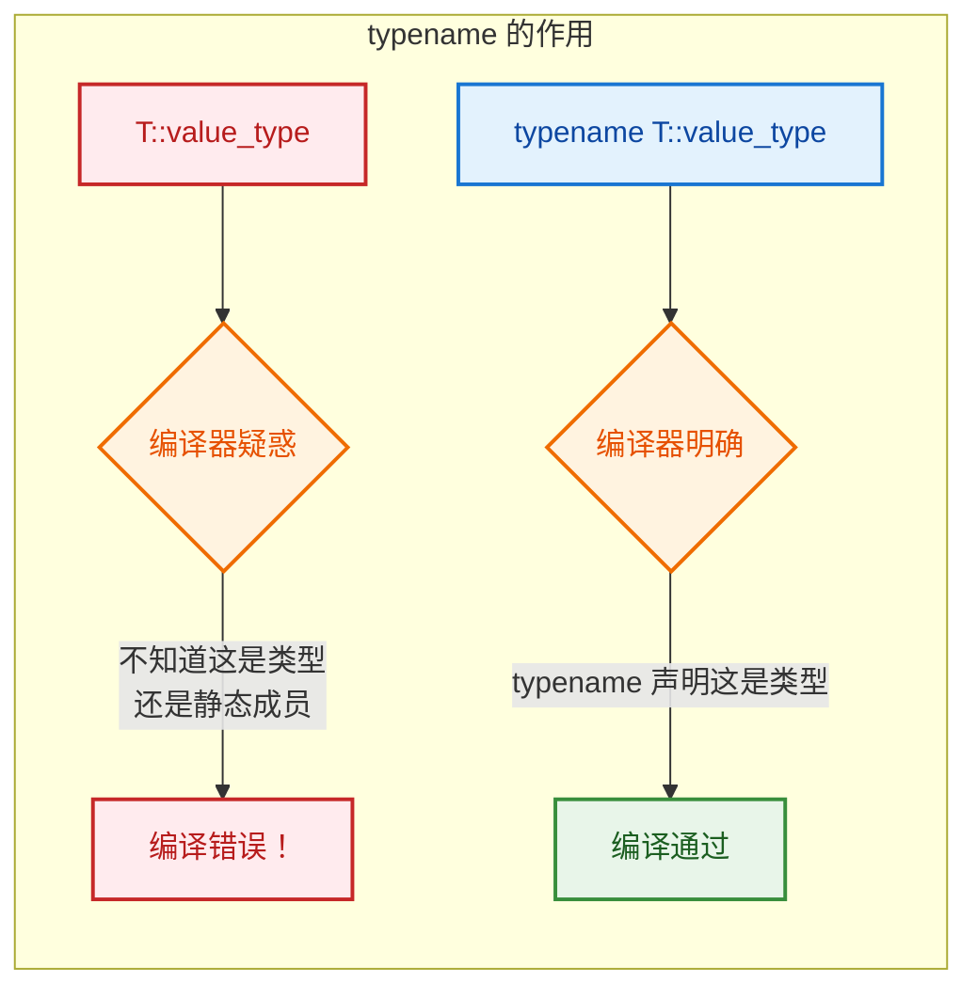

**C++ 规则**：在模板中，使用 `T::xxx` 时，如果 `xxx` 是一个**嵌套类型**（如 `value_type`），必须加 `typename` 关键字。否则编译器无法区分这是类型还是静态成员/函数。

**对比示例：**

```cpp
// ❌ 错误：编译器不知道 value_type 是类型还是成员
template<typename T>
void foo() {
    T::value_type x;  // 编译错误！
}

// ✅ 正确：typename 明确声明这是类型
template<typename T>
void foo() {
    typename T::value_type x;  // OK
}

// ✅ 正确：非模板上下文不需要 typename（编译器已知）
GeoNodesMultiInput<float>::value_type x;  // OK，不需要 typename
```

**什么是 `GeoNodesMultiInput`？**

**文件：** `source/blender/nodes/NOD_geometry_nodes_values.hh:36~42`

```cpp
template<typename T> struct GeoNodesMultiInput {
  using value_type = T;
  Vector<T> values;
};
template<typename T> constexpr bool is_GeoNodesMultiInput_v = false;
template<typename T> constexpr bool is_GeoNodesMultiInput_v<GeoNodesMultiInput<T>> = true;
```

**翻译注释：**
> 几何节点多输入结构。用于处理可以连接多个输入线的 socket（如 "Join Geometry" 节点的 Geometry 输入）。

#### 为什么模板结构体里能用 `using`？然后能通过结构体名访问这个类型别名？

**这是 C++ 的标准特性：类/结构体内部可以定义类型别名（嵌套类型）。**

```cpp
template<typename T> struct GeoNodesMultiInput {
  using value_type = T;   // ← 在结构体内部定义类型别名
  Vector<T> values;
};
```

**`using` 在这里的作用：**

| 写法 | 等价于 | 含义 |
|------|--------|------|
| `using value_type = T;` | `typedef T value_type;` | 定义类型别名 `value_type` 为 `T` |

**两种写法完全等价**，`using` 是 C++11 引入的更现代、更易读的语法。

**如何通过结构体名访问这个类型别名？**

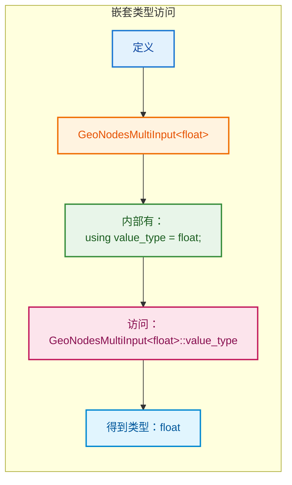

**具体例子：**

```cpp
// 1. 定义模板结构体，内部声明类型别名
template<typename T> struct GeoNodesMultiInput {
    using value_type = T;      // 类型别名
    using container_type = Vector<T>;  // 也可以有多个
    Vector<T> values;
};

// 2. 实例化模板
GeoNodesMultiInput<float> multi_input;

// 3. 通过 :: 访问内部类型别名
GeoNodesMultiInput<float>::value_type      x = 3.14f;  // x 的类型是 float
GeoNodesMultiInput<float>::container_type  vec;        // vec 的类型是 Vector<float>

// 4. 在另一个模板中使用
// source/blender/nodes/NOD_geometry_exec.hh:114
template<typename T>  // T = GeoNodesMultiInput<float>
void process() {
    // T::value_type 就是 GeoNodesMultiInput<float>::value_type，即 float
    using ValueT = typename T::value_type;  // ValueT = float
    ValueT value = 0.0f;
}
```

**这和 STL 标准库的做法一模一样：**

```cpp
// std::vector 也定义了嵌套类型别名
std::vector<int>::value_type      x;  // int
std::vector<int>::size_type       n;  // size_t
std::vector<int>::iterator        it; // 迭代器类型

// std::map 同样
std::map<string, int>::key_type    k;  // string
std::map<string, int>::mapped_type v;  // int
std::map<string, int>::value_type  p;  // pair<const string, int>
```

**为什么要在结构体内部定义 `value_type`？**

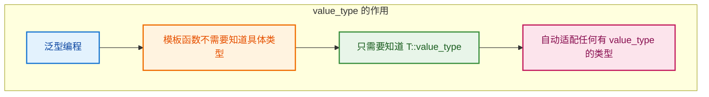

```cpp
// 通用函数：处理任何有 value_type 的类型
template<typename Container>
void process(Container c) {
    // 不需要知道 Container 具体是什么
    // 只需要知道它内部的元素类型
    typename Container::value_type sum = 0;
    for (typename Container::value_type x : c) {
        sum += x;
    }
}

// 可以用于：
process(std::vector<int>());           // value_type = int
process(std::list<float>());           // value_type = float
process(GeoNodesMultiInput<double>()); // value_type = double
```

**总结：**

1. **结构体/类内部可以用 `using` 定义类型别名**（和 `typedef` 等价）
2. **通过 `类名::类型别名` 访问**（如 `GeoNodesMultiInput<float>::value_type`）
3. **这是 C++ 泛型编程的标准做法**，STL 容器都这样做
4. **在模板中需要用 `typename` 关键字**告诉编译器这是类型而不是成员

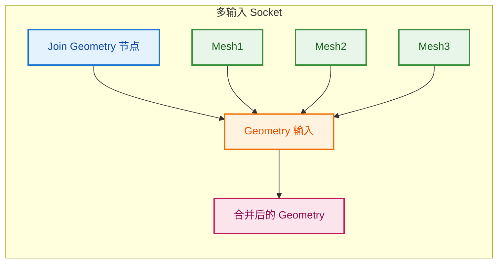

**`is_GeoNodesMultiInput_v` 是什么？**

这是一个**类型特征（Type Trait）**，用于在编译期判断一个类型是否是 `GeoNodesMultiInput`。

#### 代码拆解

**文件：** `source/blender/nodes/NOD_geometry_nodes_values.hh:40~42`

```cpp
// 第 1 行：通用模板 —— 默认所有类型都不是 GeoNodesMultiInput
template<typename T> constexpr bool is_GeoNodesMultiInput_v = false;

// 第 2 行：特化模板 —— 只有 GeoNodesMultiInput<T> 才是
template<typename T> constexpr bool is_GeoNodesMultiInput_v<GeoNodesMultiInput<T>> = true;
```

#### 逐行解释

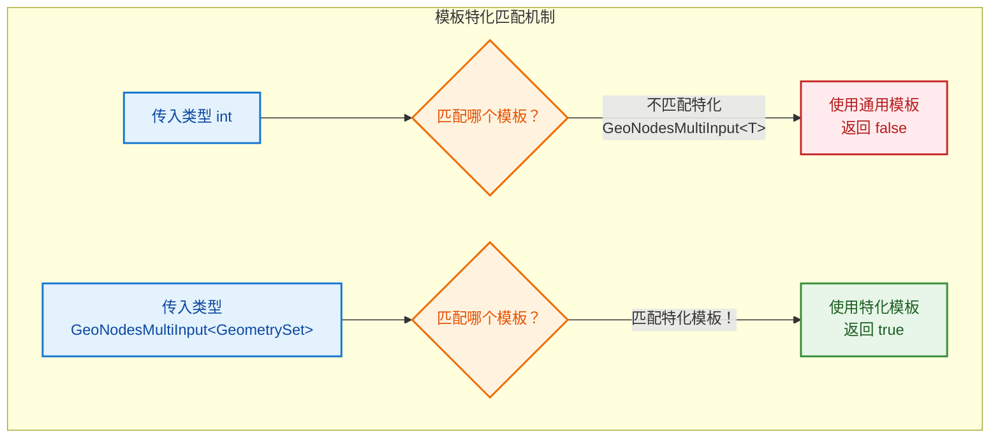

**第 1 行 —— 通用模板（主模板）：**

```cpp
template<typename T> constexpr bool is_GeoNodesMultiInput_v = false;
```

- `template<typename T>`：声明一个模板，接受任意类型 `T`
- `constexpr bool`：编译期常量布尔值
- `= false`：**默认值是 false**
- 含义：**"默认情况下，任何类型都不是 GeoNodesMultiInput"**

**第 2 行 —— 特化模板：**

```cpp
template<typename T> constexpr bool is_GeoNodesMultiInput_v<GeoNodesMultiInput<T>> = true;
```

- `template<typename T>`：特化也需要自己的模板参数
- `<GeoNodesMultiInput<T>>`：**这是关键！** 表示"当主模板的 `T` 是 `GeoNodesMultiInput<T>` 形式时"
- `= true`：**匹配成功时返回 true**
- 含义：**"如果类型是 GeoNodesMultiInput<任意类型>，那么它是 GeoNodesMultiInput"**

#### 匹配过程图解

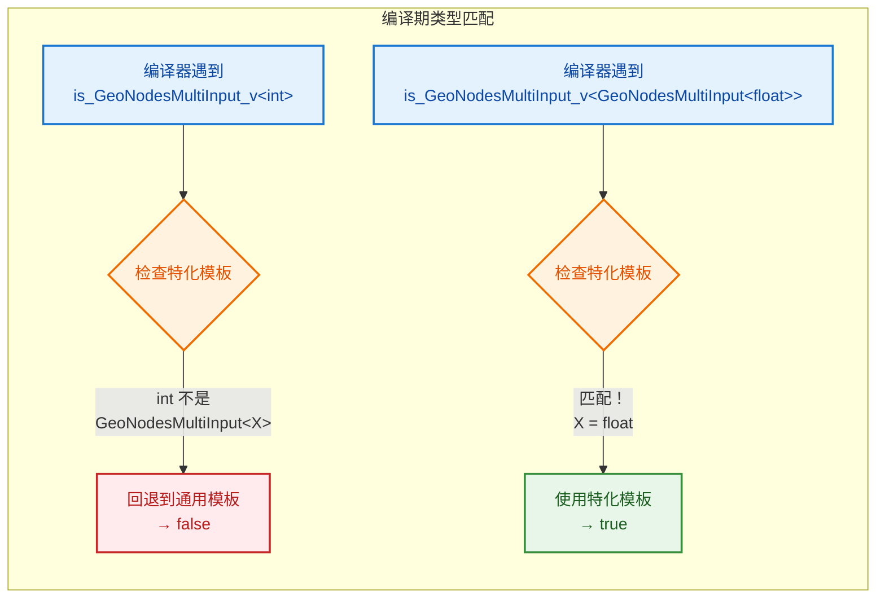

#### 实际匹配示例

| 代码 | 匹配过程 | 结果 |
|------|---------|------|
| `is_GeoNodesMultiInput_v<int>` | `int` 不是 `GeoNodesMultiInput<...>` → 用通用模板 | `false` |
| `is_GeoNodesMultiInput_v<GeometrySet>` | `GeometrySet` 不是 `GeoNodesMultiInput<...>` → 用通用模板 | `false` |
| `is_GeoNodesMultiInput_v<GeoNodesMultiInput<float>>` | 匹配特化！`T = float` | `true` |
| `is_GeoNodesMultiInput_v<GeoNodesMultiInput<GeometrySet>>` | 匹配特化！`T = GeometrySet` | `true` |

#### 为什么要这样设计？

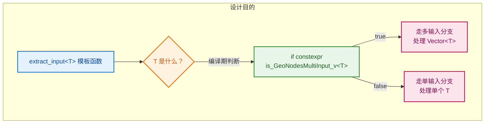

**核心目的**：让 `extract_input<T>()` **一个模板函数**就能同时处理：
- `extract_input<GeometrySet>("Geometry")` → 单输入
- `extract_input<GeoNodesMultiInput<GeometrySet>>("Geometry")` → 多输入

编译器在编译期根据 `T` 的类型自动选择正确的分支，**零运行时开销**。

**4. 多输入内部处理**

```cpp
using ValueT = typename T::value_type;  // 提取 GeoNodesMultiInput<T> 中的 T
BLI_assert(node_.input_by_identifier(identifier)->is_multi_input());
```

**翻译注释：**
> 断言这个输入 socket 确实是多输入类型。

```cpp
if constexpr (std::is_same_v<ValueT, SocketValueVariant>) {
    return params_.extract_input<T>(index);  // 直接提取
}
else {
    // 先提取为 SocketValueVariant，再逐个转换
    auto values_variants = params_.extract_input<GeoNodesMultiInput<SocketValueVariant>>(index);
    GeoNodesMultiInput<ValueT> values;
    values.values.reserve(values_variants.values.size());
    for (const int i : values_variants.values.index_range()) {
        values.values.append(values_variants.values[i].extract<ValueT>());
    }
    return values;
}
```

**5. 普通类型处理分支**

```cpp
else {  // 不是 GeoNodesMultiInput
    SocketValueVariant value_variant = params_.extract_input<SocketValueVariant>(index);
    
    if constexpr (std::is_same_v<T, SocketValueVariant>) {
        return value_variant;  // 直接返回 variant
    }
    else if constexpr (std::is_enum_v<T>) {
        return T(value_variant.extract<MenuValue>().value);  // 枚举从 MenuValue 转换
    }
    else {
        T value = value_variant.extract<T>();  // 从 variant 提取具体类型
        if constexpr (std::is_same_v<T, GeometrySet>) {
            this->check_input_geometry_set(identifier, value);  // 几何体额外检查
        }
        return value;
    }
}
```

---

### 3. `get_input<T>` vs `extract_input<T>` 的区别

**文件：** `source/blender/nodes/NOD_geometry_exec.hh:154~191`

```cpp
template<typename T> T get_input(const UString identifier) const
{
#ifndef NDEBUG
    this->check_input_access(identifier);
#endif
    const int index = this->get_input_index(identifier);
    // ... 类似 extract_input，但使用 params_.get_input 而不是 params_.extract_input
}
```

| 特性 | `extract_input<T>` | `get_input<T>` |
|------|-------------------|----------------|
| **语义** | **移动**（Move） | **拷贝**（Copy） |
| **调用次数** | **只能一次** | **可以多次** |
| **开销** | 低（转移所有权） | 高（深拷贝） |
| **适用场景** | 大对象（GeometrySet、Field） | 小对象（float、int、bool） |
| **const 修饰符** | 非 const | const |

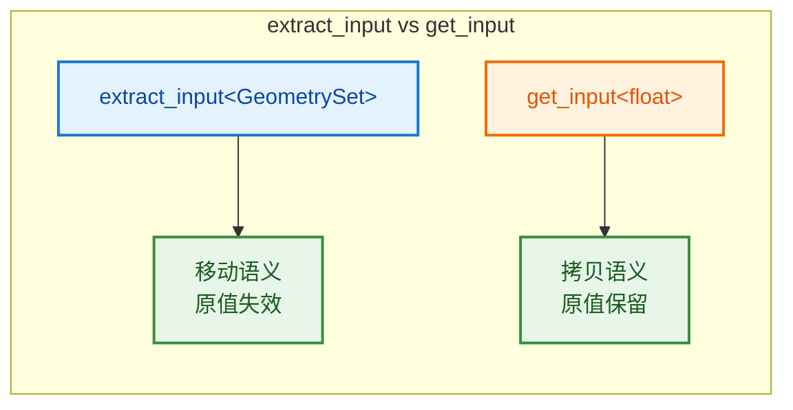

---

## 🎯 完整示例

### 标准节点模式

```cpp
static void node_geo_exec(GeoNodeExecParams params)
{
    // 1. 提取所有输入
    GeometrySet geometry = params.extract_input<GeometrySet>("Geometry"_ustr);
    const float3 offset = params.get_input<float3>("Offset"_ustr);
    const Field<bool> selection_field = params.extract_input<Field<bool>>("Selection"_ustr);
    
    // 2. 验证输入
    if (!geometry.has_real()) {
        params.set_output("Geometry"_ustr, std::move(geometry));
        return;
    }
    
    // 3. 处理逻辑
    if (Mesh *mesh = geometry.get_mesh_for_write()) {
        const bke::MeshFieldContext context(*mesh, bke::AttrDomain::Point);
        fn::FieldEvaluator evaluator(context, mesh->totvert);
        evaluator.set_selection(selection_field);
        evaluator.evaluate();
        
        const IndexMask mask = evaluator.get_evaluated_selection_as_mask();
        MutableSpan<float3> positions = mesh->vert_positions_for_write();
        
        mask.foreach_index_optimized<int>([&](const int64_t i) {
            positions[i] += offset;
        });
    }
    
    // 4. 设置输出
    params.set_output("Geometry"_ustr, std::move(geometry));
}
```

### 多输入节点

```cpp
static void node_geo_exec(GeoNodeExecParams params)
{
    // 提取多输入（如 Join Geometry 节点）
    GeoNodesMultiInput<GeometrySet> geometries =
        params.extract_input<GeoNodesMultiInput<GeometrySet>>("Geometry"_ustr);
    
    GeometrySet result;
    for (const GeometrySet &geometry : geometries.values) {
        // 合并每个输入几何
        result.add(geometry);
    }
    
    params.set_output("Geometry"_ustr, std::move(result));
}
```

### 多输出节点

```cpp
static void node_geo_exec(GeoNodeExecParams params)
{
    GeometrySet geometry = params.extract_input<GeometrySet>("Geometry"_ustr);
    
    // 分离不同类型的几何体
    GeometrySet mesh_geometry;
    GeometrySet curves_geometry;
    GeometrySet points_geometry;
    
    if (const Mesh *mesh = geometry.get_mesh()) {
        mesh_geometry.replace_mesh(BKE_mesh_copy_for_eval(mesh));
    }
    if (const Curves *curves = geometry.get_curves()) {
        curves_geometry.replace_curves(BKE_curves_copy_for_eval(curves));
    }
    if (const PointCloud *pc = geometry.get_pointcloud()) {
        points_geometry.replace_pointcloud(BKE_pointcloud_copy_for_eval(pc));
    }
    
    // 设置多个输出
    params.set_output("Mesh"_ustr, std::move(mesh_geometry));
    params.set_output("Curves"_ustr, std::move(curves_geometry));
    params.set_output("Points"_ustr, std::move(points_geometry));
    
    // 数值输出
    int total_count = 0;
    if (const Mesh *mesh = geometry.get_mesh()) {
        total_count += mesh->totvert;
    }
    params.set_output("Count"_ustr, total_count);
}
```

---

## ✅ 检查清单

- [ ] 理解 extract_input 和 get_input 的区别
- [ ] 掌握 extract_input 只能调用一次的规则
- [ ] 了解 set_output 的使用
- [ ] 会用 error_message_add 添加警告
- [ ] 掌握标准节点执行模式
- [ ] 理解 GeoNodesMultiInput 的用途
- [ ] 理解 using 声明的作用

---

## 📁 相关文件

| 文件 | 路径 |
|-----|------|
| NOD_geometry_exec.hh | `source/blender/nodes/NOD_geometry_exec.hh` |
| NOD_geometry_nodes_values.hh | `source/blender/nodes/NOD_geometry_nodes_values.hh` |

---

## 🔗 相关文档

- [01_SocketDeclaration.md](01_SocketDeclaration.md) - Socket 声明
- [12_GeometrySet.md](12_GeometrySet.md) - GeometrySet 详解
