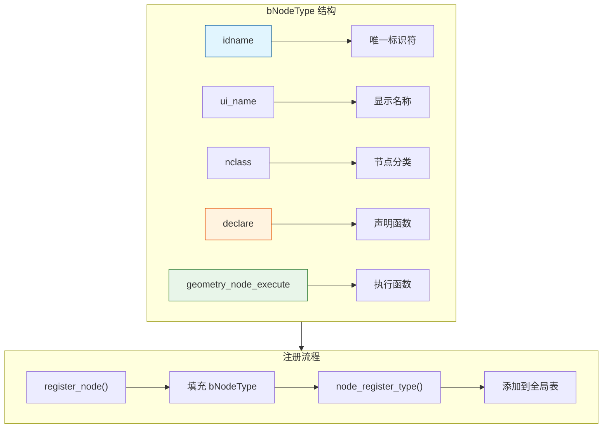

# bNodeType - 节点类型

> 定义节点类型的元数据结构，包含节点的标识、分类、执行函数等核心信息

---

## 🎯 核心概念



---

## 📦 核心成员

```cpp
// source/blender/blenkernel/BKE_node.hh

struct bNodeType {
    // 标识信息
    UString idname;                    // 唯一标识符（如 "GeometryNodeTransform"）
    const char *ui_name;               // 显示名称（如 "Transform Geometry"）
    const char *ui_description;        // 描述
    const char *enum_name_legacy;      // 旧版枚举名
    
    // 分类
    int nclass;                        // 节点分类（NODE_CLASS_GEOMETRY 等）
    int ntype;                         // 子类型
    
    // 函数指针
    void (*declare)(NodeDeclarationBuilder &builder);           // 声明函数
    void (*geometry_node_execute)(GeoNodeExecParams params);    // 执行函数
    void (*initfunc)(bNodeTree *ntree, bNode *node);            // 初始化函数
    void (*freefunc)(bNode *node);                              // 释放函数
    void (*copyfunc)(bNodeTree *dst_ntree, bNode *dst_node, 
                     const bNode *src_node);                    // 拷贝函数
    
    // 图标
    int ui_icon;                       // 节点图标
};
```

---

## 🚀 节点注册

### 注册函数示例

```cpp
// 节点注册函数
static void register_node()
{
    static bke::bNodeType ntype;
    
    // 基础信息
    geo_node_type_base(&ntype, "GeometryNodeTransform"_ustr, GEO_NODE_TRANSFORM_GEOMETRY);
    ntype.ui_name = "Transform Geometry";
    ntype.ui_description = "Translate, rotate or scale the geometry";
    ntype.enum_name_legacy = "TRANSFORM_GEOMETRY";
    
    // 分类
    ntype.nclass = NODE_CLASS_GEOMETRY;
    
    // 函数指针
    ntype.declare = node_declare;                    // Socket 声明
    ntype.geometry_node_execute = node_geo_exec;     // 执行函数
    ntype.initfunc = node_init;                      // 初始化（可选）
    ntype.freefunc = node_free;                      // 释放（可选）
    
    // 图标
    ntype.ui_icon = ICON_NODE_TRANSFORM;
    
    // 注册
    bke::node_register_type(ntype);
}

// 使用宏自动注册
NOD_REGISTER_NODE(register_node)
```

---

## 📋 节点分类

### nclass 常量

| 分类 | 值 | 用途 |
|-----|---|------|
| `NODE_CLASS_INPUT` | 0 | 输入节点 |
| `NODE_CLASS_OUTPUT` | 1 | 输出节点 |
| `NODE_CLASS_OP_COLOR` | 2 | 颜色操作 |
| `NODE_CLASS_OP_VECTOR` | 3 | 向量操作 |
| `NODE_CLASS_OP_FILTER` | 4 | 滤镜操作 |
| `NODE_CLASS_GROUP` | 5 | 节点组 |
| `NODE_CLASS_CONVERTER` | 6 | 转换器 |
| `NODE_CLASS_MATTE` | 7 | 遮罩 |
| `NODE_CLASS_DISTORT` | 8 | 扭曲 |
| `NODE_CLASS_PATTERN` | 9 | 图案 |
| `NODE_CLASS_TEXTURE` | 10 | 纹理 |
| `NODE_CLASS_GEOMETRY` | 41 | 几何操作 |
| `NODE_CLASS_ATTRIBUTE` | 42 | 属性操作 |

---

## 🎨 完整节点定义示例

### 简单节点

```cpp
namespace blender::nodes::node_geo_transform_cc {

// 1. 声明函数
static void node_declare(NodeDeclarationBuilder &b)
{
    b.use_custom_socket_order();
    
    b.add_input<decl::Geometry>("Geometry"_ustr)
        .is_default_link_socket();
    
    b.add_input<decl::Vector>("Translation"_ustr)
        .default_value({0.0f, 0.0f, 0.0f})
        .subtype(PROP_TRANSLATION);
    
    b.add_output<decl::Geometry>("Geometry"_ustr)
        .propagate_all()
        .align_with_previous();
}

// 2. 执行函数
static void node_geo_exec(GeoNodeExecParams params)
{
    GeometrySet geometry = params.extract_input<GeometrySet>("Geometry"_ustr);
    const float3 translation = params.get_input<float3>("Translation"_ustr);
    
    // 处理...
    
    params.set_output("Geometry"_ustr, std::move(geometry));
}

// 3. 注册函数
static void register_node()
{
    static bke::bNodeType ntype;
    
    geo_node_type_base(&ntype, "GeometryNodeTransform"_ustr, GEO_NODE_TRANSFORM_GEOMETRY);
    ntype.ui_name = "Transform Geometry";
    ntype.ui_description = "Translate, rotate or scale the geometry";
    ntype.enum_name_legacy = "TRANSFORM_GEOMETRY";
    ntype.nclass = NODE_CLASS_GEOMETRY;
    ntype.declare = node_declare;
    ntype.geometry_node_execute = node_geo_exec;
    
    bke::node_register_type(ntype);
}

NOD_REGISTER_NODE(register_node)

} // namespace blender::nodes::node_geo_transform_cc
```

### 带初始化函数的节点

```cpp
// 节点存储数据
typedef struct NodeTransformData {
    float matrix[4][4];
    int mode;
} NodeTransformData;

// 初始化函数
static void node_init(bNodeTree *ntree, bNode *node)
{
    NodeTransformData *data = MEM_cnew<NodeTransformData>(__func__);
    unit_m4(data->matrix);
    data->mode = 0;
    node->storage = data;
}

// 释放函数
static void node_free(bNode *node)
{
    MEM_freeN(node->storage);
}

// 拷贝函数
static void node_copy(bNodeTree *dst_ntree, bNode *dst_node, const bNode *src_node)
{
    NodeTransformData *src_data = (NodeTransformData *)src_node->storage;
    NodeTransformData *dst_data = MEM_dupallocN<NodeTransformData>(src_data);
    dst_node->storage = dst_data;
}

// 注册时设置
static void register_node()
{
    static bke::bNodeType ntype;
    // ...
    ntype.initfunc = node_init;
    ntype.freefunc = node_free;
    ntype.copyfunc = node_copy;
    // ...
}
```

---

## ✅ 检查清单

- [ ] 理解 bNodeType 的核心成员
- [ ] 掌握节点注册流程
- [ ] 了解节点分类（nclass）
- [ ] 理解 declare 和 geometry_node_execute 的作用
- [ ] 了解存储数据的生命周期管理

---

## 📁 相关文件

| 文件 | 路径 |
|-----|------|
| BKE_node.hh | `source/blender/blenkernel/BKE_node.hh` |
| BKE_node_runtime.hh | `source/blender/blenkernel/BKE_node_runtime.hh` |

---

## 🔗 相关文档

- [02_GeoNodeExecParams.md](02_GeoNodeExecParams.md) - 节点执行参数
- [01_SocketDeclaration.md](01_SocketDeclaration.md) - Socket 声明
