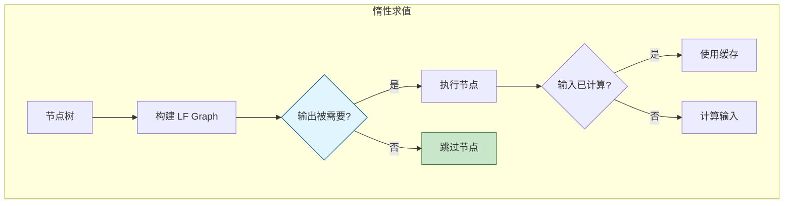

# LazyFunction - 惰性函数系统

> 惰性求值执行系统，按需计算节点输出，支持条件分支优化

---

## 🎯 核心概念



---

## 📦 核心组件

### lf::Graph - 惰性函数图

```cpp
#include "FN_lazy_function.hh"

namespace blender::nodes {

// 构建 LF Graph
class GeometryNodesLazyFunctionGraphBuilder {
public:
    lf::Graph graph_;
    
    void build(const bNodeTree &node_tree) {
        // 为每个节点创建 LF 节点
        for (const bNode *node : node_tree.all_nodes()) {
            build_node(*node);
        }
        
        // 连接输入输出
        for (const bNodeLink *link : node_tree.all_links()) {
            build_link(*link);
        }
    }
    
    void build_node(const bNode &node) {
        // 创建函数节点
        lf::FunctionNode &lf_node = graph_.add_function(
            get_node_function(node)
        );
        
        // 存储映射关系
        node_to_lf_node_map_.add(&node, &lf_node);
    }
};

} // namespace blender::nodes
```

### lf::Params - 执行参数

```cpp
// 节点执行时获取输入参数
class GeoNodeExecParams {
    lf::Params &params_;
    
public:
    template<typename T>
    T extract_input(const UString identifier) {
        const int index = get_input_index(identifier);
        return params_.extract_input<T>(index);
    }
    
    template<typename T>
    void set_output(const UString identifier, T &&value) {
        const int index = get_output_index(identifier);
        params_.set_output<T>(index, std::forward<T>(value));
    }
};
```

---

## 🚀 执行流程

```cpp
// 执行惰性函数图
static void execute_lazy_function_graph(
    const lf::Graph &graph,
    const lf::Context &context)
{
    // 1. 创建执行器
    lf::Executor executor(graph);
    
    // 2. 准备输入
    lf::Params params = executor.init_params();
    
    // 3. 设置输入值
    for (const auto &[socket, value] : input_values) {
        params.set_input(socket.index, value);
    }
    
    // 4. 执行（惰性求值）
    executor.execute(params, context);
    
    // 5. 获取输出
    for (const auto &[socket, value] : output_sockets) {
        value = params.extract_output(socket.index);
    }
}
```

---

## ✅ 检查清单

- [ ] 理解惰性求值的概念
- [ ] 了解 LF Graph 的构建过程
- [ ] 理解条件分支的优化原理
- [ ] 掌握执行流程

---

## 📁 相关文件

| 文件 | 路径 |
|-----|------|
| FN_lazy_function.hh | `source/blender/functions/FN_lazy_function.hh` |
| geometry_nodes_lazy_function.cc | `source/blender/nodes/intern/geometry_nodes_lazy_function.cc` |

---

## 🔗 相关文档

- [05_MultiFunction.md](05_MultiFunction.md) - 多函数系统
