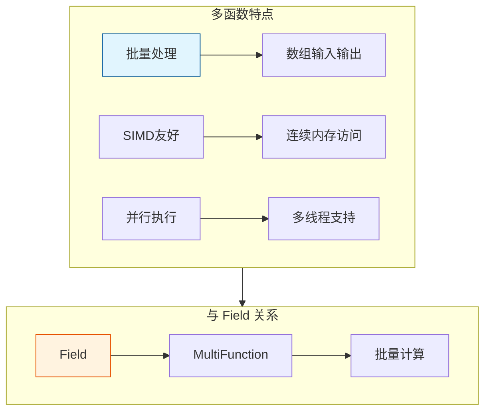

# MultiFunction - 多函数系统

> 批量数据处理的函数系统，支持 SIMD 优化和并行执行

---

## 🎯 核心概念



---

## 📦 核心类

### MultiFunction

```cpp
#include "FN_multi_function.hh"

namespace blender::fn {

// 多函数基类
class MultiFunction {
public:
    virtual void call(const IndexMask &mask, Params params) const = 0;
    virtual Signature signature() const = 0;
};

// 参数封装
class Params {
public:
    template<typename T>
    Span<T> readonly_single_input(int param_index) const;
    
    template<typename T>
    MutableSpan<T> uninitialized_single_output(int param_index) const;
    
    template<typename T>
    VArray<T> readonly_vector_input(int param_index) const;
};

} // namespace blender::fn
```

---

## 🚀 使用示例

### 调用多函数

```cpp
// 获取加法函数
static const MultiFunction &get_add_fn()
{
    static const auto &fn = multi_function::registry::lookup("float3 + float3"_ustr);
    return fn;
}

// 使用多函数
void add_vectors(Span<float3> a, Span<float3> b, MutableSpan<float3> result)
{
    const MultiFunction &add_fn = get_add_fn();
    
    // 构建参数
    MultiFunctionParams params;
    params.add_readonly_single_input(a);
    params.add_readonly_single_input(b);
    params.add_uninitialized_single_output(result);
    
    // 执行（批量）
    add_fn.call(IndexMask(a.size()), params);
}
```

### 字段运算

```cpp
// 创建字段运算
Field<float3> add_fields(const Field<float3> &a, const Field<float3> &b)
{
    return FieldOperation::from(
        get_add_fn(),
        {a, b}
    );
}
```

---

## ✅ 检查清单

- [ ] 理解多函数的批量处理特性
- [ ] 了解与 Field 的关系
- [ ] 掌握多函数调用方式

---

## 📁 相关文件

| 文件 | 路径 |
|-----|------|
| FN_multi_function.hh | `source/blender/functions/FN_multi_function.hh` |

---

## 🔗 相关文档

- [04_LazyFunction.md](04_LazyFunction.md) - 惰性函数
