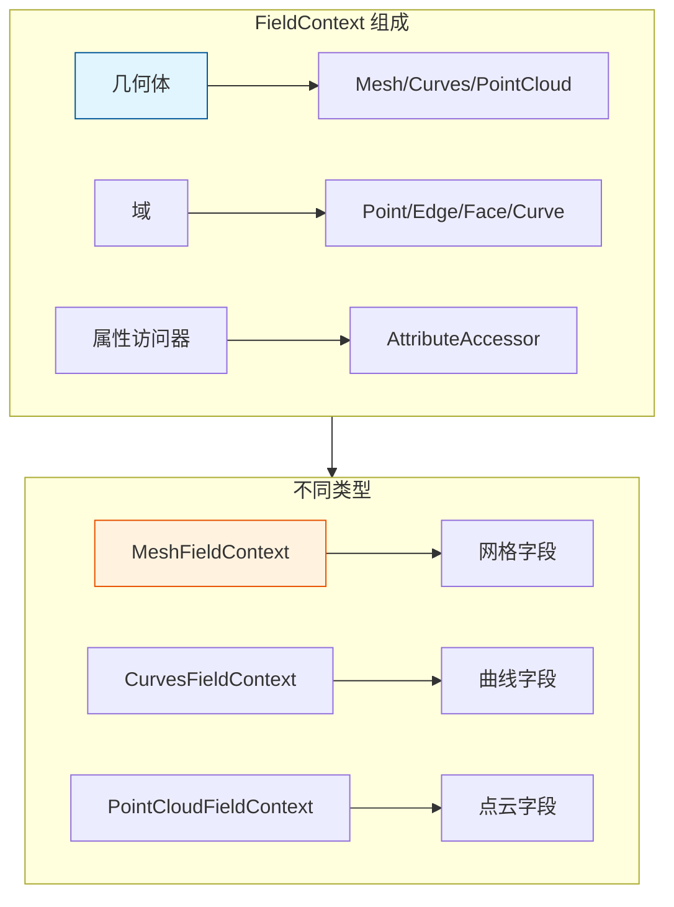

# FieldContext - 字段上下文

> 为字段求值提供几何体和域信息，是字段计算的环境
- [FieldContext - 字段上下文](#fieldcontext---字段上下文)
  - [🎯 核心概念](#-核心概念)
  - [📦 核心类](#-核心类)
    - [MeshFieldContext](#meshfieldcontext)
  - [🚀 使用示例](#-使用示例)
    - [创建字段上下文](#创建字段上下文)
  - [📋 域类型](#-域类型)
  - [✅ 检查清单](#-检查清单)
  - [📁 相关文件](#-相关文件)
  - [🔗 相关文档](#-相关文档)

---

## 🎯 核心概念



---

## 📦 核心类

### MeshFieldContext

```cpp
#include "BKE_geometry_fields.hh"

namespace blender::bke {

// 网格字段上下文
class MeshFieldContext : public FieldContext {
    const Mesh &mesh_;
    AttrDomain domain_;
    
public:
    MeshFieldContext(const Mesh &mesh, AttrDomain domain)
        : mesh_(mesh), domain_(domain) {}
    
    // 获取属性
    GVArray get_varray_for_input(const FieldInput &input) const override;
    
    // 获取域大小
    int64_t size() const {
        switch (domain_) {
            case AttrDomain::Point: return mesh_.totvert;
            case AttrDomain::Edge: return mesh_.totedge;
            case AttrDomain::Face: return mesh_.totface;
            case AttrDomain::FaceCorner: return mesh_.totloop;
        }
    }
};

} // namespace blender::bke
```

---

## 🚀 使用示例

### 创建字段上下文

```cpp
static void node_geo_exec(GeoNodeExecParams params)
{
    GeometrySet geometry = params.extract_input<GeometrySet>("Geometry"_ustr);
    
    if (Mesh *mesh = geometry.get_mesh()) {
        // 创建点域上下文
        const MeshFieldContext point_context(*mesh, AttrDomain::Point);
        
        // 创建面域上下文
        const MeshFieldContext face_context(*mesh, AttrDomain::Face);
        
        // 字段求值...
        Field<float> field = params.extract_input<Field<float>>("Value"_ustr);
        
        FieldEvaluator point_evaluator(point_context, mesh->totvert);
        Array<float> point_result(mesh->totvert);
        point_evaluator.add_with_destination(field, point_result.as_mutable_span());
        point_evaluator.evaluate();
        
        FieldEvaluator face_evaluator(face_context, mesh->totface);
        Array<float> face_result(mesh->totface);
        face_evaluator.add_with_destination(field, face_result.as_mutable_span());
        face_evaluator.evaluate();
    }
}
```

---

## 📋 域类型

| 域 | 适用几何 | 元素 |
|---|---------|------|
| `AttrDomain::Point` | Mesh, Curves, PointCloud | 顶点/点 |
| `AttrDomain::Edge` | Mesh | 边 |
| `AttrDomain::Face` | Mesh | 面 |
| `AttrDomain::FaceCorner` | Mesh | 面角 |
| `AttrDomain::Curve` | Curves | 曲线 |

---

## ✅ 检查清单

- [ ] 理解 FieldContext 的作用
- [ ] 掌握不同几何类型的上下文
- [ ] 了解域的概念

---

## 📁 相关文件

| 文件 | 路径 |
|-----|------|
| BKE_geometry_fields.hh | `source/blender/blenkernel/BKE_geometry_fields.hh` |

---

## 🔗 相关文档

- [10_Field.md](../基础库/10_Field.md) - 字段系统
