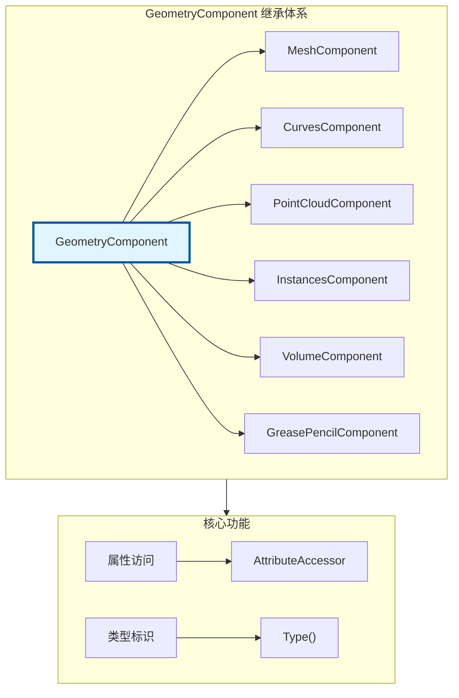

# GeometryComponent - 几何组件基类

> 所有几何类型的抽象基类，提供统一的属性和数据访问接口

---

## 🎯 核心概念



---

## 📦 核心类

### GeometryComponent

```cpp
#include "BKE_geometry_set.hh"

namespace blender::bke {

class GeometryComponent {
public:
    enum class Type {
        Mesh,
        Curve,
        PointCloud,
        Volume,
        Instance,
        GreasePencil,
    };
    
    // 获取类型
    virtual Type type() const = 0;
    
    // 属性访问
    virtual const AttributeAccessor *attributes() const = 0;
    virtual MutableAttributeAccessor *attributes_for_write() = 0;
    
    // 检查是否有真实数据
    virtual bool has_real() const = 0;
    
    // 获取元素数量
    virtual int64_t element_count() const = 0;
};

} // namespace blender::bke
```

---

## 🚀 使用示例

### 遍历组件

```cpp
static void process_all_components(const GeometrySet &geometry)
{
    geometry.foreach_component([&](const GeometryComponent &component) {
        switch (component.type()) {
            case GeometryComponent::Type::Mesh: {
                const MeshComponent &mesh_comp = static_cast<const MeshComponent &>(component);
                process_mesh(mesh_comp.get());
                break;
            }
            case GeometryComponent::Type::Curve: {
                const CurvesComponent &curves_comp = static_cast<const CurvesComponent &>(component);
                process_curves(curves_comp.get());
                break;
            }
            case GeometryComponent::Type::PointCloud: {
                const PointCloudComponent &pc_comp = static_cast<const PointCloudComponent &>(component);
                process_pointcloud(pc_comp.get());
                break;
            }
            default:
                break;
        }
    });
}
```

---

## ✅ 检查清单

- [ ] 理解 GeometryComponent 的继承体系
- [ ] 掌握组件类型判断
- [ ] 了解属性访问接口

---

## 📁 相关文件

| 文件 | 路径 |
|-----|------|
| BKE_geometry_set.hh | `source/blender/blenkernel/BKE_geometry_set.hh` |

---

## 🔗 相关文档

- [11_GeometrySet.md](../基础库/11_GeometrySet.md) - 几何体集合
