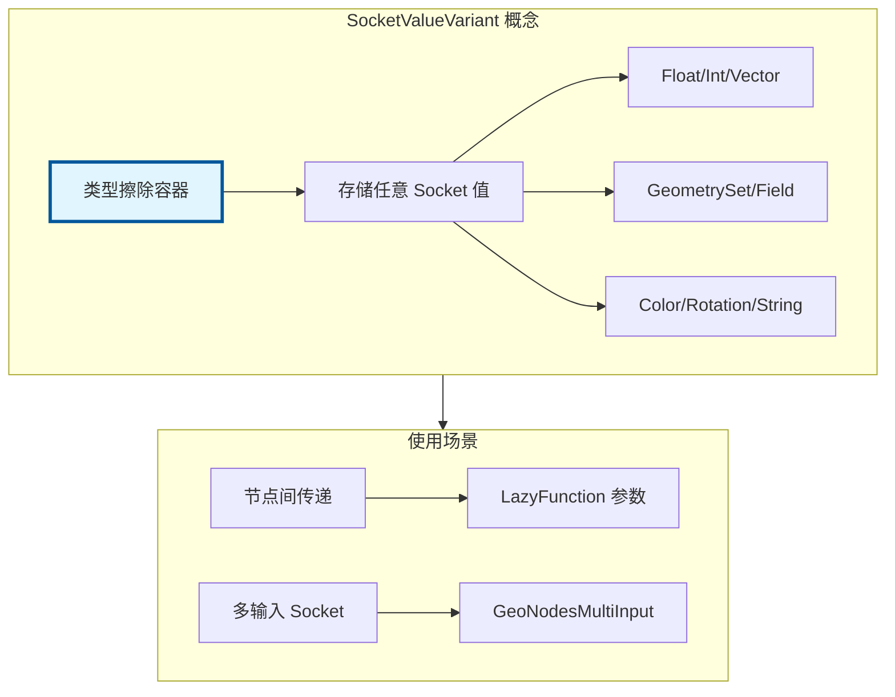

# SocketValueVariant - Socket 值变体

> 类型擦除的 Socket 值容器，支持几何节点中所有可能的 Socket 类型

---

## 🎯 核心概念



---

## 📦 核心类

### SocketValueVariant

```cpp
#include "BKE_node_socket_value.hh"

namespace blender::bke {

class SocketValueVariant {
    std::variant<
        std::monostate,
        float,
        int,
        float3,
        float4,
        math::Quaternion,
        math::EulerXYZ,
        bool,
        ColorGeometry4f,
        std::string,
        GeometrySet,
        fn::GField,
        bke::SocketValueVariantPointer,
        MenuValue
    > value_;

public:
    // 构造
    SocketValueVariant() = default;
    template<typename T> SocketValueVariant(T &&value);

    // 获取值
    template<typename T> T get() const;
    template<typename T> T extract();

    // 获取类型
    eNodeSocketDatatype get_type() const;

    // 检查是否为空
    bool is_empty() const;
};

} // namespace blender::bke
```

---

## 🚀 使用示例

### 基本操作

```cpp
static void socket_value_examples()
{
    // 1. 构造
    SocketValueVariant float_val(1.0f);
    SocketValueVariant int_val(42);
    SocketValueVariant vec_val(float3(1, 2, 3));
    SocketValueVariant geo_val(GeometrySet::from_mesh(mesh));

    // 2. 获取值
    float f = float_val.get<float>();
    int i = int_val.get<int>();
    float3 v = vec_val.get<float3>();
    GeometrySet g = geo_val.get<GeometrySet>();

    // 3. 提取值（移动）
    GeometrySet g2 = geo_val.extract<GeometrySet>();
}
```

### 多输入 Socket

```cpp
// 多输入值容器
template<typename T>
struct GeoNodesMultiInput {
    Vector<T> values;
};

// 提取多输入
static void extract_multi_input(GeoNodeExecParams params)
{
    // 提取多个几何体
    auto geometries = params.extract_input<GeoNodesMultiInput<GeometrySet>>("Geometries"_ustr);

    // 合并所有几何体
    GeometrySet result;
    for (GeometrySet &geo : geometries.values) {
        // 合并逻辑...
    }
}
```

---

## ✅ 检查清单

- [ ] 理解 SocketValueVariant 的类型擦除机制
- [ ] 掌握 get 和 extract 的区别
- [ ] 了解多输入 Socket 的处理

---

## 📁 相关文件

| 文件 | 路径 |
|-----|------|
| BKE_node_socket_value.hh | `source/blender/blenkernel/BKE_node_socket_value.hh` |

---

## 🔗 相关文档

- [02_GeoNodeExecParams.md](02_GeoNodeExecParams.md) - 节点执行参数
