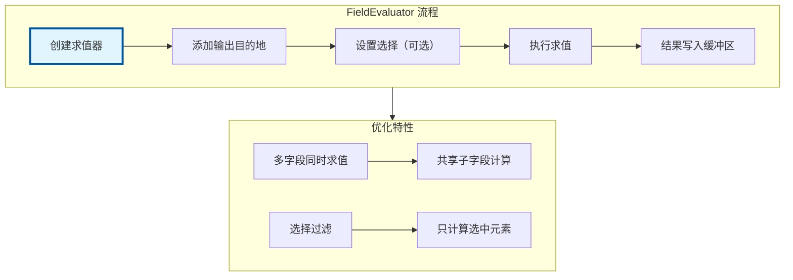

# FieldEvaluator - 字段求值器

> 批量求值字段的核心工具，支持多字段同时求值和选择过滤

---

## 🎯 核心概念



---

## 📦 核心类

### FieldEvaluator

```cpp
#include "FN_field.hh"

namespace blender::fn {

class FieldEvaluator {
    const FieldContext &context_;
    int64_t size_;
    Vector<GField> fields_;
    Vector<GVArray *> destinations_;
    std::optional<IndexMask> selection_;
    
public:
    FieldEvaluator(const FieldContext &context, int64_t size)
        : context_(context), size_(size) {}
    
    // 添加输出目的地
    template<typename T>
    void add_with_destination(const Field<T> &field, MutableSpan<T> dst);
    
    void add_with_destination(const GField &field, GMutableSpan dst);
    
    // 设置选择
    void set_selection(const Field<bool> &selection_field);
    void set_selection(const IndexMask &mask);
    
    // 执行求值
    void evaluate();
    
    // 获取选择掩码
    IndexMask get_evaluated_selection_as_mask();
};

} // namespace blender::fn
```

---

## 🚀 使用示例

### 基础求值

```cpp
static void basic_field_evaluation()
{
    // 1. 创建上下文
    const bke::MeshFieldContext context(mesh, bke::AttrDomain::Point);
    
    // 2. 创建求值器
    FieldEvaluator evaluator(context, mesh.totvert);
    
    // 3. 分配输出缓冲区
    Array<float3> result(mesh.totvert);
    
    // 4. 添加字段和目的地
    Field<float3> position_field = bke::AttributeFieldInput::Create<float3>("position");
    evaluator.add_with_destination(position_field, result.as_mutable_span());
    
    // 5. 执行求值
    evaluator.evaluate();
    
    // result 现在包含位置数据
}
```

### 选择过滤

```cpp
static void field_evaluation_with_selection()
{
    const bke::MeshFieldContext context(mesh, bke::AttrDomain::Point);
    FieldEvaluator evaluator(context, mesh.totvert);
    
    // 添加选择字段
    Field<bool> selection_field = params.extract_input<Field<bool>>("Selection"_ustr);
    evaluator.set_selection(selection_field);
    
    // 添加输出
    Array<float> result(mesh.totvert);
    Field<float> value_field = params.extract_input<Field<float>>("Value"_ustr);
    evaluator.add_with_destination(value_field, result.as_mutable_span());
    
    evaluator.evaluate();
    
    // 获取实际计算的掩码
    IndexMask mask = evaluator.get_evaluated_selection_as_mask();
}
```

### 多字段同时求值

```cpp
static void multi_field_evaluation()
{
    const bke::MeshFieldContext context(mesh, bke::AttrDomain::Point);
    FieldEvaluator evaluator(context, mesh.totvert);
    
    // 分配多个缓冲区
    Array<float3> positions(mesh.totvert);
    Array<float3> normals(mesh.totvert);
    Array<float> custom_values(mesh.totvert);
    
    // 添加多个字段（共享计算）
    evaluator.add_with_destination(
        bke::AttributeFieldInput::Create<float3>("position"),
        positions.as_mutable_span()
    );
    evaluator.add_with_destination(
        bke::AttributeFieldInput::Create<float3>("normal"),
        normals.as_mutable_span()
    );
    evaluator.add_with_destination(
        params.extract_input<Field<float>>("Custom"_ustr),
        custom_values.as_mutable_span()
    );
    
    // 一次求值，自动优化共享子字段
    evaluator.evaluate();
}
```

---

## ✅ 检查清单

- [ ] 理解 FieldEvaluator 的作用
- [ ] 掌握 add_with_destination 的使用
- [ ] 了解选择过滤机制
- [ ] 理解多字段同时求值的优化

---

## 📁 相关文件

| 文件 | 路径 |
|-----|------|
| FN_field.hh | `source/blender/functions/FN_field.hh` |

---

## 🔗 相关文档

- [10_Field.md](../基础库/10_Field.md) - 字段系统
- [06_FieldContext.md](06_FieldContext.md) - 字段上下文
