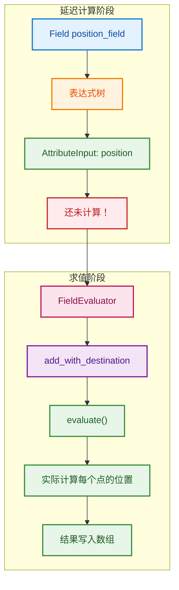

# FieldEvaluator - 字段求值器

> 将延迟计算的字段表达式转换为实际数据的核心组件

---

## 📖 源码注释翻译

**文件：** `source/blender/functions/FN_field_evaluation.hh`

> 使字段求值更容易的实用工具类。

> 字段求值器在构造时接收一个字段上下文（FieldContext）和一个索引掩码（IndexMask）。然后可以添加多个字段进行求值。最后调用 `evaluate()` 方法执行所有字段的求值。

> 多个字段一起求值可以更高效，因为它们可能共享公共的子字段。

---

## 🎯 核心概念

### 什么是字段求值？

```cpp
// 字段是延迟计算的表达式
Field<float3> position_field = bke::AttributeFieldInput::Create<float3>("position");
// 此时还没有实际计算任何位置数据！

// 字段求值器将表达式转换为实际数据
fn::FieldEvaluator evaluator(context, mesh.totvert);  // 创建求值器
evaluator.add_with_destination(position_field, result_span);  // 添加字段
evaluator.evaluate();  // 执行求值，result_span 现在包含实际位置数据
```



---

## 🔧 源码详解

### 类定义

```cpp
// FN_field_evaluation.hh:17
class FieldEvaluator : NonMovable, NonCopyable {
 private:
  ResourceScope scope_;                    // 资源管理
  const FieldContext &context_;            // 字段上下文
  const IndexMask &mask_;                  // 求值掩码（哪些索引需要计算）
  Vector<GField> fields_to_evaluate_;      // 待求值的字段列表
  Vector<GVMutableArray> dst_varrays_;     // 目标虚拟数组
  Vector<GVArray> evaluated_varrays_;      // 求值结果
  Vector<OutputPointerInfo> output_pointer_infos_;  // 输出指针信息
  bool is_evaluated_ = false;              // 是否已求值
  
  std::optional<Field<bool>> selection_field_;  // 选择字段（可选）
  IndexMask selection_mask_;                    // 选择掩码

 public:
  // 构造函数
  FieldEvaluator(const FieldContext &context, const int64_t size);
  
  // 添加字段求值
  int add_with_destination(GField field, GVMutableArray dst);
  template<typename T> int add_with_destination(Field<T> field, VMutableArray<T> dst);
  
  // 设置选择
  void set_selection(Field<bool> selection);
  
  // 执行求值
  void evaluate();
  
  // 获取结果
  const GVArray &get_evaluated(int field_index) const;
  template<typename T> VArray<T> get_evaluated(int field_index) const;
};
```

### 关键方法详解

#### 构造函数

```cpp
// FN_field_evaluation.hh:45
FieldEvaluator(const FieldContext &context, const int64_t size)
    : context_(context), mask_(scope_.construct<IndexMask>(size))
{
}

// 使用示例：
const bke::MeshFieldContext context(mesh, bke::AttrDomain::Point);
fn::FieldEvaluator evaluator(context, mesh.totvert);  // 为所有顶点求值
```

#### add_with_destination

```cpp
// FN_field_evaluation.hh:73
int add_with_destination(GField field, GVMutableArray dst);

// 模板版本（类型安全）
template<typename T>
int add_with_destination(Field<T> field, VMutableArray<T> dst)
{
  return this->add_with_destination(GField(std::move(field)), 
                                    GVMutableArray(std::move(dst)));
}
```

**为什么返回 `int`？**
- 返回字段在求值器中的索引，用于后续 `get_evaluated()` 获取结果

#### set_selection

```cpp
// FN_field_evaluation.hh:64
void set_selection(Field<bool> selection)
{
  selection_field_ = std::move(selection);
}

// 作用：
// 1. 先求值选择字段
// 2. 只有被选中的索引才会计算其他字段
// 3. 可以显著减少计算量
```

#### evaluate

```cpp
// FN_field_evaluation.hh:138
void evaluate();

// 内部实现（简化）：
// 1. 如果有选择字段，先求值选择字段
// 2. 将字段树转换为 MultiFunction 过程
// 3. 执行多函数过程，计算所有字段
// 4. 将结果写入目标数组
```

---

## 💡 使用方法

### 基础用法

```cpp
// 1. 创建字段上下文
const bke::MeshFieldContext context(mesh, bke::AttrDomain::Point);

// 2. 创建求值器
fn::FieldEvaluator evaluator(context, mesh.totvert);

// 3. 准备结果存储
Array<float3> positions(mesh.totvert);

// 4. 添加字段
const Field<float3> position_field = 
    bke::AttributeFieldInput::Create<float3>("position");
evaluator.add_with_destination(position_field, positions.as_mutable_span());

// 5. 执行求值
evaluator.evaluate();

// 6. 使用结果
for (float3 pos : positions) {
    // 处理位置...
}
```

### 多字段同时求值

```cpp
// 同时求值多个字段，共享公共子字段的计算
fn::FieldEvaluator evaluator(context, mesh.totvert);

Array<float3> positions(mesh.totvert);
Array<float3> normals(mesh.totvert);
Array<float> weights(mesh.totvert);

evaluator.add_with_destination(position_field, positions.as_mutable_span());
evaluator.add_with_destination(normal_field, normals.as_mutable_span());
evaluator.add_with_destination(weight_field, weights.as_mutable_span());

evaluator.evaluate();  // 自动优化，共享计算
```

### 使用选择

```cpp
// 只计算被选中的顶点
fn::FieldEvaluator evaluator(context, mesh.totvert);

// 设置选择字段（可以是复杂表达式）
Field<bool> selection_field = /* 选择表达式 */;
evaluator.set_selection(selection_field);

Array<float3> result(mesh.totvert);
evaluator.add_with_destination(field, result.as_mutable_span());
evaluator.evaluate();

// 只有被选中的顶点才有有效值，其他位置未定义
```

### 获取求值结果

```cpp
// 方式1：使用 add_with_destination（推荐）
Array<float3> result(mesh.totvert);
evaluator.add_with_destination(field, result.as_mutable_span());
evaluator.evaluate();

// 方式2：使用 add + get_evaluated
int field_index = evaluator.add(field);  // 不指定目的地
evaluator.evaluate();
VArray<float3> result = evaluator.get_evaluated<float3>(field_index);

// 方式3：获取为掩码（布尔字段）
IndexMask mask = evaluator.get_evaluated_as_mask(field_index);
```

---

## 🎨 在 Blender 中的实际应用

### 场景：Set Position 节点

```cpp
static void node_geo_exec(GeoNodeExecParams params)
{
    GeometrySet geometry = params.extract_input<GeometrySet>("Geometry"_ustr);
    
    if (Mesh *mesh = geometry.get_mesh_for_write()) {
        // 提取字段输入
        const Field<float3> position_field = params.extract_input<Field<float3>>("Position"_ustr);
        
        // 创建求值器
        const bke::MeshFieldContext context(*mesh, bke::AttrDomain::Point);
        fn::FieldEvaluator evaluator(context, mesh->totvert);
        
        // 添加选择（可选）
        if (params.input_is_set("Selection"_ustr)) {
            const Field<bool> selection_field = params.extract_input<Field<bool>>("Selection"_ustr);
            evaluator.set_selection(selection_field);
        }
        
        // 求值并直接写入位置属性
        MutableSpan<float3> positions = mesh->vert_positions_for_write();
        evaluator.add_with_destination(position_field, positions);
        evaluator.evaluate();
    }
    
    params.set_output("Geometry"_ustr, std::move(geometry));
}
```

### 场景：计算并存储自定义属性

```cpp
static void node_geo_exec(GeoNodeExecParams params)
{
    GeometrySet geometry = params.extract_input<GeometrySet>("Geometry"_ustr);
    const Field<float> value_field = params.extract_input<Field<float>>("Value"_ustr);
    
    if (Mesh *mesh = geometry.get_mesh_for_write()) {
        bke::MutableAttributeAccessor attributes = mesh->attributes_for_write();
        
        // 创建或获取属性
        bke::SpanAttributeWriter<float> attr = 
            attributes.lookup_or_add_for_write_span<float>("custom", bke::AttrDomain::Point);
        
        // 求值字段到属性
        const bke::MeshFieldContext context(*mesh, bke::AttrDomain::Point);
        fn::FieldEvaluator evaluator(context, mesh->totvert);
        evaluator.add_with_destination(value_field, attr.span);
        evaluator.evaluate();
        
        attr.finish();
    }
    
    params.set_output("Geometry"_ustr, std::move(geometry));
}
```

---

## 🚀 高级特性

### 全局求值函数

```cpp
// FN_field_evaluation.hh:184
Vector<GVArray> evaluate_fields(ResourceScope &scope,
                                Span<GFieldRef> fields_to_evaluate,
                                const IndexMask &mask,
                                const FieldContext &context,
                                Span<GVMutableArray> dst_varrays = {});

// 使用场景：不需要 FieldEvaluator 的完整功能时
Vector<GVArray> results = evaluate_fields(
    scope,
    {field1, field2, field3},
    mask,
    context
);
```

### 常量字段求值

```cpp
// FN_field_evaluation.hh:194
void evaluate_constant_field(const GField &field, void *r_value);

template<typename T> T evaluate_constant_field(const Field<T> &field)
{
    T value;
    value.~T();  // 先析构
    evaluate_constant_field(field, &value);  // 原地构造
    return value;
}

// 使用：
float constant = evaluate_constant_field<float>(field);
```

### 优化常量字段

```cpp
// FN_field_evaluation.hh:213
GField make_field_constant_if_possible(GField field);

// 作用：
// 1. 如果字段不依赖输入，立即求值并转为常量字段
// 2. 减少字段树复杂度
// 3. 释放输入字段的内存

Field<float> optimized = make_field_constant_if_possible(complex_field);
```

---

## ✅ 总结

| 特性 | 说明 |
|------|------|
| **延迟求值** | 字段表达式在 `evaluate()` 时才计算 |
| **批量求值** | 多个字段一起求值，共享子计算 |
| **选择支持** | 只计算被选中的元素，提高性能 |
| **类型安全** | 模板方法确保类型正确 |
| **资源管理** | ResourceScope 自动管理临时资源 |

**关键方法：**

| 方法 | 用途 |
|------|------|
| `add_with_destination` | 添加字段并指定结果存储位置 |
| `set_selection` | 设置选择字段，限制求值范围 |
| `evaluate` | 执行所有字段的求值 |
| `get_evaluated` | 获取求值结果（使用 add 时） |
| `get_evaluated_as_mask` | 将布尔字段转为 IndexMask |
