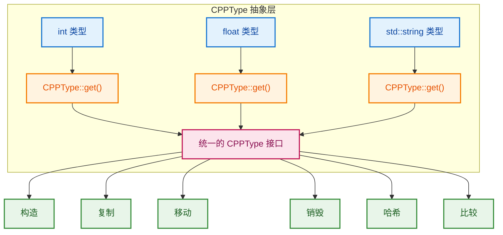
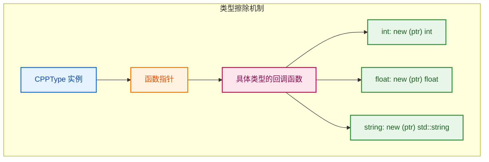

# CPPType - C++ 类型运行时抽象

> 在运行时以通用方式处理任意 C++ 类型的类型系统

---

## 📖 源码注释翻译

**文件：** `source/blender/blenlib/BLI_cpp_type.hh:7~73`

> `CPPType` 类允许以通用方式处理任意 C++ 类型。`CPPType` 的实例包装了确切的单一类型，如 `int` 或 `std::string`。
>
> 使用 `CPPType` 可以编写通用数据结构和算法。这类似于 C++ 模板的功能。区别在于使用模板时，类型必须在编译期已知，代码必须实例化多次。而使用 `CPPType` 时，数据类型只需要在运行期已知，代码只需要编译一次。
>
> 应该使用 `CPPType` 还是经典 C++ 模板取决于上下文：
> - 如果数据类型在运行期未知，应该使用 `CPPType`。
> - 如果数据类型已知是少数几种，取决于代码对性能的敏感程度。
>   - 如果是小型热循环，可以使用模板为每种类型优化（代价是更长的编译时间、更大的二进制文件和模板带来的复杂性）。
>   - 如果代码对性能不敏感，通常使用 `CPPType` 更有意义。
> - 有时组合使用可能更有意义。可以在编译期为某些类型生成优化代码，同时为所有其他类型使用 `CPPType` 的回退代码路径。`CPPType::to_static_type` 允许基于类型在这两个版本之间分发。
>
> 在某些情况下，`CPPType` 的作用类似于 `std::type_info`。然而，`CPPType` 更有用，因为它包含实际处理类型实例的方法。
>
> 每种类型都有大小和对齐要求。处理 C++ 类型的通用函数必须确保遵循对齐规则。`CPPType` 实例提供的方法也会检查正确的对齐。
>
> 每种类型都有一个仅用于调试目的的名称。它不应该用作标识符。
>
> 要检查两个 `CPPType` 实例是否表示相同类型，只需比较它们的指针。任何 C++ 类型最多只有一个对应的 `CPPType` 实例。
>
> `CPPType` 实例带有许多允许以通用方式处理类型的方法。大多数方法有三种变体。以默认构造方法为例：
> - `default_construct(void *ptr)`：在给定指针处构造该类型的单个实例。
> - `default_construct_n(void *ptr, int64_t n)`：在从给定指针开始的数组中构造 n 个该类型的实例。
> - `default_construct_indices(void *ptr, const IndexMask &mask)`：在从给定指针开始的数组中构造该类型的多个实例。只有 `mask` 引用的索引会被构造。
>
> 在某些情况下，默认构造什么也不做（例如对于像 int 这样的平凡类型）。`default_value` 方法提供一个可以复制的默认值。默认值是什么取决于类型。通常是 0 或空字符串之类的东西。

---

## 🎯 核心概念

### 什么是 CPPType？

```cpp
// CPPType 是 C++ 类型的"运行时描述"
// 它知道如何构造、复制、移动、销毁该类型的实例

// 获取 int 的类型信息
const CPPType &int_type = CPPType::get<int>();

// 获取 std::string 的类型信息
const CPPType &string_type = CPPType::get<std::string>();

// 现在可以在运行期处理这些类型
int64_t int_size = int_type.size;        // sizeof(int) = 4
int64_t string_size = string_type.size;  // sizeof(std::string) = 32 (平台相关)
```



---

## 🔧 源码详解

### 类定义

```cpp
// BLI_cpp_type.hh:102
class CPPType : NonCopyable, NonMovable {
 public:
  int64_t size = 0;           // 类型大小（sizeof）
  int64_t alignment = 0;      // 对齐要求（alignof）
  bool is_trivial = false;    // 是否是平凡类型
  bool is_trivially_destructible = false;  // 是否平凡可析构
  bool has_special_member_functions = false;
  bool is_default_constructible = false;
  bool is_copy_constructible = false;
  bool is_move_constructible = false;
  bool is_destructible = false;
  bool is_copy_assignable = false;
  bool is_move_assignable = false;
  
 private:
  // 函数指针 - 类型擦除的核心！
  void (*default_construct_)(void *ptr) = nullptr;
  void (*default_construct_n_)(void *ptr, int64_t n) = nullptr;
  void (*destruct_)(void *ptr) = nullptr;
  void (*copy_assign_)(const void *src, void *dst) = nullptr;
  void (*copy_construct_)(const void *src, void *dst) = nullptr;
  void (*move_assign_)(void *src, void *dst) = nullptr;
  void (*move_construct_)(void *src, void *dst) = nullptr;
  // ... 更多函数指针
};
```

**关键设计：函数指针实现类型擦除**

```cpp
// 传统模板方式：编译期确定类型
template<typename T>
void construct(void *ptr) {
    new (ptr) T;  // 编译期知道 T 是什么
}

// CPPType 方式：运行期通过函数指针调用
void (*construct_fn)(void *) = nullptr;  // 函数指针
construct_fn(ptr);  // 运行期调用，不知道具体类型

// 初始化时设置函数指针（根据具体类型）
if constexpr (std::is_default_constructible_v<T>) {
    default_construct_ = default_construct_cb<T>;  // 绑定到具体类型
}
```

### 函数指针的工作原理



---

## 💡 使用方法

### 1. 注册类型

```cpp
// 使用宏注册类型
BLI_CPP_TYPE_MAKE(int, CPPTypeFlags::BasicType)
BLI_CPP_TYPE_MAKE(float, CPPTypeFlags::BasicType)
BLI_CPP_TYPE_MAKE(std::string, CPPTypeFlags::Hashable | CPPTypeFlags::Printable)

// 在程序初始化时注册
void register_cpp_types() {
    BLI_CPP_TYPE_REGISTER(int)
    BLI_CPP_TYPE_REGISTER(float)
    BLI_CPP_TYPE_REGISTER(std::string)
}
```

### 2. 获取类型信息

```cpp
// 获取类型的 CPPType 引用
const CPPType &int_type = CPPType::get<int>();
const CPPType &float_type = CPPType::get<float>();

// 比较类型
if (int_type == float_type) {  // 比较指针
    // false
}

// 检查类型特性
bool can_copy = int_type.is_copy_constructible;  // true
bool can_hash = int_type.is_hashable();          // true
```

### 3. 通用操作

```cpp
// 分配内存
void *buffer = malloc(int_type.size);

// 构造对象
int_type.default_construct(buffer);  // 在 buffer 处构造 int

// 赋值
int value = 42;
int_type.copy_construct(&value, buffer);  // 复制构造

// 使用
int *ptr = static_cast<int*>(buffer);
std::cout << *ptr;  // 42

// 销毁
int_type.destruct(buffer);  // 调用析构函数
free(buffer);
```

---

## 🎨 在 Blender 中的实际应用

### 场景：属性系统

```cpp
// 几何节点需要处理不同类型的属性
// - 顶点位置（float3）
// - 顶点颜色（Color4f）
// - 材质索引（int）
// - UV 坐标（float2）
// - 自定义数据（任意类型）

// 使用 CPPType 统一处理
class Attribute {
    const CPPType &type_;  // 属性的类型
    void *data_;           // 属性数据（类型擦除）
    
public:
    Attribute(const CPPType &type, int64_t size) : type_(type) {
        data_ = malloc(type_.size * size);
        type_.default_construct_n(data_, size);  // 构造所有元素
    }
    
    ~Attribute() {
        type_.destruct_n(data_, size);  // 销毁所有元素
        free(data_);
    }
    
    void copy_from(const Attribute &other) {
        type_.copy_assign_n(other.data_, data_, size);
    }
};

// 使用
Attribute positions(CPPType::get<float3>(), vertex_count);
Attribute colors(CPPType::get<Color4f>(), vertex_count);
// 同样的代码处理不同类型的属性！
```

### 场景：字段求值

```cpp
// 字段（Field）可以包含任意类型的表达式
// 需要在运行期知道类型才能求值

class FieldEvaluator {
    const CPPType &result_type_;
    
public:
    void evaluate(void *result_buffer) {
        // 根据结果类型执行不同的求值逻辑
        result_type_.to_static_type<float, int, float3>([&](auto type_tag) {
            using T = typename decltype(type_tag)::type;
            // 现在 T 是编译期已知的类型
            T *result = static_cast<T*>(result_buffer);
            *result = compute_value<T>();
        });
    }
};
```

---

## 🚀 高级特性

### to_static_type - 编译期优化

```cpp
// 运行期知道类型，但想生成编译期优化的代码
template<typename... Types, typename Fn>
bool to_static_type_try(Fn &&fn) const;

// 使用示例
const CPPType &type = get_runtime_type();

type.to_static_type_try<int, float, double>([&](auto type_tag) {
    using T = typename decltype(type_tag)::type;
    // 如果 type 是 int、float 或 double 之一
    // 这里会实例化为具体类型的代码（编译期优化）
    T value = compute<T>();
});

// 如果不是这三种类型，返回 false，可以执行通用回退代码
```

### 实现原理

```cpp
// 使用 Map 实现 O(1) 查找
template<typename... Types, typename Fn>
bool to_static_type_try(Fn &&fn) const {
    static const Map<const CPPType *, Callback> callback_map = []() {
        Map<const CPPType *, Callback> map;
        // 为每种类型创建回调
        const CPPType *keys[] = {&CPPType::get<Types>()...};
        const Callback vals[] = {&call_with_type_impl_<Types, Fn>...};
        for (int64_t i = 0; i < sizeof...(Types); i++) {
            map.add_new(keys[i], vals[i]);
        }
        return map;
    }();
    
    // O(1) 查找并调用
    const Callback callback = callback_map.lookup_default(this, nullptr);
    if (callback != nullptr) {
        callback(fn);
        return true;
    }
    return false;
}
```

---

## ✅ 总结

| 特性 | 说明 |
|------|------|
| **类型擦除** | 使用函数指针在运行期处理任意类型 |
| **内存安全** | 自动处理构造、析构、对齐 |
| **性能** | `to_static_type` 允许编译期优化 |
| **用途** | 属性系统、字段求值、通用容器 |

**CPPType vs 模板：**

| | CPPType | 模板 |
|--|---------|------|
| 类型确定时机 | 运行期 | 编译期 |
| 代码大小 | 一份代码 | 每种类型一份 |
| 性能 | 有间接调用开销 | 最优 |
| 灵活性 | 高 | 低 |
| 适用场景 | 类型运行期确定 | 类型编译期确定 |
