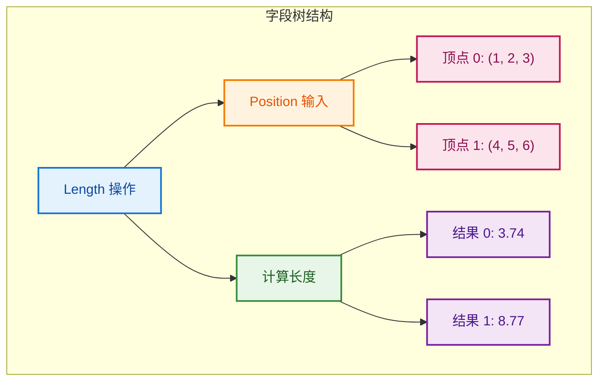

# Field - 延迟计算表达式

> 几何节点中延迟求值的类型安全表达式系统

---

## 📖 源码注释翻译

**文件：** `source/blender/functions/FN_field.hh:7~70`

> 字段是一个延迟求值的表达式。它知道输出什么类型的数据，以及如何计算它。
>
> 字段由两个主要部分组成：
> - `FieldNode`：表示字段树中的一个节点。它知道如何计算特定索引的值。
> - `FieldInputs`：包含字段引用的所有输入。
>
> 字段可以引用其他字段作为输入，形成字段树。当字段被求值时，整个树被遍历，每个节点的值被计算。
>
> 字段是类型安全的。`Field<T>` 模板参数指定字段输出的类型。
>
> 字段使用隐式共享（Implicit Sharing）来避免不必要的复制。

---

## 🎯 核心概念

### 什么是 Field？

```cpp
// Field 是延迟计算的表达式
// 类似于函数：输入 -> 计算 -> 输出

// 创建字段（此时不计算）
Field<float3> position_field = bke::AttributeFieldInput::Create<float3>("position");

// 字段可以组合
Field<float> length_field = fn::FieldOperation::Create<float>(
    fn::FieldOperation::Length,
    {position_field}
);

// 只有求值时才计算
FieldEvaluator evaluator(context, size);
evaluator.add_with_destination(length_field, result);
evaluator.evaluate();  // 现在才计算
```



---

## 🔧 源码详解

### Field 类定义

```cpp
// FN_field.hh:72
template<typename T>
class Field {
 private:
  std::shared_ptr<const FieldNode> node_;  // 字段节点（表达式树根）
  FieldInputs inputs_;                      // 输入依赖

 public:
  using value_type = T;

  // 构造函数
  Field() = default;
  Field(std::shared_ptr<const FieldNode> node, FieldInputs inputs);
  
  // 获取输出类型
  static const CPPType &cpp_type() { return CPPType::get<T>(); }
  
  // 获取节点和输入
  const FieldNode &node() const { return *node_; }
  const FieldInputs &inputs() const { return inputs_; }
  
  // 检查是否为空
  bool is_empty() const { return node_ == nullptr; }
  
  // 转换为通用字段
  GField generic() const;
};

// 通用字段（类型擦除）
class GField {
 private:
  std::shared_ptr<const FieldNode> node_;
  FieldInputs inputs_;
  const CPPType *type_ = nullptr;

 public:
  GField() = default;
  template<typename T> GField(Field<T> field);
  
  const CPPType &cpp_type() const { return *type_; }
  const FieldNode &node() const { return *node_; }
};
```

### FieldNode 基类

```cpp
// FN_field.hh:180
class FieldNode : public ImplicitSharingMixin {
 public:
  virtual ~FieldNode() = default;
  
  // 获取输出类型
  virtual const CPPType &output_cpp_type() const = 0;
  
  // 检查是否为常量
  virtual bool is_constant() const { return false; }
  
  // 获取常量值（如果是常量）
  virtual void get_constant_value(void *r_value) const;
  
  // 转换为多函数（用于求值）
  virtual MultiFunction *get_multi_function() const = 0;
};
```

### 常见字段节点类型

```cpp
// 1. 属性输入节点
class AttributeFieldInput : public FieldNode {
    std::string name_;  // 属性名
 public:
  void evaluate(const FieldContext &context, void *r_value) override;
};

// 2. 常量节点
class ConstantFieldNode : public FieldNode {
    void *value_;  // 常量值
 public:
  bool is_constant() const override { return true; }
};

// 3. 操作节点
class FieldOperation : public FieldNode {
    Vector<GField> inputs_;  // 输入字段
    MultiFunction *fn_;      // 操作函数
 public:
  MultiFunction *get_multi_function() const override { return fn_; }
};
```

---

## 💡 使用方法

### 创建字段

```cpp
// 1. 属性输入
Field<float3> position = bke::AttributeFieldInput::Create<float3>("position");
Field<float> weight = bke::AttributeFieldInput::Create<float>("weight");

// 2. 常量
Field<float> constant = fn::make_constant_field<float>(3.14f);

// 3. 数学运算
Field<float> sum = fn::FieldOperation::Create<float>(
    fn::FieldOperation::Add,
    {field1, field2}
);

// 4. 向量运算
Field<float> length = fn::FieldOperation::Create<float>(
    fn::FieldOperation::Length,
    {position_field}
);
```

### 字段组合

```cpp
// 创建复杂表达式
Field<float3> position = ...;
Field<float3> normal = ...;

// 位移 = 位置 + 法线 * 偏移
Field<float> offset = ...;
Field<float3> displaced = position + normal * offset;
// 操作符重载自动创建 FieldOperation 节点
```

### 类型擦除与恢复

```cpp
// 类型擦除（通用字段）
Field<float3> typed_field = ...;
GField generic_field = typed_field.generic();

// 类型恢复（需要知道原始类型）
if (generic_field.cpp_type() == CPPType::get<float3>()) {
    Field<float3> recovered = generic_field.typed<float3>();
}
```

---

## 🎨 在 Blender 中的实际应用

### 场景：节点输入处理

```cpp
static void node_geo_exec(GeoNodeExecParams params)
{
    // 提取字段输入
    Field<float3> offset = params.extract_input<Field<float3>>("Offset"_ustr);
    Field<bool> selection = params.extract_input<Field<bool>>("Selection"_ustr);
    
    // 使用字段...
    GeometrySet geometry = params.extract_input<GeometrySet>("Geometry"_ustr);
    
    if (Mesh *mesh = geometry.get_mesh_for_write()) {
        const bke::MeshFieldContext context(*mesh, bke::AttrDomain::Point);
        fn::FieldEvaluator evaluator(context, mesh->totvert);
        
        MutableSpan<float3> positions = mesh->vert_positions_for_write();
        evaluator.add_with_destination(offset, positions);
        evaluator.evaluate();
    }
    
    params.set_output("Geometry"_ustr, std::move(geometry));
}
```

### 场景：程序化生成

```cpp
// 创建程序化噪声字段
Field<float3> position = bke::AttributeFieldInput::Create<float3>("position");
Field<float> noise = fn::FieldOperation::Create<float>(
    fn::noise::Noise,
    {position, frequency_field, amplitude_field}
);

// 用于置换
Field<float3> displaced = position + normal * noise;
```

---

## ✅ 总结

| 特性 | 说明 |
|------|------|
| **延迟求值** | 表达式在需要时才计算 |
| **类型安全** | `Field<T>` 编译期检查类型 |
| **可组合** | 字段可以组合成复杂表达式树 |
| **隐式共享** | 避免不必要的复制 |
| **多态** | 不同节点类型实现不同计算逻辑 |

**核心组件：**

| 组件 | 作用 |
|------|------|
| `Field<T>` | 类型安全的字段句柄 |
| `GField` | 类型擦除的通用字段 |
| `FieldNode` | 表达式树节点基类 |
| `FieldInputs` | 输入依赖管理 |
| `FieldOperation` | 操作节点实现 |
