# GeometrySet - 几何集合

> 统一管理多种几何类型的容器，支持隐式共享和写时复制
- [GeometrySet - 几何集合](#geometryset---几何集合)
  - [📖 源码注释翻译](#-源码注释翻译)
  - [🎯 核心概念](#-核心概念)
    - [什么是 GeometrySet？](#什么是-geometryset)
  - [🔧 源码详解](#-源码详解)
    - [1. `class GeometryComponent : public ImplicitSharingMixin`](#1-class-geometrycomponent--public-implicitsharingmixin)
      - [`ImplicitSharingMixin` 是什么？](#implicitsharingmixin-是什么)
      - [为什么继承它？](#为什么继承它)
    - [2. `ImplicitSharingPtr` 是什么？为什么这样使用？](#2-implicitsharingptr-是什么为什么这样使用)
      - [与 `std::shared_ptr` 的区别](#与-stdshared_ptr-的区别)
      - [为什么使用 `ImplicitSharingPtr`？](#为什么使用-implicitsharingptr)
    - [3. `std::is_base_of_v` 是什么？](#3-stdis_base_of_v-是什么)
      - [`std::is_base_of_v<B, D>` 详解](#stdis_base_of_vb-d-详解)
      - [在代码中的使用](#在代码中的使用)
    - [4. `GeometryComponentEditData` 是什么？](#4-geometrycomponenteditdata-是什么)
      - [作用图解](#作用图解)
    - [5. 为什么用 `std::array`？](#5-为什么用-stdarray)
      - [使用 `std::array` 的原因](#使用-stdarray-的原因)
  - [💡 使用方法](#-使用方法)
    - [创建和修改几何集合](#创建和修改几何集合)
    - [遍历所有组件](#遍历所有组件)
    - [复制和共享](#复制和共享)
  - [🎨 在 Blender 中的实际应用](#-在-blender-中的实际应用)
    - [场景：几何节点输入输出](#场景几何节点输入输出)
    - [场景：foreach\_real\_geometry](#场景foreach_real_geometry)
  - [✅ 总结](#-总结)
  - [🔍 深入细节](#-深入细节)
    - [6. 为什么大量使用 `BLI_STATIC_ASSERT`？但其他地方又大量使用 `static_assert`？](#6-为什么大量使用-bli_static_assert但其他地方又大量使用-static_assert)
      - [`BLI_STATIC_ASSERT` 的本质](#bli_static_assert-的本质)
      - [为什么 Blender 代码库中同时存在 `BLI_STATIC_ASSERT` 和 `static_assert`？](#为什么-blender-代码库中同时存在-bli_static_assert-和-static_assert)
    - [7. `std::is_base_of_v` 命名怪？为什么不叫 `is_derived_v`？](#7-stdis_base_of_v-命名怪为什么不叫-is_derived_v)
      - [C++ 标准库的命名逻辑](#c-标准库的命名逻辑)
      - [为什么 C++ 标准选择了 `is_base_of` 而不是 `is_derived_of`？](#为什么-c-标准选择了-is_base_of-而不是-is_derived_of)
    - [8. 特殊成员函数为什么全用默认实现？](#8-特殊成员函数为什么全用默认实现)
      - [什么是"翻译单元"（Translation Unit）？](#什么是翻译单元translation-unit)
      - [问题：如果在头文件中直接 `= default`](#问题如果在头文件中直接--default)
      - [解决方案：头文件声明，实现文件 `= default`](#解决方案头文件声明实现文件--default)
      - [为什么这些函数可以用默认实现？](#为什么这些函数可以用默认实现)
      - [总结](#总结)
      - [每一行特殊成员函数详解](#每一行特殊成员函数详解)
      - [拷贝构造 vs 拷贝赋值、移动构造 vs 移动赋值 怎么区分？](#拷贝构造-vs-拷贝赋值移动构造-vs-移动赋值-怎么区分)
      - [`= default` 编译后真的有很多代码吗？](#-default-编译后真的有很多代码吗)
      - [如果不写这几行声明（`BKE_geometry_set.hh:168~173`），会怎样？](#如果不写这几行声明bke_geometry_sethh168173会怎样)
    - [9. `has_` / `from_` / `get_` / `replace_` 为什么不用模板函数？](#9-has_--from_--get_--replace_-为什么不用模板函数)
      - [为什么不用统一的模板函数？](#为什么不用统一的模板函数)
      - [具体原因分析](#具体原因分析)
      - [已有的模板 API vs 显式 API 对比](#已有的模板-api-vs-显式-api-对比)
    - [10. 什么是 Mixin 设计模式？](#10-什么是-mixin-设计模式)
      - [Mixin 的定义](#mixin-的定义)
      - [Mixin 的核心特点](#mixin-的核心特点)
      - [Blender 中的 Mixin 实例](#blender-中的-mixin-实例)
      - [为什么用 Mixin 而不是组合？](#为什么用-mixin-而不是组合)
      - [Mixin 的命名惯例](#mixin-的命名惯例)

---

## 📖 源码注释翻译

**文件：** `source/blender/blenkernel/BKE_geometry_set.hh:64~150`

> 这是专用几何组件类型的基类。几何组件使用隐式共享来避免只读复制。它还集成了属性 API，用于存储和修改几何上的通用信息。
>
> 每个几何组件都有特定的类型。类型决定了组件存储什么类型的数据。修改几何的函数通常只修改组件类型的子集。
>
> 注意：这些值存储在文件中，因此不应重新排序。
>
> 几何集合是多种几何的容器。它本身不直接拥有几何，而是由多个 GeometryComponents 拥有几何，几何集合增加每个组件的用户计数，以避免丢失数据。这意味着单个组件可能在多个几何和其他代码之间共享。当请求写访问时，共享组件会自动复制。
>
> 组件通常不直接存储数据，而是保留对在其他地方定义的数据结构的引用。每种类型最多有一个组件。
>
> 复制几何集合是相对便宜的操作，因为它不复制引用的几何组件，因此 GeometrySet 通常可以按值传递或移动。

---

## 🎯 核心概念

### 什么是 GeometrySet？

```cpp
// GeometrySet 是一个"几何集合"
// 可以同时包含多种几何类型：
// - Mesh（网格）
// - Curves（曲线）
// - PointCloud（点云）
// - Volume（体积）
// - GreasePencil（蜡笔）
// - Instances（实例）

GeometrySet geometry;
geometry.add_mesh(mesh);        // 添加网格
geometry.add_curves(curves);    // 添加曲线
geometry.add_pointcloud(points); // 添加点云

// 复制是便宜的（只复制指针）
GeometrySet copy = geometry;  // O(1) 操作

// 修改时自动写时复制
Mesh *mesh = geometry.get_mesh_for_write();  // 如果需要，自动复制
```

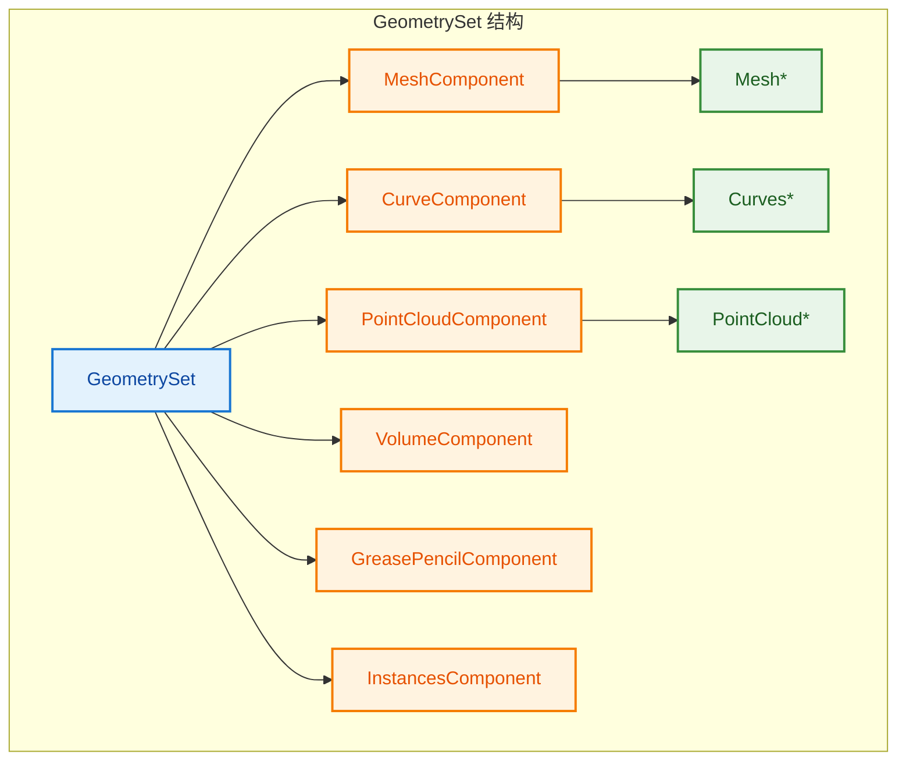

---

## 🔧 源码详解

### 1. `class GeometryComponent : public ImplicitSharingMixin`

**文件：** `source/blender/blenkernel/BKE_geometry_set.hh:69`

```cpp
class GeometryComponent : public ImplicitSharingMixin {
```

#### `ImplicitSharingMixin` 是什么？

**文件：** `source/blender/blenlib/BLI_implicit_sharing.hh:192`

```cpp
/**
 * Makes it easy to embed implicit-sharing behavior into a struct.
 * Structs that derive from this class can be used with #ImplicitSharingPtr.
 */
class ImplicitSharingMixin : public ImplicitSharingInfo {
 private:
  void delete_self_with_data() override
  {
    /* Can't use `delete this` here, because we don't know what allocator was used. */
    this->delete_self();
  }

  virtual void delete_self() = 0;
};
```

**翻译注释：**
> 让隐式共享行为更容易嵌入到结构体中。派生自此类的结构体可以与 `ImplicitSharingPtr` 一起使用。

`ImplicitSharingMixin` 是 **隐式共享混入类（Mixin）**，它的作用是把"引用计数 + 生命周期管理"的能力**注入**到任何继承它的类中。

> **什么是 Mixin？**
>
> Mixin 是一种**代码复用模式**，它不是独立的基类（不表示"是一个"的关系），而是**功能模块**（表示"有这个功能"）。通过继承 Mixin，类可以获得特定的行为，而无需自己实现。
>
> 与普通的继承不同：
> - 普通继承：`Dog : public Animal` → Dog **是一个** Animal（语义关系）
> - Mixin 继承：`GeometryComponent : public ImplicitSharingMixin` → GeometryComponent **有**隐式共享能力（功能注入）

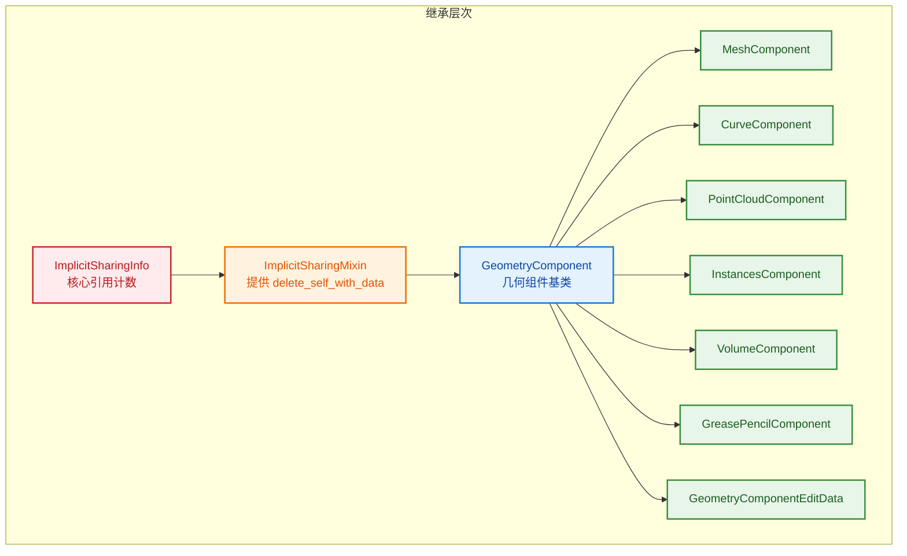

#### 为什么继承它？

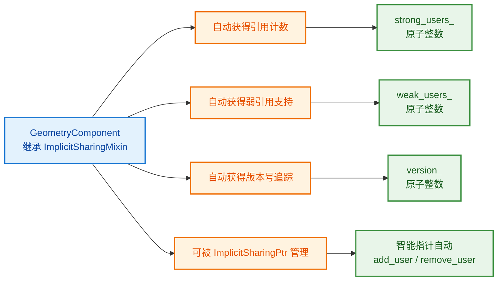

**核心原因：**

1. **引用计数嵌入对象内部**：`ImplicitSharingMixin` 继承自 `ImplicitSharingInfo`，而后者包含 `strong_users_`（强引用计数）、`weak_users_`（弱引用计数）和 `version_`（版本号）。这些计数器直接嵌入到 `GeometryComponent` 对象的内存布局中，不需要额外分配。

2. **与 `ImplicitSharingPtr` 配合**：继承后，`GeometryComponent` 可以被 `ImplicitSharingPtr<GeometryComponent>` 管理，自动处理引用计数的增减。

3. **自定义删除逻辑**：`delete_self_with_data()` 调用纯虚函数 `delete_self()`，让子类（如 `MeshComponent`）决定如何释放自己（因为不知道使用了什么分配器，不能直接用 `delete this`）。

4. **Copy-on-Write 支持**：通过 `is_mutable()` 检查是否只有一个用户，从而实现写时复制。

---

### 2. `ImplicitSharingPtr` 是什么？为什么这样使用？

**文件：** `source/blender/blenlib/BLI_implicit_sharing_ptr.hh:23`

```cpp
/**
 * #ImplicitSharingPtr is a smart pointer that manages implicit sharing.
 * It's designed to work with types that derive from #ImplicitSharingMixin.
 * It is fairly similar to #std::shared_ptr but requires the reference count
 * to be embedded in the data.
 */
template<typename T = ImplicitSharingInfo, bool IsStrong = true> class ImplicitSharingPtr {
```

**翻译注释：**
> `ImplicitSharingPtr` 是一个管理隐式共享的智能指针。它被设计为与派生自 `ImplicitSharingMixin` 的类型一起工作。它与 `std::shared_ptr` 非常相似，但要求引用计数嵌入在数据内部。

#### 与 `std::shared_ptr` 的区别

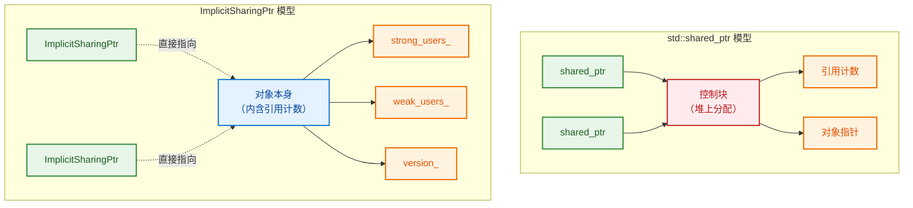

| 特性 | `std::shared_ptr` | `ImplicitSharingPtr` |
|------|-------------------|----------------------|
| **控制块** | 堆上单独分配 | 嵌入对象内部 |
| **内存开销** | 额外分配控制块 | 无额外分配 |
| **引用计数位置** | 控制块中 | 对象内部 (`ImplicitSharingInfo`) |
| **弱引用** | 支持 | 支持 (`weak_users_`) |
| **版本追踪** | 不支持 | 支持 (`version_`) |
| **适用场景** | 通用 | 需要大量共享的大型数据 |

#### 为什么使用 `ImplicitSharingPtr`？

**文件：** `source/blender/blenkernel/BKE_geometry_set.hh:62`

```cpp
using GeometryComponentPtr = ImplicitSharingPtr<GeometryComponent>;
```

**文件：** `source/blender/nodes/NOD_geometry_nodes_bundle.hh:64`

```cpp
class Bundle : public ImplicitSharingMixin {
```

**文件：** `source/blender/blenkernel/BKE_geometry_set.hh:46`

```cpp
using BundlePtr = ImplicitSharingPtr<Bundle>;
```

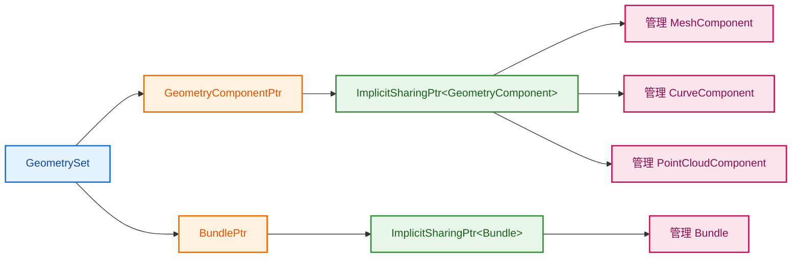

**使用原因：**

1. **性能优化**：几何数据（网格、曲线等）通常很大。使用隐式共享可以避免不必要的深拷贝。`ImplicitSharingPtr` 只拷贝指针，引用计数嵌入对象内部，没有额外的堆分配。

2. **写时复制（Copy-on-Write）**：`ensure_mutable_inplace()` 方法检查是否只有一个用户，如果是则直接返回可变引用，否则复制一份。

```cpp
// BLI_implicit_sharing_ptr.hh:144
template<typename T = ImplicitSharingInfo, bool IsStrong = true>
T &ImplicitSharingPtr<T, IsStrong>::ensure_mutable_inplace()
{
    BLI_assert(data_);
    if (!data_->is_mutable()) {
        /* The data is shared and therefore immutable. Make a mutable copy. */
        *this = data_->copy();
    }
    BLI_assert(data_->is_mutable());
    data_->tag_ensured_mutable();
    return const_cast<T &>(*data_);
}
```

3. **版本追踪**：`version_` 原子计数器在数据修改时递增，可以高效检测数据是否发生变化（用于缓存失效判断）。

---

### 3. `std::is_base_of_v` 是什么？

**文件：** `source/blender/blenkernel/BKE_geometry_set.hh:129~130`

```cpp
template<typename T>
inline constexpr bool is_geometry_component_v = std::is_base_of_v<GeometryComponent, T>;
```

#### `std::is_base_of_v<B, D>` 详解

这是 C++17 标准库提供的**类型特征（Type Trait）**，用于在**编译期**判断类型 `D` 是否是类型 `B` 的派生类（或就是 `B` 本身）。

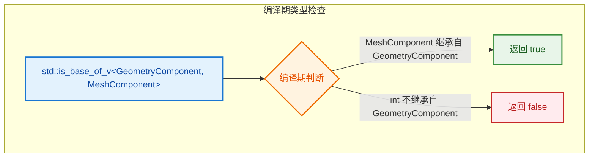

#### 在代码中的使用

```cpp
// BKE_geometry_set.hh:180~184
template<typename Component>
Component &get_component_for_write() {
    BLI_STATIC_ASSERT(is_geometry_component_v<Component>, "");
    return static_cast<Component &>(this->get_component_for_write(Component::static_type));
}
```

**作用：**
- `BLI_STATIC_ASSERT(is_geometry_component_v<Component>, "")` 在编译时检查模板参数 `Component` 是否派生自 `GeometryComponent`。
- 如果传入 `int` 或 `std::string` 等不相关的类型，编译会直接失败，给出清晰的错误信息。
- 这是**零运行时开销**的类型安全检查。

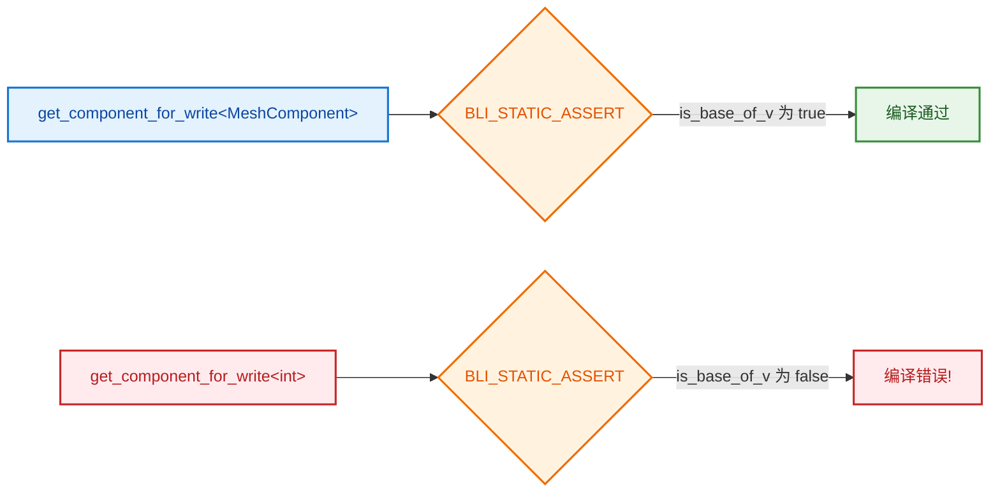

---

### 4. `GeometryComponentEditData` 是什么？

**文件：** `source/blender/blenkernel/BKE_geometry_set.hh:744~779`

```cpp
/**
 * When the original data is in some edit mode, we want to propagate some additional information
 * through object evaluation. This information can be used by edit modes to support working on
 * evaluated data.
 *
 * This component is added at the beginning of modifier evaluation.
 */
class GeometryComponentEditData final : public GeometryComponent {
 public:
  /**
   * Information about how original curves are manipulated during evaluation. This data is used so
   * that curve sculpt tools can work on evaluated data. It is not stored in #CurveComponent
   * because the data remains valid even when there is no actual curves geometry anymore, for
   * example, when the curves have been converted to a mesh.
   */
  std::unique_ptr<CurvesEditHints> curves_edit_hints_;
  /**
   * Information about how drawings on the grease pencil layers are manipulated during evaluation.
   */
  std::unique_ptr<GreasePencilEditHints> grease_pencil_edit_hints_;
  /**
   * Propagated information for how gizmos should be transformed along with the geometry.
   */
  std::unique_ptr<GizmoEditHints> gizmo_edit_hints_;

  GeometryComponentEditData();

  GeometryComponentPtr copy() const final;
  bool owns_direct_data() const final;
  void ensure_owns_direct_data() final;

  void clear() override;

  /**
   * The first node that does topology changing operations on curves should store the curve point
   * positions it retrieved as input. Without this, information about the deformed positions is
   * lost, which would make curves sculpt mode fall back to using original curve positions instead
   * of deformed ones.
   */
  static void remember_deformed_positions_if_necessary(GeometrySet &geometry);

  static constexpr GeometryComponent::Type static_type = GeometryComponent::Type::Edit;
};
```

**翻译关键注释：**

> 当原始数据处于某种编辑模式时，我们希望通过对象评估传播一些额外信息。这些信息可以被编辑模式用来支持在评估后的数据上工作。

> 关于原始曲线在评估期间如何被操作的信息。这些数据用于让曲线雕刻工具可以在评估后的数据上工作。它不存储在 `CurveComponent` 中，因为即使没有实际的曲线几何了（例如，曲线已被转换为网格），这些数据仍然有效。

> 执行拓扑改变操作的第一个节点应该存储它获取的输入曲线点位置。没有这些，变形位置的信息会丢失，导致曲线雕刻模式回退到使用原始曲线位置而不是变形后的位置。

#### 作用图解

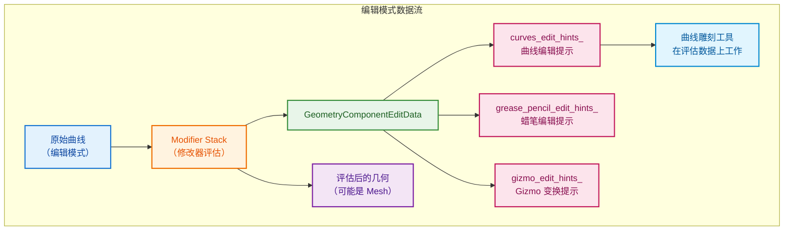

**核心要点：**

1. **独立组件**：`GeometryComponentEditData` 是一个独立的 `GeometryComponent` 类型（`Type::Edit`），不存储实际几何，只存储编辑提示。

2. **生命周期独立于几何**：即使曲线被转换为网格，`curves_edit_hints_` 仍然存在，这样雕刻工具仍能知道原始曲线的变形信息。

3. **`std::unique_ptr` 语义**：三个编辑提示都使用 `std::unique_ptr`，表示 `GeometryComponentEditData` **独占**这些提示数据的所有权。

4. **`final` 关键字**：类标记为 `final`，禁止进一步继承；方法标记为 `final`，禁止子类覆盖。

---

### 5. 为什么用 `std::array`？

**文件：** `source/blender/blenkernel/BKE_geometry_set.hh:154`

```cpp
struct GeometrySet {
 private:
  /* Indexed by #GeometryComponent::Type. */
  std::array<GeometryComponentPtr, GEO_COMPONENT_TYPE_ENUM_SIZE> components_;
  nodes::BundlePtr bundle_;
```

**翻译注释：**
> 按 `GeometryComponent::Type` 索引。

```cpp
// BKE_geometry_set.hh:51
#define GEO_COMPONENT_TYPE_ENUM_SIZE 7

// GeometryComponent::Type 枚举
enum class Type {
    Mesh = 0,        // 索引 0
    PointCloud = 1,  // 索引 1
    Instance = 2,    // 索引 2
    Volume = 3,      // 索引 3
    Curve = 4,       // 索引 4
    Edit = 5,        // 索引 5
    GreasePencil = 6,// 索引 6
};
```

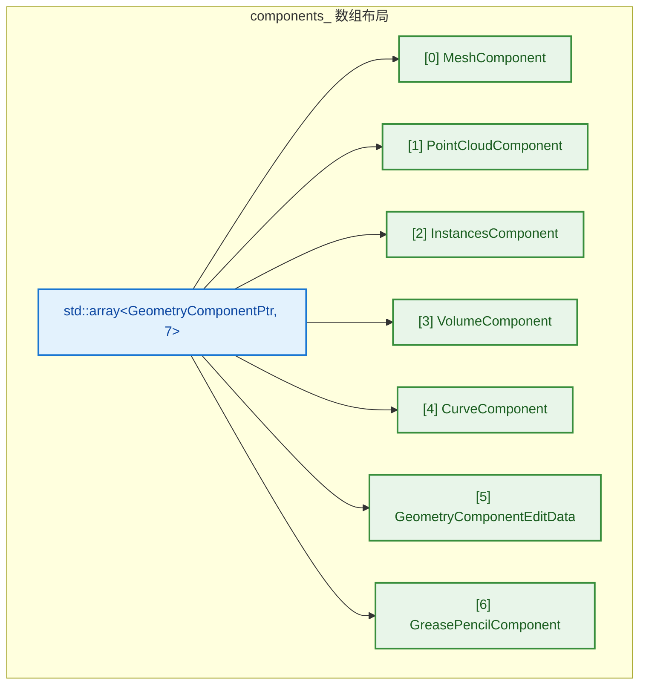

#### 使用 `std::array` 的原因

| 特性 | `std::array` | `std::vector` | `Map` |
|------|-------------|--------------|-------|
| **内存布局** | 连续固定大小 | 动态分配 | 树/哈希结构 |
| **访问速度** | O(1)，直接索引 | O(1)，可能缓存不友好 | O(log n) / O(1) |
| **内存开销** | 无额外开销 | 有容量开销 | 有节点开销 |
| **编译期大小** | 是 | 否 | 否 |
| **类型安全** | 索引即类型 | 需要额外检查 | 需要键值查找 |

**具体原因：**

1. **固定数量**：几何组件类型数量是固定的（7种），不会动态增减。

2. **O(1) 访问**：通过 `components_[size_t(component_type)]` 直接索引，无需查找：

```cpp
// geometry_set.cc:133
const GeometryComponent *GeometrySet::get_component(GeometryComponent::Type component_type) const {
    return components_[size_t(component_type)].get();
}
```

3. **缓存友好**：所有 `GeometryComponentPtr` 连续存储在内存中，遍历时代码如下：

```cpp
// geometry_set.cc:168~177
Vector<const GeometryComponent *> GeometrySet::get_components() const {
    Vector<const GeometryComponent *> components;
    for (const GeometryComponentPtr &component_ptr : components_) {
        if (component_ptr) {
            components.append(component_ptr.get());
        }
    }
    return components;
}
```

4. **类型即索引**：`GeometryComponent::Type` 枚举值直接作为数组索引，无需哈希或比较：

```cpp
// 类型到索引的转换是编译期确定的
components_[size_t(GeometryComponent::Type::Mesh)]      // → components_[0]
components_[size_t(GeometryComponent::Type::PointCloud)] // → components_[1]
```

5. **内存紧凑**：`std::array` 没有额外的堆分配或元数据开销，7个指针的大小就是 `7 * sizeof(void*)`。

---

## 💡 使用方法

### 创建和修改几何集合

```cpp
// 1. 创建空集合
GeometrySet geometry;

// 2. 添加几何
Mesh *mesh = BKE_mesh_new_nomain("Mesh");
geometry.add_mesh(mesh);

// 3. 获取几何（只读）
const Mesh *read_mesh = geometry.get_mesh();

// 4. 获取几何（可写）- 触发写时复制
Mesh *write_mesh = geometry.get_mesh_for_write();

// 5. 检查类型
if (geometry.has_mesh()) {
    // 处理网格...
}

// 6. 移除几何
geometry.remove_mesh();
```

### 遍历所有组件

```cpp
// 遍历所有几何组件
for (const GeometryComponent *component : geometry.get_components()) {
    switch (component->type()) {
        case GeometryComponent::Type::Mesh:
            process_mesh(static_cast<const MeshComponent *>(component));
            break;
        case GeometryComponent::Type::Curve:
            process_curves(static_cast<const CurveComponent *>(component));
            break;
        // ...
    }
}
```

### 复制和共享

```cpp
// 原始几何
GeometrySet original;
original.add_mesh(create_mesh());

// 复制（共享数据）
GeometrySet copy = original;
// original 和 copy 共享同一个 MeshComponent

// 修改副本（触发写时复制）
Mesh *mesh = copy.get_mesh_for_write();
// 现在 copy 有自己的 Mesh 数据，original 保持不变
```

---

## 🎨 在 Blender 中的实际应用

### 场景：几何节点输入输出

```cpp
static void node_geo_exec(GeoNodeExecParams params)
{
    // 提取输入
    GeometrySet geometry = params.extract_input<GeometrySet>("Geometry"_ustr);
    
    // 处理网格
    if (Mesh *mesh = geometry.get_mesh_for_write()) {
        // 修改网格...
        mesh->vert_positions_for_write()[0] = float3(0, 0, 0);
    }
    
    // 处理曲线
    if (Curves *curves = geometry.get_curves_for_write()) {
        // 修改曲线...
    }
    
    // 设置输出
    params.set_output("Geometry"_ustr, std::move(geometry));
}
```

### 场景：foreach_real_geometry

```cpp
// 处理几何集合中的所有"真实"几何（非实例）
geometry::foreach_real_geometry(geometry_set, [&](GeometrySet &geo) {
    if (Curves *curves = geo.get_curves_for_write()) {
        split_curves(curves->geometry.wrap(), ...);
    }
});
```

---

## ✅ 总结

| 特性 | 说明 |
|------|------|
| **多类型容器** | 同时包含 Mesh、Curves、PointCloud 等 |
| **隐式共享** | 复制时共享数据，不复制实际几何 |
| **写时复制** | 修改时自动复制，保持原始数据不变 |
| **类型安全** | 模板 API 提供编译期类型检查 |
| **属性集成** | 每个组件支持属性系统 |

---

## 🔍 深入细节

### 6. 为什么大量使用 `BLI_STATIC_ASSERT`？但其他地方又大量使用 `static_assert`？

**文件：** `source/blender/blenkernel/BKE_geometry_set.hh:182`

```cpp
template<typename Component>
Component &get_component_for_write() {
    BLI_STATIC_ASSERT(is_geometry_component_v<Component>, "");
    return static_cast<Component &>(this->get_component_for_write(Component::static_type));
}
```

#### `BLI_STATIC_ASSERT` 的本质

**文件：** `source/blender/blenlib/BLI_assert.h:65~84`

```cpp
#if defined(__cplusplus)
/* C++11 */
#  define BLI_STATIC_ASSERT(a, msg) static_assert(a, msg);
#elif defined(_MSC_VER)
/* Visual Studio */
#  if !defined(__clang__)
#    define BLI_STATIC_ASSERT(a, msg) static_assert(a, msg);
#  else
#    define BLI_STATIC_ASSERT(a, msg) _STATIC_ASSERT(a);
#  endif
#elif defined(__COVERITY__)
/* Workaround error with COVERITY. */
#  define BLI_STATIC_ASSERT(a, msg)
#elif defined(__STDC_VERSION__) && (__STDC_VERSION__ >= 201112L)
/* C11 */
#  define BLI_STATIC_ASSERT(a, msg) _Static_assert(a, msg);
#else
/* Old unsupported compiler */
#  define BLI_STATIC_ASSERT(a, msg)
#endif
```

**翻译注释：**
> C++11 / Visual Studio / C11 等不同编译器环境下的静态断言封装。

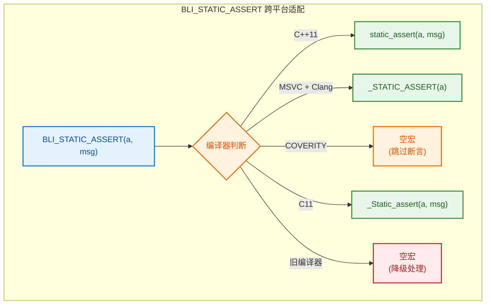

#### 为什么 Blender 代码库中同时存在 `BLI_STATIC_ASSERT` 和 `static_assert`？

**事实：在 Blender 代码库中，两者确实同时大量存在。**

**使用 `BLI_STATIC_ASSERT` 的文件示例：**
- `source/blender/blenkernel/BKE_geometry_set.hh`
- `source/blender/blenkernel/BKE_attribute_math.hh`
- `source/blender/blenkernel/intern/customdata.cc`
- `source/blender/blenlib/BLI_assert.h`（定义处）

**使用 `static_assert` 的文件示例：**
- `source/blender/blenkernel/BKE_attribute_math.hh`（同一文件中两种都有！）
- `source/blender/blenkernel/BKE_curves.hh`
- `source/blender/blenlib/BLI_span.hh`
- `source/blender/blenlib/BLI_hash.hh`
- `source/blender/blenkernel/intern/object.cc`

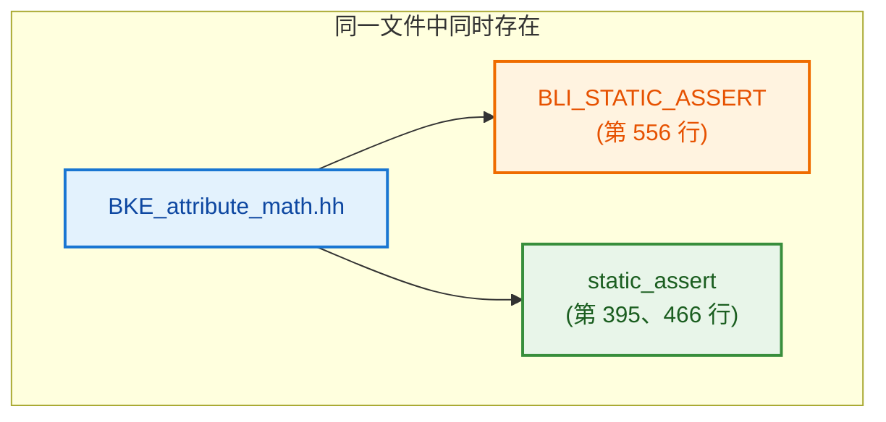

| 场景 | 使用 `BLI_STATIC_ASSERT` | 使用 `static_assert` |
|------|------------------------|---------------------|
| **跨平台兼容** | 需要适配 C/C++、不同编译器 | 确定是 C++11+ 环境 |
| **代码位置** | `.hh` 头文件（可能被 C 代码包含） | `.cc` 实现文件或纯 C++ 头文件 |
| **工具链兼容** | COVERITY 静态分析工具需要特殊处理 | 不需要 |
| **统一风格** | Blender 自己的断言体系 | 标准 C++ 语法 |
| **实际使用** | 模板约束、类型检查 | 大小检查、编译期常量验证 |

**核心原因：**

1. **C/C++ 混合项目**：Blender 是 C/C++ 混合项目，头文件可能被 C 编译器包含。`static_assert` 是 C++11 关键字，C11 中对应的是 `_Static_assert`。`BLI_STATIC_ASSERT` 自动处理这种差异。

2. **静态分析工具兼容**：`COVERITY` 是静态代码分析工具，某些断言可能会触发误报，所以宏定义为空来跳过。

3. **统一风格**：Blender 有自己的断言体系（`BLI_assert`、`BLI_assert_msg`、`BLI_STATIC_ASSERT`），在类型约束等场景下保持代码风格一致性。

4. **标准语法的直接使用**：在确定是纯 C++ 且不需要跨平台兼容的场景，直接使用 `static_assert` 更简洁直观。

5. **头文件 vs 实现文件**：
   - `BKE_geometry_set.hh` 是**头文件**，会被各种翻译单元包含，使用 `BLI_STATIC_ASSERT` 更安全
   - `.cc` 实现文件中如果确定是纯 C++，可以直接用 `static_assert`

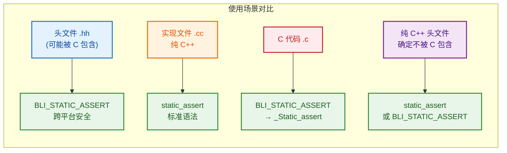

---

### 7. `std::is_base_of_v` 命名怪？为什么不叫 `is_derived_v`？

**文件：** `source/blender/blenkernel/BKE_geometry_set.hh:129~130`

```cpp
template<typename T>
inline constexpr bool is_geometry_component_v = std::is_base_of_v<GeometryComponent, T>;
```

#### C++ 标准库的命名逻辑

```cpp
// 标准库定义（概念上）
template<class Base, class Derived>
constexpr bool is_base_of_v = __is_base_of(Base, Derived);
```

**命名含义：** `is_base_of_v<Base, Derived>` 问的是：**"Base 是 Derived 的基类吗？"**

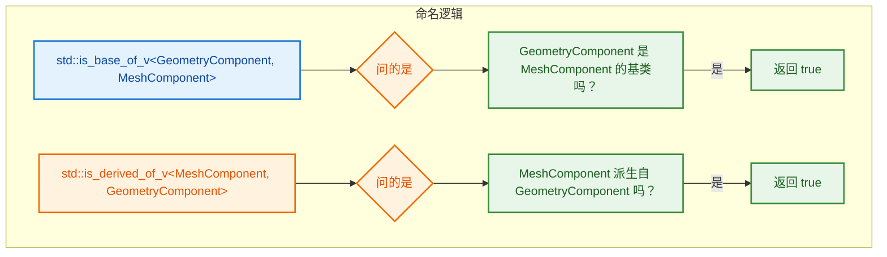

#### 为什么 C++ 标准选择了 `is_base_of` 而不是 `is_derived_of`？

| 角度 | `is_base_of<Base, Derived>` | 假设的 `is_derived_of<Derived, Base>` |
|------|---------------------------|-------------------------------------|
| **语义焦点** | 从基类视角看继承关系 | 从派生类视角看继承关系 |
| **数学直觉** | "A 是 B 的基类" = B ⊆ A（集合包含） | "A 派生自 B" = A ⊇ B |
| **对称性** | 与 `dynamic_cast<Base*>(derived)` 一致 | 需要反转参数顺序 |
| **类型约束** | `std::is_base_of_v<T, U>` 常用于 `requires T` 是 `U` 的基类 | 不太自然 |

**关键理解：**

C++ 的类型特征（Type Traits）命名遵循 **"is_XXX_of_v<A, B>"** 的模式，问的是 **"A 是 B 的 XXX 吗？"**：

- `is_base_of_v<A, B>` → **A 是 B 的基类吗？**
- `is_same_v<A, B>` → **A 和 B 是同一类型吗？**
- `is_convertible_v<A, B>` → **A 可以隐式转换为 B 吗？**

所以 `is_base_of_v<GeometryComponent, T>` 读作：
> **"GeometryComponent 是 T 的基类吗？"**

也就是 **"T 派生自 GeometryComponent 吗？"**

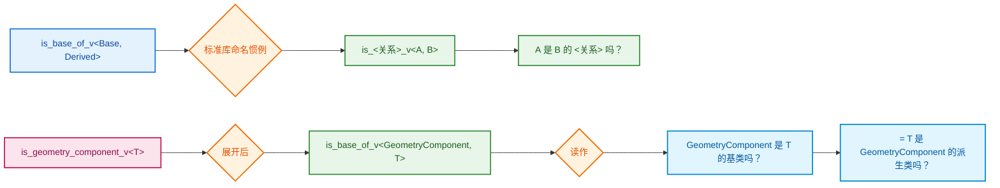

**为什么 Blender 不自己定义 `is_derived_v`？**

因为 Blender 的 `is_geometry_component_v` 本质上就是回答了 **"T 是 GeometryComponent 吗？"** 这个问题，命名已经很直观了。它内部使用 `std::is_base_of_v` 只是实现细节。

---

### 8. 特殊成员函数为什么全用默认实现？

**文件：** `source/blender/blenkernel/BKE_geometry_set.hh:165~173`

```cpp
/**
 * The methods are defaulted here so that they are not instantiated in every translation unit.
 */
GeometrySet();
GeometrySet(const GeometrySet &other);
GeometrySet(GeometrySet &&other);
~GeometrySet();
GeometrySet &operator=(const GeometrySet &other);
GeometrySet &operator=(GeometrySet &&other);
```

**翻译注释：**
> 这些方法在这里声明为默认，这样它们就不会在每个翻译单元中实例化。

**文件：** `source/blender/blenkernel/intern/geometry_set.cc:108~113`

```cpp
GeometrySet::GeometrySet() = default;
GeometrySet::GeometrySet(const GeometrySet &other) = default;
GeometrySet::GeometrySet(GeometrySet &&other) = default;
GeometrySet::~GeometrySet() = default;
GeometrySet &GeometrySet::operator=(const GeometrySet &other) = default;
GeometrySet &GeometrySet::operator=(GeometrySet &&other) = default;
```

#### 什么是"翻译单元"（Translation Unit）？

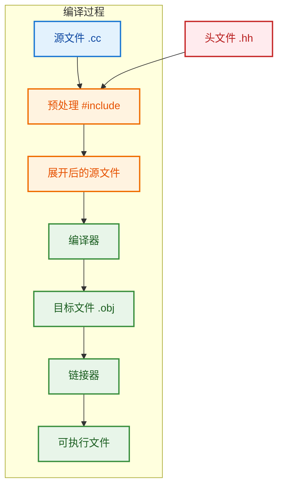

一个 **翻译单元** = 一个 `.cc` 源文件 + 所有被 `#include` 的头文件展开后的完整代码。

#### 问题：如果在头文件中直接 `= default`

```cpp
// 假设在头文件中这样写
struct GeometrySet {
    std::array<GeometryComponentPtr, 7> components_;
    nodes::BundlePtr bundle_;
    std::string name_;
    
    // ❌ 如果在头文件中直接 default
    GeometrySet() = default;
    GeometrySet(const GeometrySet &other) = default;
    // ... 其他特殊成员函数
};
```

**后果：**

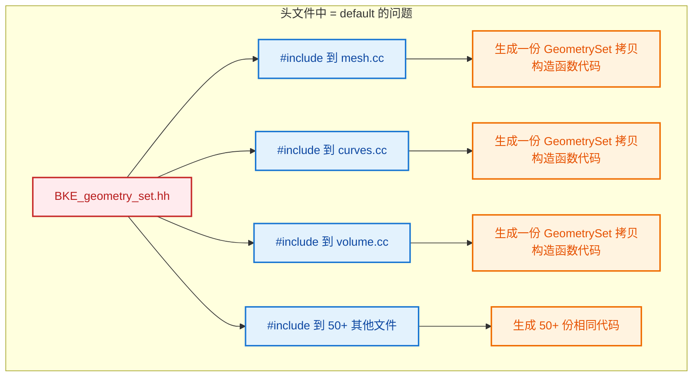

**问题：**
- `GeometrySet` 包含 `std::array<GeometryComponentPtr, 7>`、`BundlePtr`、`std::string`
- 这些成员都有自己的构造函数/析构函数/拷贝操作
- 如果在头文件中 `= default`，编译器会在**每个包含该头文件的翻译单元**中生成一份完整的代码
- 导致**代码膨胀（Code Bloat）**，增加编译时间和可执行文件大小

#### 解决方案：头文件声明，实现文件 `= default`

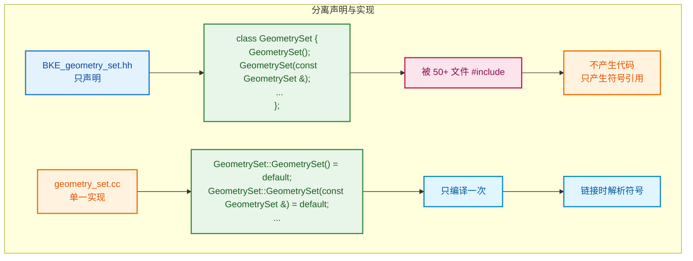

**好处：**

| 方面 | 头文件 `= default` | 分离声明与实现 |
|------|-------------------|-------------|
| **编译时间** | 每个翻译单元都生成代码 | 只生成一次 |
| **代码大小** | 重复代码膨胀 | 单一实例 |
| **链接时间** | 需要去重（COMDAT） | 直接链接 |
| **缓存效率** | 指令缓存不友好 | 更好 |

#### 为什么这些函数可以用默认实现？

因为 `GeometrySet` 的成员类型都**正确管理了自己的资源**：

```cpp
struct GeometrySet {
 private:
  std::array<GeometryComponentPtr, 7> components_;  // ImplicitSharingPtr 管理引用计数
  nodes::BundlePtr bundle_;                          // ImplicitSharingPtr 管理引用计数
  std::string name_;                                 // std::string 管理内存
};
```

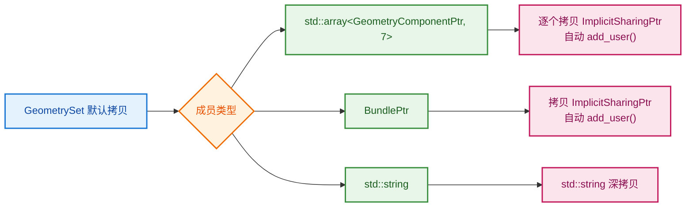

- `ImplicitSharingPtr` 的拷贝构造函数会自动调用 `add_user()`
- `std::string` 的拷贝构造函数会深拷贝字符串内容
- 析构时会自动调用 `remove_user_and_delete_if_last()`

所以 `GeometrySet` **不需要自定义**这些特殊成员函数，默认生成的行为就是正确的！

#### 总结

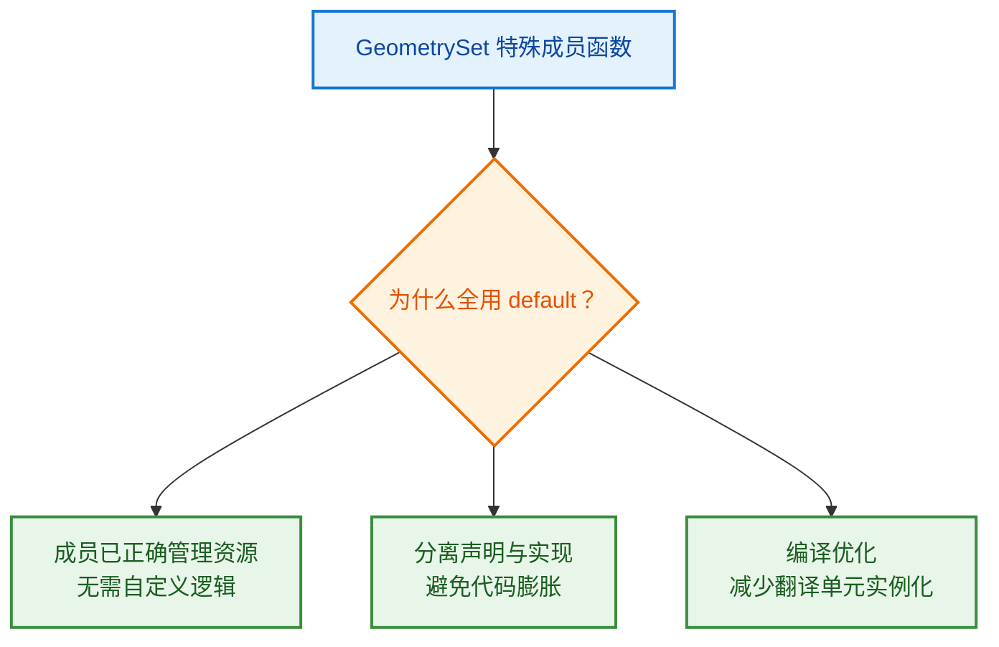

#### 每一行特殊成员函数详解

```cpp
// geometry_set.cc:108~113
GeometrySet::GeometrySet() = default;
GeometrySet::GeometrySet(const GeometrySet &other) = default;
GeometrySet::GeometrySet(GeometrySet &&other) = default;
GeometrySet::~GeometrySet() = default;
GeometrySet &GeometrySet::operator=(const GeometrySet &other) = default;
GeometrySet &GeometrySet::operator=(GeometrySet &&other) = default;
```

| 行 | 函数 | 名称 | 作用 | 调用场景 |
|---|------|------|------|---------|
| 1 | `GeometrySet()` | **默认构造函数** | 创建空 `GeometrySet`，`components_` 数组每个元素初始化为空 `ImplicitSharingPtr`，`bundle_` 为空，`name_` 为空字符串 | `GeometrySet geo;` 或 `GeometrySet geo = GeometrySet();` |
| 2 | `GeometrySet(const GeometrySet &)` | **拷贝构造函数** | 复制另一个 `GeometrySet`，逐个拷贝 `components_` 数组中的 `ImplicitSharingPtr`（自动 `add_user()`），拷贝 `bundle_`（自动 `add_user()`），深拷贝 `name_` | `GeometrySet copy = original;` 或按值传递参数 `fn(geo)` |
| 3 | `GeometrySet(GeometrySet &&)` | **移动构造函数** | 窃取另一个 `GeometrySet` 的资源，将 `components_`、`bundle_`、`name_` 直接转移过来，原对象变为空状态 | `GeometrySet moved = std::move(original);` 或函数返回 `return geo;` |
| 4 | `~GeometrySet()` | **析构函数** | 销毁 `GeometrySet`，`components_` 中每个 `ImplicitSharingPtr` 自动析构（调用 `remove_user_and_delete_if_last()`），`bundle_` 同理，`name_` 释放内存 | 对象离开作用域 `}` 时自动调用，或 `delete ptr` 时 |
| 5 | `operator=(const GeometrySet &)` | **拷贝赋值运算符** | 先释放当前持有的资源，再复制另一个 `GeometrySet` 的内容，行为与拷贝构造类似 | `geo_a = geo_b;`（**两个已存在**的对象之间赋值） |
| 6 | `operator=(GeometrySet &&)` | **移动赋值运算符** | 先释放当前持有的资源，再窃取另一个 `GeometrySet` 的资源，行为与移动构造类似 | `geo_a = std::move(geo_b);` 或 `geo_a = fn_returning_geo();`（**两个已存在**的对象之间赋值） |

#### 拷贝构造 vs 拷贝赋值、移动构造 vs 移动赋值 怎么区分？

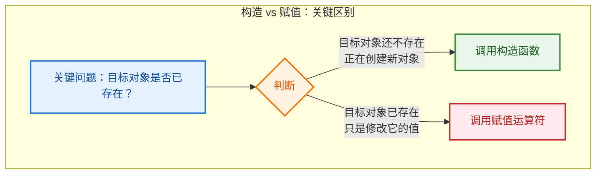

**拷贝构造 vs 拷贝赋值：**

```cpp
GeometrySet original;

// ✅ 拷贝构造：copy 是**新创建**的对象
GeometrySet copy = original;           // 调用拷贝构造函数
GeometrySet copy2(original);           // 调用拷贝构造函数

// ✅ 拷贝赋值：geo_a **已经存在**，只是被重新赋值
GeometrySet geo_a;
geo_a = original;                      // 调用拷贝赋值运算符
```

**移动构造 vs 移动赋值：**

```cpp
GeometrySet original;

// ✅ 移动构造：moved 是**新创建**的对象
GeometrySet moved = std::move(original);  // 调用移动构造函数
GeometrySet moved2(std::move(original));  // 调用移动构造函数

// ✅ 移动赋值：geo_a **已经存在**，只是被重新赋值
GeometrySet geo_a;
geo_a = std::move(original);              // 调用移动赋值运算符
```

| 场景 | 目标对象状态 | 调用的函数 |
|------|-------------|-----------|
| `GeometrySet a = b;` | `a` **还不存在**（正在定义） | **拷贝构造** |
| `GeometrySet a(b);` | `a` **还不存在**（正在定义） | **拷贝构造** |
| `a = b;` | `a` **已经存在**（之前定义过） | **拷贝赋值** |
| `GeometrySet a = std::move(b);` | `a` **还不存在**（正在定义） | **移动构造** |
| `a = std::move(b);` | `a` **已经存在**（之前定义过） | **移动赋值** |

**记忆口诀：**

> **构造 = 创建新对象时调用**
> **赋值 = 修改已存在的对象时调用**
>
> 看等号左边：如果是**新定义的变量** → 构造；如果是**已存在的变量** → 赋值

#### `= default` 编译后真的有很多代码吗？

**答案是：会生成代码，但只在 `geometry_set.cc` 中生成一次。**

```mermaid
flowchart TB
    subgraph "= default 编译后的真相"
        A["GeometrySet::GeometrySet(const GeometrySet &other) = default"] --> B{"编译器展开后"}
        B --> C["for each component in components_:<br/>component.add_user()<br/>(调用 ImplicitSharingPtr 拷贝构造)"]
        B --> D["bundle_.add_user()<br/>(调用 BundlePtr 拷贝构造)"]
        B --> E["name_ = other.name_<br/>(调用 std::string 拷贝构造)"]
    end
    
    style A fill:#e3f2fd,stroke:#1976d2,stroke-width:2px,color:#0d47a1
    style B fill:#fff3e0,stroke:#ef6c00,stroke-width:2px,color:#e65100
    style C fill:#e8f5e9,stroke:#388e3c,stroke-width:2px,color:#1b5e20
    style D fill:#e8f5e9,stroke:#388e3c,stroke-width:2px,color:#1b5e20
    style E fill:#e8f5e9,stroke:#388e3c,stroke-width:2px,color:#1b5e20
```

**具体说明：**

1. **拷贝构造函数**展开后大约等价于：

```cpp
// 编译器实际生成的代码（概念上）
GeometrySet::GeometrySet(const GeometrySet &other)
    : components_(other.components_),  // 7 个 ImplicitSharingPtr 的拷贝构造
      bundle_(other.bundle_),          // BundlePtr 的拷贝构造
      name_(other.name_)               // std::string 的拷贝构造
{
}
```

- `std::array<GeometryComponentPtr, 7>` 的拷贝 = 循环 7 次，每次调用 `ImplicitSharingPtr` 的拷贝构造
- 每个 `ImplicitSharingPtr` 拷贝构造会调用 `add_user()`（原子操作）
- `std::string` 的拷贝构造会分配新内存并复制字符串内容

2. **析构函数**展开后大约等价于：

```cpp
// 编译器实际生成的代码（概念上）
GeometrySet::~GeometrySet() {
    // components_ 逆序析构
    for (int i = 6; i >= 0; i--) {
        components_[i].~ImplicitSharingPtr();  // 调用 remove_user_and_delete_if_last()
    }
    bundle_.~BundlePtr();  // 调用 remove_user_and_delete_if_last()
    name_.~std::string();  // 释放字符串内存
}
```

3. **移动构造函数**展开后大约等价于：

```cpp
// 编译器实际生成的代码（概念上）
GeometrySet::GeometrySet(GeometrySet &&other)
    : components_(std::move(other.components_)),  // 7 个 ImplicitSharingPtr 的移动构造
      bundle_(std::move(other.bundle_)),          // BundlePtr 的移动构造
      name_(std::move(other.name_))               // std::string 的移动构造
{
}
```

- 移动构造更轻量：只是转移指针所有权，不涉及 `add_user()` 或内存分配

**关键结论：**

| 问题 | 答案 |
|------|------|
| `= default` 有代码吗？ | **有**，编译器会生成完整的函数体 |
| 代码量大吗？ | 相对大（涉及 7 个指针的引用计数操作 + 字符串拷贝） |
| 在哪里生成？ | **只在 `geometry_set.cc` 中生成一次** |
| 如果在头文件 `= default`？ | **每个翻译单元都生成一份**，导致代码膨胀 |

#### 如果不写这几行声明（`BKE_geometry_set.hh:168~173`），会怎样？

**文件：** `source/blender/blenkernel/BKE_geometry_set.hh:168~173`

```cpp
GeometrySet();
GeometrySet(const GeometrySet &other);
GeometrySet(GeometrySet &&other);
~GeometrySet();
GeometrySet &operator=(const GeometrySet &other);
GeometrySet &operator=(GeometrySet &&other);
```

**答案是：编译和运行都正常，但会导致代码膨胀！**

```mermaid
flowchart TB
    subgraph "不写声明的后果"
        A["不在头文件中声明"] --> B{"编译器行为"}
        B --> C["编译器自动隐式生成<br/>inline 的特殊成员函数"]
        C --> D["在**每个翻译单元**中内联展开"]
        D --> E["代码膨胀<br/>编译时间增加"]
    end
    
    style A fill:#e3f2fd,stroke:#1976d2,stroke-width:2px,color:#0d47a1
    style B fill:#fff3e0,stroke:#ef6c00,stroke-width:2px,color:#e65100
    style C fill:#e8f5e9,stroke:#388e3c,stroke-width:2px,color:#1b5e20
    style D fill:#fff3e0,stroke:#ef6c00,stroke-width:2px,color:#e65100
    style E fill:#ffebee,stroke:#c62828,stroke-width:2px,color:#b71c1c
```

**C++ 规则：**

| 情况 | 编译器行为 | 后果 |
|------|-----------|------|
| **不声明任何构造函数** | 编译器隐式生成默认构造函数 | `inline` 函数，每个翻译单元一份 |
| **不声明拷贝构造** | 编译器隐式生成拷贝构造函数 | `inline` 函数，每个翻译单元一份 |
| **不声明移动构造** | 编译器隐式生成移动构造函数 | `inline` 函数，每个翻译单元一份 |
| **不声明析构函数** | 编译器隐式生成析构函数 | `inline` 函数，每个翻译单元一份 |
| **不声明拷贝赋值** | 编译器隐式生成拷贝赋值运算符 | `inline` 函数，每个翻译单元一份 |
| **不声明移动赋值** | 编译器隐式生成移动赋值运算符 | `inline` 函数，每个翻译单元一份 |

**为什么声明后 + `.cc` 中 `= default` 更好？**

```mermaid
flowchart LR
    subgraph "方案对比"
        A["方案 A<br/>不声明"] --> B["隐式 inline 生成<br/>50+ 份代码"]
        C["方案 B<br/>头文件声明 + .cc default"] --> D["非 inline 单一实例<br/>只生成 1 份"]
    end
    
    style A fill:#ffebee,stroke:#c62828,stroke-width:2px,color:#b71c1c
    style B fill:#fff3e0,stroke:#ef6c00,stroke-width:2px,color:#e65100
    style C fill:#e3f2fd,stroke:#1976d2,stroke-width:2px,color:#0d47a1
    style D fill:#e8f5e9,stroke:#388e3c,stroke-width:2px,color:#1b5e20
```

| 对比项 | 不声明（隐式生成） | 声明 + `.cc` 中 `= default` |
|--------|-------------------|---------------------------|
| **存在性** | 编译器隐式生成 | 显式声明和定义 |
| **链接属性** | `inline`（每个翻译单元一份） | 非 `inline`（只一份） |
| **编译时间** | 更长（重复编译相同代码） | 更短（只编译一次） |
| **代码大小** | 更大（重复代码） | 更小（单一实例） |
| **灵活性** | 不能控制生成时机 | 可以控制在哪里实例化 |

**核心要点：**

1. **不写声明 ≠ 未定义**：C++ 编译器会自动隐式生成这些函数，行为是**定义好的**（well-defined）。

2. **写声明的目的**：不是为了"定义"这些函数（因为 `= default` 也是编译器生成），而是为了**控制它们的实例化位置**——从"头文件内联"改为".cc 文件单一实例"。

3. **注释说明**：源码注释 `"The methods are defaulted here so that they are not instantiated in every translation unit"` 明确说明了这一点——声明 + 外部 `= default` 是为了**避免在每个翻译单元中实例化**。

---

### 9. `has_` / `from_` / `get_` / `replace_` 为什么不用模板函数？

**文件：** `source/blender/blenkernel/BKE_geometry_set.hh:274~376`

```cpp
/* Utility methods for creation. */
static GeometrySet from_mesh(Mesh *mesh, GeometryOwnershipType ownership = ...);
static GeometrySet from_volume(Volume *volume, GeometryOwnershipType ownership = ...);
static GeometrySet from_pointcloud(PointCloud *pointcloud, GeometryOwnershipType ownership = ...);
// ... 更多 from_xxx

/* Utility methods for access. */
bool has_mesh() const;
bool has_pointcloud() const;
bool has_instances() const;
// ... 更多 has_xxx

const Mesh *get_mesh() const;
const PointCloud *get_pointcloud() const;
const Volume *get_volume() const;
// ... 更多 get_xxx

Mesh *get_mesh_for_write();
PointCloud *get_pointcloud_for_write();
// ... 更多 get_xxx_for_write

/* Utility methods for replacement. */
void replace_mesh(Mesh *mesh, GeometryOwnershipType ownership = ...);
void replace_pointcloud(PointCloud *pointcloud, GeometryOwnershipType ownership = ...);
// ... 更多 replace_xxx
```

**文件：** `source/blender/blenkernel/intern/geometry_set.cc:311~369`

```cpp
const Mesh *GeometrySet::get_mesh() const
{
  const MeshComponent *component = this->get_component<MeshComponent>();
  return (component == nullptr) ? nullptr : component->get();
}

bool GeometrySet::has_mesh() const
{
  const MeshComponent *component = this->get_component<MeshComponent>();
  return component != nullptr && component->has_mesh();
}

bool GeometrySet::has_instances() const
{
  const InstancesComponent *component = this->get_component<InstancesComponent>();
  return component != nullptr && component->get() != nullptr &&
         component->get()->instances_num() >= 1;
}
```

#### 为什么不用统一的模板函数？

理论上可以写成：

```cpp
// ❌ 假设的模板版本（实际不存在）
template<typename T>
const T *get() const;

// 使用：
auto *mesh = geometry.get<Mesh>();
auto *curves = geometry.get<Curves>();
```

但实际代码选择了**显式的具名函数**。原因如下：

```mermaid
flowchart TB
    subgraph "不用模板的原因"
        A["显式函数<br/>get_mesh() / has_mesh()"] --> B{"优势"}
        B --> C["编译期类型安全<br/>返回值类型明确"]
        B --> D["IDE 自动补全友好<br/>输入 get_ 就能看到所有选项"]
        B --> E["每种类型的逻辑可能不同<br/>如 has_instances() 需检查数量"]
        B --> F["C++ 不支持根据返回值做模板推导<br/>auto *m = geo.get&lt;Mesh&gt;() 不自然"]
        B --> G["代码自文档化<br/>get_mesh() 比 get&lt;Mesh&gt;() 更易读"]
    end
    
    style A fill:#e3f2fd,stroke:#1976d2,stroke-width:2px,color:#0d47a1
    style B fill:#fff3e0,stroke:#ef6c00,stroke-width:2px,color:#e65100
    style C fill:#e8f5e9,stroke:#388e3c,stroke-width:2px,color:#1b5e20
    style D fill:#e8f5e9,stroke:#388e3c,stroke-width:2px,color:#1b5e20
    style E fill:#e8f5e9,stroke:#388e3c,stroke-width:2px,color:#1b5e20
    style F fill:#e8f5e9,stroke:#388e3c,stroke-width:2px,color:#1b5e20
    style G fill:#e8f5e9,stroke:#388e3c,stroke-width:2px,color:#1b5e20
```

#### 具体原因分析

**1. 每种类型逻辑可能不同**

```cpp
// 大多数 has_xxx 很简单
bool has_mesh() const {
    const MeshComponent *component = this->get_component<MeshComponent>();
    return component != nullptr && component->has_mesh();
}

// 但 has_instances 有特殊逻辑！
bool has_instances() const {
    const InstancesComponent *component = this->get_component<InstancesComponent>();
    return component != nullptr && component->get() != nullptr &&
           component->get()->instances_num() >= 1;  // 还要检查实例数量 >= 1
}

// has_realized_data 更是完全不同的逻辑
bool has_realized_data() const {
    for (const GeometryComponentPtr &component_ptr : components_) {
        if (component_ptr) {
            if (!ELEM(component_ptr->type(),
                      GeometryComponent::Type::Instance,
                      GeometryComponent::Type::Edit))
            {
                return true;
            }
        }
    }
    return false;
}
```

**2. 编辑提示数据是"穿透"获取的**

```cpp
// 这些不是直接从对应 Component 获取，而是从 GeometryComponentEditData 穿透获取
const CurvesEditHints *get_curve_edit_hints() const {
    const GeometryComponentEditData *component = this->get_component<GeometryComponentEditData>();
    return (component == nullptr) ? nullptr : component->curves_edit_hints_.get();
}

const GreasePencilEditHints *get_grease_pencil_edit_hints() const {
    const GeometryComponentEditData *component = this->get_component<GeometryComponentEditData>();
    return (component == nullptr) ? nullptr : component->grease_pencil_edit_hints_.get();
}
```

**3. C++ 模板返回值推导问题**

```cpp
// ❌ 这种写法在 C++ 中不自然
template<typename T>
const T *get() const;

// 必须显式指定类型
auto *mesh = geometry.get<Mesh>();  // 需要知道 Mesh 对应 MeshComponent

// ✅ 显式函数更自然
const Mesh *mesh = geometry.get_mesh();
```

**4. 类型到组件的映射不是泛型的**

```mermaid
flowchart LR
    subgraph "类型映射"
        A["Mesh*"] --> B["MeshComponent"]
        C["Curves*"] --> D["CurveComponent"]
        E["CurvesEditHints*"] --> F["GeometryComponentEditData<br/>curves_edit_hints_"]
        G["GizmoEditHints*"] --> H["GeometryComponentEditData<br/>gizmo_edit_hints_"]
    end
    
    style A fill:#e3f2fd,stroke:#1976d2,stroke-width:2px,color:#0d47a1
    style B fill:#e8f5e9,stroke:#388e3c,stroke-width:2px,color:#1b5e20
    style C fill:#e3f2fd,stroke:#1976d2,stroke-width:2px,color:#0d47a1
    style D fill:#e8f5e9,stroke:#388e3c,stroke-width:2px,color:#1b5e20
    style E fill:#fff3e0,stroke:#ef6c00,stroke-width:2px,color:#e65100
    style F fill:#fce4ec,stroke:#c2185b,stroke-width:2px,color:#880e4f
    style G fill:#fff3e0,stroke:#ef6c00,stroke-width:2px,color:#e65100
    style H fill:#fce4ec,stroke:#c2185b,stroke-width:2px,color:#880e4f
```

- `Mesh*` → `MeshComponent::get()`
- `CurvesEditHints*` → `GeometryComponentEditData::curves_edit_hints_.get()`
- `GizmoEditHints*` → `GeometryComponentEditData::gizmo_edit_hints_.get()`

这种映射关系是**硬编码的**，不适合泛型模板。

#### 已有的模板 API vs 显式 API 对比

```mermaid
flowchart TB
    subgraph "API 层次"
        A["底层模板 API<br/>get_component&lt;MeshComponent&gt;()"] --> B["类型安全，通用"]
        C["中层显式 API<br/>get_mesh() / has_mesh()"] --> D["语义明确，易用"]
        E["高层工具函数<br/>from_mesh() / replace_mesh()"] --> F["业务逻辑封装"]
    end
    
    style A fill:#e3f2fd,stroke:#1976d2,stroke-width:2px,color:#0d47a1
    style B fill:#e8f5e9,stroke:#388e3c,stroke-width:2px,color:#1b5e20
    style C fill:#fff3e0,stroke:#ef6c00,stroke-width:2px,color:#e65100
    style D fill:#e8f5e9,stroke:#388e3c,stroke-width:2px,color:#1b5e20
    style E fill:#fce4ec,stroke:#c2185b,stroke-width:2px,color:#880e4f
    style F fill:#e8f5e9,stroke:#388e3c,stroke-width:2px,color:#1b5e20
```

| API 层级 | 示例 | 用途 |
|---------|------|------|
| **底层模板** | `get_component<MeshComponent>()` | 通用组件访问，框架内部使用 |
| **中层显式** | `get_mesh()` / `has_mesh()` | 具体类型访问，业务代码使用 |
| **高层工具** | `from_mesh()` / `replace_mesh()` | 完整业务操作 |

**总结：**

1. **显式函数是封装**：底层已经有模板 API `get_component<T>()`，显式函数是在其上的**语义封装**。
2. **逻辑差异**：不同类型有不同的判断逻辑（如 `has_instances` 要检查数量）。
3. **编辑提示穿透**：`get_curve_edit_hints()` 等不是从对应组件获取，而是从 `EditData` 组件穿透获取。
4. **可读性**：`geometry.get_mesh()` 比 `geometry.get<Mesh>()` 更符合 Blender 的编码风格。

---

### 10. 什么是 Mixin 设计模式？

#### Mixin 的定义

**Mixin** 是一种**代码复用模式**，它通过继承将一组相关功能"混入"到类中，而**不建立语义上的"是一个"（is-a）关系**。

```mermaid
flowchart TB
    subgraph "普通继承 vs Mixin"
        subgraph "普通继承（is-a）"
            A1["Animal"] --> B1["Dog"]
            A1 --> C1["Cat"]
            B1 --> D1["Dog 是一个 Animal<br/>语义关系"]
        end
        
        subgraph "Mixin（has capability）"
            A2["ImplicitSharingMixin<br/>引用计数功能"] --> B2["GeometryComponent"]
            A2 --> C2["Bundle"]
            A2 --> D2["Closure"]
            B2 --> E2["GeometryComponent 有隐式共享能力<br/>功能注入"]
        end
    end
    
    style A1 fill:#e3f2fd,stroke:#1976d2,stroke-width:2px,color:#0d47a1
    style B1 fill:#e8f5e9,stroke:#388e3c,stroke-width:2px,color:#1b5e20
    style C1 fill:#e8f5e9,stroke:#388e3c,stroke-width:2px,color:#1b5e20
    style D1 fill:#fff3e0,stroke:#ef6c00,stroke-width:2px,color:#e65100
    style A2 fill:#ffebee,stroke:#c62828,stroke-width:2px,color:#b71c1c
    style B2 fill:#e8f5e9,stroke:#388e3c,stroke-width:2px,color:#1b5e20
    style C2 fill:#e8f5e9,stroke:#388e3c,stroke-width:2px,color:#1b5e20
    style D2 fill:#e8f5e9,stroke:#388e3c,stroke-width:2px,color:#1b5e20
    style E2 fill:#fff3e0,stroke:#ef6c00,stroke-width:2px,color:#e65100
```

#### Mixin 的核心特点

| 特点 | 普通基类 | Mixin |
|------|---------|-------|
| **语义** | "是一个"（is-a） | "有这个能力"（has capability） |
| **独立性** | 可以独立存在 | 通常不独立使用 |
| **目的** | 建立类型层次 | 注入功能代码 |
| **命名** | `Animal`、`Shape` | `ImplicitSharingMixin`、`RandomAccessIteratorMixin` |
| **多继承** | 通常单继承 | 经常多继承组合多个 Mixin |

#### Blender 中的 Mixin 实例

**1. `ImplicitSharingMixin` — 隐式共享能力**

```cpp
// source/blender/blenlib/BLI_implicit_sharing.hh:192
class ImplicitSharingMixin : public ImplicitSharingInfo {
 private:
  void delete_self_with_data() override {
    this->delete_self();
  }
  virtual void delete_self() = 0;
};

// 被多个类继承使用
class GeometryComponent : public ImplicitSharingMixin { ... };
class Bundle : public ImplicitSharingMixin { ... };
class Closure : public ImplicitSharingMixin { ... };
class VolumeGridData : public ImplicitSharingMixin { ... };
class FieldInputs : public ImplicitSharingMixin { ... };
```

**2. `RandomAccessIteratorMixin` — 随机访问迭代器能力**

```cpp
// source/blender/blenlib/BLI_random_access_iterator_mixin.hh:27
template<typename Derived> class RandomAccessIteratorMixin {
 public:
  using iterator_category = std::random_access_iterator_tag;
  using difference_type = std::ptrdiff_t;

  constexpr friend Derived &operator++(Derived &a) {
    ++a.iter_prop_mutable();
    return a;
  }
  // ... 还有 operator--, operator+=, operator[], 等等
};

// 使用：自定义迭代器只需实现 iter_prop()，其他操作符自动获得
class Iterator : public iterator::RandomAccessIteratorMixin<Iterator> {
  // 只需提供 iter_prop() 方法
};
```

**翻译注释：**
> 简化实现随机访问迭代器。实际迭代器应该公开继承此类。此外，它必须提供一个 const `iter_prop` 方法，返回与当前位置对应的内部属性的引用。这通常是一个指针或索引。
>
> 实现随机访问迭代器通常很简单，但需要大量样板代码，因为算法期望许多操作符能在迭代器类型上工作。它们的行为应该类似于指针，因此必须实现许多相同的操作符。

```mermaid
flowchart TB
    subgraph "RandomAccessIteratorMixin 功能注入"
        A["RandomAccessIteratorMixin&lt;Derived&gt;"] --> B["operator++"]
        A --> C["operator--"]
        A --> D["operator+="]
        A --> E["operator[]"]
        A --> F["operator=="]
        A --> G["operator&lt;"]
        
        H["自定义 Iterator"] --> I["只需实现<br/>iter_prop()"]
        H --> J["自动获得<br/>所有操作符"]
        
        A -.->|"继承"| H
    end
    
    style A fill:#e3f2fd,stroke:#1976d2,stroke-width:2px,color:#0d47a1
    style B fill:#e8f5e9,stroke:#388e3c,stroke-width:2px,color:#1b5e20
    style C fill:#e8f5e9,stroke:#388e3c,stroke-width:2px,color:#1b5e20
    style D fill:#e8f5e9,stroke:#388e3c,stroke-width:2px,color:#1b5e20
    style E fill:#e8f5e9,stroke:#388e3c,stroke-width:2px,color:#1b5e20
    style F fill:#e8f5e9,stroke:#388e3c,stroke-width:2px,color:#1b5e20
    style G fill:#e8f5e9,stroke:#388e3c,stroke-width:2px,color:#1b5e20
    style H fill:#fff3e0,stroke:#ef6c00,stroke-width:2px,color:#e65100
    style I fill:#fce4ec,stroke:#c2185b,stroke-width:2px,color:#880e4f
    style J fill:#fce4ec,stroke:#c2185b,stroke-width:2px,color:#880e4f
```

#### 为什么用 Mixin 而不是组合？

```mermaid
flowchart TB
    subgraph "Mixin（继承）"
        A1["GeometryComponent"] --> B1["ImplicitSharingMixin"]
        A1 --> C1["直接访问 protected 成员"]
        A1 --> D1["编译期绑定，零开销"]
    end
    
    subgraph "组合（成员变量）"
        A2["GeometryComponent"] --> B2["std::shared_ptr<SharingInfo>"]
        A2 --> C2["需要显式转发接口"]
        A2 --> D2["运行时多态，有间接开销"]
    end
    
    style A1 fill:#e3f2fd,stroke:#1976d2,stroke-width:2px,color:#0d47a1
    style B1 fill:#e8f5e9,stroke:#388e3c,stroke-width:2px,color:#1b5e20
    style C1 fill:#fff3e0,stroke:#ef6c00,stroke-width:2px,color:#e65100
    style D1 fill:#fff3e0,stroke:#ef6c00,stroke-width:2px,color:#e65100
    style A2 fill:#ffebee,stroke:#c62828,stroke-width:2px,color:#b71c1c
    style B2 fill:#e8f5e9,stroke:#388e3c,stroke-width:2px,color:#1b5e20
    style C2 fill:#fff3e0,stroke:#ef6c00,stroke-width:2px,color:#e65100
    style D2 fill:#fff3e0,stroke:#ef6c00,stroke-width:2px,color:#e65100
```

| 方案 | 优点 | 缺点 |
|------|------|------|
| **Mixin（继承）** | 零开销、直接访问基类保护成员、自动获得接口 | 增加继承层次、可能引入命名冲突 |
| **组合（成员）** | 更灵活、可替换、无继承污染 | 需要手写转发函数、有间接开销 |

**Blender 选择 Mixin 的原因：**

1. **性能**：`ImplicitSharingMixin` 将引用计数直接嵌入对象内存，没有额外的指针间接
2. **简洁**：`RandomAccessIteratorMixin` 让自定义迭代器只需实现 1 个方法，自动获得 10+ 个操作符
3. **类型安全**：编译期确定，无需运行时多态

#### Mixin 的命名惯例

在 Blender 和 C++ 社区中，Mixin 类通常以 `Mixin` 后缀命名：

| Mixin 类 | 注入的功能 |
|---------|-----------|
| `ImplicitSharingMixin` | 隐式共享（引用计数） |
| `RandomAccessIteratorMixin` | 随机访问迭代器操作符 |
| `NonCopyable` / `NonMovable` | 禁用拷贝/移动（也是 Mixin 的一种） |

---

**核心组件：**

| 组件 | 作用 |
|------|------|
| `GeometrySet` | 几何集合容器 |
| `GeometryComponent` | 几何组件基类 |
| `MeshComponent` | 网格组件 |
| `CurveComponent` | 曲线组件 |
| `ImplicitSharingPtr` | 隐式共享指针 |
| `ImplicitSharingMixin` | 隐式共享混入基类 |
| `GeometryComponentEditData` | 编辑模式数据组件 |
