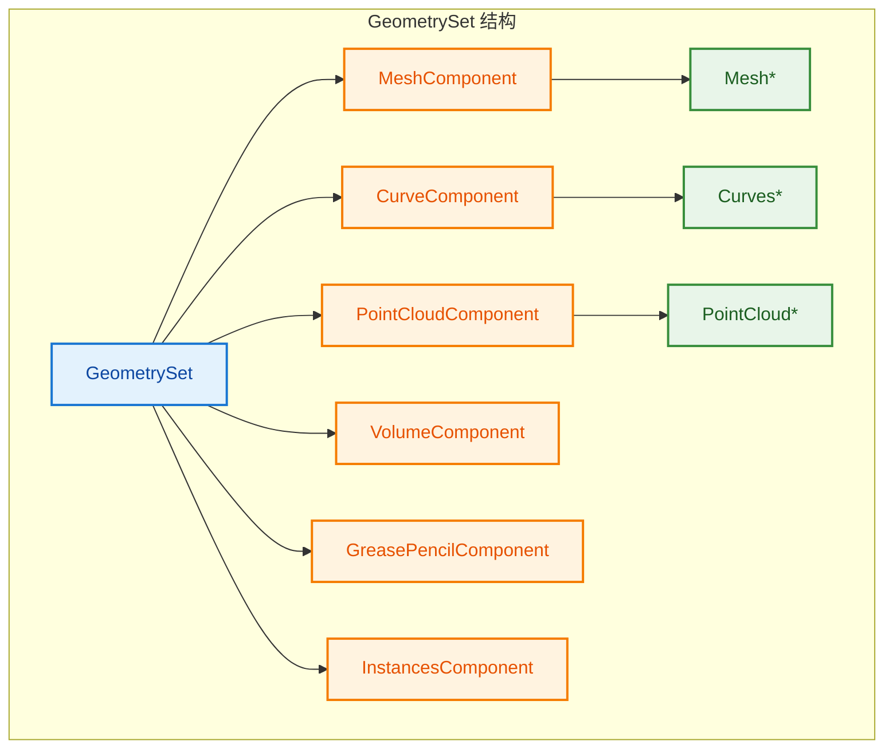

# GeometrySet - 几何集合

> 统一管理多种几何类型的容器，支持隐式共享和写时复制

---

## 📖 源码注释翻译

**文件：** `source/blender/blenkernel/BKE_geometry_set.hh:64~150`

> 这是专用几何组件类型的基类。几何组件使用隐式共享来避免只读复制。它还集成了属性 API，用于存储和修改几何上的通用信息。
>
> 每个几何组件都有特定的类型。类型决定了组件存储什么类型的数据。修改几何的函数通常只修改组件类型的子集。
>
> 注意：这些值存储在文件中，因此不应重新排序。
>
> 几何集合是多种几何的容器。它本身不直接拥有几何，而是由多个 GeometryComponents 拥有几何，几何集合增加每个组件的用户计数，以避免丢失数据。这意味着单个组件可能在多个几何和其他代码之间共享。当请求写访问时，共享组件会自动复制。
>
> 组件通常不直接存储数据，而是保留对在其他地方定义的数据结构的引用。每种类型最多有一个组件。
>
> 复制几何集合是相对便宜的操作，因为它不复制引用的几何组件，因此 GeometrySet 通常可以按值传递或移动。

---

## 🎯 核心概念

### 什么是 GeometrySet？

```cpp
// GeometrySet 是一个"几何集合"
// 可以同时包含多种几何类型：
// - Mesh（网格）
// - Curves（曲线）
// - PointCloud（点云）
// - Volume（体积）
// - GreasePencil（蜡笔）
// - Instances（实例）

GeometrySet geometry;
geometry.add_mesh(mesh);        // 添加网格
geometry.add_curves(curves);    // 添加曲线
geometry.add_pointcloud(points); // 添加点云

// 复制是便宜的（只复制指针）
GeometrySet copy = geometry;  // O(1) 操作

// 修改时自动写时复制
Mesh *mesh = geometry.get_mesh_for_write();  // 如果需要，自动复制
```



---

## 🔧 源码详解

### GeometryComponent 基类

```cpp
// BKE_geometry_set.hh:69
class GeometryComponent : public ImplicitSharingMixin {
 public:
  enum class Type {
    Mesh = 0,
    PointCloud = 1,
    Instance = 2,
    Volume = 3,
    Curve = 4,
    Edit = 5,
    GreasePencil = 6,
  };

  virtual GeometryComponentPtr copy() const = 0;
  virtual void clear() = 0;
  
  // 属性访问
  virtual std::optional<AttributeAccessor> attributes() const;
  virtual std::optional<MutableAttributeAccessor> attributes_for_write();
};
```

### GeometrySet 结构

```cpp
// BKE_geometry_set.hh:151
struct GeometrySet {
 private:
  // 按 GeometryComponent::Type 索引的组件数组
  std::array<GeometryComponentPtr, GEO_COMPONENT_TYPE_ENUM_SIZE> components_;
  
 public:
  // 获取组件（只读）
  const GeometryComponent *get_component(GeometryComponent::Type type) const;
  
  // 获取组件（可写）- 触发写时复制
  GeometryComponent &get_component_for_write(GeometryComponent::Type type);
  
  // 检查是否有某类型
  bool has(GeometryComponent::Type type) const;
  
  // 添加组件
  void add(const GeometryComponent &component);
  
  // 移除组件
  void remove(GeometryComponent::Type type);
};
```

### 双版本 API 设计

```cpp
// 模板版本（类型安全）
template<typename Component>
const Component *get_component() const {
    BLI_STATIC_ASSERT(is_geometry_component_v<Component>, "");
    return static_cast<const Component *>(
        get_component(Component::static_type)
    );
}

// 非模板版本（运行时类型）
const GeometryComponent *get_component(GeometryComponent::Type type) const;

// 使用对比：
auto *mesh = geometry.get_component<MeshComponent>();  // 编译期确定类型
auto *comp = geometry.get_component(Type::Mesh);       // 运行时确定类型
```

---

## 💡 使用方法

### 创建和修改几何集合

```cpp
// 1. 创建空集合
GeometrySet geometry;

// 2. 添加几何
Mesh *mesh = BKE_mesh_new_nomain("Mesh");
geometry.add_mesh(mesh);

// 3. 获取几何（只读）
const Mesh *read_mesh = geometry.get_mesh();

// 4. 获取几何（可写）- 触发写时复制
Mesh *write_mesh = geometry.get_mesh_for_write();

// 5. 检查类型
if (geometry.has_mesh()) {
    // 处理网格...
}

// 6. 移除几何
geometry.remove_mesh();
```

### 遍历所有组件

```cpp
// 遍历所有几何组件
for (const GeometryComponent *component : geometry.get_components()) {
    switch (component->type()) {
        case GeometryComponent::Type::Mesh:
            process_mesh(static_cast<const MeshComponent *>(component));
            break;
        case GeometryComponent::Type::Curve:
            process_curves(static_cast<const CurveComponent *>(component));
            break;
        // ...
    }
}
```

### 复制和共享

```cpp
// 原始几何
GeometrySet original;
original.add_mesh(create_mesh());

// 复制（共享数据）
GeometrySet copy = original;
// original 和 copy 共享同一个 MeshComponent

// 修改副本（触发写时复制）
Mesh *mesh = copy.get_mesh_for_write();
// 现在 copy 有自己的 Mesh 数据，original 保持不变
```

---

## 🎨 在 Blender 中的实际应用

### 场景：几何节点输入输出

```cpp
static void node_geo_exec(GeoNodeExecParams params)
{
    // 提取输入
    GeometrySet geometry = params.extract_input<GeometrySet>("Geometry"_ustr);
    
    // 处理网格
    if (Mesh *mesh = geometry.get_mesh_for_write()) {
        // 修改网格...
        mesh->vert_positions_for_write()[0] = float3(0, 0, 0);
    }
    
    // 处理曲线
    if (Curves *curves = geometry.get_curves_for_write()) {
        // 修改曲线...
    }
    
    // 设置输出
    params.set_output("Geometry"_ustr, std::move(geometry));
}
```

### 场景：foreach_real_geometry

```cpp
// 处理几何集合中的所有"真实"几何（非实例）
geometry::foreach_real_geometry(geometry_set, [&](GeometrySet &geo) {
    if (Curves *curves = geo.get_curves_for_write()) {
        split_curves(curves->geometry.wrap(), ...);
    }
});
```

---

## ✅ 总结

| 特性 | 说明 |
|------|------|
| **多类型容器** | 同时包含 Mesh、Curves、PointCloud 等 |
| **隐式共享** | 复制时共享数据，不复制实际几何 |
| **写时复制** | 修改时自动复制，保持原始数据不变 |
| **类型安全** | 模板 API 提供编译期类型检查 |
| **属性集成** | 每个组件支持属性系统 |

**核心组件：**

| 组件 | 作用 |
|------|------|
| `GeometrySet` | 几何集合容器 |
| `GeometryComponent` | 几何组件基类 |
| `MeshComponent` | 网格组件 |
| `CurveComponent` | 曲线组件 |
| `ImplicitSharingPtr` | 隐式共享指针 |
